# 📐 SMMS Resort & Spa – Biểu đồ Lớp (Class Diagram)

Tài liệu này đặc tả cấu trúc hệ thống **SMMS Ngũ Sơn Resort & Spa** dưới dạng **UML Class Diagram** tuân thủ tiêu chuẩn **UML 2.51**. Sơ đồ được vẽ trực quan bằng công nghệ Mermaid, mô tả đầy đủ các quan hệ Aggregation (Thu gom), Composition (Hợp thành), Generalization (Kế thừa / Chuyên biệt hóa), và Association (Liên kết).

---

## 🎨 1. Sơ đồ Lớp tổng thể (UML 2.51 Class Diagram)

```mermaid
classDiagram
    %% Tác nhân & Phân quyền (User component)
    class User {
        +Integer userId
        +String email
        +String passwordHash
        +String fullName
        +String phone
        +String idPassportEncrypted
        +Role role
        +Status status
        +LocalDateTime createdAt
        +login() Boolean
        +logout() Boolean
    }

    class Customer {
        +String membershipLevel
        +bookPackage() RoomBooking
        +declareHealthProfile()
    }

    class Specialist {
        +String specialty
        +updateSessionStatus()
        +writeMedicalNotes()
    }

    class Chef {
        +String kitchenSection
        +manageMenu()
        +updateOrderStatus()
    }

    class Receptionist {
        +Integer frontDeskNumber
        +checkIn()
        +checkOut()
        +postExtraCharges()
    }

    class Admin {
        +manageStaffAccounts()
        +manageMasterData()
    }

    %% Kế thừa / Chuyên biệt hóa (Generalization vs Specialization)
    User <|-- Customer
    User <|-- Specialist
    User <|-- Chef
    User <|-- Receptionist
    User <|-- Admin

    %% Thành phần bảo mật & OTP (Composition: Người dùng sở hữu)
    class MedicalProfile {
        +Integer profileId
        +String physicalConditionEncrypted
        +String foodAllergiesEncrypted
        +Boolean explicitConsentSigned
        +LocalDateTime updatedAt
    }

    class OtpToken {
        +Integer tokenId
        +String token
        +LocalDateTime expiresAt
        +Boolean used
    }

    User "1" *-- "1" MedicalProfile : "Composition"
    User "1" *-- "0..*" OtpToken : "Composition"

    %% Lịch trực nhân viên (Association)
    class WorkSchedule {
        +Integer scheduleId
        +LocalDate workDate
        +LocalTime shiftStart
        +LocalTime shiftEnd
        +String status
    }
    User "1" --> "0..*" WorkSchedule : "Association (Staff shift)"

    %% Phòng & Loại phòng (Aggregation)
    class RoomType {
        +Integer roomTypeId
        +String typeName
        +BigDecimal basePrice
        +Integer capacity
        +Integer areaSqm
    }

    class Room {
        +Integer roomId
        +String roomNumber
        +RoomStatus status
        +String maintenanceDescription
    }
    RoomType "1" o-- "0..*" Room : "Aggregation"

    %% Gói trị liệu (Retreat Package)
    class RetreatPackage {
        +Integer packageId
        +String name
        +String description
        +BigDecimal price
        +Integer durationDays
        +String status
    }

    %% Đặt phòng & chi tiết đặt phòng (Composition & Association)
    class RoomBooking {
        +Integer bookingId
        +LocalDateTime checkInDate
        +LocalDateTime checkOutDate
        +String status
        +BigDecimal totalDeposit
        +Integer guestsCount
        +Integer childrenUnder5
        +Integer children5to12
        +Integer childrenCount
        +LocalDateTime createdAt
    }

    class RoomBookingDetail {
        +Integer detailId
        +BigDecimal priceAtBooking
    }

    class AccompanyingGuest {
        +Integer guestId
        +String fullName
        +String identityDocument
        +String nationality
        +String documentType
    }

    Customer "1" --> "0..*" RoomBooking : "Association (Booker)"
    RoomBooking "1" *-- "0..*" RoomBookingDetail : "Composition"
    RoomBooking "1" *-- "0..*" AccompanyingGuest : "Composition"
    RoomBookingDetail "0..*" --> "1" Room : "Association"
    RoomBooking "0..*" --> "0..*" RetreatPackage : "Association (Bundled packages)"

    %% Hóa đơn & Kế toán (Consolidated Invoice Components)
    class Invoice {
        +Integer invoiceId
        +BigDecimal roomSubtotal
        +BigDecimal spaSubtotal
        +BigDecimal foodSubtotal
        +BigDecimal serviceSubtotal
        +BigDecimal taxAndFees
        +BigDecimal finalAmount
        +BigDecimal depositAmount
        +BigDecimal amountDue
        +String status
        +String vnpayTranId
        +LocalDateTime paymentTime
        +recalculate()
    }

    class PaymentTransactionLog {
        +Integer logId
        +String txnRef
        +BigDecimal amount
        +String paymentGateway
        +String status
        +LocalDateTime createdAt
    }

    RoomBooking "1" *-- "1" Invoice : "Composition (Consolidated folio)"
    Invoice "1" *-- "0..*" PaymentTransactionLog : "Composition"

    %% Đặt lịch Spa (Spa components)
    class SpaService {
        +Integer serviceId
        +String name
        +String description
        +BigDecimal price
        +Integer durationMinutes
        +String category
        +String status
    }

    class TreatmentRoom {
        +Integer treatmentRoomId
        +String roomName
        +String status
    }

    class SpaBooking {
        +Integer spaBookingId
        +LocalDateTime startDatetime
        +LocalDateTime endDatetime
        +String status
        +BigDecimal priceAtBooking
        +Boolean isPackageIncluded
    }

    SpaBooking "0..*" --> "1" Customer : "Association"
    SpaBooking "0..*" --> "0..1" RoomBooking : "Association (Package stay link)"
    SpaBooking "0..*" --> "1" SpaService : "Association"
    SpaBooking "0..*" --> "1" Specialist : "Association (Therapist)"
    SpaBooking "0..*" --> "1" TreatmentRoom : "Association"
    RetreatPackage "0..*" o-- "0..*" SpaService : "Aggregation (Included spa limit)"

    %% Đặt món ăn (F&B Components)
    class FoodMenu {
        +Integer foodId
        +String dishName
        +String description
        +BigDecimal price
        +String dietaryTags
    }

    class FoodOrder {
        +Integer orderId
        +LocalDateTime orderTime
        +String status
        +BigDecimal totalAmount
        +String origin
    }

    class FoodOrderDetail {
        +Integer orderDetailId
        +Integer quantity
        +BigDecimal priceAtOrder
        +String specialNote
        +Boolean isPackageIncluded
    }

    FoodOrder "0..*" --> "1" User : "Association"
    FoodOrder "0..*" --> "0..1" RoomBooking : "Association"
    FoodOrder "1" *-- "0..*" FoodOrderDetail : "Composition"
    FoodOrderDetail "0..*" --> "1" FoodMenu : "Association"
    RetreatPackage "0..*" o-- "0..*" FoodMenu : "Aggregation (Included meal limit)"

    %% Dịch vụ phát sinh ngoài (Incurred service)
    class IncurredService {
        +Integer id
        +String roomNumber
        +String category
        +String detail
        +BigDecimal price
        +String status
        +LocalDateTime createdAt
    }
    IncurredService "0..*" --> "1" RoomBooking : "Association (Folio extra debit)"

    %% Đánh giá khách hàng (Feedback)
    class Feedback {
        +Integer feedbackId
        +Integer rating
        +String comment
        +Boolean isToxic
        +LocalDateTime createdAt
    }
    Feedback "0..1" --> "1" RoomBooking : "Association"
```

---

## 📝 2. Giải thích các mối quan hệ (UML 2.51 Relationships Explanation)

### 2.1 Hợp thành (Composition - Ký hiệu `*--`)
*   **Ý nghĩa**: Là quan hệ phụ thuộc tồn tại mạnh mẽ. Đối tượng con không thể tồn tại độc lập nếu đối tượng cha bị hủy.
*   **Ví dụ trong hệ thống**:
    *   `User *-- MedicalProfile` và `User *-- OtpToken`: Hồ sơ sức khỏe y tế và token OTP chỉ thuộc về duy nhất một người dùng cụ thể. Khi xóa `User`, các thực thể này sẽ bị xóa theo thông qua cơ chế `ON DELETE CASCADE`.
    *   `RoomBooking *-- RoomBookingDetail` và `RoomBooking *-- AccompanyingGuest`: Chi tiết đặt phòng và danh sách khách đi kèm check-in chỉ tồn tại trong ngữ cảnh của một mã đặt phòng (`RoomBooking`).
    *   `Invoice *-- PaymentTransactionLog`: Lịch sử giao dịch thanh toán trực tuyến gắn liền với một hóa đơn.

### 2.2 Thu gom (Aggregation - Ký hiệu `o--`)
*   **Ý nghĩa**: Là quan hệ "chứa đựng" nhưng lỏng lẻo. Đối tượng con có thể tồn tại độc lập ngay cả khi đối tượng cha bị xóa.
*   **Ví dụ trong hệ thống**:
    *   `RoomType o-- Room`: Loại phòng chứa danh sách các phòng cụ thể. Nếu loại phòng bị xóa, các phòng vật lý vẫn tồn tại độc lập (có thể chuyển sang loại phòng khác).
    *   `RetreatPackage o-- SpaService` và `RetreatPackage o-- FoodMenu`: Gói trị liệu liên kết với các hạn mức spa và món ăn đi kèm. Các dịch vụ spa lẻ hay món ăn vẫn tồn tại độc lập trong danh mục menu của resort dù gói trị liệu có bị ngừng áp dụng.

### 2.3 Chuyên biệt hóa / Kế thừa (Generalization vs Specialization - Ký hiệu `<|--`)
*   **Ý nghĩa**: Biểu diễn quan hệ cha-con (IS-A) để mô tả tính bao đóng và đa hình của đối tượng.
*   **Ví dụ trong hệ thống**:
    *   `User` là lớp cha khái quát chứa các thuộc tính cơ bản (email, mật khẩu, họ tên, CCCD mã hóa).
    *   `Customer`, `Specialist` (Trị liệu viên), `Chef` (Đầu bếp), `Receptionist` (Lễ tân), và `Admin` kế thừa toàn bộ thuộc tính từ `User` nhưng được chuyên biệt hóa với các phương thức và thuộc tính riêng để đáp ứng cơ chế phân quyền RBAC (Role-Based Access Control) tại cả Backend lẫn Frontend.

### 2.4 Liên kết (Association - Ký hiệu `-->`)
*   **Ý nghĩa**: Quan hệ kết nối thông thường giữa các thực thể đại diện cho các tham chiếu luồng nghiệp vụ.
*   **Ví dụ trong hệ thống**:
    *   `RoomBooking --> Customer`: Ghi nhận khách hàng nào là chủ thể đặt phòng.
    *   `SpaBooking --> Specialist`: Điều phối chuyên gia trị liệu nào đảm nhận ca spa của khách.
    *   `IncurredService --> RoomBooking`: Ghi nhận các hóa đơn phụ thu (giặt là, mini-bar) đổ về mã đặt phòng tương ứng.
