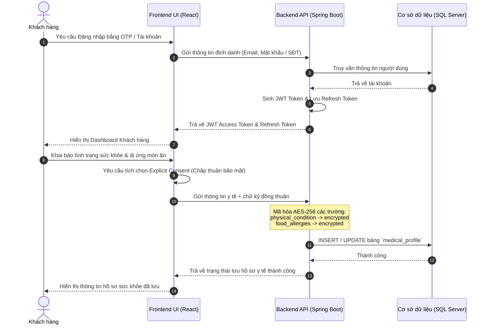
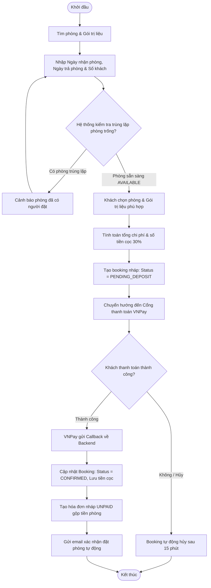
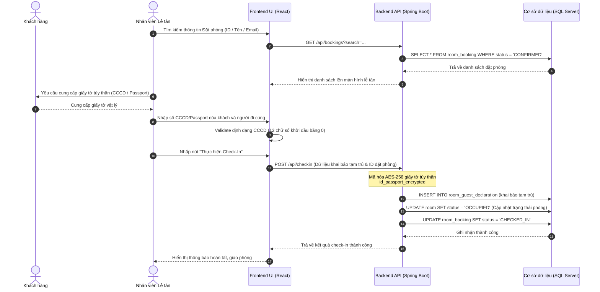
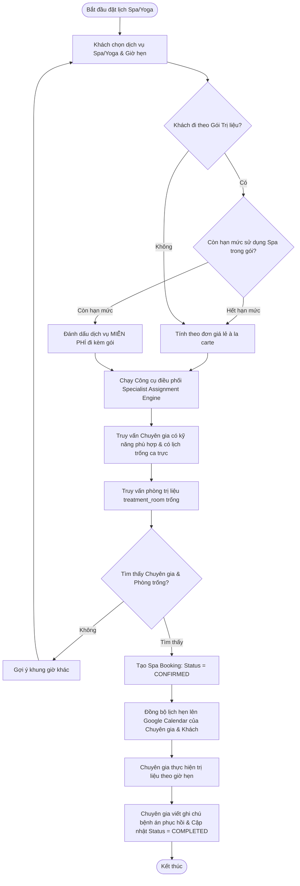
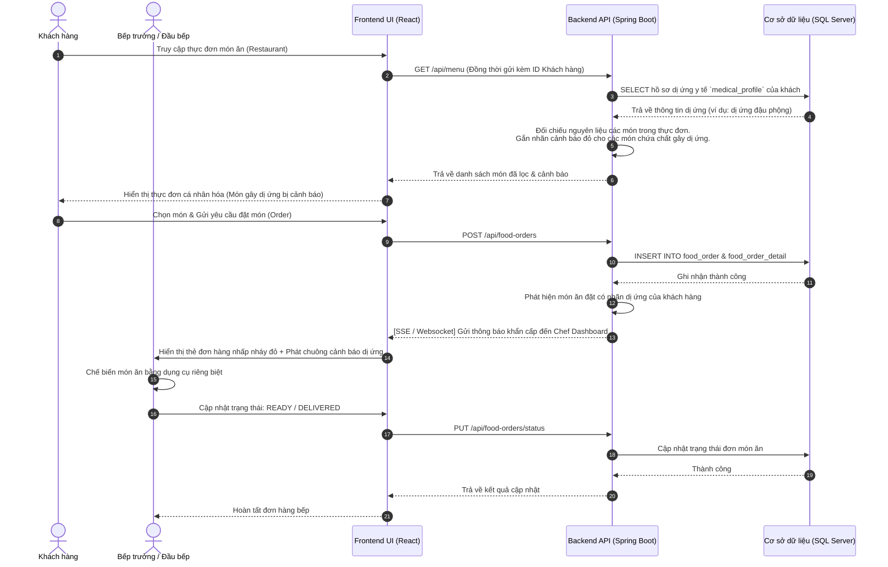
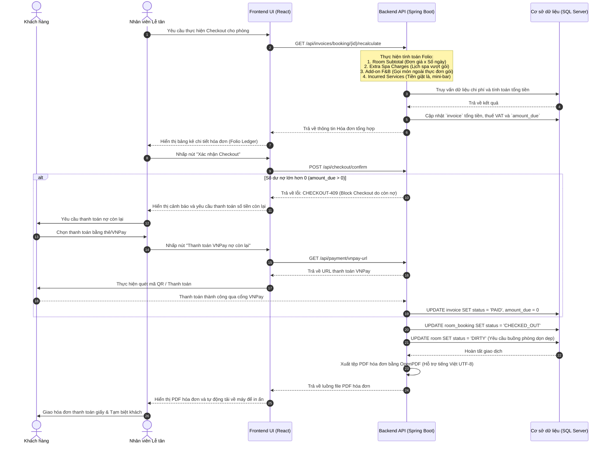

# 🌿 SMMS Resort & Spa – Quy trình Nghiệp vụ (Workflows)

Tài liệu này chi tiết 6 quy trình nghiệp vụ cốt lõi (workflows) tương ứng với 5 Module của hệ thống **SMMS Ngũ Sơn Resort & Spa** sử dụng sơ đồ tuần tự (Sequence Diagram) và sơ đồ hoạt động (Activity Diagram) bằng cú pháp Mermaid.

---

## 🔐 Workflow 1: Đăng ký, Đăng nhập & Khai báo Hồ sơ Y tế (Module 1)

Quy trình này mô tả việc đăng nhập, bảo mật hồ sơ sức khỏe nhạy cảm bằng mã hóa AES-256 và quyền được xóa dữ liệu cá nhân theo tiêu chuẩn GDPR.



---

## 🛏️ Workflow 2: Tìm kiếm & Đặt phòng cùng Gói trị liệu (Module 2)

Khách hàng tìm kiếm phòng trống theo thời gian thực và thực hiện đặt phòng kết hợp Gói trị liệu (Retreat Package) kèm thanh toán đặt cọc 30%.

```mermaid
activityDiagram
    %% Note: Cú pháp flowchart thường được dùng làm Activity Diagram đẹp hơn trong Mermaid.
```


---

## 🪪 Workflow 3: Thủ tục Check-In & Khai báo Tạm trú (Module 2)

Nhân viên lễ tân thực hiện làm thủ tục nhận phòng cho khách lưu trú khi đến resort.



---

## 💆 Workflow 4: Đặt lịch Trị liệu Spa/Yoga & Điều phối Chuyên gia (Module 3)

Quy trình tự động hóa lập lịch hẹn dịch vụ và phân bổ chuyên gia y tế/trị liệu dựa trên năng lực và thời gian trống.



---

## 🍲 Workflow 5: Đặt món ăn ẩm thực trị liệu & Cảnh báo Dị ứng (Module 4)

Quy trình đặt món ăn an toàn cho sức khỏe và kích hoạt cảnh báo dị ứng thời gian thực cho nhà bếp.



---

## 🧾 Workflow 6: Hóa đơn Tổng hợp & Làm thủ tục Trả phòng (Module 5)

Quy trình kết xuất hóa đơn consolidated folio, thanh toán phần còn lại qua cổng VNPay và hoàn tất check-out.


