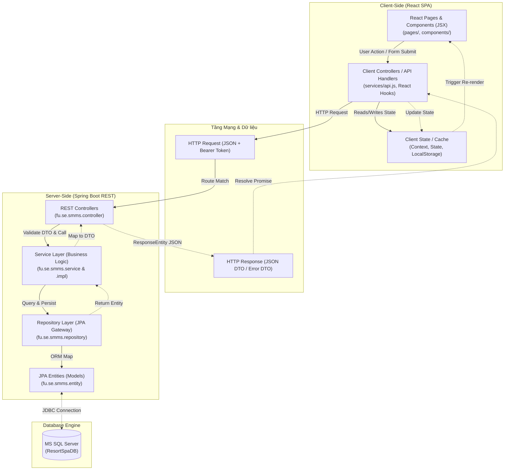

# ADR-001 — Kiến trúc MVC Phân rã (Decoupled MVC Pattern)

**Status:** `Accepted`  
**Date:** 2026-07-01  
**Deciders:** SWP391 SE2023-G3 Architecture Team  
**Context tags:** #architecture #mvc #decoupled #spring-boot #react-spa #rest-api #technical-specification  
**US References:** `UC-01` to `UC-25` ⭐ *CASE 2.0*  
**BR References:** `BR-CHILD`, `BR-DEPOSIT`, `BR-REFUND`, `BR-Allergy` ⭐ *CASE 2.0*  

---

## Context — Bối cảnh

Hệ thống Quản lý Resort & Spa Ngũ Sơn (Ngũ Sơn Resort & Spa Management System - SMMS) đòi hỏi một kiến trúc phần mềm linh hoạt, bảo mật cao, khả năng mở rộng tốt và mang lại trải nghiệm người dùng tối ưu (UX mượt mà, tốc độ phản hồi nhanh, cập nhật thời gian thực). 

Với quy mô ứng dụng lớn bao gồm quản lý đặt phòng, đặt lịch spa, đặt thực đơn dinh dưỡng cá nhân hóa, quản lý hóa đơn (VNPay), phân ca làm việc và dọn dẹp phòng, nhóm phát triển phải lựa chọn giữa hai mô hình kiến trúc MVC chính:
1. **Monolithic MVC (Traditional MVC)**: Xử lý hiển thị (View) và dữ liệu (Model) trên cùng một máy chủ (ví dụ: Spring Boot + Thymeleaf/JSP).
2. **Decoupled MVC (Client-Server Split)**: Phân tách hoàn toàn Frontend (React Single Page Application) đóng vai trò hiển thị và quản lý trạng thái giao diện, kết nối với Backend (Spring Boot REST API) đóng vai trò xử lý nghiệp vụ và quản trị cơ sở dữ liệu.

---

## Options Considered — Các lựa chọn đã xem xét

| Option | Mô tả | Pros | Cons |
|--------|-------|------|------|
| **Option A: Monolithic Traditional MVC** | Sử dụng Spring MVC tích hợp Thymeleaf để render HTML trực tiếp từ máy chủ gửi về trình duyệt. | - Đơn giản khi cấu hình khởi tạo ban đầu.<br>- Loại bỏ hoàn toàn lỗi CORS.<br>- Bảo mật Session truyền thống dễ thiết lập. | - Trải nghiệm người dùng kém do mỗi lần nhấp chuột phải tải lại toàn bộ trang (Full Page Reload).<br>- Ràng buộc chặt chẽ mã giao diện vào cấu trúc Java backend.<br>- Khó phát triển song song giữa nhóm Frontend và Backend. |
| **Option B: Decoupled MVC Architecture** *(Lựa chọn được duyệt)* | Tách biệt hoàn toàn:<br>- **Backend**: Spring Boot đóng vai trò **Model** (Entities, Repositories) & **Controller** (REST Controllers, Services).<br>- **Frontend**: React + Vite đóng vai trò **View** & **Client-side Controller** (Routing, Client State, API Service). | - **UX tối ưu**: Chuyển trang mượt mà nhờ cơ chế Single Page Application (SPA).<br>- **Phát triển song song**: Lập trình viên Front và Back làm việc độc lập qua hợp đồng API (JSON DTO).<br>- **Khả năng mở rộng**: API Backend có thể tái sử dụng cho các ứng dụng di động hoặc đối tác thứ ba trong tương lai. | - Phức tạp hơn trong việc quản lý trạng thái phiên đăng nhập (JWT token).<br>- Cần xử lý và cấu hình phân chia nguồn tài nguyên (CORS). |

---

## Decision — Quyết định

Chúng ta lựa chọn **Option B: Decoupled MVC Architecture (Kiến trúc MVC Phân rã)** làm tiêu chuẩn thiết kế hệ thống SMMS.
*   **Backend**: Xây dựng trên nền tảng **Java 21** và **Spring Boot 3.4.2**, sử dụng Spring Security để xác thực phi trạng thái (Stateless Authentication) qua JWT, kết nối **MS SQL Server** thông qua JPA/Hibernate. Tiền tố API được mặc định là `/api`.
*   **Frontend**: Xây dựng bằng **React 19** và công cụ build **Vite**, quản lý định tuyến Client-side bằng `react-router-dom`, giao tiếp API bằng thư viện `Axios`.

---

## Rationale — Lý do

*   **Tăng hiệu quả phát triển song song**: Frontend và Backend có thể được phát triển và kiểm thử độc lập thông qua hợp đồng API (JSON DTO) đã thống nhất từ trước.
*   **Tối ưu hóa trải nghiệm người dùng (UX)**: Cơ chế Single Page Application (SPA) giúp trang web phản hồi tức thì, chuyển trang không bị giật lag hoặc tải lại toàn bộ, phù hợp với tiêu chuẩn vận hành cao cấp của Resort & Spa.
*   **Khả năng tái sử dụng API**: API Backend được thiết kế stateless có thể tái sử dụng cho các nền tảng khác như ứng dụng di động cho khách hàng hoặc nhân viên trị liệu trong tương lai mà không cần viết lại logic nghiệp vụ.

---

## Technical Specification – Đặc tả kỹ thuật MVC phân rã

### 1. Sơ đồ Luồng dữ liệu cấu trúc (System Component Flow)



### 2. Mô tả các thành phần MVC cụ thể

#### A. MODEL (Lớp Dữ liệu & Nghiệp vụ)
*   **Server-Side Model (JPA Entities)**:
    *   Thư mục: `fu.se.smms.entity` (Xem các tệp tại [entity](file:///d:/ResortManageNew/05-Development/backend/src/main/java/fu/se/smms/entity)).
    *   Các lớp Java ánh xạ trực tiếp xuống cơ sở dữ liệu SQL Server qua JPA (Hibernate).
    *   Ví dụ: `User.java` (thông tin tài khoản và vai trò), `RoomBooking.java` (thông tin đặt phòng), `MedicalProfile.java` (hồ sơ y tế mã hóa), `Invoice.java` (hóa đơn consolidated folio).
*   **Client-Side Model (State & Cache)**:
    *   Quản lý trạng thái bằng React Context (`frontend/src/context`) để đồng bộ xuyên suốt ứng dụng.
    *   Ví dụ: `LanguageContext.jsx` (Ngôn ngữ VI/EN), `NotificationContext.jsx` (Quản lý các thông báo nổi thời gian thực).
    *   `LocalStorage / Session Storage` dùng lưu trữ tạm thời JWT Access Token để đính kèm vào Header Authorization của mỗi request.

#### B. VIEW (Lớp Hiển thị Giao diện)
*   View được xử lý bất đồng bộ hoàn toàn ở Client-Side thông qua các component React:
    *   Thư mục: `frontend/src/pages` (Xem [pages](file:///d:/ResortManageNew/05-Development/frontend/src/pages)).
    *   Ví dụ: `BookingPage.jsx` (giao diện đặt phòng), `Restaurant.jsx` (thực đơn F&B của khách), `ChefDashboard.jsx` (bảng hiển thị chế biến của bếp trưởng), `StaffDashboard.jsx` (lễ tân).
    *   Backend chỉ lưu một trang tĩnh tối giản `index.html` tại thư mục `static/` để kiểm tra nhanh trạng thái máy chủ.

#### C. CONTROLLER (Lớp Điều phối & Định tuyến)
*   **Server-Side REST Controller**:
    *   Thư mục: `fu.se.smms.controller` (Xem [controller](file:///d:/ResortManageNew/05-Development/backend/src/main/java/fu/se/smms/controller)).
    *   Các lớp được khai báo `@RestController` có nhiệm vụ tiếp nhận HTTP request từ Client, giải mã JSON payload thành DTO, thực thi validation thông qua `@Valid`, sau đó chuyển giao nghiệp vụ xuống tầng Service.
    *   Ví dụ: `AuthController.java` (xử lý đăng nhập, OTP), `BookingController.java` (xử lý đặt phòng), `InvoiceController.java` (xử lý thanh toán).
*   **Client-Side Controller (API Service & Routing)**:
    *   Định tuyến Client-side được quản lý bởi React Router trong `App.jsx`.
    *   Giao tiếp API được đóng gói tại `api.js` (Sử dụng Axios interceptors để tự động chèn JWT token vào header request và xử lý lỗi tập trung).
    *   Event handlers trong React components (như `handleSubmit`, `handleClick`) chịu trách nhiệm thu thập dữ liệu từ View, gọi Client API và chuyển đổi dữ liệu hiển thị.

---

## Consequences — Hệ quả

**Positive:**
*   **Phân tách trách nhiệm (Separation of Concerns)**: View và Model nghiệp vụ hoàn toàn độc lập. Sự thay đổi giao diện không gây ảnh hưởng đến logic của API backend.
*   **Hiệu năng & Trải nghiệm (UX)**: Cơ chế Single Page Application (SPA) giúp trang web chuyển động mượt mà, tải dữ liệu động thông qua gọi API bất đồng bộ mà không cần tải lại toàn bộ trang.
*   **Stateless Security**: Bảo mật dựa trên JWT token phi trạng thái giúp server không cần lưu trữ Session trong bộ nhớ RAM, tăng tính phân tải và tránh được tấn công CSRF.
*   **Phát triển độc lập**: Nhóm phát triển frontend và backend làm việc độc lập sau khi thống nhất đặc tả các DTO JSON.

**Negative (trade-offs accepted):**
*   **Cấu hình CORS phức tạp**: Phải cho phép tường minh chia sẻ tài nguyên cross-origin giữa cổng của Client (`5173`/`5174`) và Server (`8080`) thông qua [SecurityConfig.java](file:///d:/ResortManageNew/05-Development/backend/src/main/java/fu/se/smms/config/SecurityConfig.java).
*   **Quản lý Token ở Client**: Phải xử lý việc lưu trữ JWT token an toàn tại Client nhằm tránh tấn công XSS chiếm đoạt thông tin.

**Risks:**
*   **Không đồng bộ DTO và Entity**: Khi thay đổi thuộc tính dữ liệu ở database, nếu không cập nhật DTO tương ứng ở cả Backend và Frontend sẽ gây ra lỗi crash hệ thống.
    *   *Biện pháp giảm thiểu:* Thực hiện viết unit test cho các luồng Controller/Service và chạy kiểm thử tự động sau mỗi lần thay đổi schema.

**Compliance Impact:** ⭐ *CASE 2.0*
*   **Nghị định 13/2023/NĐ-CP (Bảo vệ dữ liệu cá nhân) & Luật Cư trú 2020**: Tầng Model lưu trữ thông tin nhạy cảm của khách hàng (CCCD/Passport, bệnh án, thông tin sức khỏe/dị ứng) bắt buộc phải được mã hóa đối xứng AES-256. Frontend View không bao giờ hiển thị trực tiếp dữ liệu thô này nếu không được xác thực quyền và giải mã ở Backend Controller/Service.

**Decisions unlocked (ADR tiếp theo có thể viết):**
*   **ADR-002**: Quản lý tỉ lệ đặt cọc trực tuyến: Fixed 30% vs Configurable (Lưu trong database và quản lý động).
*   **ADR-003**: Quy trình dọn dẹp Villa và chuyển giao trạng thái sau check-out.
*   **ADR-004**: Tối ưu hóa API trục thời gian lịch trình (Itinerary Timeline) sử dụng Aggregator Pattern & Redis Cache.

---

## §AI Prompt Constraint ⭐ CASE 2.0 — BẮT BUỘC

> **Các quy định bắt buộc phải tuân thủ khi viết mã nguồn dự án:**

```
Theo ADR-001:
1. Tất cả các Model dữ liệu nghiệp vụ phải được định nghĩa dưới dạng JPA Entity tại gói 'fu.se.smms.entity'. Không được định nghĩa trực tiếp cấu trúc bảng cơ sở dữ liệu trong Controller hoặc Service.
2. Các REST Controller tại 'fu.se.smms.controller' CHỈ chịu trách nhiệm điều hướng yêu cầu HTTP, kiểm tra hợp lệ dữ liệu (@Valid) và ánh xạ dữ liệu trả về thông qua DTO. TUYỆT ĐỐI không triển khai logic nghiệp vụ phức tạp trực tiếp tại Controller; toàn bộ logic nghiệp vụ phải được ủy quyền cho Service.
3. Tất cả các giao dịch dữ liệu ghi (Create, Update, Delete) ở Service Layer phải được đánh dấu bằng annotation '@Transactional' để đảm bảo tính toàn vẹn dữ liệu khi xảy ra lỗi.
4. Lớp Frontend (React SPA) phải gọi API thông qua helper 'apiRequest' được cấu hình sẵn trong 'api.js' (không được dùng fetch/axios trực tiếp từ các file component mà không có cơ chế gắn JWT token và bắt lỗi chung).
5. Khi bổ sung/cập nhật API, phải cập nhật tài liệu API Status Dashboard tại 'src/main/resources/static/index.html' hoặc ghi nhận trong Swagger/Postman collection chung của dự án để đảm bảo tính nhất quán.
```

---
*Template version 2.0 — PrivacyOps Architecture Team — Tích hợp CASE 2.0*  
*Section đánh dấu ⭐ là bổ sung mới từ CASE 2.0 methodology.*  
