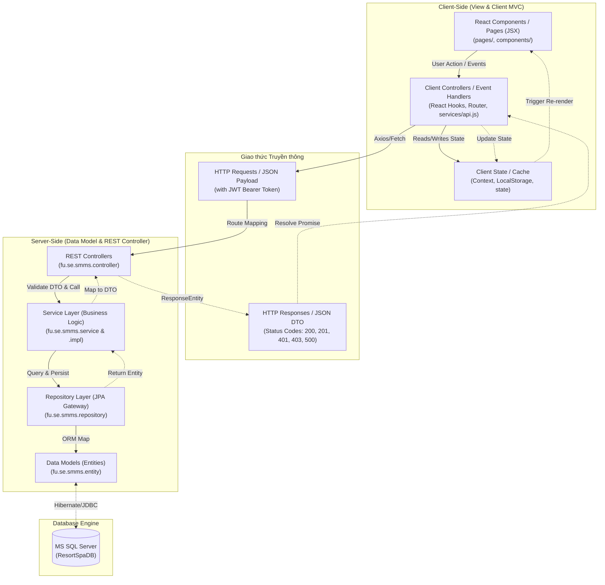
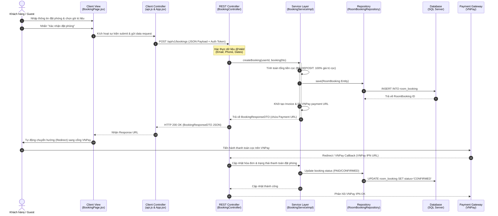

# ADR-002 — Kiến trúc MVC Phân rã (Decoupled MVC Pattern) & Technical Specification

**Status:** `Accepted`
**Date:** 2026-06-29
**Deciders:** Project Architecture Team, SWP391 G3 Backend/Frontend Developers
**Context tags:** #architecture #mvc #decoupled #spring-boot #react-spa #rest-api #technical-specification
**US References:** All User Stories (US-01 to US-20)
**BR References:** System Business Rules (e.g., BR-CHILD, BR-DEPOSIT, BR-REFUND)

---

## Context — Bối cảnh
Hệ thống Quản lý và Vận hành Resort & Spa Ngũ Sơn (Ngu Son Resort & Spa Management System - NSRMS) yêu cầu một kiến trúc phần mềm linh hoạt, dễ mở rộng, bảo mật cao và mang lại trải nghiệm người dùng tối ưu (UX mượt mà, tải trang nhanh, tương tác thời gian thực).

Trong quá trình phân tích và thiết kế, nhóm phát triển đối mặt với hai hướng tiếp cận chính để tổ chức mô hình MVC:
1. **Traditional MVC (Monolithic MVC)**: Server-side rendering (ví dụ: Spring MVC + Thymeleaf/JSP). Server chịu trách nhiệm sinh mã HTML và gửi về Client.
2. **Decoupled MVC (Client-Server Split)**: Tách biệt Frontend (Single Page Application dùng React + Vite) và Backend (REST API dùng Spring Boot + Spring Data JPA).

Với khối lượng nghiệp vụ lớn liên quan đến đặt phòng (Room Booking), trị liệu Spa (Spa Booking), đặt thực đơn ăn kiêng dinh dưỡng (Diet & Meal Planning), quản lý kho (Inventory), phân ca làm việc (Shifts) và quản lý hóa đơn thanh toán (Invoice/VNPay), hệ thống cần một cấu trúc rõ ràng nhằm phân chia công việc tối ưu cho nhóm phát triển và đảm bảo khả năng mở rộng trong tương lai.

---

## Options Considered — Các lựa chọn đã xem xét

| Option | Mô tả | Pros | Cons |
|--------|-------|------|------|
| **Option A: Traditional Monolithic MVC** | Dùng Spring Boot làm trung tâm xử lý dữ liệu và render giao diện trực tiếp (HTML/Thymeleaf) gửi về trình duyệt. | - Đơn giản khi bắt đầu cấu hình.<br>- Không gặp vấn đề CORS.<br>- Bảo mật Session truyền thống dễ kiểm soát. | - Tải lại trang toàn bộ (Full Page Reload) làm giảm trải nghiệm khách hàng.<br>- Phụ thuộc chặt chẽ giữa logic hiển thị và nghiệp vụ backend.<br>- Khó phát triển song song giữa Frontend & Backend dev. |
| **Option B: Decoupled MVC Architecture** (Lựa chọn chọn) | Phân tách hệ thống thành 2 phần độc lập:<br>- **Backend (RESTful API)**: Spring Boot đóng vai trò **Model** (JPA Entity, Repository, DB) và **Controller** (REST Controllers xử lý logic, nhận/trả JSON).<br>- **Frontend (SPA - Single Page Application)**: React (Vite) đóng vai trò **View** và quản lý **Client State / Controller** nội bộ. | - **Trải nghiệm khách hàng tối ưu**: Chuyển trang mượt mà không load lại trang, hỗ trợ SPA tốt.<br>- **Phát triển độc lập**: Backend và Frontend giao tiếp thông qua giao thức REST API rõ ràng.<br>- **Dễ mở rộng**: Có thể tái sử dụng Backend API cho các nền tảng khác (Mobile app, Partner API).<br>- **Tối ưu hóa hiệu năng**: Phân tải xử lý hiển thị về phía client-side. | - Cần cấu hình CORS (Cross-Origin Resource Sharing).<br>- Phức tạp hơn trong việc quản lý trạng thái đồng bộ và bảo mật token (JWT). |

---

## Decision — Quyết định
Chúng ta lựa chọn **Option B: Decoupled MVC Architecture (Kiến trúc MVC Phân rã)**.
- **Backend** được xây dựng trên Java 21, Spring Boot 3.4.2, Spring Security, JPA, kết nối với MS SQL Server làm kho dữ liệu chính, phơi bày các REST endpoints dưới định dạng JSON tại tiền tố `/api` (hoặc `/v1`).
- **Frontend** được xây dựng bằng React 18+ sử dụng công cụ build Vite, quản lý định tuyến bằng `react-router-dom`, và giao tiếp với Backend thông qua Axios / Fetch API.
- Bổ sung một **API Status Dashboard** nhỏ nằm trực tiếp tại thư mục tĩnh của backend (`src/main/resources/static/index.html`) để các nhà phát triển kiểm tra nhanh tình trạng hoạt động của API và cấu hình thanh toán.

---

## Technical Specification - Chi tiết Thiết kế Mô hình MVC trong NSRMS

### 1. Kiến trúc Tổng thể (System Component Diagram)

Hệ thống được tổ chức thành 3 lớp phân tầng logic tương ứng với mô hình MVC cải tiến trong cấu trúc decoupled:



### 2. Mô tả các thành phần MVC (MVC Component Breakdown)

#### A. MODEL (Lớp Dữ liệu & Trạng thái Nghiệp vụ)
Trong kiến trúc Decoupled MVC, Model tồn tại ở cả hai phía Server và Client:

1. **Server-Side Model (JPA Entities & SQL DB)**:
   - Thư mục: `fu.se.smms.entity` (Xem các tệp tại [entity](file:///d:/ResortManageNew/05-Development/backend/src/main/java/fu/se/smms/entity))
   - Định nghĩa cấu trúc dữ liệu quan hệ được ánh xạ trực tiếp sang MS SQL Server bằng Hibernate.
   - Ví dụ tiêu biểu:
     - [User.java](file:///d:/ResortManageNew/05-Development/backend/src/main/java/fu/se/smms/entity/User.java): Lưu thông tin định danh khách hàng/nhân viên, phân quyền vai trò (CUSTOMER, STAFF, ADMIN, CHEF, SPA...).
     - [RoomBooking.java](file:///d:/ResortManageNew/05-Development/backend/src/main/java/fu/se/smms/entity/RoomBooking.java): Đại diện cho thực thể giao dịch đặt phòng, lưu ngày check-in/check-out, tổng tiền, tiền cọc.
     - [MedicalProfile.java](file:///d:/ResortManageNew/05-Development/backend/src/main/java/fu/se/smms/entity/MedicalProfile.java): Lưu trữ thông tin nhạy cảm về y tế, dị ứng thức ăn của khách nhằm phục vụ lập kế hoạch ăn kiêng và liệu trình trị liệu.
     - [Invoice.java](file:///d:/ResortManageNew/05-Development/backend/src/main/java/fu/se/smms/entity/Invoice.java): Quản lý hóa đơn folio, trạng thái thanh toán và thông tin VNPay.
2. **Client-Side Model (State & Storage)**:
   - Thư mục: `frontend/src/context` và các trạng thái component nội bộ.
   - [LanguageContext.jsx](file:///d:/ResortManageNew/05-Development/frontend/src/context/LanguageContext.jsx): Lưu trữ ngôn ngữ hiện tại (VI/EN) được đồng bộ xuống toàn bộ View.
   - [NotificationContext.jsx](file:///d:/ResortManageNew/05-Development/frontend/src/context/NotificationContext.jsx): Lưu trữ danh sách thông báo nổi thời gian thực trên màn hình client.
   - **Local Storage / Session Storage**: Lưu trữ JWT token định danh người dùng phục vụ cho việc gửi kèm Header Authorization trong mỗi request API.

#### B. VIEW (Lớp Hiển thị Giao diện)
View được xử lý hoàn toàn phía Client-Side thông qua các React Components được biên dịch nhanh chóng bằng Vite:
- **Pages**: Chứa các trang chính của hệ thống.
  - Thư mục: `frontend/src/pages` (Xem [pages](file:///d:/ResortManageNew/05-Development/frontend/src/pages))
  - Ví dụ: [Home.jsx](file:///d:/ResortManageNew/05-Development/frontend/src/pages/Home.jsx) (Trang chủ resort), [BookingPage.jsx](file:///d:/ResortManageNew/05-Development/frontend/src/pages/BookingPage.jsx) (Form đặt lịch wizard), [AdminDashboard.jsx](file:///d:/ResortManageNew/05-Development/frontend/src/pages/AdminDashboard.jsx) (Bảng điều khiển quản trị).
- **Components**: Các thành phần giao diện nhỏ, tái sử dụng được.
  - Thư mục: `frontend/src/components` (Xem [components](file:///d:/ResortManageNew/05-Development/frontend/src/components))
  - Ví dụ: [Header.jsx](file:///d:/ResortManageNew/05-Development/frontend/src/components/Header.jsx) và [Footer.jsx](file:///d:/ResortManageNew/05-Development/frontend/src/components/Footer.jsx), [ProtectedRoute.jsx](file:///d:/ResortManageNew/05-Development/frontend/src/components/ProtectedRoute.jsx) (điều hướng bảo vệ route theo quyền).
- **Style System**:
  - Giao diện được thiết kế hiện đại với phong cách Dark Glassmorphism, kết hợp giữa `index.css` (Tailwind và các custom token) và các tệp `.css` riêng biệt của từng Dashboard để đảm bảo tính module hóa cao.

*Lưu ý:* Backend cũng giữ một View tĩnh tối giản [index.html](file:///d:/ResortManageNew/05-Development/backend/src/main/resources/static/index.html) phục vụ cho nhà phát triển kiểm tra trạng thái API mà không cần khởi động frontend.

#### C. CONTROLLER (Lớp Điều phối & Xử lý Yêu cầu)
Trong mô hình Decoupled, Controller đóng vai trò phân luồng giao tiếp:
1. **Server-Side Controller (REST Controllers)**:
   - Thư mục: `fu.se.smms.controller` (Xem [controller](file:///d:/ResortManageNew/05-Development/backend/src/main/java/fu/se/smms/controller))
   - Các class được đánh dấu bằng `@RestController` và cấu hình tiền tố endpoint bằng `@RequestMapping`.
   - **Nhiệm vụ**: Nhận JSON request payload, xác thực dữ liệu đầu vào bằng `@Valid` và Jakarta Validation Constraints, gọi Service tương ứng xử lý nghiệp vụ, sau đó đóng gói dữ liệu kết quả vào DTO và trả về thông qua `ResponseEntity`.
   - Ví dụ:
     - [AuthController.java](file:///d:/ResortManageNew/05-Development/backend/src/main/java/fu/se/smms/controller/AuthController.java): Xử lý đăng ký, đăng nhập, quên mật khẩu và xác thực mã OTP.
     - [BookingController.java](file:///d:/ResortManageNew/05-Development/backend/src/main/java/fu/se/smms/controller/BookingController.java): Điều phối luồng đặt phòng, tự động tạo khách hàng Guest nếu chưa đăng nhập, kết hợp tính toán đơn giá.
2. **Client-Side Controller (Client-Side Routers & API Handlers)**:
   - Thư mục: `frontend/src/api.js` và `frontend/src/services/api.js`.
   - Xử lý điều phối View bằng [App.jsx](file:///d:/ResortManageNew/05-Development/frontend/src/App.jsx) (sử dụng React Router `Routes` & `Route`).
   - Kết nối với REST API:
     - [api.js](file:///d:/ResortManageNew/05-Development/frontend/src/api.js) định nghĩa hàm `apiRequest` tự động gắn JWT Bearer Token lấy từ localStorage và thực hiện fetch các api nghiệp vụ như `authApi`, `medicalApi`.
     - Các sự kiện Click/Submit trong React component đóng vai trò điều hướng dữ liệu từ View sang API Client để đẩy về Backend Controller.

---

### 3. Business & Data Flow Sequence (Luồng xử lý điển hình: Đặt phòng & Thanh toán đặt cọc - UC07)

Dưới đây là sơ đồ tuần tự biểu diễn dòng dữ liệu đi qua các lớp MVC khi Khách hàng thực hiện Đặt phòng và Thanh toán cọc VNPay:



---

## Consequences — Hệ quả

### Positive (Mặt tích cực):
- **Phân tách trách nhiệm rõ ràng (Separation of Concerns)**: Lớp hiển thị hoàn toàn tách biệt khỏi logic xử lý nghiệp vụ backend. Thay đổi giao diện frontend không ảnh hưởng đến API backend.
- **Trải nghiệm người dùng cao**: Định dạng Single Page Application (SPA) giúp trang web phản hồi nhanh, tải dữ liệu động qua AJAX/Fetch, tạo cảm giác mượt mà như ứng dụng native.
- **Dễ bảo trì và kiểm thử**: Các lập trình viên có thể viết unit test độc lập cho từng class của backend service/controller và kiểm thử UI component frontend bằng các tool giả lập (Jest/Cypress).
- **Cơ chế Bảo mật tốt hơn**: API được bảo vệ bởi Spring Security stateless JWT. Session không lưu giữ trên server giúp giảm tải bộ nhớ RAM và loại bỏ nguy cơ bị tấn công CSRF phổ biến ở các hệ thống Monolithic dùng Session Cookie.

### Negative (Hệ quả cần đánh đổi):
- **Phát sinh vấn đề CORS**: Vì Frontend chạy trên cổng `5173` và Backend chạy trên cổng `8080`, việc giao tiếp cross-origin cần được cấu hình tường minh thông qua [SecurityConfig.java](file:///d:/ResortManageNew/05-Development/backend/src/main/java/fu/se/smms/config/SecurityConfig.java) và [WebConfig.java](file:///d:/ResortManageNew/05-Development/backend/src/main/java/fu/se/smms/config/WebConfig.java).
- **SEO Optimization**: Mặc định Single Page Application sẽ khó SEO hơn do render client-side. Tuy nhiên đối với hệ thống quản lý nội bộ resort (NSRMS) thì yêu cầu SEO cho các trang Dashboard là không quan trọng (chỉ cần tối ưu các trang tĩnh giới thiệu như trang chủ, dịch vụ spa, yoga).

### Risks (Rủi ro & Biện pháp giảm thiểu):
- **Rủi ro lộ Token (JWT)**: Nếu Token lưu ở LocalStorage, kẻ tấn công có thể thực hiện tấn công XSS để chiếm đoạt token.
  - *Biện pháp giảm thiểu:* Cấu hình token có thời gian hết hạn ngắn (Short-lived token), sử dụng thêm cơ chế HTTPS và thiết lập CSP (Content Security Policy) chặt chẽ trên Client.
- **Rủi ro không đồng bộ Entity & DTO**: Thay đổi thuộc tính Entity dưới database dễ làm crash API nếu DTO không được cập nhật tương ứng.
  - *Biện pháp giảm thiểu:* Sử dụng thư viện Lombok để tự sinh Getter/Setter và luôn thực hiện kiểm thử tự động (Automation Tests) luồng API sau khi cập nhật database schema.

---

## §AI Prompt Constraint ⭐ CASE 2.0 — BẮT BUỘC

> **Quy định triển khai cho các Phase tiếp theo.**

```
Theo ADR-002:
1. Tất cả các Model dữ liệu nghiệp vụ phải được định nghĩa dưới dạng JPA Entity tại gói 'fu.se.smms.entity'. Không được định nghĩa trực tiếp cấu trúc bảng cơ sở dữ liệu trong Controller hoặc Service.
2. Các REST Controller tại 'fu.se.smms.controller' CHỈ chịu trách nhiệm điều hướng yêu cầu HTTP, kiểm tra hợp lệ dữ liệu (@Valid) và ánh xạ dữ liệu trả về thông qua DTO. TUYỆT ĐỐI không triển khai logic nghiệp vụ phức tạp trực tiếp tại Controller; toàn bộ logic nghiệp vụ phải được ủy quyền cho Service.
3. Tất cả các giao dịch dữ liệu ghi (Create, Update, Delete) ở Service Layer phải được đánh dấu bằng annotation '@Transactional' để đảm bảo tính toàn vẹn dữ liệu khi xảy ra lỗi.
4. Lớp Frontend (React SPA) phải gọi API thông qua helper 'apiRequest' được cấu hình sẵn trong 'api.js' (không được dùng fetch/axios trực tiếp từ các file component mà không có cơ chế gắn JWT token và bắt lỗi chung).
5. Khi bổ sung/cập nhật API, phải cập nhật tài liệu API Status Dashboard tại 'src/main/resources/static/index.html' hoặc ghi nhận trong Swagger/Postman collection chung của dự án để đảm bảo tính nhất quán.
```

---
*Template version 2.0 — PrivacyOps Architecture Team — Tích hợp CASE 2.0*
*Section đánh dấu ⭐ là bổ sung mới từ CASE 2.0 methodology.*
