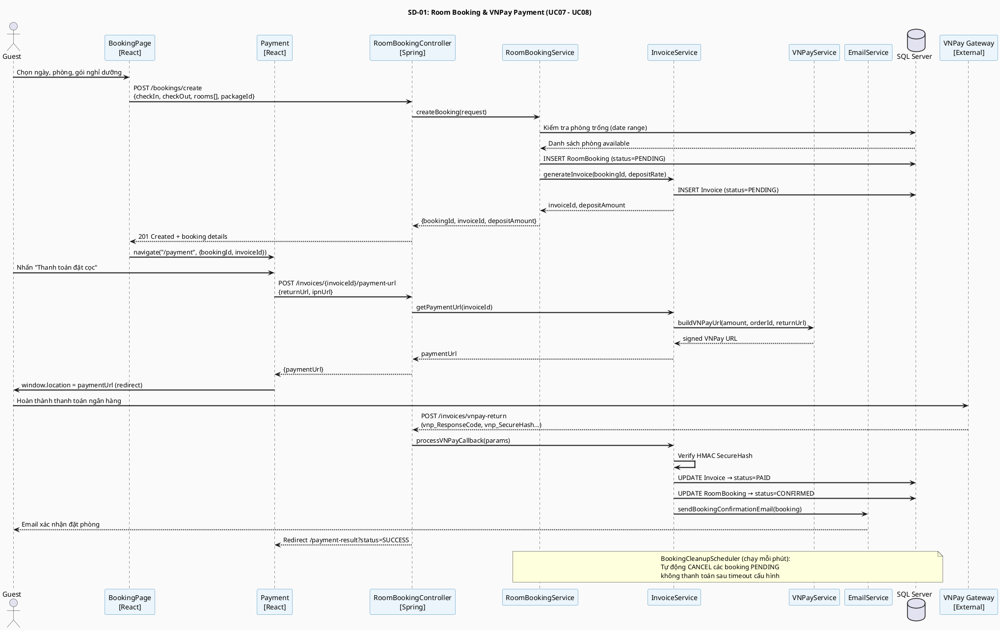
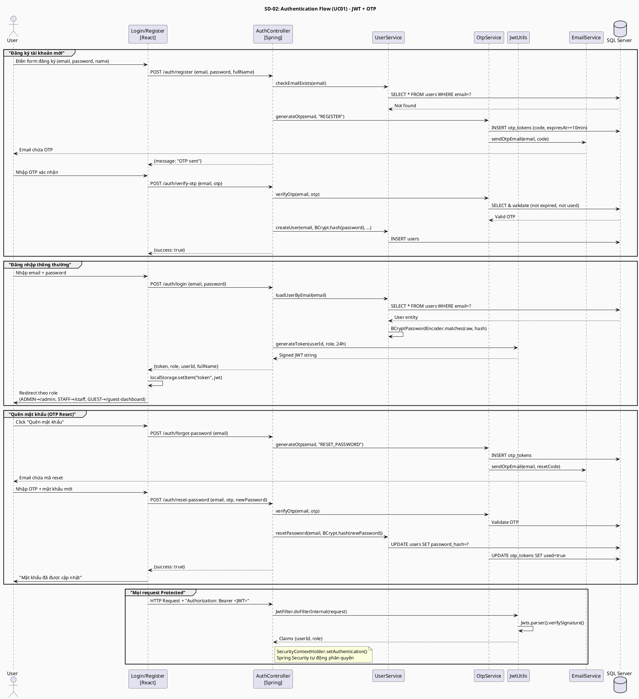
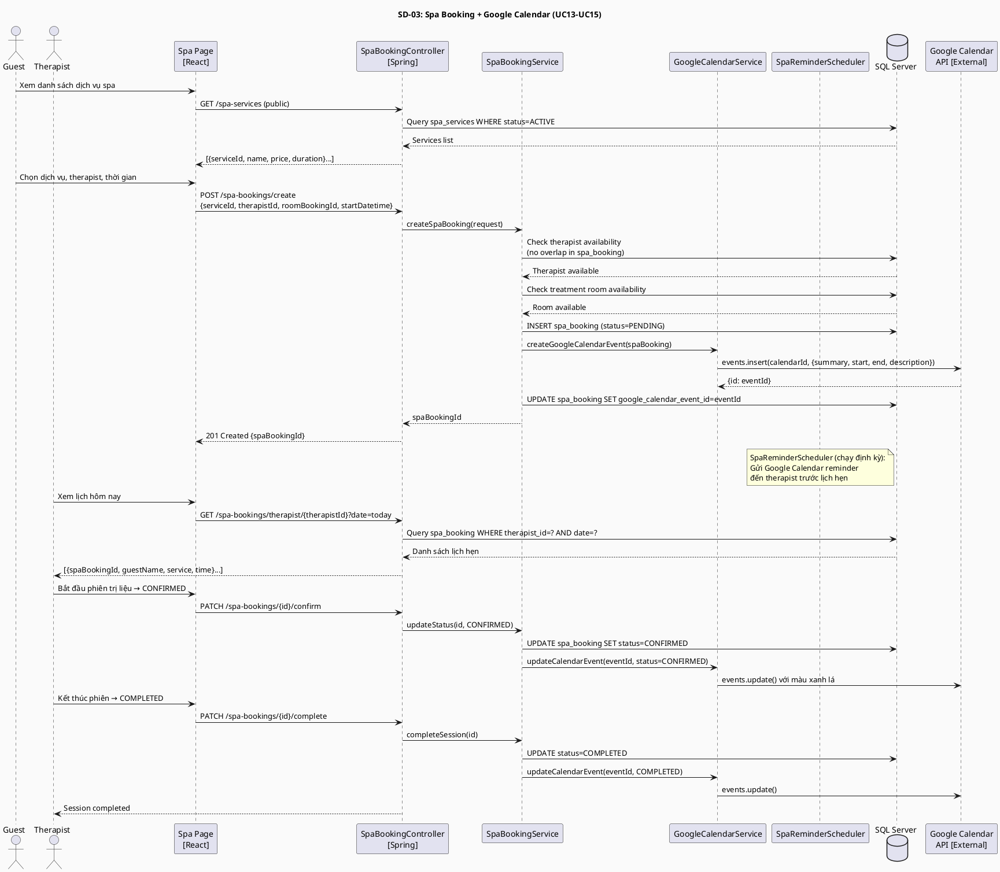
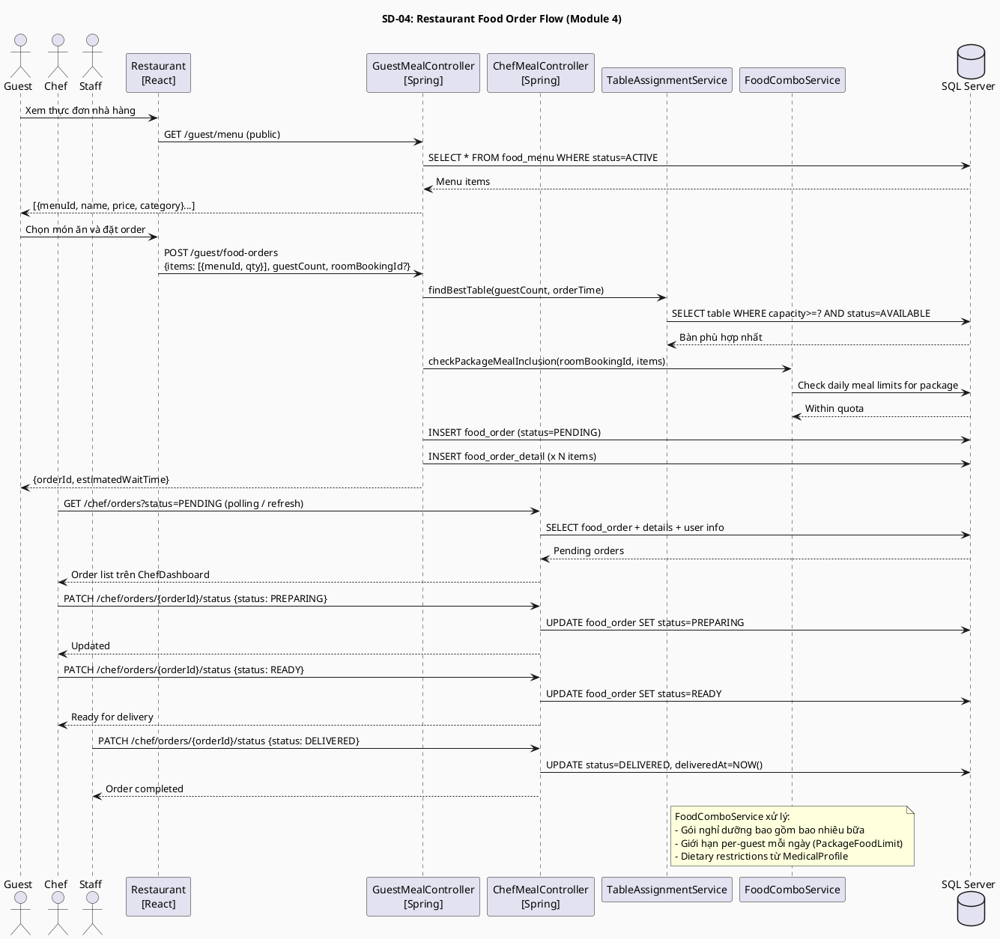
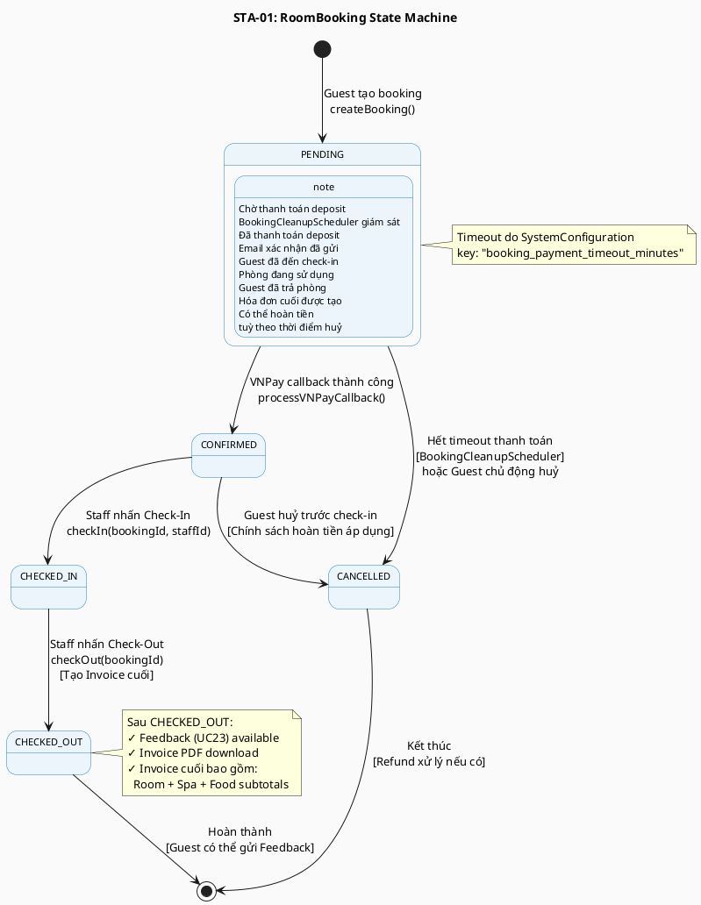
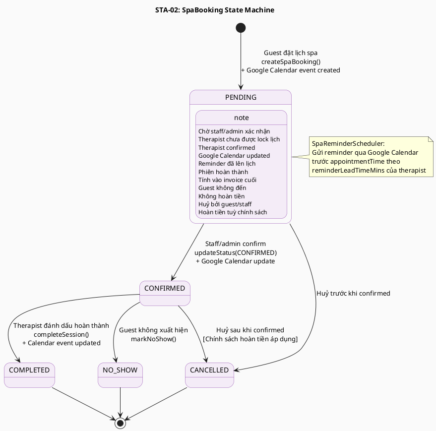

# SOFTWARE ARCHITECTURE DOCUMENT – C4 MODEL
## SMMS – Ngũ Sơn Resort & Spa Management System

**Dự án:** SWP391 – SE2023-G3  
**Phiên bản:** 2.0 (C4 Model Revision)  
**Ngày:** 2026-06-27  
**Tác giả:** Generated from codebase analysis (05-Development)  
**Phương pháp:** [C4 Model](https://c4model.com) – Simon Brown

---

## GIỚI THIỆU VỀ C4 MODEL

C4 Model mô tả kiến trúc phần mềm qua **4 cấp độ trừu tượng**, từ tổng quát đến chi tiết:

| Level | Sơ đồ | Đối tượng xem | Mục đích |
|---|---|---|---|
| **L1** | System Context | Tất cả stakeholders | Hệ thống nằm trong môi trường nào |
| **L2** | Container | Developers, Architects | Các ứng dụng/dịch vụ chính |
| **L3** | Component | Backend Developers | Các component bên trong container |
| **L4** | Code (Class) | Developers | Cấu trúc class, entity |

---

## TECH STACK

| Thành phần         | Công nghệ                                                         |
| ------------------- | ------------------------------------------------------------------|
| **Frontend**       | React 19 + Vite 8, React Router v7, Axios, TailwindCSS, Firebase |
| **Backend**        | Spring Boot 3.4.2, Java 21, Spring Security, Spring Data JPA     |
| **Database**       | Microsoft SQL Server (primary), H2 (fallback/testing)            |
| **Authentication** | JWT (jjwt 0.12.5) + BCrypt password hashing                      |
| **Payments**       | VNPay Gateway Integration                                        |
| **Email**          | Spring Mail (SMTP)                                               |
| **Calendar**       | Google Calendar API v3                                           |
| **PDF**            | OpenPDF (iText fork)                                             |
| **Security**       | AES Encryption for sensitive data                                |

---

## LEVEL 1 – SYSTEM CONTEXT DIAGRAM

> **Mục đích:** Cho thấy SMMS nằm trong môi trường nào, ai sử dụng và tương tác với hệ thống ngoại vi nào.

```plantuml
@startuml C4_L1_System_Context
!include https://raw.githubusercontent.com/plantuml-stdlib/C4-PlantUML/master/C4_Context.puml

LAYOUT_WITH_LEGEND()

title [L1] System Context – SMMS Ngũ Sơn Resort & Spa

' ===== PEOPLE =====
Person(guest, "Guest / Customer", "Khách hàng đặt phòng, spa,\norder ăn và xem lịch sử")
Person(staff, "Staff / Receptionist", "Nhân viên lễ tân quản lý\ncheck-in, check-out, hỗ trợ")
Person(admin, "Admin / Manager", "Quản lý tài khoản, dịch vụ,\nbáo cáo doanh thu")
Person(chef, "Chef / Kitchen Staff", "Quản lý thực đơn, xử lý\norder bữa ăn")
Person(therapist, "Therapist / Specialist", "Quản lý lịch trị liệu spa,\nyoga, vật lý trị liệu")

' ===== MAIN SYSTEM =====
System(smms, "SMMS", "Ngũ Sơn Resort & Spa\nManagement System\n\nQuản lý toàn bộ hoạt động\nnghỉ dưỡng của resort")

' ===== EXTERNAL SYSTEMS =====
System_Ext(vnpay, "VNPay Gateway", "Cổng thanh toán trực tuyến\ndeposit đặt phòng")
System_Ext(gcal, "Google Calendar API", "Đồng bộ lịch hẹn spa\ncho therapist")
System_Ext(firebase, "Firebase", "OAuth2 login và\nlưu trữ media")
System_Ext(smtp, "SMTP Email Server\n(Gmail)", "Gửi email xác nhận\nđặt phòng, OTP")

' ===== RELATIONSHIPS =====
Rel(guest, smms, "Đặt phòng / spa / order ăn\nXem hóa đơn, phản hồi", "HTTPS / Web Browser")
Rel(staff, smms, "Quản lý booking, check-in/out\nHỗ trợ khách, báo cáo ca", "HTTPS / Web Browser")
Rel(admin, smms, "Quản lý tài khoản, dịch vụ\nBáo cáo doanh thu", "HTTPS / Web Browser")
Rel(chef, smms, "Xem & xử lý food orders\nQuản lý thực đơn", "HTTPS / Web Browser")
Rel(therapist, smms, "Xem lịch trị liệu\nCập nhật trạng thái phiên", "HTTPS / Web Browser")

Rel(smms, vnpay, "Tạo payment URL\nXác thực callback", "HTTPS REST")
Rel(smms, gcal, "Tạo / cập nhật / xóa\ncalendar events", "Google API v3 / OAuth2")
Rel(smms, smtp, "Gửi email xác nhận\nOTP reset mật khẩu", "SMTP / TLS 587")
Rel(guest, firebase, "Đăng nhập Google", "Firebase SDK / OAuth2")

@enduml
```

---

## LEVEL 2 – CONTAINER DIAGRAM

> **Mục đích:** Cho thấy các "container" (ứng dụng, data store) cấu thành SMMS và cách chúng giao tiếp với nhau.

```plantuml
@startuml C4_L2_Container
!include https://raw.githubusercontent.com/plantuml-stdlib/C4-PlantUML/master/C4_Container.puml

LAYOUT_WITH_LEGEND()

title [L2] Container Diagram – SMMS

Person(guest, "Guest / Customer", "Khách hàng")
Person(staff_admin, "Staff / Admin /\nChef / Therapist", "Nhân viên vận hành")

System_Boundary(smms_boundary, "SMMS – Ngũ Sơn Resort & Spa") {

  Container(spa_frontend, "React SPA", "React 19 + Vite 8\nReact Router v7 / Axios", "Giao diện web single-page\ncho tất cả người dùng.\nChạy tại localhost:5173")

  Container(spring_api, "Spring Boot REST API", "Java 21\nSpring Boot 3.4.2\nSpring Security / JPA", "Backend API server xử lý\ntoàn bộ business logic.\nChạy tại localhost:8080")

  ContainerDb(mssql_db, "MS SQL Server", "Microsoft SQL Server\nJDBC / Hibernate ORM", "Cơ sở dữ liệu chính lưu trữ\ntất cả dữ liệu nghiệp vụ")

  ContainerDb(h2_db, "H2 In-Memory DB", "H2 Database\n(fallback / testing)", "Cơ sở dữ liệu dự phòng\ncho môi trường testing")

  Container(scheduler, "Scheduled Jobs", "Spring @Scheduled\nComponent", "BookingCleanupScheduler\nInvoiceCleanupScheduler\nSpaReminderScheduler")
}

System_Ext(vnpay, "VNPay Gateway", "Thanh toán online")
System_Ext(gcal, "Google Calendar API", "Lịch hẹn spa")
System_Ext(smtp_ext, "Gmail SMTP", "Email xác nhận / OTP")
System_Ext(firebase_ext, "Firebase", "OAuth2 login")

' Frontend → Backend
Rel(guest, spa_frontend, "Sử dụng", "HTTPS / Browser")
Rel(staff_admin, spa_frontend, "Sử dụng", "HTTPS / Browser")
Rel(spa_frontend, spring_api, "REST API calls\nGửi JWT Bearer Token", "JSON / HTTP")

' Backend → DB
Rel(spring_api, mssql_db, "Đọc / Ghi dữ liệu", "JDBC / JPA / HQL")
Rel(spring_api, h2_db, "Fallback khi\nSQL Server offline", "JDBC / JPA")

' Scheduler → Backend
Rel(scheduler, spring_api, "Gọi service methods\ntheo lịch định kỳ", "Spring Context")

' Backend → External
Rel(spring_api, vnpay, "Tạo payment URL\nVerify callback HMAC", "HTTPS REST")
Rel(spring_api, gcal, "CRUD calendar events\ncho therapist", "Google API v3")
Rel(spring_api, smtp_ext, "Gửi transactional email", "SMTP / STARTTLS")
Rel(guest, firebase_ext, "Google OAuth2 login", "Firebase Web SDK")

@enduml
```

---

## LEVEL 3 – COMPONENT DIAGRAM (Backend API)

> **Mục đích:** Cho thấy các component bên trong **Spring Boot REST API** container và trách nhiệm của từng component.

```plantuml
@startuml C4_L3_Component_Backend
!include https://raw.githubusercontent.com/plantuml-stdlib/C4-PlantUML/master/C4_Component.puml

LAYOUT_WITH_LEGEND()

title [L3] Component Diagram – Spring Boot REST API (Backend)

Container_Ext(spa_frontend, "React SPA", "React 19", "Giao diện frontend")
ContainerDb_Ext(mssql_db, "MS SQL Server", "SQL Server", "Database chính")
System_Ext(vnpay_ext, "VNPay Gateway", "Thanh toán")
System_Ext(gcal_ext, "Google Calendar", "Calendar API")
System_Ext(smtp_ext, "Gmail SMTP", "Email")

Container_Boundary(api, "Spring Boot REST API") {

  ' ===== CROSS-CUTTING =====
  Component(security, "Security Config\n+ JWT Filter", "Spring Security\nJwtFilter / JwtUtils", "Xác thực JWT, cấu hình CORS,\nphân quyền RBAC theo role")

  Component(aes_enc, "AES Encryptor", "JPA AttributeConverter\nAES-256", "Mã hóa dữ liệu nhạy cảm\n(CCCD/Passport) khi lưu DB")

  Component(schedulers, "Scheduled Jobs", "Spring @Scheduled\n@Component", "BookingCleanupScheduler\nInvoiceCleanupScheduler\nSpaReminderScheduler")

  ' ===== MODULE 1: USER MANAGEMENT =====
  Component(auth_ctrl, "AuthController", "REST Controller\n/auth/**", "UC01: Đăng ký, đăng nhập,\nForgot Password, OTP")
  Component(user_ctrl, "UserController", "REST Controller\n/users/**", "Quản lý profile,\ncập nhật tài khoản")
  Component(admin_ctrl, "AdminController", "REST Controller\n/admin/**", "Quản lý tài khoản staff,\nthay đổi role/status")
  Component(med_ctrl, "MedicalProfileController", "REST Controller\n/medical-profiles/**", "UC02: Hồ sơ sức khoẻ khách")

  Component(user_svc, "UserService", "Spring @Service", "Authenticate, CRUD user,\nBCrypt password")
  Component(otp_svc, "OtpService", "Spring @Service", "Generate & verify\n6-digit OTP (10min TTL)")
  Component(email_svc, "EmailService", "Spring @Service\nJavaMailSender", "Gửi email OTP,\nxác nhận booking")

  ' ===== MODULE 2: ROOM BOOKING =====
  Component(booking_ctrl, "RoomBookingController", "REST Controller\n/bookings, /v1/**", "UC07-UC11: Tạo booking,\ncheck-in/out, huỷ, villa")
  Component(checkin_ctrl, "CheckInController", "REST Controller\n/check-in/**", "UC09: Check-in thủ công\nbởi staff lễ tân")

  Component(room_booking_svc, "RoomBookingService", "Spring @Service\n(32KB – core service)", "Kiểm tra phòng trống,\ntạo booking, tính phí deposit,\nauto-cancel timeout logic")
  Component(invoice_svc, "InvoiceService", "Spring @Service", "Tạo hóa đơn, tính tổng,\nxử lý VNPay callback")
  Component(invoice_pdf_svc, "InvoicePdfService", "Spring @Service\nOpenPDF", "Xuất hóa đơn PDF\ncho guest download")
  Component(vnpay_svc, "VNPayService", "Spring @Service", "Tạo payment URL\nVNPay HMAC verification")
  Component(invoice_ctrl, "InvoiceController", "REST Controller\n/invoices/**", "Lấy invoice, tạo VNPay URL,\nxử lý IPN callback")

  ' ===== MODULE 3: SPA & WELLNESS =====
  Component(spa_ctrl, "SpaBookingController", "REST Controller\n/spa-bookings/**", "UC13-UC15: Đặt lịch spa,\ntherapist schedule")
  Component(spec_ctrl, "SpecialistController", "REST Controller\n/specialists/**", "Quản lý therapist profile\nvà chuyên môn")

  Component(spa_svc, "SpaBookingService", "Spring @Service", "Kiểm tra therapist rảnh,\ntạo spa booking")
  Component(gcal_svc, "GoogleCalendarService", "Spring @Service\nGoogle API v3", "CRUD calendar events\ncho therapist lịch spa")

  ' ===== MODULE 4: FOOD & RESTAURANT =====
  Component(chef_ctrl, "ChefMealController", "REST Controller\n/chef/**", "Xem & cập nhật food orders\ntheo trạng thái")
  Component(guest_meal_ctrl, "GuestMealController", "REST Controller\n/guest/**", "Guest order ăn,\nxem thực đơn")

  Component(food_svc, "FoodComboService", "Spring @Service", "Package meal inclusions,\nper-guest dietary limits")
  Component(table_svc, "TableAssignmentService", "Spring @Service", "Tự động gán bàn\ntheo số lượng khách")

  ' ===== MODULE 5: REPORTS & SUPPORT =====
  Component(feedback_ctrl, "FeedbackController", "REST Controller\n/feedback/**", "UC23: Submit feedback,\nkiểm duyệt nội dung toxic")
  Component(complaint_ctrl, "ComplaintController", "REST Controller\n/complaints/**", "UC24: Gửi & xử lý khiếu nại")
  Component(revenue_ctrl, "RevenueController", "REST Controller\n/revenue/**", "UC20: Báo cáo doanh thu\ntheo khoảng thời gian")
  Component(voucher_ctrl, "VoucherController", "REST Controller\n/vouchers/**", "CRUD voucher giảm giá")
  Component(master_ctrl, "MasterDataController", "REST Controller\n/spa-services, /room-types", "CRUD dịch vụ spa,\ngói nghỉ dưỡng, loại phòng")
  Component(shift_ctrl, "ShiftController", "REST Controller\n/shifts/**", "UC22: Quản lý ca làm việc")

  ' ===== DATA ACCESS LAYER =====
  Component(repositories, "JPA Repositories\n(28 interfaces)", "Spring Data JPA\nextends JpaRepository", "Data access layer:\nRoomBookingRepository\nSpaBookingRepository\nInvoiceRepository\nUserRepository\n...26 more")
}

' External in/out
Rel(spa_frontend, security, "Gửi HTTP request\n+ Bearer JWT", "HTTPS / JSON")
Rel(security, auth_ctrl, "Điều phối\nsau xác thực")
Rel(security, booking_ctrl, "Điều phối\nsau xác thực")
Rel(security, spa_ctrl, "Điều phối\nsau xác thực")
Rel(security, chef_ctrl, "Điều phối\nsau xác thực")
Rel(security, invoice_ctrl, "Điều phối\nsau xác thực")
Rel(security, feedback_ctrl, "Điều phối\nsau xác thực")

' Controller → Service
Rel(auth_ctrl, user_svc, "uses")
Rel(auth_ctrl, otp_svc, "uses")
Rel(auth_ctrl, email_svc, "uses")
Rel(booking_ctrl, room_booking_svc, "uses")
Rel(checkin_ctrl, room_booking_svc, "uses")
Rel(invoice_ctrl, invoice_svc, "uses")
Rel(invoice_ctrl, vnpay_svc, "uses")
Rel(spa_ctrl, spa_svc, "uses")
Rel(spa_svc, gcal_svc, "uses")
Rel(chef_ctrl, food_svc, "uses")
Rel(guest_meal_ctrl, table_svc, "uses")
Rel(room_booking_svc, email_svc, "uses")
Rel(invoice_svc, invoice_pdf_svc, "uses")
Rel(invoice_svc, email_svc, "uses")

' Service → Repository → DB
Rel(repositories, mssql_db, "CRUD queries", "JDBC / JPA / HQL")
Rel(user_svc, repositories, "uses")
Rel(room_booking_svc, repositories, "uses")
Rel(spa_svc, repositories, "uses")
Rel(invoice_svc, repositories, "uses")

' Scheduler
Rel(schedulers, room_booking_svc, "Auto-cancel\nunpaid bookings")
Rel(schedulers, gcal_svc, "Send spa\nreminders")

' External API calls
Rel(vnpay_svc, vnpay_ext, "createPaymentUrl()\nverifyCallback()", "HTTPS")
Rel(gcal_svc, gcal_ext, "events.insert/update/delete()", "Google API")
Rel(email_svc, smtp_ext, "sendEmail()", "SMTP")
Rel(aes_enc, mssql_db, "Encrypt/decrypt\ncolumns", "JPA Converter")

@enduml
```

---

## LEVEL 3 – COMPONENT DIAGRAM (Frontend SPA)

> **Mục đích:** Cho thấy các component bên trong **React SPA** container và cách chúng tổ chức theo feature.

```plantuml
@startuml C4_L3_Component_Frontend
!include https://raw.githubusercontent.com/plantuml-stdlib/C4-PlantUML/master/C4_Component.puml

LAYOUT_WITH_LEGEND()

title [L3] Component Diagram – React SPA (Frontend)

Person(guest, "Guest / Customer", "Khách hàng")
Person(staff_admin, "Staff / Admin /\nChef / Therapist", "Nhân viên")
Container_Ext(spring_api, "Spring Boot API", "Java / Spring Boot", "Backend REST API")
System_Ext(firebase_ext, "Firebase", "OAuth2")

Container_Boundary(frontend, "React SPA – Vite 8") {

  ' ===== CORE =====
  Component(router, "React Router v7\n(App.jsx)", "BrowserRouter\nRoute / ProtectedRoute", "Định nghĩa tất cả routes,\nbảo vệ route theo role")

  Component(auth_ctx, "AuthContext\n(localStorage)", "React Context API", "Lưu JWT token, role, userId\nCung cấp cho toàn bộ app")

  Component(lang_ctx, "LanguageContext", "React Context API", "Hỗ trợ đa ngôn ngữ\n(Vietnamese / English)")

  Component(notif_ctx, "NotificationContext", "React Context API", "Hiển thị toast notifications\ntoàn ứng dụng")

  Component(api_layer, "API Layer\n(api.js + api/)", "Axios instance\n+ interceptors", "Tự động gắn Bearer Token,\nhandle 401 redirect,\nbase URL: localhost:8080")

  ' ===== LAYOUTS =====
  Component(cust_layout, "CustomerLayout", "React Component\n(Outlet)", "Header + Footer wrapper\ncho public routes")

  ' ===== PUBLIC PAGES =====
  Component(public_pages, "Public Pages", "React Pages\nCSS Modules", "Home, Spa, Restaurant,\nRoomsPage, Events,\nYoga, Therapy, Promotions")

  ' ===== AUTH PAGES =====
  Component(auth_pages, "Auth Pages", "React Pages", "Login (JWT + Firebase OAuth)\nRegister (OTP Email verify)\nForgotPassword (OTP Reset)")

  ' ===== GUEST DASHBOARD =====
  Component(guest_dash, "GuestDashboard", "React Page (41KB)\nProtected: CUSTOMER", "Xem booking history,\nSpa bookings, food orders,\nthông tin tài khoản")

  ' ===== BOOKING FLOW =====
  Component(booking_page, "BookingPage", "React Page (31KB)\nPublic", "Wizard đặt phòng:\nChọn ngày, phòng, gói,\nkhách, yêu cầu đặc biệt")

  Component(payment_pages, "Payment / PaymentResult", "React Pages", "Tạo VNPay redirect,\nhiển thị kết quả thanh toán")

  ' ===== STAFF DASHBOARD =====
  Component(staff_dash, "StaffDashboard", "React Page\nProtected: STAFF/ADMIN", "Dashboard nhân viên\nvới sidebar navigation")
  Component(staff_comps, "Staff Components\n(10 components)", "React Components\nstaff/", "ManageBookings (37KB)\nManagePayments (34KB)\nManageRooms (23KB)\nManageShifts, ManageTables\nManageServices, ManageSupport\nBookingItinerary, StaffOverview")

  ' ===== ADMIN DASHBOARD =====
  Component(admin_dash, "AdminDashboard", "React Page\nProtected: ADMIN/MANAGER", "Dashboard quản lý\nvới full access")
  Component(admin_comps, "Admin Components\n(15 components)", "React Components\nadmin/", "ManageAccounts (20KB)\nManageServices (19KB)\nManageVouchers (19KB)\nManagePayments (25KB)\nAdminOverview, ManageShifts\nManageInventory, ManageRooms")

  ' ===== CHEF DASHBOARD =====
  Component(chef_dash, "ChefDashboard", "React Page (21KB)\nProtected: CHEF/ADMIN", "Real-time food orders\nquản lý bếp & thực đơn")

  ' ===== SPECIALIST DASHBOARD =====
  Component(spec_dash, "SpecialistDashboard", "React Page\nProtected: SPA/YOGA/PHYSIO", "Lịch trị liệu, phiên spa\nthông tin bệnh nhân")

  ' ===== PROFILE =====
  Component(profile_page, "ProfilePage", "React Page\nProtected: authenticated", "Cập nhật thông tin cá nhân,\nGoogle Calendar sync settings")
}

' User → Router
Rel(guest, router, "Browse website", "HTTPS")
Rel(staff_admin, router, "Access dashboard", "HTTPS")

' Router → Pages
Rel(router, public_pages, "/ /spa /nha-hang\n/phong-o ...")
Rel(router, auth_pages, "/dang-nhap\n/dang-ky /quen-mat-khau")
Rel(router, cust_layout, "Wraps public routes")
Rel(router, booking_page, "/dat-lich")
Rel(router, guest_dash, "/guest-dashboard\n[Protected: CUSTOMER]")
Rel(router, payment_pages, "/payment\n/payment-result")
Rel(router, staff_dash, "/staff\n[Protected: STAFF]")
Rel(router, admin_dash, "/admin\n[Protected: ADMIN]")
Rel(router, chef_dash, "/chef\n[Protected: CHEF]")
Rel(router, spec_dash, "/specialist\n[Protected: SPA/YOGA]")
Rel(router, profile_page, "/tai-khoan/*\n[Protected]")

' Dashboards → Feature Components
Rel(staff_dash, staff_comps, "renders tabs")
Rel(admin_dash, admin_comps, "renders tabs")

' Pages → API
Rel(booking_page, api_layer, "createBooking()\ngetAvailableRooms()")
Rel(payment_pages, api_layer, "getPaymentUrl()\ngetPaymentResult()")
Rel(guest_dash, api_layer, "getMyBookings()\ngetSpaBookings()")
Rel(staff_comps, api_layer, "CRUD bookings\ncheck-in/out")
Rel(admin_comps, api_layer, "CRUD accounts\nview revenue")
Rel(chef_dash, api_layer, "getOrders()\nupdateOrderStatus()")
Rel(spec_dash, api_layer, "getTherapistSchedule()\ncompleteSession()")

' API → Auth Context
Rel(api_layer, auth_ctx, "Đọc JWT token\ncho Authorization header")
Rel(auth_ctx, api_layer, "Provide token")

' API → Backend
Rel(api_layer, spring_api, "HTTP REST calls\nJSON payload", "HTTP / JSON")

' Auth → Firebase
Rel(auth_pages, firebase_ext, "Google OAuth2\nlogin flow", "Firebase SDK")

@enduml
```

---

## LEVEL 4 – CODE (Entity Class Diagram)

> **Mục đích:** Chi tiết cấu trúc class của các Domain Entities (tầng Code trong C4 Model).

```plantuml
@startuml C4_L4_Entity_Class_Diagram
skinparam backgroundColor #FAFAFA
skinparam classBorderColor #2980B9
skinparam classBackgroundColor #EBF5FB
skinparam classHeaderBackgroundColor #2980B9
skinparam classHeaderFontColor #FFFFFF
skinparam ArrowColor #2C3E50
skinparam defaultFontName Arial

title [L4] Code – Domain Entity Class Diagram (JPA Entities)

' ===== CORE USER =====
class User {
  + userId : Integer <<PK, IDENTITY>>
  + email : String <<Unique, NOT NULL>>
  + passwordHash : String <<BCrypt>>
  + fullName : String <<NVARCHAR(255)>>
  + phone : String
  + idPassportEncrypted : String <<AES-256>>
  + role : String <<ADMIN|STAFF|THERAPIST|GUEST>>
  + status : String <<ACTIVE|INACTIVE|BANNED>>
  + specialty : String
  + googleCalendarSyncEnabled : Boolean
  + googleCalendarId : String
  + reminderLeadTimeMins : Integer
  + createdAt : LocalDateTime
  --
  # onCreate() : void <<@PrePersist>>
}

' ===== ACCOMMODATION =====
class RoomType {
  + roomTypeId : Integer <<PK>>
  + name : String
  + description : String
  + basePrice : BigDecimal
  + maxGuests : Integer
}

class Room {
  + roomId : Integer <<PK>>
  + roomNumber : String <<Unique>>
  + status : String <<AVAILABLE|OCCUPIED|MAINTENANCE|CLEANING>>
  --
  roomType: RoomType <<ManyToOne>>
}

class RetreatPackage {
  + packageId : Integer <<PK>>
  + name : String <<NVARCHAR(200)>>
  + description : String
  + durationDays : Integer
  + price : BigDecimal
  + includes : String
  + goal : String
  + imageUrl : String
  + status : String <<ACTIVE|INACTIVE>>
  + createdAt : LocalDateTime
}

class RoomBooking {
  + bookingId : Integer <<PK>>
  + checkInDate : LocalDateTime
  + checkOutDate : LocalDateTime
  + status : String <<PENDING|CONFIRMED|CHECKED_IN|CHECKED_OUT|CANCELLED>>
  + totalDeposit : BigDecimal
  + guestsCount : Integer
  + childrenUnder5 : Integer
  + children5to12 : Integer
  + childrenCount : Integer
  + specialRequests : String
  + cancellationReason : String
  + cancellationTime : LocalDateTime
  + refundAmount : BigDecimal
  + createdAt : LocalDateTime
  --
  user: User <<ManyToOne>>
  retreatPackage: RetreatPackage <<ManyToOne>>
  retreatPackages: List<RetreatPackage> <<ManyToMany>>
  details: List<RoomBookingDetail> <<OneToMany>>
  --
  # onCreate() : void <<@PrePersist>>
}

class RoomBookingDetail {
  + id : Integer <<PK>>
  + pricePerNight : BigDecimal
  --
  roomBooking: RoomBooking <<ManyToOne>>
  room: Room <<ManyToOne>>
}

' ===== SPA =====
class SpaService {
  + serviceId : Integer <<PK>>
  + name : String <<NVARCHAR(150)>>
  + description : String
  + category : String <<BODY|FACE|YOGA|PHYSIO>>
  + durationMinutes : Integer
  + price : BigDecimal
  + status : String <<ACTIVE|INACTIVE>>
  + createdAt : LocalDateTime
}

class TreatmentRoom {
  + treatmentRoomId : Integer <<PK>>
  + name : String
  + status : String
}

class SpaBooking {
  + spaBookingId : Integer <<PK>>
  + startDatetime : LocalDateTime
  + endDatetime : LocalDateTime
  + status : String <<PENDING|CONFIRMED|COMPLETED|CANCELLED|NO_SHOW>>
  + priceAtBooking : BigDecimal
  + isPackageIncluded : Boolean
  + googleCalendarEventId : String
  + cancellationReason : String
  + cancellationTime : LocalDateTime
  + refundAmount : BigDecimal
  --
  user: User <<ManyToOne>>
  roomBooking: RoomBooking <<ManyToOne, nullable>>
  spaService: SpaService <<ManyToOne>>
  therapist: User <<ManyToOne>>
  treatmentRoom: TreatmentRoom <<ManyToOne>>
  --
  # onCreate() : void <<@PrePersist>>
}

' ===== FOOD & RESTAURANT =====
class RestaurantTable {
  + tableId : Integer <<PK>>
  + tableNumber : String
  + capacity : Integer
  + status : String
}

class FoodMenu {
  + menuId : Integer <<PK>>
  + name : String
  + category : String
  + price : BigDecimal
  + status : String <<ACTIVE|INACTIVE>>
}

class FoodOrder {
  + orderId : Integer <<PK>>
  + orderTime : LocalDateTime
  + status : String <<PENDING|PREPARING|READY|DELIVERED|CANCELLED>>
  + totalAmount : BigDecimal
  + origin : String
  + cancellationReason : String
  + refundAmount : BigDecimal
  --
  user: User <<ManyToOne>>
  roomBooking: RoomBooking <<ManyToOne, nullable>>
  table: RestaurantTable <<ManyToOne>>
  details: List<FoodOrderDetail> <<OneToMany>>
}

class FoodOrderDetail {
  + id : Integer <<PK>>
  + quantity : Integer
  + unitPrice : BigDecimal
  --
  foodOrder: FoodOrder <<ManyToOne>>
  foodMenu: FoodMenu <<ManyToOne>>
}

' ===== BILLING =====
class Invoice {
  + invoiceId : Integer <<PK>>
  + roomSubtotal : BigDecimal
  + spaSubtotal : BigDecimal
  + foodSubtotal : BigDecimal
  + taxAndFees : BigDecimal
  + finalAmount : BigDecimal
  + depositAmount : BigDecimal
  + amountDue : BigDecimal
  + discountAmount : BigDecimal
  + status : String <<PENDING|PAID|CANCELLED>>
  + vnpayTranId : String
  + paymentTime : LocalDateTime
  --
  user: User <<ManyToOne>>
  roomBooking: RoomBooking <<ManyToOne>>
  voucher: Voucher <<ManyToOne, nullable>>
}

class Voucher {
  + voucherId : Integer <<PK>>
  + code : String <<Unique, UPPERCASE>>
  + discountType : String <<PERCENTAGE|FIXED_AMOUNT>>
  + discountValue : BigDecimal
  + maxDiscountAmount : BigDecimal
  + minBookingAmount : BigDecimal
  + startDate : LocalDateTime
  + expiryDate : LocalDateTime
  + usageLimit : Integer
  + usedCount : Integer
  + status : String <<ACTIVE|EXPIRED|DISABLED>>
  + createdAt : LocalDateTime
}

class PaymentTransactionLog {
  + logId : Integer <<PK>>
  + transactionId : String
  + amount : BigDecimal
  + status : String
  + rawResponse : String
  + createdAt : LocalDateTime
  --
  invoice: Invoice <<ManyToOne>>
}

' ===== SUPPORT =====
class Feedback {
  + feedbackId : Integer <<PK>>
  + rating : Integer <<1-5>>
  + comment : String <<NVARCHAR(MAX)>>
  + isToxic : Boolean <<content moderation>>
  + createdAt : LocalDateTime
  --
  user: User <<ManyToOne>>
  roomBooking: RoomBooking <<ManyToOne>>
  'BR: Only CHECKED_OUT guests, one per booking
}

class Complaint {
  + id : Integer <<PK>>
  + guestName : String
  + roomNumber : String
  + content : String <<NVARCHAR(MAX)>>
  + status : String <<Open|InProgress|Resolved>>
  + feedback : String
  + createdAt : LocalDateTime
  --
  user: User <<ManyToOne, nullable>>
}

class MedicalProfile {
  + profileId : Integer <<PK>>
  + bloodType : String
  + allergies : String
  + chronicDiseases : String
  + medications : String
  + dietaryRestrictions : String
  --
  user: User <<OneToOne>>
}

' ===== AUTH =====
class OtpToken {
  + tokenId : Integer <<PK>>
  + otpCode : String <<6-digit>>
  + expiresAt : LocalDateTime <<10min TTL>>
  + used : Boolean
  + purpose : String <<REGISTER|RESET_PASSWORD>>
  --
  user: User <<ManyToOne>>
}

' ===== STAFF MANAGEMENT =====
class Shift {
  + shiftId : Integer <<PK>>
  + shiftDate : LocalDate
  + shiftType : String <<MORNING|AFTERNOON|EVENING>>
  + status : String
  --
  staff: User <<ManyToOne>>
}

class Inventory {
  + inventoryId : Integer <<PK>>
  + itemName : String
  + quantity : Integer
  + unit : String
  + minStock : Integer
  + lastUpdated : LocalDateTime
}

class SystemConfiguration {
  + configId : Integer <<PK>>
  + configKey : String <<Unique>>
  + configValue : String
  + description : String
}

' ===== RELATIONSHIPS =====
User "1" --> "0..*" RoomBooking : books
User "1" --> "0..*" SpaBooking : books as guest
User "1" --> "0..*" SpaBooking : performs as therapist
User "1" --> "0..*" FoodOrder : places
User "1" --> "1" MedicalProfile : has health profile
User "1" --> "0..*" Feedback : writes
User "1" --> "0..*" Complaint : submits
User "1" --> "0..*" OtpToken : receives
User "1" --> "0..*" Shift : assigned

RoomType "1" --> "0..*" Room : categorizes
Room "1" --> "0..*" RoomBookingDetail : included in

RoomBooking "1" --> "1..*" RoomBookingDetail : contains
RoomBooking "0..*" --> "0..*" RetreatPackage : includes (M:N)

SpaService "1" --> "0..*" SpaBooking : offered as
TreatmentRoom "1" --> "0..*" SpaBooking : hosts
SpaBooking "0..1" --> "0..1" RoomBooking : linked to (optional)

FoodOrder "1" --> "1..*" FoodOrderDetail : contains
FoodOrderDetail "0..*" --> "1" FoodMenu : references item
FoodOrder "0..1" --> "1" RestaurantTable : served at
FoodOrder "0..1" --> "0..1" RoomBooking : linked to

Invoice "1" --> "1" RoomBooking : covers
Invoice "1" --> "1" User : billed to
Invoice "0..1" --> "0..1" Voucher : applies discount
Invoice "1" --> "0..*" PaymentTransactionLog : logs transactions

Feedback "1" --> "1" RoomBooking : reviews
Complaint "0..1" --> "0..1" User : from (anonymous allowed)

@enduml
```



---

## SEQUENCE DIAGRAMS (Dynamic Views)

### SD-01: Room Booking & VNPay Payment Flow



---

### SD-02: Authentication Flow (JWT + OTP)



---

### SD-03: Spa Booking & Google Calendar Sync



---

### SD-04: Chef Food Order Processing



---

## STATE DIAGRAMS

### STA-01: RoomBooking State Machine



---

### STA-02: SpaBooking State Machine



---

## TÓM TẮT KIẾN TRÚC

### Architectural Patterns

| Pattern | Mô tả | Áp dụng |
|---|---|---|
| **Layered Architecture** | Backend phân 4 lớp rõ ràng | Controller → Service → Repository → Entity |
| **SPA (Single Page Application)** | Frontend toàn bộ trên browser | React 19 + Vite, Client-side routing |
| **REST API (Client-Server)** | JSON over HTTP, stateless | Axios ↔ Spring Boot |
| **RBAC** | Phân quyền theo role | ADMIN / STAFF / CHEF / THERAPIST / GUEST |
| **Repository Pattern** | Tách biệt data access | 28 JPA Repository interfaces |
| **Service Layer Pattern** | Business logic tập trung | 17 Service classes |
| **Filter Chain** | Xử lý request cross-cutting | JWT Filter, CORS Filter |
| **Builder Pattern** | Khởi tạo object phức tạp | `User.Builder` |
| **Observer / Hook** | Lifecycle events | `@PrePersist` trên JPA entities |
| **Strategy** | Linh hoạt xử lý thanh toán | VNPay integration |
| **Scheduled Tasks** | Background jobs | BookingCleanup, SpaReminder |
| **Context API** | State chia sẻ toàn cục FE | Auth, Language, Notification |

### Phân cấp người dùng

```
ADMIN      ───► Toàn quyền: accounts, services, revenue, config
STAFF      ───► Booking management: check-in/out, support, shifts
CHEF       ───► Food orders: menu, daily meals, kitchen ops
THERAPIST  ───► Spa schedule: sessions, patient info
GUEST      ───► Self-service: booking, spa, food, feedback, profile
```

### Module & Controller Mapping

| Module | Chức năng chính | Controllers | Core Services |
|---|---|---|---|
| **M1** User Management | Đăng ký, đăng nhập, profile, tài khoản | AuthController, UserController, AdminController, MedicalProfileController | UserService, OtpService, EmailService |
| **M2** Room Booking | Đặt phòng, thanh toán, check-in/out | RoomBookingController, BookingController, CheckInController, VillaController, InvoiceController | RoomBookingService, InvoiceService, VNPayService |
| **M3** Spa & Wellness | Đặt lịch spa, therapist schedule | SpaBookingController, SpecialistController | SpaBookingService, GoogleCalendarService |
| **M4** Food & Restaurant | Order ăn, bếp, thực đơn, bàn ăn | ChefMealController, GuestMealController, FoodComboController | FoodComboService, GuestMealService, TableAssignmentService |
| **M5** Reports & Support | Doanh thu, phản hồi, khiếu nại, ca làm, voucher, tồn kho | RevenueController, FeedbackController, ComplaintController, ShiftController, VoucherController, InventoryController | RevenueService, FeedbackService, VoucherService |

### External Integrations

| Hệ thống | Mục đích | Phương thức |
|---|---|---|
| **VNPay** | Thanh toán deposit online | HTTPS REST + HMAC-SHA512 |
| **Google Calendar API v3** | Sync lịch spa cho therapist | OAuth2 Service Account |
| **Firebase** | Google OAuth2 login | Firebase Web SDK v12 |
| **Gmail SMTP** | Email xác nhận, OTP reset | Spring Mail / STARTTLS port 587 |
| **OpenPDF** | Xuất hóa đơn PDF | Java library (iText fork) |

### Codebase Statistics

| Thành phần | Số lượng |
|---|---|
| REST Controllers | 22 |
| Service Classes | 17 (+ impl/) |
| JPA Repository Interfaces | 28 |
| Domain Entities (JPA) | 28 |
| Frontend Pages | 26 |
| Frontend Component Groups | 9 groups / 50+ components |
| Scheduled Jobs | 3 |
| External Integrations | 5 |

---

*Tài liệu được tổng hợp từ phân tích toàn bộ codebase `05-Development/`*  
*Phương pháp kiến trúc: **C4 Model** (Simon Brown) – [https://c4model.com](https://c4model.com)*  
*Dự án: **SWP391-SE2023-G3** – Ngũ Sơn Resort & Spa Management System*
