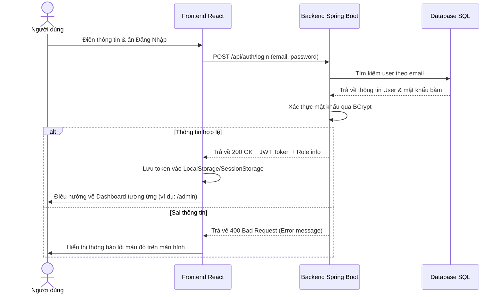
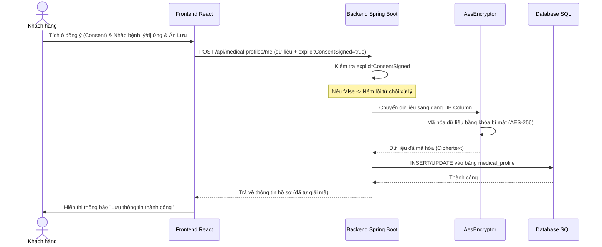
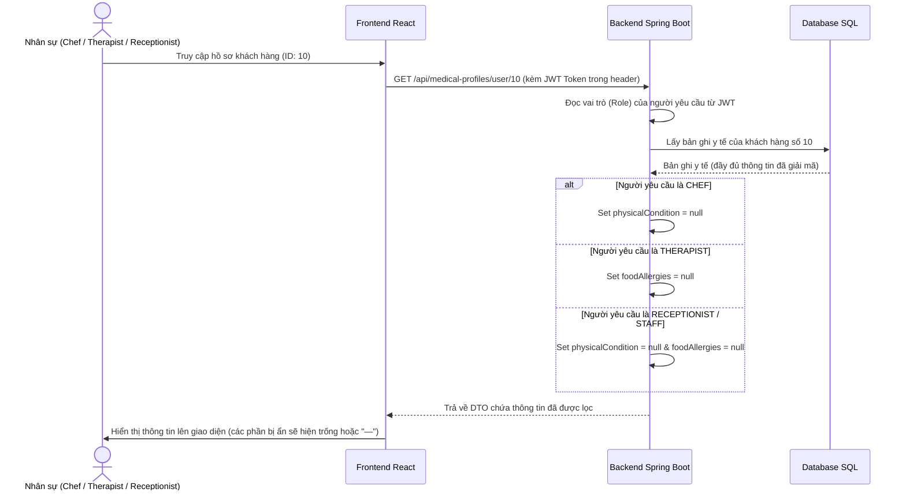

# 🌿 Tài Liệu Mô Tả Luồng Nghiệp Vụ & Kiến Trúc Mã Nguồn Module 1 - Ngũ Sơn Resort

Tài liệu này mô tả chi tiết luồng dữ liệu (Data Flow), cấu trúc tệp tin liên quan (Frontend & Backend), và cơ chế xử lý của từng Use Case thuộc **Module 1 (Xác thực & Hồ sơ Sức khỏe Nhạy cảm)**.

---

## 🗺️ TỔNG QUAN KIẾN TRÚC MỚI (2 PORTALS)

Hệ thống đã được tái cấu trúc thành 2 cổng thông tin tách biệt để sửa lỗi giao diện và đảm bảo bảo mật:
1. **Cổng Khách Hàng (Customer Portal):** Sử dụng `CustomerLayout.jsx` (chứa Header & Footer trang chủ).
2. **Cổng Vận Hành (Operation Portal):** Sử dụng `OperationLayout.jsx` & `OperationSidebar.jsx` (UI Admin Panel hợp nhất cho các role Admin, Staff, Chef, Specialist).

---

## 1. UC01: Đăng ký & Đăng nhập (Register Account / Log In / SSO)

### 📌 Luồng Chạy (Workflow)
1. **Đăng nhập truyền thống:**
   * **Khách hàng/Nhân viên** nhập thông tin đăng nhập. 
   * Frontend kiểm tra nếu người dùng gõ username tắt (ví dụ `admin`, `staff`, `chef`) sẽ tự động thêm hậu tố `@nguson.com`.
   * Gửi request tới Backend. Backend xác thực mật khẩu qua `BCrypt`.
   * Nếu hợp lệ, sinh mã **JWT Token** lưu vào `localStorage`/`sessionStorage` của trình duyệt.
   * Hệ thống đọc quyền hạn (`role`) trong Token và điều hướng (redirect) về trang tương ứng.
2. **Đăng nhập Google SSO:**
   * Khách hàng click "Đăng nhập với Google" $\rightarrow$ kích hoạt Firebase SDK mở Popup chọn tài khoản.
   * Lấy Email và Họ tên từ tài khoản Google gửi về API Backend.
   * Backend kiểm tra Email, tự động tạo mới tài khoản với vai trò `GUEST` nếu chưa tồn tại, sau đó sinh JWT Token tương tự.

### 📁 Các File Code Liên Quan
* **Frontend:**
  * [Login.jsx](file:///d:/Semester5/P/Project/su26-swp391-se2023-g3/frontend/src/pages/Login.jsx): Xử lý form đăng nhập, Firebase SSO Google, lưu token và chuyển hướng dựa theo vai trò.
  * [Register.jsx](file:///d:/Semester5/P/Project/su26-swp391-se2023-g3/frontend/src/pages/Register.jsx): Form đăng ký khách hàng mới.
  * [ForgotPassword.jsx](file:///d:/Semester5/P/Project/su26-swp391-se2023-g3/frontend/src/pages/ForgotPassword.jsx): Form nhập email $\rightarrow$ nhận OTP $\rightarrow$ đổi mật khẩu mới.
  * [api.js](file:///d:/Semester5/P/Project/su26-swp391-se2023-g3/frontend/src/api.js): Định nghĩa hàm `getAuthHeaders()` để đính kèm `Authorization: Bearer <token>` vào mọi request.
* **Backend:**
  * [AuthController.java](file:///d:/Semester5/P/Project/su26-swp391-se2023-g3/backend/src/main/java/fu/se/smms/controller/AuthController.java): Định nghĩa các API `/auth/register`, `/auth/login`, `/auth/google`, `/auth/forgot-password`, `/auth/verify-otp`, `/auth/reset-password`.
  * `UserServiceImpl.java`: So khớp password, tạo mới tài khoản SSO, tạo chuỗi JWT.
  * `OtpService.java`: Sinh mã OTP và quản lý hạn sử dụng OTP.

### 📊 Sơ đồ Luồng (Sequence Diagram)

---

## 2. UC02: Khai báo hồ sơ sức khỏe & Dị ứng (Complete Dietary & Health Profile)

### 📌 Luồng Chạy (Workflow)
1. **Tuân thủ pháp lý (Nghị định 13/2023/NĐ-CP):** Khách hàng phải tự tay chọn các hộp kiểm đồng ý (Consent Checkboxes) vốn được **để trống mặc định**. Nếu không chọn, nút Lưu bị vô hiệu hóa hoặc Backend sẽ ném lỗi từ chối xử lý.
2. **Khai báo sức khỏe:**
   * Khách nhập thông tin dị ứng thực phẩm, bệnh lý cơ thể (như đau vai gáy, cao huyết áp...).
   * Gửi POST request `/medical-profiles/me` kèm theo trạng thái đồng ý `explicitConsentSigned = true`.
3. **Mã hóa lưu trữ (Encryption-at-rest):** 
   * Trước khi ghi thông tin vào cơ sở dữ liệu, JPA AttributeConverter tự động dùng thuật toán **AES-256** để mã hóa các chuỗi văn bản nhạy cảm này. Khi đọc dữ liệu từ DB lên, hệ thống sẽ tự động giải mã.

### 📁 Các File Code Liên Quan
* **Frontend:**
  * [HealthProfile.jsx](file:///d:/Semester5/P/Project/su26-swp391-se2023-g3/frontend/src/pages/HealthProfile.jsx): Màn hình khai báo sức khỏe của khách hàng ở trang cá nhân.
  * [BookingPage.jsx](file:///d:/Semester5/P/Project/su26-swp391-se2023-g3/frontend/src/pages/BookingPage.jsx) (Bước 2): Tích hợp khai báo sức khỏe nhanh trong quá trình đặt phòng.
* **Backend:**
  * [MedicalProfileController.java](file:///d:/Semester5/P/Project/su26-swp391-se2023-g3/backend/src/main/java/fu/se/smms/controller/MedicalProfileController.java): API `/medical-profiles/me` (Lấy, Lưu và Xóa hồ sơ cá nhân).
  * [MedicalProfileServiceImpl.java](file:///d:/Semester5/P/Project/su26-swp391-se2023-g3/backend/src/main/java/fu/se/smms/service/impl/MedicalProfileServiceImpl.java): Kiểm tra tính đồng ý (consent check), xử lý lưu trữ.
  * [MedicalProfile.java](file:///d:/Semester5/P/Project/su26-swp391-se2023-g3/backend/src/main/java/fu/se/smms/entity/MedicalProfile.java): Entity khai báo ánh xạ cột DB kèm `@Convert(converter = AesEncryptor.class)`.
  * [AesEncryptor.java](file:///d:/Semester5/P/Project/su26-swp391-se2023-g3/backend/src/main/java/fu/se/smms/config/AesEncryptor.java): Bộ chuyển đổi dữ liệu, thực hiện mã hóa và giải mã bằng thuật toán AES.

### 📊 Sơ đồ Luồng (Sequence Diagram)

---

## 3. UC03: Quản lý tài khoản & Phân quyền nhân viên (Manage Staff Accounts & RBAC)

### 📌 Luồng Chạy (Workflow)
1. **Quản lý tài khoản nhân viên (Admin):**
   * Admin truy cập màn hình quản lý, thực hiện tạo mới nhân viên (nhập tên, email, sđt, mật khẩu và chọn vai trò: `Chef`, `Therapist`, `Receptionist`...).
   * Có quyền chỉnh sửa thông tin, khóa tài khoản (`status = BANNED`) để chặn đăng nhập (BR-22) hoặc mở khóa tài khoản, xóa vĩnh viễn tài khoản.
2. **Quy tắc bảo mật dữ liệu dựa trên vai trò (Role-Based Access Control - BR-21):**
   * Khi một nhân sự đăng nhập và yêu cầu xem thông tin chi tiết của một khách hàng, Backend sẽ tự động lọc thông tin nhạy cảm:
     * **Specialist (Therapist - Chuyên gia trị liệu):** Chỉ có thuộc tính `physicalCondition` (bệnh lý cơ thể) có dữ liệu; thuộc tính `foodAllergies` bị đặt thành `null` (không được xem dị ứng đồ ăn).
     * **Chef (Đầu bếp):** Chỉ có thuộc tính `foodAllergies` (dị ứng đồ ăn) có dữ liệu; thuộc tính `physicalCondition` bị đặt thành `null`.
     * **Receptionist / Staff (Lễ tân/Nhân viên thường):** Cả 2 thuộc tính trên đều bị đặt thành `null` (không được tiếp cận bất kỳ thông tin y tế nào).

### 📁 Các File Code Liên Quan
* **Frontend:**
  * [ManageAccounts.jsx](file:///d:/Semester5/P/Project/su26-swp391-se2023-g3/frontend/src/components/admin/ManageAccounts.jsx): Màn hình bảng điều khiển của Admin để thực hiện CRUD nhân viên.
* **Backend:**
  * [AdminController.java](file:///d:/Semester5/P/Project/su26-swp391-se2023-g3/backend/src/main/java/fu/se/smms/controller/AdminController.java): Khai báo Endpoint quản trị bắt đầu bằng tiền tố `/admin/` và bảo vệ bằng `@PreAuthorize("hasRole('ADMIN')")`.
  * `UserServiceImpl.java`: Các hàm CRUD tài khoản nhân sự và phân quyền.
  * [MedicalProfileServiceImpl.java](file:///d:/Semester5/P/Project/su26-swp391-se2023-g3/backend/src/main/java/fu/se/smms/service/impl/MedicalProfileServiceImpl.java): Thực thi logic lọc ẩn thông tin nhạy cảm trong hàm `getMedicalProfileByUserId()`.

### 📊 Sơ đồ Luồng (Sequence Diagram)

---

## 4. UC04: Quản lý dữ liệu danh mục (Manage Master Data)

### 📌 Luồng Chạy (Workflow)
* **Khách vãng lai / Khách hàng:** Được phép truy cập công khai vào các API xem thông tin (`GET` như `/spa-services`, `/retreat-packages`, `/room-types`) để lựa chọn biệt thự và dịch vụ khi đặt phòng.
* **Quản trị viên (Admin):** Có đặc quyền chỉnh sửa danh mục cốt lõi này. Khi thực hiện Thêm, Sửa hoặc Xóa, yêu cầu được gửi lên các API quản trị `/admin/spa-services`, `/admin/retreat-packages`, `/admin/room-types`. Backend sẽ dùng Spring Security để chắn và từ chối nếu request không có Token của Admin.

### 📁 Các File Code Liên Quan
* **Frontend:**
  * [ManageServices.jsx](file:///d:/Semester5/P/Project/su26-swp391-se2023-g3/frontend/src/components/admin/ManageServices.jsx): Trang thiết lập dịch vụ Spa/Yoga.
  * [ManageRooms.jsx](file:///d:/Semester5/P/Project/su26-swp391-se2023-g3/frontend/src/components/admin/ManageRooms.jsx): Trang thiết lập hạng phòng/Villa.
* **Backend:**
  * [MasterDataController.java](file:///d:/Semester5/P/Project/su26-swp391-se2023-g3/backend/src/main/java/fu/se/smms/controller/MasterDataController.java): Phân tách rõ rệt các API đọc công khai và các API ghi được bảo vệ bởi `@PreAuthorize("hasRole('ADMIN')")`.
  * `MasterDataServiceImpl.java`: Logic nghiệp vụ lưu/sửa đổi Master Data.

---

## 5. UC05: Quyền được xóa dữ liệu (Right to Deletion)

### 📌 Luồng Chạy (Workflow)
1. **Khách hàng** đăng nhập vào trang cá nhân, truy cập mục **Hồ sơ sức khỏe**.
2. Click nút **"Xóa hồ sơ sức khỏe"**.
3. Frontend hiển thị cảnh báo xác nhận xóa vĩnh viễn dữ liệu.
4. Gửi request `DELETE /medical-profiles/me` kèm Token của khách hàng.
5. Backend xác thực, tìm kiếm bản ghi y tế tương ứng với tài khoản và thực hiện lệnh **xóa vật lý (Hard Delete)** bản ghi trong cơ sở dữ liệu.
6. Khi hoàn tất, trả về thông báo thành công cho Frontend và xóa trắng các trường nhập liệu sức khỏe trên giao diện của khách.

### 📁 Các File Code Liên Quan
* **Frontend:**
  * [HealthProfile.jsx](file:///d:/Semester5/P/Project/su26-swp391-se2023-g3/frontend/src/pages/HealthProfile.jsx): Xử lý nút xóa và gửi request `DELETE`.
* **Backend:**
  * [MedicalProfileController.java](file:///d:/Semester5/P/Project/su26-swp391-se2023-g3/backend/src/main/java/fu/se/smms/controller/MedicalProfileController.java): Endpoint `DELETE /medical-profiles/me`.
  * [MedicalProfileServiceImpl.java](file:///d:/Semester5/P/Project/su26-swp391-se2023-g3/backend/src/main/java/fu/se/smms/service/impl/MedicalProfileServiceImpl.java): Phương thức `deleteMedicalProfile(String email)` gọi JPA Repository để thực thi xóa bản ghi khỏi DB.
