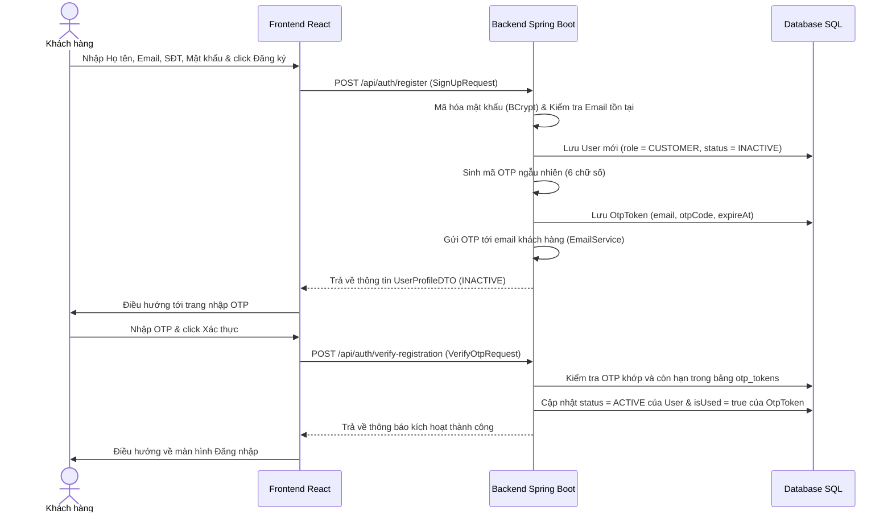
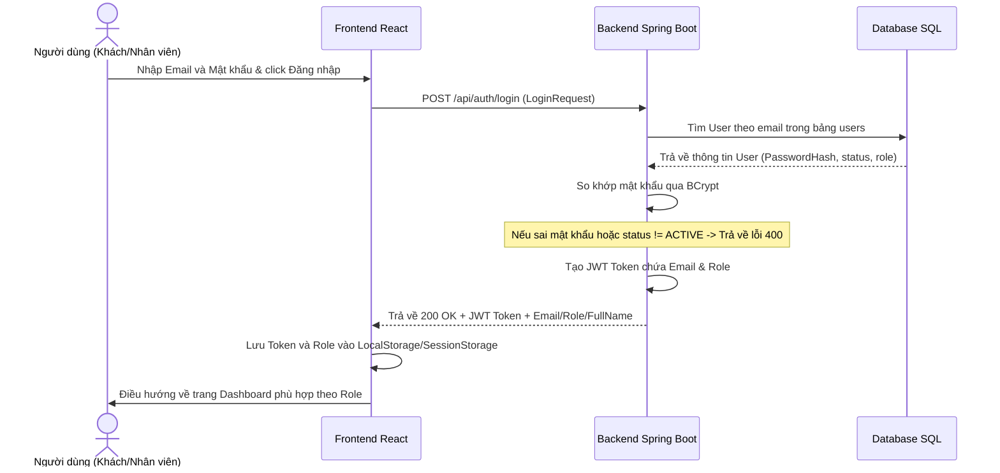
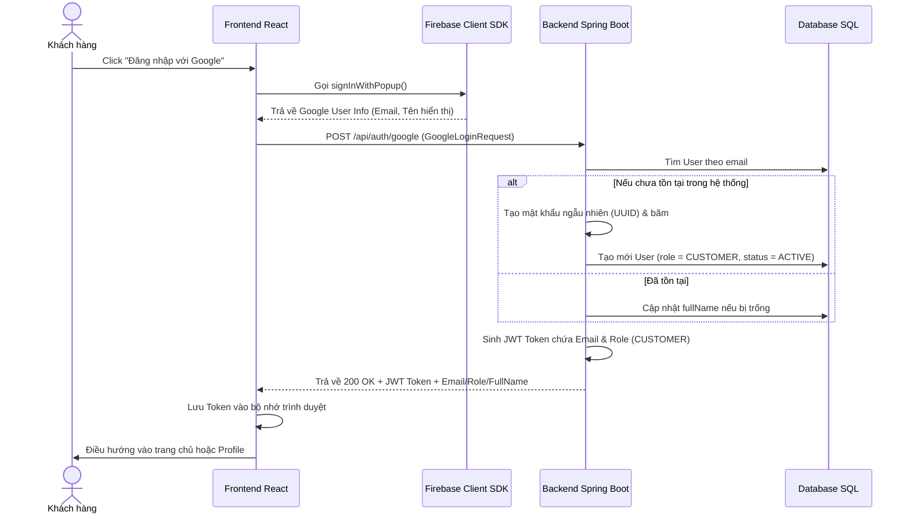
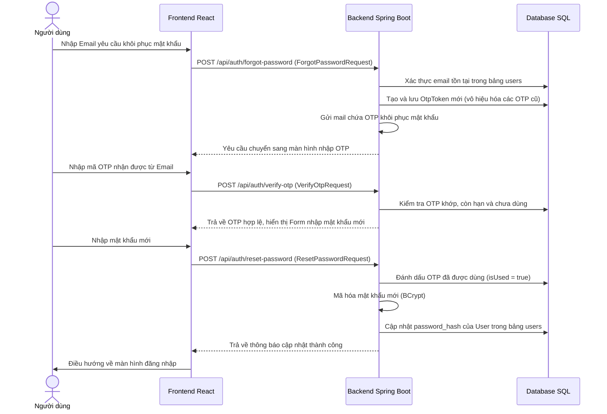

# 🌿 Workflow Chi Tiết Module 1 - UC01: Xác thực & Đăng nhập (Authentication & SSO)

Tài liệu này mô tả chi tiết luồng nghiệp vụ (Workflow) từ Frontend (Giao diện React), tới Backend (Spring Boot APIs, Services) và Database (CSDL PostgreSQL/MySQL), đồng thời liệt kê các Services liên quan thực thi tính năng.

---

## 🗺️ TỔNG QUAN LUỒNG CHẠY (WORKFLOW)

### 1. Đăng ký tài khoản (User Registration)

* **Quy trình hoạt động:**
  1. Người dùng khai báo thông tin đăng ký tại component [Register.jsx](file:///d:/Semester5/P/Project/su26-swp391-se2023-g3/05-Development/frontend/src/pages/Register.jsx).
  2. Gửi yêu cầu HTTP POST tới `/api/auth/register` qua endpoint `register` trong [api.js](file:///d:/Semester5/P/Project/su26-swp391-se2023-g3/05-Development/frontend/src/api.js).
  3. `AuthController.registerUser()` tiếp nhận, chuyển tiếp tới `UserService.signUp()`.
  4. Hệ thống kiểm tra xem email đã tồn tại hay chưa. Nếu chưa, băm mật khẩu bằng `BCryptPasswordEncoder` và ghi nhận một dòng dữ liệu mới trong bảng `users` với trạng thái `INACTIVE`.
  5. Gọi `OtpService.generateAndSendOtp()` để khởi tạo mã OTP ngẫu nhiên gồm 6 ký tự số, lưu vào bảng `otp_tokens` với thời gian hết hạn là 10 phút, và gửi email chứa OTP cho người dùng qua `EmailService`.
  6. Sau khi điền OTP trên Frontend, Client gửi POST tới `/api/auth/verify-registration`.
  7. Backend kiểm tra OTP. Nếu hợp lệ, cập nhật trạng thái User thành `ACTIVE` và đánh dấu OTP đã sử dụng (`is_used = true`).

---

### 2. Đăng nhập truyền thống (Traditional Login)

* **Quy trình hoạt động:**
  1. Người dùng nhập thông tin đăng nhập tại [Login.jsx](file:///d:/Semester5/P/Project/su26-swp391-se2023-g3/05-Development/frontend/src/pages/Login.jsx).
  2. Gửi yêu cầu HTTP POST tới `/api/auth/login` với body chứa thông tin Email và Mật khẩu.
  3. `AuthController.authenticateUser()` tiếp nhận và chuyển tiếp tới `UserService.login()`.
  4. Hệ thống truy vấn CSDL tìm người dùng theo Email. Nếu tìm thấy và mật khẩu băm so khớp thành công bằng `PasswordEncoder.matches()`, hệ thống sẽ kiểm tra trạng thái tài khoản:
     - Nếu `status = BANNED` hoặc `INACTIVE`, Backend ném ra ngoại lệ và chặn đăng nhập.
  5. Sinh **JWT Token** có chứa thông tin định danh (Email, Role) thông qua [JwtUtils](file:///d:/Semester5/P/Project/su26-swp391-se2023-g3/05-Development/backend/src/main/java/fu/se/smms/config/JwtUtils.java).
  6. Trả về `LoginResponse` chứa JWT Token cho Frontend. Frontend lưu Token vào bộ nhớ trình duyệt và điều hướng dựa theo vai trò (`role`).

---

### 3. Đăng nhập Google SSO (Single Sign-On)

* **Quy trình hoạt động:**
  1. Người dùng click nút đăng nhập Google. Frontend sử dụng Firebase Client SDK mở cửa sổ chọn tài khoản Google.
  2. Frontend lấy Email và Họ tên từ tài khoản Google gửi về API Backend `/api/auth/google`.
  3. `AuthController.authenticateGoogleUser()` tiếp nhận và gọi `UserService.loginWithGoogle()`.
  4. Nếu email này chưa tồn tại trong hệ thống, Backend tự động đăng ký mới một tài khoản Khách hàng (`role = CUSTOMER`), mật khẩu ngẫu nhiên (UUID) băm sẵn, và kích hoạt trạng thái `ACTIVE` ngay lập tức (bỏ qua OTP).
  5. Sinh và trả về JWT Token tương tự quy trình đăng nhập truyền thống.

---

### 4. Quên mật khẩu & Đặt lại mật khẩu (Forgot & Reset Password)

---

## 💾 CẤU TRÚC DATABASE (TABLES LIÊN QUAN)

### 1. Bảng `users` (Entity: [User.java](file:///d:/Semester5/P/Project/su26-swp391-se2023-g3/05-Development/backend/src/main/java/fu/se/smms/entity/User.java))
Chứa thông tin cốt lõi của tài khoản người dùng và nhân viên.
* `user_id` (PK): Mã định danh tăng tự động.
* `email` (Unique): Địa chỉ email đăng nhập.
* `password_hash`: Chuỗi mật khẩu băm (BCrypt).
* `full_name`: Họ và tên đầy đủ.
* `phone`: Số điện thoại.
* `role`: Vai trò trong hệ thống (`ADMIN`, `MANAGER`, `STAFF`, `RECEPTIONIST`, `CHEF`, `SPA`, `YOGA`, `PHYSIO`, `THERAPIST`, `CUSTOMER`, `GUEST`).
* `status`: Trạng thái tài khoản (`ACTIVE`, `INACTIVE` - chưa xác thực OTP, `BANNED` - bị khóa).

### 2. Bảng `otp_tokens` (Entity: [OtpToken.java](file:///d:/Semester5/P/Project/su26-swp391-se2023-g3/05-Development/backend/src/main/java/fu/se/smms/entity/OtpToken.java))
Lưu trữ thông tin xác thực OTP.
* `id` (PK): Mã định danh.
* `email`: Email nhận mã xác thực.
* `otp_code`: Mã xác thực 6 chữ số ngẫu nhiên.
* `expires_at`: Thời điểm hết hạn (thời gian tạo + 10 phút).
* `is_used`: Trạng thái đã sử dụng hay chưa (`true`/`false`).

---

## 🛠️ CÁC SERVICE LIÊN QUAN (RELATED SERVICES)

Trong UC01, có 3 Services chính phối hợp hoạt động ở tầng Logic:

### 1. [UserService (UserServiceImpl)](file:///d:/Semester5/P/Project/su26-swp391-se2023-g3/05-Development/backend/src/main/java/fu/se/smms/service/impl/UserServiceImpl.java)
Chịu trách nhiệm quản lý thông tin người dùng và điều phối xác thực:
* `signUp(SignUpRequest)`: Đăng ký tài khoản CUSTOMER mới, băm mật khẩu, lưu ở trạng thái `INACTIVE`, sau đó kích hoạt gửi mã OTP.
* `login(LoginRequest)`: Xác thực email/mật khẩu đăng nhập truyền thống, kiểm tra trạng thái hoạt động, sinh chuỗi JWT Token.
* `loginWithGoogle(GoogleLoginRequest)`: Xử lý đăng nhập Google SSO. Tự động tạo mới tài khoản nếu email chưa tồn tại.
* `verifyRegistration(email, otpCode)`: Xác nhận mã OTP kích hoạt tài khoản. Nếu đúng sẽ chuyển đổi trạng thái User thành `ACTIVE`.
* `resendVerificationOtp(email)`: Gửi lại mã OTP kích hoạt tài khoản nếu mã cũ bị hết hạn.

### 2. [OtpService (OtpServiceImpl)](file:///d:/Semester5/P/Project/su26-swp391-se2023-g3/05-Development/backend/src/main/java/fu/se/smms/service/impl/OtpServiceImpl.java)
Chịu trách nhiệm quản lý vòng đời của mã xác thực OTP và đổi mật khẩu:
* `generateAndSendOtp(email)` & `generateAndSendOtp(email, isForgotPassword)`: Hủy toàn bộ OTP cũ của email, tạo mã 6 số ngẫu nhiên mới, lưu vào CSDL và gọi `EmailService` để gửi.
* `verifyOtp(email, otpCode)`: Kiểm tra mã OTP khớp, chưa sử dụng và còn hiệu lực.
* `verifyAndUseOtp(email, otpCode)`: Xác thực OTP và đánh dấu là đã sử dụng (`isUsed = true`) ngay lập tức (dùng khi đăng ký tài khoản).
* `resetPassword(email, otpCode, newPassword)`: Xác thực OTP lần cuối, băm mật khẩu mới và cập nhật lại vào thông tin người dùng, đồng thời hủy OTP.

### 3. [EmailService (EmailServiceImpl)](file:///d:/Semester5/P/Project/su26-swp391-se2023-g3/05-Development/backend/src/main/java/fu/se/smms/service/impl/EmailServiceImpl.java)
Chịu trách nhiệm gửi thư chứa mã xác nhận OTP tới hộp thư của khách hàng:
* `sendOtpEmail(email, otpCode, isForgotPassword)`: Sử dụng `JavaMailSender` để gửi email HTML được định dạng chuyên nghiệp. Nếu là quên mật khẩu sẽ gửi tiêu đề khôi phục, ngược lại gửi tiêu đề kích hoạt tài khoản.
