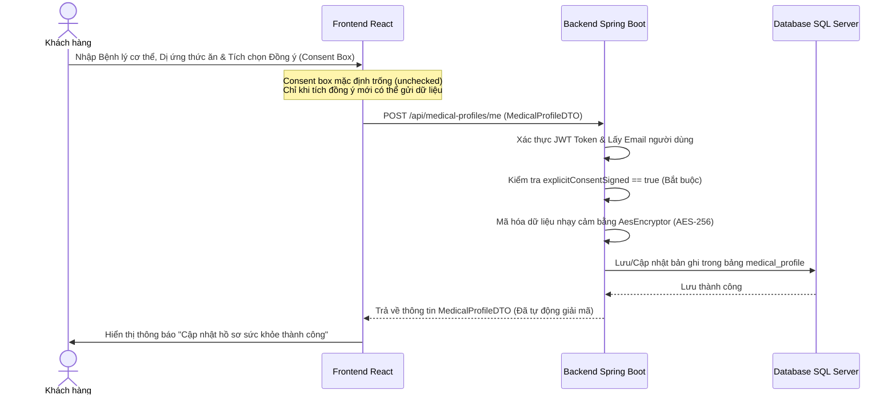
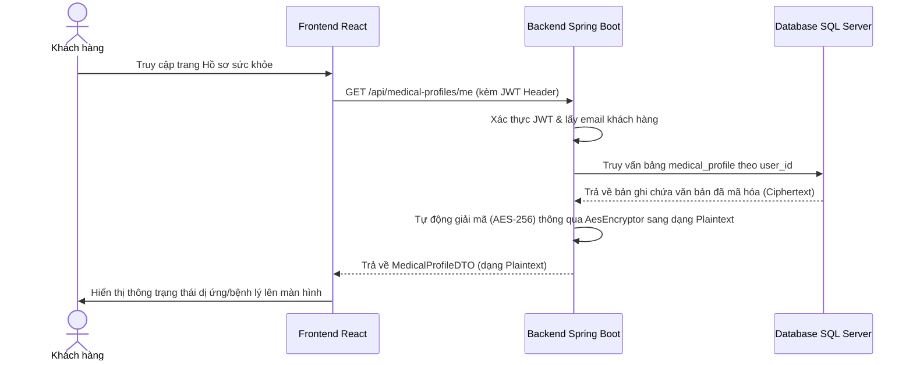

# 🌿 Workflow Chi Tiết Module 1 - UC02: Khai báo hồ sơ sức khỏe & Dị ứng (Dietary & Health Profile)

Tài liệu này mô tả chi tiết luồng nghiệp vụ (Workflow) từ Frontend (Giao diện React), tới Backend (Spring Boot APIs, Services) và Database (CSDL SQL Server) để quản lý Hồ sơ sức khỏe và dị ứng của khách hàng, đảm bảo tuân thủ pháp lý theo quy định bảo vệ dữ liệu nhạy cảm.

---

## 🗺️ TỔNG QUAN LUỒNG CHẠY (WORKFLOW)

### 1. Luồng Khai báo / Cập nhật Hồ sơ Sức khỏe

* **Quy trình hoạt động:**
  1. Khách hàng truy cập trang cá nhân hoặc giao diện Đặt phòng để khai báo thông tin sức khỏe nhạy cảm tại component [HealthProfile.jsx](file:///d:/Semester5/P/Project/su26-swp391-se2023-g3/05-Development/frontend/src/pages/HealthProfile.jsx) hoặc bước 2 của [BookingPage.jsx](file:///d:/Semester5/P/Project/su26-swp391-se2023-g3/05-Development/frontend/src/pages/BookingPage.jsx) thông qua [HealthProfileStep.jsx](file:///d:/Semester5/P/Project/su26-swp391-se2023-g3/05-Development/frontend/src/components/booking/HealthProfileStep.jsx).
  2. Giao diện thiết kế tuân thủ **Nghị định 13/2023/NĐ-CP** về dữ liệu cá nhân nhạy cảm:
     - Hộp kiểm đồng ý (Consent Checkbox) mặc định ở trạng thái trống (**explicit, unchecked**).
     - Khách hàng bắt buộc phải tự tích chọn đồng ý cho phép hệ thống thu thập thông tin sức khỏe nhạy cảm để phục vụ gói trị liệu thì nút **Lưu** mới được kích hoạt.
  3. Khi click **Lưu**, Frontend gửi HTTP POST tới `/api/medical-profiles/me` thông qua hàm `saveMyProfile` định nghĩa tại [api.js](file:///d:/Semester5/P/Project/su26-swp391-se2023-g3/05-Development/frontend/src/api.js).
  4. `MedicalProfileController.saveMyProfile()` tiếp tiếp nhận yêu cầu, kiểm tra dữ liệu đầu vào.
  5. API chuyển tiếp xử lý tới `MedicalProfileService.saveMedicalProfile()`. Hệ thống sẽ:
     - Kiểm tra điều kiện đồng ý `explicitConsentSigned` trong DTO. Nếu bằng `false`, ném ra lỗi bad request.
     - Tìm kiếm người dùng hiện tại dựa trên Email trích xuất từ JWT token.
     - Ánh xạ sang Entity [MedicalProfile.java](file:///d:/Semester5/P/Project/su26-swp391-se2023-g3/05-Development/backend/src/main/java/fu/se/smms/entity/MedicalProfile.java).
  6. Tại tầng Persistence, JPA Converter [AesEncryptor.java](file:///d:/Semester5/P/Project/su26-swp391-se2023-g3/05-Development/backend/src/main/java/fu/se/smms/config/AesEncryptor.java) tự động dùng thuật toán **AES-256** để mã hóa hai trường dữ liệu nhạy cảm: `physical_condition` và `food_allergies` trước khi lưu vào CSDL (Encryption-at-rest).
  7. Dữ liệu được ghi nhận trong bảng `medical_profile`.

---

### 2. Luồng Lấy thông tin Hồ sơ Sức khỏe

* **Quy trình hoạt động:**
  1. Khi người dùng truy cập trang cá nhân, Frontend gửi HTTP GET tới `/api/medical-profiles/me`.
  2. `MedicalProfileController.getMyProfile()` xác định danh tính Khách hàng dựa trên JWT Token.
  3. `MedicalProfileService.getMedicalProfile()` truy vấn bảng `medical_profile`.
  4. Trong lúc lấy dữ liệu từ DB, JPA Attribute Converter [AesEncryptor.java](file:///d:/Semester5/P/Project/su26-swp391-se2023-g3/05-Development/backend/src/main/java/fu/se/smms/config/AesEncryptor.java) tự động giải mã từ chuỗi Ciphertext thành chuỗi văn bản Plaintext.
  5. Trả dữ liệu Plaintext về cho Frontend hiển thị cho người dùng chỉnh sửa hoặc xem thông tin.

---

## 💾 CẤU TRÚC DATABASE (TABLES LIÊN QUAN)

### Bảng `medical_profile` (Entity: [MedicalProfile.java](file:///d:/Semester5/P/Project/su26-swp391-se2023-g3/05-Development/backend/src/main/java/fu/se/smms/entity/MedicalProfile.java))
Chứa thông tin dị ứng thực phẩm và tình trạng thể lý bệnh lý của Khách hàng, được liên kết trực tiếp với bảng `users`.
* `profile_id` (PK): Mã hồ sơ tăng tự động.
* `user_id` (FK, Unique): Khóa ngoại tham chiếu đến bảng `users(user_id)`.
* `physical_condition_encrypted` (VARCHAR(MAX)): Tình trạng bệnh lý cơ thể (Được mã hóa AES-256).
* `food_allergies_encrypted` (VARCHAR(MAX)): Danh sách dị ứng đồ ăn/uống (Được mã hóa AES-256).
* `explicit_consent_signed` (BOOLEAN): Trạng thái xác nhận đồng ý của người dùng (`true`/`false`).
* `updated_at` (TIMESTAMP): Thời gian cập nhật hồ sơ gần nhất.

---

## 🛠️ CÁC SERVICE LIÊN QUAN (RELATED SERVICES)

### 1. [MedicalProfileService (MedicalProfileServiceImpl)](file:///d:/Semester5/P/Project/su26-swp391-se2023-g3/05-Development/backend/src/main/java/fu/se/smms/service/impl/MedicalProfileServiceImpl.java)
Chịu trách nhiệm thực thi nghiệp vụ lưu trữ, truy vấn hồ sơ y tế:
* `getMedicalProfile(String email)`: Lấy thông tin hồ sơ của khách hàng hiện tại dựa theo email, tự động trả về dữ liệu sau khi giải mã.
* `saveMedicalProfile(String email, MedicalProfileDTO dto)`: Kiểm tra điều kiện đồng ý, ánh xạ dữ liệu và lưu xuống CSDL. Đảm bảo cập nhật lại `updated_at`.

### 2. [AesEncryptor](file:///d:/Semester5/P/Project/su26-swp391-se2023-g3/05-Development/backend/src/main/java/fu/se/smms/config/AesEncryptor.java)
Lớp chuyển đổi dữ liệu thuộc tính JPA (Attribute Converter):
* `convertToDatabaseColumn(String attribute)`: Sử dụng `EncryptionUtils.encrypt(attribute, key)` để tự động mã hóa chuỗi khi thực thi lệnh INSERT/UPDATE của Hibernate/JPA.
* `convertToEntityAttribute(String dbData)`: Sử dụng `EncryptionUtils.decrypt(dbData, key)` để giải mã chuỗi tự động khi thực thi lệnh SELECT từ Hibernate/JPA.
