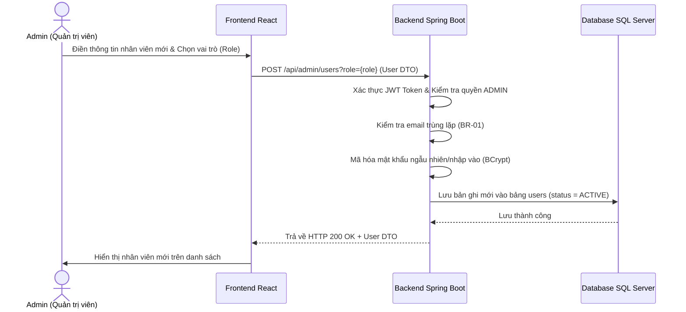
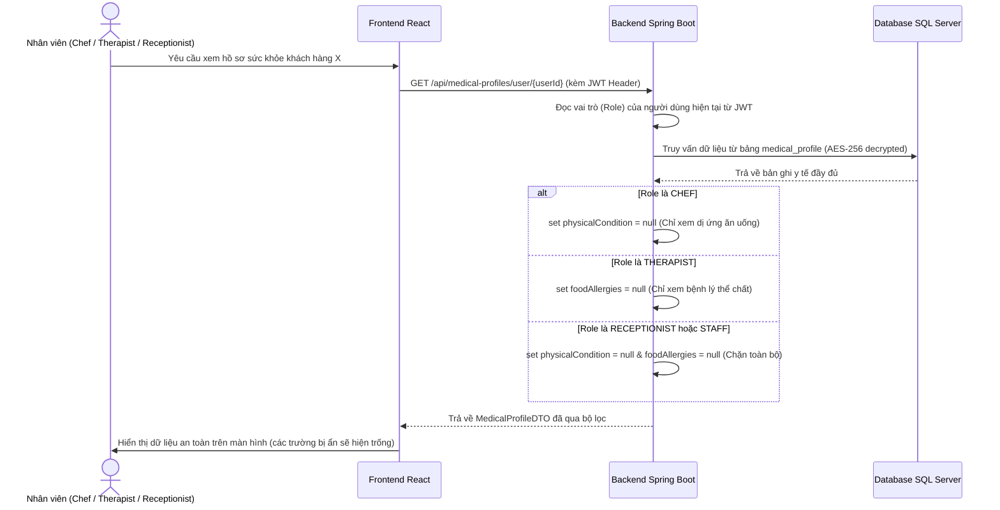

# 🌿 Workflow Chi Tiết Module 1 - UC03: Quản lý tài khoản & Phân quyền nhân viên (Manage Staff Accounts & Roles)

Tài liệu này mô tả chi tiết luồng nghiệp vụ (Workflow) từ Frontend (Giao diện React), tới Backend (Spring Boot APIs, Services) và Database (CSDL SQL Server) cho việc quản lý tài khoản nhân viên (Staff Accounts) bởi Admin, và cơ chế lọc thông tin nhạy cảm dựa trên vai trò (Role-Based Access Control - RBAC).

---

## 🗺️ TỔNG QUAN LUỒNG CHẠY (WORKFLOW)

### 1. Luồng Admin quản trị tài khoản Nhân viên (CRUD Staff)

* **Quy trình hoạt động:**
  1. Admin truy cập trang Dashboard của Admin tại component [ManageAccounts.jsx](file:///d:/Semester5/P/Project/su26-swp391-se2023-g3/05-Development/frontend/src/components/admin/ManageAccounts.jsx) (nằm trong [AdminDashboard.jsx](file:///d:/Semester5/P/Project/su26-swp391-se2023-g3/05-Development/frontend/src/pages/AdminDashboard.jsx)).
  2. Để tạo nhân viên mới, Admin nhập đầy đủ thông tin (Họ tên, SĐT, Email, Password) và chọn vai trò chuyên biệt (`CHEF`, `THERAPIST`, `RECEPTIONIST`, `STAFF`, v.v.).
  3. Khi click **Lưu**, Frontend gửi HTTP POST tới `/api/admin/users?role={role}` thông qua hàm `createUser` định nghĩa tại [api.js](file:///d:/Semester5/P/Project/su26-swp391-se2023-g3/05-Development/frontend/src/api.js).
  4. `AdminController.createUser()` nhận request. Phương thức này được bảo vệ nghiêm ngặt bằng `@PreAuthorize("hasRole('ADMIN')")`.
  5. API chuyển tiếp xử lý đến `UserService.createUser()`. Hệ thống sẽ:
     - Đảm bảo Email chưa tồn tại trong hệ thống (vi phạm **BR-01**).
     - Băm mật khẩu bằng `BCryptPasswordEncoder`.
     - Lưu tài khoản ở trạng thái `ACTIVE`.
  6. Admin cũng có thể khóa tài khoản nhân viên (đổi `status` thành `BANNED`), khiến họ không thể đăng nhập vào hệ thống (**BR-22**), thông qua hàm `updateUser` (`PUT /api/admin/users/{userId}`).

---

### 2. Luồng Lọc ẩn thông tin nhạy cảm dựa theo vai trò (BR-21)

* **Quy trình hoạt động:**
  1. Khi một nhân sự đăng nhập và yêu cầu xem thông tin chi tiết của một khách hàng, Frontend gửi HTTP GET tới `/api/medical-profiles/user/{userId}`.
  2. `MedicalProfileController.getMedicalProfileByUserId()` tiếp nhận yêu cầu, trích xuất Email và Vai trò từ JWT.
  3. API chuyển tiếp dữ liệu tới `MedicalProfileService.getMedicalProfileByUserId(userId, email, role)`.
  4. Hệ thống lấy bản ghi y tế đầy đủ từ DB và giải mã AES-256 tự động.
  5. Áp dụng quy tắc phân quyền nghiệp vụ nghiêm ngặt (**BR-21**):
     - **CHEF (Đầu bếp):** Chỉ được phép xem dị ứng thực phẩm (`foodAllergies`) để nấu nướng an toàn $\rightarrow$ hệ thống gán `physicalCondition` thành `null`.
     - **THERAPIST (Trị liệu viên):** Chỉ được phép xem tình trạng bệnh lý thể lý (`physicalCondition`) để phục vụ mát-xa trị liệu $\rightarrow$ hệ thống gán `foodAllergies` thành `null`.
     - **RECEPTIONIST / STAFF (Lễ tân/Nhân viên thông thường):** Tuyệt đối không được tiếp cận bất kỳ thông tin y tế nhạy cảm nào $\rightarrow$ hệ thống gán cả 2 thuộc tính trên thành `null`.
  6. Trả dữ liệu an toàn về cho Frontend hiển thị.

---

## 💾 CẤU TRÚC DATABASE (TABLES LIÊN QUAN)

### Bảng `users` (Entity: [User.java](file:///d:/Semester5/P/Project/su26-swp391-se2023-g3/05-Development/backend/src/main/java/fu/se/smms/entity/User.java))
* `user_id` (PK): Mã ID tăng tự động.
* `email` (Unique): Email định danh đăng nhập.
* `password_hash`: Mật khẩu được băm BCrypt.
* `full_name`: Tên đầy đủ của nhân sự.
* `phone`: Số điện thoại liên hệ.
* `role`: Vai trò chuyên môn (`ADMIN`, `CHEF`, `THERAPIST`, `RECEPTIONIST`, `CUSTOMER`, v.v.).
* `status`: Trạng thái hoạt động (`ACTIVE`, `INACTIVE` - chưa xác thực, `BANNED` - bị khóa).

---

## 🛠️ CÁC SERVICE LIÊN QUAN (RELATED SERVICES)

### 1. [UserService (UserServiceImpl)](file:///d:/Semester5/P/Project/su26-swp391-se2023-g3/05-Development/backend/src/main/java/fu/se/smms/service/impl/UserServiceImpl.java)
Cung cấp các hàm quản lý tài khoản nhân viên cho Admin:
* `getAllUsers()`: Lấy danh sách tất cả các tài khoản đang có trong hệ thống.
* `createUser(SignUpRequest, String role)`: Băm mật khẩu, thiết lập trạng thái và vai trò tương ứng và lưu tài khoản.
* `updateUser(Integer id, String role, String status)`: Cho phép thay đổi vai trò hoặc trạng thái tài khoản (ví dụ, đổi sang `BANNED` để vô hiệu hóa tài khoản).
* `deleteUser(Integer id)`: Xóa cứng tài khoản khỏi DB.

### 2. [MedicalProfileService (MedicalProfileServiceImpl)](file:///d:/Semester5/P/Project/su26-swp391-se2023-g3/05-Development/backend/src/main/java/fu/se/smms/service/impl/MedicalProfileServiceImpl.java)
Thực thi bộ lọc thông tin nhạy cảm của khách hàng dựa trên vai trò:
* `getMedicalProfileByUserId(Integer userId, String actorEmail, String actorRole)`: Nhận dạng vai trò của người gọi API, truy cập DB và xóa bỏ các thông tin nhạy cảm không tương thích với vai trò trước khi gửi trả dữ liệu.
