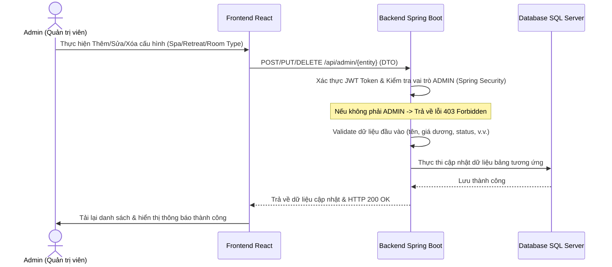
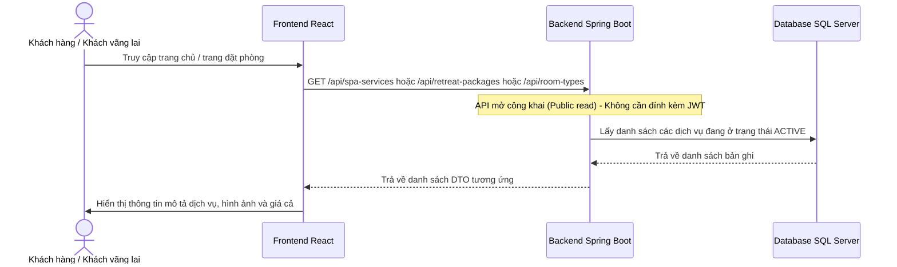

# 🌿 Workflow Chi Tiết Module 1 - UC04: Quản lý dữ liệu danh mục (Manage Master Data)

Tài liệu này mô tả chi tiết luồng nghiệp vụ (Workflow) từ Frontend (Giao diện React), tới Backend (Spring Boot APIs, Services) và Database (CSDL SQL Server) cho việc quản lý các dữ liệu danh mục cốt lõi (Master Data) bao gồm Dịch vụ Spa/Yoga, Gói trị liệu Retreat, và các Hạng phòng/Villa bởi Admin.

---

## 🗺️ TỔNG QUAN LUỒNG CHẠY (WORKFLOW)

### 1. Luồng Admin Cập nhật Danh mục (Thêm / Sửa / Xóa)

* **Quy trình hoạt động:**
  1. Admin đăng nhập, truy cập bảng điều khiển quản lý dịch vụ tại component [ManageServices.jsx](file:///d:/Semester5/P/Project/su26-swp391-se2023-g3/05-Development/frontend/src/components/admin/ManageServices.jsx) (hoặc quản lý phòng/Villa qua [ManageRooms.jsx](file:///d:/Semester5/P/Project/su26-swp391-se2023-g3/05-Development/frontend/src/components/admin/ManageRooms.jsx)).
  2. Hệ thống chia làm 3 tab quản lý riêng biệt: Dịch vụ Spa, Gói trị liệu, và Loại phòng.
  3. Khi Admin gửi yêu cầu ghi (Thêm/Sửa/Xóa):
     - Gửi request đến các đầu API quản lý như `/api/admin/spa-services`, `/api/admin/retreat-packages`, `/api/admin/room-types` thông qua `masterDataApi` trong [api.js](file:///d:/Semester5/P/Project/su26-swp391-se2023-g3/05-Development/frontend/src/api.js).
  4. `MasterDataController` tiếp nhận yêu cầu. Tất cả các phương thức ghi này đều được cấu hình kiểm tra phân quyền nghiêm ngặt thông qua Annotation `@PreAuthorize("hasRole('ADMIN')")`.
  5. API chuyển tiếp xử lý tới `MasterDataService` để thực hiện các thao tác kiểm tra nghiệp vụ và gọi repositories lưu xuống SQL Server.

---

### 2. Luồng Khách hàng / Khách vãng lai Đọc thông tin công khai

* **Quy trình hoạt động:**
  1. Khách hàng hoặc khách vãng lai khi truy cập trang web để tìm kiếm thông tin dịch vụ hoặc đặt phòng, Frontend sẽ tự động gửi request GET tới các API đọc công khai (ví dụ: `/api/spa-services`, `/api/retreat-packages`, `/api/room-types`).
  2. Các API này không chứa tiền tố `/admin/` và không bị chặn bởi Spring Security, cho phép truy cập tự do mà không cần truyền JWT Token trong header.
  3. Backend chỉ truy vấn những bản ghi đang hoạt động (`status = 'ACTIVE'`) từ database và gửi trả về Frontend hiển thị cho khách hàng đặt mua dịch vụ hoặc lựa chọn đặt phòng.

---

## 💾 CẤU TRÚC DATABASE (TABLES LIÊN QUAN)

### 1. Bảng `room_type` (Entity: [RoomType.java](file:///d:/Semester5/P/Project/su26-swp391-se2023-g3/05-Development/backend/src/main/java/fu/se/smms/entity/RoomType.java))
* `room_type_id` (PK): Mã ID tăng tự động.
* `type_name` (Unique): Tên loại phòng/Villa (ví dụ: Royal Villa, Deluxe Suite).
* `description`: Mô tả chi tiết diện tích, tiện ích phòng.
* `base_price_per_night`: Giá phòng cơ bản mỗi đêm.
* `max_occupancy`: Số lượng khách tối đa.
* `area_sqm`: Diện tích phòng (mét vuông).

### 2. Bảng `spa_service` (Entity: [SpaService.java](file:///d:/Semester5/P/Project/su26-swp391-se2023-g3/05-Development/backend/src/main/java/fu/se/smms/entity/SpaService.java))
* `service_id` (PK): Mã ID dịch vụ.
* `name`: Tên dịch vụ trị liệu/Spa/Yoga.
* `description`: Mô tả chi tiết về bài trị liệu.
* `category`: Phân loại dịch vụ (`BODY`, `FACE`, `YOGA`, `PHYSIO`, `MEDITATION`, `OTHER`).
* `duration_minutes`: Thời lượng thực hiện bài trị liệu (phút).
* `price`: Giá dịch vụ.
* `status`: Trạng thái dịch vụ (`ACTIVE`, `INACTIVE`).

### 3. Bảng `retreat_package` (Entity: [RetreatPackage.java](file:///d:/Semester5/P/Project/su26-swp391-se2023-g3/05-Development/backend/src/main/java/fu/se/smms/entity/RetreatPackage.java))
* `package_id` (PK): Mã ID gói trị liệu.
* `name`: Tên gói trị liệu (ví dụ: Detox & Renew, Sleep Therapy).
* `description`: Mô tả chi tiết gói.
* `duration_days`: Số ngày tham gia liệu trình.
* `price`: Tổng giá trọn gói.
* `includes`: Mô tả chi tiết những quyền lợi đi kèm trong gói.
* `status`: Trạng thái gói (`ACTIVE`, `INACTIVE`).

---

## 🛠️ CÁC SERVICE LIÊN QUAN (RELATED SERVICES)

### 1. [MasterDataService (MasterDataServiceImpl)](file:///d:/Semester5/P/Project/su26-swp391-se2023-g3/05-Development/backend/src/main/java/fu/se/smms/service/impl/MasterDataServiceImpl.java)
Thực thi toàn bộ logic quản lý danh mục dịch vụ/phòng:
* **Dịch vụ Spa/Yoga:**
  - `getActiveSpaServices()`: Lấy danh sách dịch vụ Spa đang hoạt động (`ACTIVE`) dành cho Khách hàng.
  - `getAllSpaServices()`: Lấy toàn bộ dịch vụ (gồm cả `INACTIVE`) phục vụ cho màn hình quản trị của Admin.
  - `createSpaService(SpaServiceDTO)`, `updateSpaService(id, SpaServiceDTO)`, `deleteSpaService(id)`: Thực thi CRUD dịch vụ.
* **Gói trị liệu Retreat:**
  - `getActiveRetreatPackages()`, `getAllRetreatPackages()`: Đọc danh sách gói trị liệu công khai hoặc đầy đủ.
  - `createRetreatPackage(RetreatPackageDTO)`, `updateRetreatPackage(id, RetreatPackageDTO)`, `deleteRetreatPackage(id)`: Quản lý gói trị liệu.
* **Hạng phòng/Villa:**
  - `getRoomTypes()`: Xem tất cả các loại phòng Villa hiện hành.
  - `createRoomType(RoomTypeDTO)`, `updateRoomType(id, RoomTypeDTO)`, `deleteRoomType(id)`: Quản lý các hạng phòng Villa.
