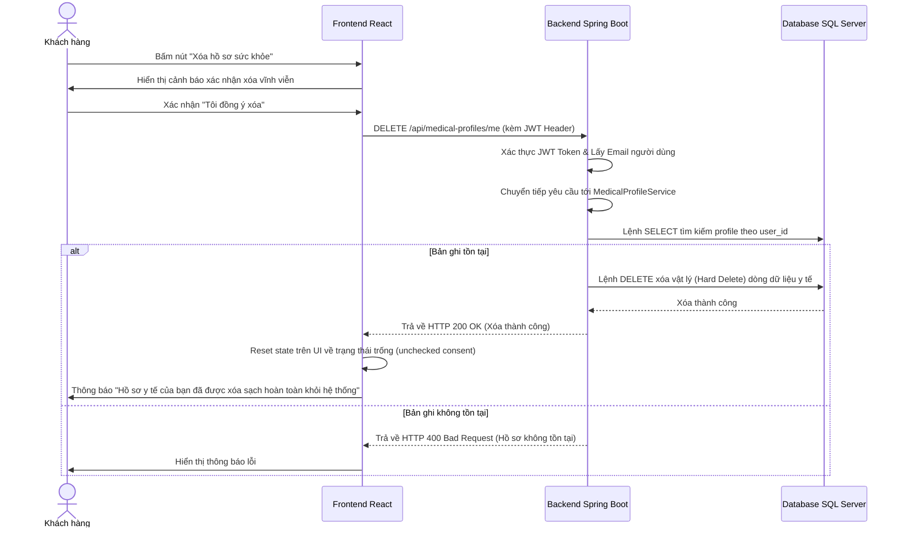

# 🌿 Workflow Chi Tiết Module 1 - UC05: Quyền được xóa dữ liệu (Right to Deletion)

Tài liệu này mô tả chi tiết luồng nghiệp vụ (Workflow) từ Frontend (Giao diện React), tới Backend (Spring Boot APIs, Services) và Database (CSDL SQL Server) để thực thi quyền được xóa dữ liệu (Right to Deletion - BR-20), đảm bảo tuân thủ nghiêm ngặt các quy định của pháp luật Việt Nam về việc xóa bỏ vĩnh viễn các thông tin y tế nhạy cảm khi khách kết thúc kỳ nghỉ hoặc yêu cầu rút lại sự đồng ý.

---

## 🗺️ TỔNG QUAN LUỒNG CHẠY (WORKFLOW)

### Luồng thực hiện Xóa dữ liệu sức khỏe (Hard Delete)


* **Quy trình hoạt động:**
  1. Khách hàng đăng nhập vào trang cá nhân, truy cập mục **Hồ sơ sức khỏe** tại component [HealthProfile.jsx](file:///d:/Semester5/P/Project/su26-swp391-se2023-g3/05-Development/frontend/src/pages/HealthProfile.jsx).
  2. Tại đây, hệ thống cung cấp nút **"Xóa hồ sơ sức khỏe"**. Khi người dùng click vào, một hộp thoại xác nhận (Confirmation Dialog) được hiển thị để nhắc nhở người dùng rằng hành động này sẽ xóa vĩnh viễn dữ liệu bệnh lý và dị ứng thức ăn khỏi hệ thống của Resort.
  3. Sau khi xác nhận đồng ý xóa, Frontend gửi HTTP DELETE tới `/api/medical-profiles/me` thông qua hàm `deleteMyProfile` định nghĩa tại [api.js](file:///d:/Semester5/P/Project/su26-swp391-se2023-g3/05-Development/frontend/src/api.js).
  4. `MedicalProfileController.deleteMyProfile()` tiếp nhận yêu cầu và trích xuất email của Khách hàng từ JWT token.
  5. API chuyển tiếp xử lý tới `MedicalProfileService.deleteMedicalProfile(email)`. Hệ thống thực hiện:
     - Tìm kiếm người dùng hiện tại theo email.
     - Kiểm tra sự tồn tại của hồ sơ sức khỏe trong bảng `medical_profile`. Nếu không tìm thấy, ném ra ngoại lệ.
     - Thực thi lệnh **xóa vật lý (Hard Delete)** bản ghi tương ứng ra khỏi CSDL thông qua `medicalProfileRepository.delete(profile)`. Việc này đảm bảo tính triệt để, thông tin y tế nhạy cảm không còn lưu lại dưới bất kỳ hình thức nào ở database đang chạy (Data Minimization).
  6. Backend gửi phản hồi HTTP 200 OK về Frontend. Frontend làm sạch state trên giao diện (xóa trắng các trường và chuyển checkbox đồng ý consent về trạng thái `false`/`unchecked`).

---

## 💾 CẤU TRÚC DATABASE (TABLES LIÊN QUAN)

### Bảng `medical_profile` (Entity: [MedicalProfile.java](file:///d:/Semester5/P/Project/su26-swp391-se2023-g3/05-Development/backend/src/main/java/fu/se/smms/entity/MedicalProfile.java))
Khác với các thực thể khác có thể áp dụng cơ chế Soft Delete (đổi flag active thành inactive) để giữ lại dữ liệu lịch sử hóa đơn hoặc giao dịch, bảng `medical_profile` bắt buộc phải áp dụng **Hard Delete** (xóa vật lý dòng dữ liệu khỏi bảng) khi người dùng yêu cầu xóa, để đảm bảo tuân thủ tính riêng tư và quy định lưu trữ dữ liệu tối thiểu.
* Lệnh SQL thực thi dưới DB:
  ```sql
  DELETE FROM medical_profile WHERE user_id = ?;
  ```

---

## 🛠️ CÁC SERVICE LIÊN QUAN (RELATED SERVICES)

### 1. [MedicalProfileService (MedicalProfileServiceImpl)](file:///d:/Semester5/P/Project/su26-swp391-se2023-g3/05-Development/backend/src/main/java/fu/se/smms/service/impl/MedicalProfileServiceImpl.java)
Cung cấp logic nghiệp vụ xử lý xóa bỏ dữ liệu:
* `deleteMedicalProfile(String email)`: Định vị ID người dùng qua email, truy xuất bản ghi trong `medical_profile` và ra lệnh xóa vật lý thông qua Spring Data JPA Repository. Ném lỗi nếu hồ sơ không tồn tại để ngăn chặn các request rác hoặc xóa trùng lặp.
