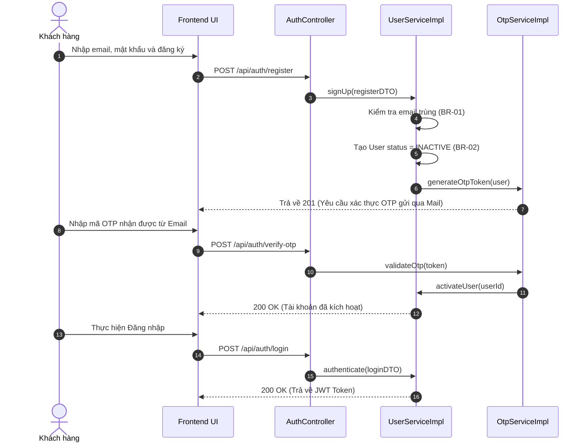

# KẾ HOẠCH THỰC THI MÃ NGUỒN VÀ KIỂM THỬ (EDS & TDD SPECIFICATION)
## Quy trình WF-01: Đăng ký, Đăng nhập & Khai báo Hồ sơ Y tế (Module 1)

| Field                | Value                                               |
| :---------------------| :----------------------------------------------------|
| **Document ID**      | RESORT-M1-IMP-001                                   |
| **Version**          | 1.0                                                 |
| **Date**             | 2026-07-01                                          |
| **Status**           | Approved                                            |
| **Document Owner**   | SWP391 SE2023-G3 Architecture Team                  |
| **Author**           | Hoang Tuan Anh                                      |
| **Reviewed by**      | SWP391 SE2023-G3 Tech Lead                          |
| **DPO Sign-off**     | [x] Approved — 2026-07-01 — Data Protection Officer |
| **Approved by**      | Principal Architect                                 |
| **Last Review**      | 2026-07-01                                          |
| **Based on EDS/TDD** | EDS v2.0 & TDD v1.0                                 |

---

## CHANGELOG

| Ngày | Người thực hiện | Nội dung thay đổi |
| :--- | :--- | :--- |
| 2026-07-01 | Antigravity | Tạo tài liệu thiết kế kỹ thuật (EDS) và đặc tả kiểm thử (TDD) tích hợp cho WF-01 |

---

## MỤC LỤC

1. [Tổng quan Quy trình (WF-01 Overview)](#1-tổng-quan-quy-trình-wf-01-overview)
2. [Ma trận Truy vết Nghiệp vụ (Traceability Matrix)](#2-ma-trận-truy-vết-nghiệp-vụ-traceability-matrix)
3. [Architecture Decision Records (ADR)](#3-architecture-decision-records-adr)
4. [Yêu cầu Phi chức năng & SLA (NFRs)](#4-yêu-cầu-phi-chức-năng--sla-nfrs)
5. [Mô hình Tĩnh MVC (Static MVC Modeling)](#5-mô-hình-tĩnh-mvc-static-mvc-modeling)
6. [Mô hình Động (Dynamic Modeling)](#6-mô-hình-động-dynamic-modeling)
7. [Domain Event Catalog](#7-domain-event-catalog)
8. [Đặc tả Interface & Giao thức (Interface Spec)](#8-đặc-tả-interface--giao-thức-interface-spec)
9. [Đặc tả API Endpoints (API Specification)](#9-đặc-tả-api-endpoints-api-specification)
10. [Bảng mã lỗi (Error Codes)](#10-bảng-mã-lỗi-error-codes)
11. [Đặc tả Kiểm thử TDD (TDD Test Design & Cases)](#11-đặc-tả-kiểm-thử-tdd-tdd-test-design--cases)
12. [Entry & Exit Criteria (DoD)](#12-entry--exit-criteria-dod)
13. [Kế hoạch Rollback (Rollback Plan)](#13-kế-hoạch-rollback-rollback-plan)

---

## 1. Tổng quan Quy trình (WF-01 Overview)

Quy trình **WF-01: Đăng ký, Đăng nhập & Khai báo Hồ sơ Y tế** là luồng thiết lập danh tính và khai báo y tế ban đầu của khách hàng. Nó bao gồm đăng ký tài khoản, gửi và xác thực OTP qua email, đăng nhập lấy JWT Token, ký chấp thuận đồng thuận sử dụng dữ liệu (Explicit Consent), khai báo thông tin sức khỏe (được mã hóa AES-256), phân quyền truy cập thông tin y tế theo vai trò (RBAC) và hỗ trợ xóa tài khoản theo yêu cầu (Quyền được lãng quên - GDPR).

| Field | Value |
| :--- | :--- |
| **Module / Bounded Context** | Module 1: Auth & User Profile Context |
| **Data Classification** | Sensitive-PII (Mật khẩu băm, Mã OTP, Tình trạng sức khỏe, Dị ứng thực phẩm) |
| **Compliance Scope** | GDPR Art. 7 (Consent) & Art. 17 (Right to Deletion), Nghị định 13/2023/NĐ-CP |
| **Upstream Dependencies** | Mail/SMS Gateway Service (Gửi mã OTP xác thực) |
| **Downstream Consumers** | Module 2 & 3 (Kiểm tra hồ sơ sức khỏe và dị ứng trước khi đặt dịch vụ) |

---

## 2. Ma trận Truy vết Nghiệp vụ (Traceability Matrix)

| Requirement ID | Loại | Mô tả yêu cầu | Thành phần MVC / Code chịu trách nhiệm | Target Compliance | ADR liên quan |
| :--- | :--- | :--- | :--- | :--- | :--- |
| **BR-01** | Business Rule | Mỗi địa chỉ email chỉ đăng ký duy nhất 1 tài khoản. | `UserRepository.existsByEmail()`, `UserServiceImpl.signUp()` | Toàn vẹn dữ liệu | ADR-01 |
| **BR-02** | Business Rule | Khách đăng ký truyền thống phải xác thực email trước khi book phòng. | `User.status` = `INACTIVE` -> `ACTIVE` qua OTP | Xác minh tài khoản | ADR-01 |
| **BR-07** | Business Rule | Khách hàng phải khai báo sức khỏe và ký Consent trước khi được đặt lịch Spa/Yoga. | `MedicalProfile.explicitConsentSigned`, `MedicalProfileServiceImpl` | Tuân thủ Dữ liệu Y tế | ADR-01 |
| **BR-20** | Business Rule | Xử lý yêu cầu xóa dữ liệu cá nhân nhạy cảm của khách hàng (Right to Deletion). | `UserServiceImpl.deleteUser()`, GDPR Scheduler job | GDPR Art. 17 | ADR-01 |
| **BR-21** | Business Rule | RBAC: Chuyên gia được xem bệnh lý, Đầu bếp được xem dị ứng ăn uống, Lễ tân/khác bị chặn xem cả hai. | `@PreAuthorize` guards, DTO filtering in `MedicalProfileServiceImpl` | Least Privilege | ADR-01 |
| **BR-22** | Business Rule | Tài khoản bị khóa sẽ không được phép đăng nhập. | `User.status` = `LOCKED`, `AuthController.login()` | An toàn hệ thống | ADR-01 |

---

## 3. Architecture Decision Records (ADR)

*   **ADR-001 (Kiến trúc MVC phân rã)**: React SPA Frontend kết nối Spring Boot REST API Backend, xác thực phi trạng thái bằng JWT token đính kèm ở Authorization Header.
*   **ADR-003 (Mã hóa dữ liệu y tế tại rest)**: Mã hóa đối xứng AES-256 các trường `physical_condition` và `food_allergies` trước khi lưu vào MS SQL Server. Khóa giải mã được quản lý an toàn ở biến môi trường của server Backend.

---

## 4. Yêu cầu Phi chức năng & SLA (NFRs)

*   **Thời gian phản hồi (Latency)**: API Đăng nhập và Giải mã thông tin y tế phải có tốc độ phản hồi $p99 < 200\text{ ms}$.
*   **Bảo mật (Security)**: Mã OTP có hiệu lực tối đa 5 phút và tự động hủy sau khi sử dụng. Dữ liệu y tế nhạy cảm phải được giải mã tại bộ nhớ JVM (in-memory) trước khi trả về DTO phù hợp cho vai trò người dùng, không bao giờ được lưu plaintext thô vào log file.

---

## 5. Mô hình Tĩnh MVC (Static MVC Modeling)

### 5.1. Thành phần MODEL (Dữ liệu & ORM)

#### Server-Side Model (JPA Entities tại [fu.se.smms.entity](file:///d:/ResortManageNew/05-Development/backend/src/main/java/fu/se/smms/entity))
1.  **User**: Quản lý thông tin tài khoản chung.
    *   `userId`: Integer (PK)
    *   `email`: String (Unique)
    *   `passwordHash`: String
    *   `fullName`: String
    *   `phone`: String
    *   `role`: Role (`CUSTOMER`, `SPECIALIST`, `CHEF`, `RECEPTIONIST`, `ADMIN`)
    *   `status`: Status (`INACTIVE`, `ACTIVE`, `LOCKED`)
2.  **MedicalProfile**: Chứa dữ liệu y tế nhạy cảm (1-to-1 với User).
    *   `profileId`: Integer (PK)
    *   `physicalConditionEncrypted`: String (Mã hóa AES-256)
    *   `foodAllergiesEncrypted`: String (Mã hóa AES-256)
    *   `explicitConsentSigned`: Boolean (Chữ ký chấp thuận của khách)
    *   `updatedAt`: LocalDateTime
3.  **OtpToken**: Token xác thực email.
    *   `tokenId`: Integer (PK)
    *   `token`: String
    *   `expiresAt`: LocalDateTime
    *   `used`: Boolean
    *   `user`: User (Many-to-One)

#### Client-Side Model (React State tại `frontend/src/context/NotificationContext.jsx` & LocalStorage)
*   `userToken`: Lưu JWT Token tại `localStorage`.
*   `currentUser`: `{ userId, email, role, fullName }` lưu trong React AuthContext.

### 5.2. Thành phần VIEW (Giao diện Hiển thị)
*   **Register.jsx**: Giao diện đăng ký tài khoản mới.
*   **Login.jsx**: Form đăng nhập bằng tài khoản hoặc OTP.
*   **HealthProfile.jsx**: Trang khai báo tình trạng sức khỏe, có checkbox ký chấp thuận Explicit Consent.

### 5.3. Thành phần CONTROLLER (Điều phối & Định tuyến)
*   **Server REST Controllers**:
    *   `AuthController`: Xử lý `/api/auth/register`, `/api/auth/verify-otp`, `/api/auth/login`.
    *   `MedicalProfileController`: Xử lý `/api/medical-profiles` (GET/POST/PUT).
    *   `UserController`: Xử lý `/api/users/delete-request` (xóa tài khoản).

---

## 6. Mô hình Động (Dynamic Modeling)

### 6.1. Đăng ký & Đăng nhập (Happy Path Sequence)



---

## 7. Domain Event Catalog

*   **`UserRegistered`**: Phát ra khi tạo thành công tài khoản nháp để dịch vụ email tự động gửi mã OTP.
*   **`UserDeleted`**: Phát ra khi khách hàng nhấn yêu cầu xóa dữ liệu, kích hoạt tiến trình soft-delete dữ liệu y tế liên quan trong vòng 24 giờ.

---

## 8. Đặc tả API Endpoints (API Specification)

### 8.1. Khai báo Hồ sơ Y tế
*   **Method**: `POST`
*   **Path**: `/api/medical-profiles`
*   **Auth Level**: JWT Bearer (`ROLE_CUSTOMER`)
*   **Payload Request (JSON)**:
    ```json
    {
      "physicalCondition": "Đau cột sống thắt lưng mãn tính",
      "foodAllergies": "Dị ứng lạc, cua bể",
      "explicitConsentSigned": true
    }
    ```
*   **Phản hồi thành công (200 OK)**:
    ```json
    {
      "profileId": 45,
      "explicitConsentSigned": true,
      "updatedAt": "2026-07-01T23:10:00"
    }
    ```

---

## 9. Đặc tả Kiểm thử TDD (TDD Test Design & Cases)

### 9.1. Danh sách Test Cases (TDD Specification)

#### `AUTH-TC-001` — Chặn đăng ký email trùng lặp (BR-01)
*   **Severity**: CRITICAL
*   **Feature under test**: `UserServiceImpl.signUp()`
*   **Test File**: [AuthControllerTest.java](file:///d:/ResortManageNew/05-Development/backend/src/test/java/fu/se/smms/controller/AuthControllerTest.java)
*   **Hành vi mong đợi**: Ném lỗi `BusinessException` mã `AUTH-001` (400 Bad Request) khi email đã tồn tại trong DB.

#### `AUTH-TC-002` — Khóa đăng nhập đối với tài khoản bị khóa (BR-22)
*   **Severity**: HIGH
*   **Feature under test**: `AuthController.login()`
*   **Preconditions**: Tài khoản có `status` = `LOCKED`.
*   **Hành vi mong đợi**: Ném lỗi `BusinessException` mã `AUTH-004` (403 Forbidden).

#### `MEDICAL-TC-001` — Tự động mã hóa AES-256 thông tin y tế khi lưu (Security)
*   **Severity**: CRITICAL
*   **Feature under test**: `MedicalProfileServiceImpl.saveProfile()`
*   **Test File**: [MedicalProfileControllerTest.java](file:///d:/ResortManageNew/05-Development/backend/src/test/java/fu/se/smms/controller/MedicalProfileControllerTest.java)
*   **Hành vi mong đợi**: Thông tin `physicalCondition` và `foodAllergies` lưu trong bảng `medical_profile` dưới dạng chuỗi băm mã hóa, không phải văn bản thô.

#### `MEDICAL-TC-002` — Phân quyền xem dữ liệu y tế (RBAC - BR-21)
*   **Severity**: CRITICAL
*   **Feature under test**: `MedicalProfileServiceImpl.getProfileForUser()`
*   **Hành vi mong đợi**:
    *   `SPECIALIST` có thể xem đầy đủ cả `physicalCondition` và `foodAllergies`.
    *   `CHEF` chỉ có thể xem `foodAllergies` (trường `physicalCondition` bị lọc/null).
    *   `RECEPTIONIST` bị chặn và trả về lỗi 403 Forbidden.
