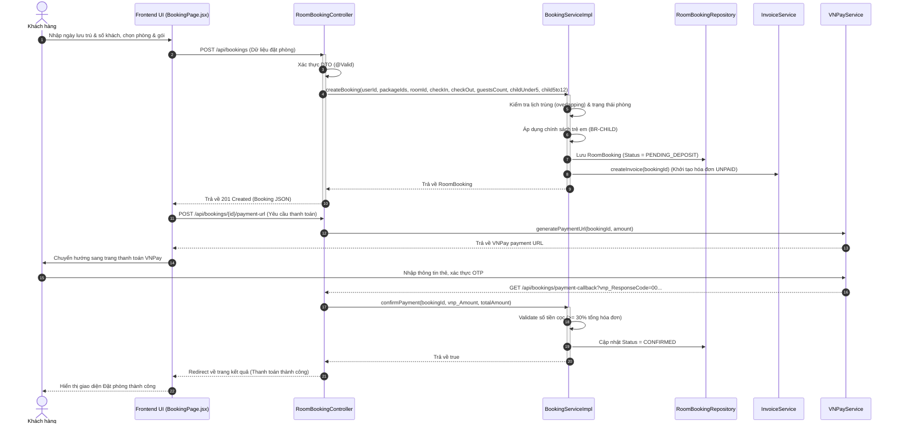
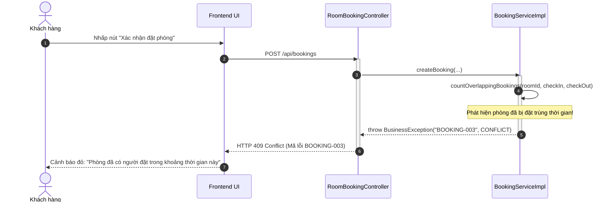

# KẾ HOẠCH THỰC THI MÃ NGUỒN VÀ KIỂM THỬ (EDS & TDD SPECIFICATION)

## Quy trình WF-02: Tìm kiếm & Đặt phòng cùng Gói trị liệu (Module 2)

| Field                | Value                                               |
| :---------------------| :----------------------------------------------------|
| **Document ID**      | RESORT-M2-IMP-002                                   |
| **Version**          | 1.0                                                 |
| **Date**             | 2026-07-01                                          |
| **Status**           | Approved                                            |
| **Document Owner**   | SWP391 SE2023-G3 Architecture Team                  |
| **Author**           | Pham Duy Nghia                                      |
| **Reviewed by**      | SWP391 SE2023-G3 Tech Lead                          |
| **DPO Sign-off**     | [x] Approved — 2026-07-01 — Data Protection Officer |
| **Approved by**      | Principal Architect                                 |
| **Last Review**      | 2026-07-01                                          |
| **Based on EDS/TDD** | EDS v2.0 & TDD v1.0                                 |

---

## CHANGELOG

> **Policy 4.4 — Immutable History**: Không xóa lịch sử cũ. Mọi sửa đổi phải được ghi nhận tại bảng này.

| Ngày      | Người thực hiện | Nội dung thay đổi                                                                            |
| :--------- | :------------------ | :---------------------------------------------------------------------------------------------- |
| 2026-07-01 | Antigravity         | Tạo tài liệu thiết kế kỹ thuật (EDS) và đặc tả kiểm thử (TDD) tích hợp cho WF-02 |

---

## MỤC LỤC

1. [Tổng quan Quy trình (WF-02 Overview)](#1-tổng-quan-quy-trình-wf-02-overview)
2. [Ma trận Truy vết Nghiệp vụ (Traceability Matrix)](#2-ma-trận-truy-vết-nghiệp-vụ-traceability-matrix)
3. [Architecture Decision Records (ADR)](#3-architecture-decision-records-adr)
4. [Yêu cầu Phi chức năng & SLA (NFRs)](#4-yêu-cầu-phi-chức-năng--sla-nfrs)
5. [Mô hình Tĩnh MVC (Static MVC Modeling)](#5-mô-hình-tĩnh-mvc-static-mvc-modeling)
6. [Mô hình Động (Dynamic Modeling)](#6-mô-hình-động-dynamic-modeling)
7. [Domain Event Catalog](#7-domain-event-catalog)
8. [Đặc tả Interface & Giao thức (Interface Spec)](#8-đặc-tả-interface--giao-thức-interface-spec)
9. [Đặc tả API Endpoints (API Specification)](#9-đặc-tả-api-endpoints-api-specification)
10. [Bảng mã lỗi (Error Codes)](#10-bảng-mã-lỗi-error-codes)
11. [Đặc tả Kiểm thử TDD (TDD Test Design & Cases)](#11-đặc-tả-kiểm-thử-tdd-tdd-test-design--cases)
12. [Bảng theo dõi TDD (Red-Green-Refactor Tracker)](#12-bảng-theo-dõi-tdd-red-green-refactor-tracker)
13. [Điều kiện Bắt đầu & Kết thúc (DoD)](#13-điều-kiện-bắt-đầu--kết-thúc-dod)
14. [Kế hoạch Rollback (Rollback Plan)](#14-kế-hoạch-rollback-rollback-plan)

---

## 1. Tổng quan Quy trình (WF-02 Overview)

Quy trình **WF-02: Tìm kiếm & Đặt phòng cùng Gói trị liệu** cho phép khách hàng thực hiện tìm kiếm phòng trống theo thời gian thực tại resort, lựa chọn phòng (Villa) thích hợp kết hợp với các Gói trị liệu sức khỏe (Retreat Package) đi kèm, tính toán chi phí và thực hiện đặt cọc trực tuyến 30% qua cổng thanh toán VNPay để nhận xác nhận đặt phòng chính thức.

| Field                              | Value                                                                                                                                                                                                                                                                                                           |
| :--------------------------------- | :-------------------------------------------------------------------------------------------------------------------------------------------------------------------------------------------------------------------------------------------------------------------------------------------------------------- |
| **Module / Bounded Context** | Module 2: Accommodation & Retreat Booking / Booking Context                                                                                                                                                                                                                                                     |
| **Data Classification**      | PII & Financial Data (Họ tên khách, Số điện thoại, Email, Số tiền giao dịch, Mã thanh toán)                                                                                                                                                                                                         |
| **Compliance Scope**         | Nghị định 13/2023/NĐ-CP (Bảo vệ dữ liệu cá nhân)                                                                                                                                                                                                                                                      |
| **Upstream Dependencies**    | [User/Identity Service](file:///d:/ResortManageNew/05-Development/backend/src/main/java/fu/se/smms/service/impl/UserServiceImpl.java) (Xác thực tài khoản và phân quyền)                                                                                                                                  |
| **Downstream Consumers**     | [Invoice Service](file:///d:/ResortManageNew/05-Development/backend/src/main/java/fu/se/smms/service/impl/InvoiceServiceImpl.java) (Tính toán hóa đơn tổng hợp), [Spa Booking Service](file:///d:/ResortManageNew/05-Development/backend/src/main/java/fu/se/smms/service/impl/SpaBookingServiceImpl.java) |

---

## 2. Ma trận Truy vết Nghiệp vụ (Traceability Matrix)

| Requirement ID     | Loại         | Mô tả yêu cầu                                                                                                                         | Thành phần MVC / Code chịu trách nhiệm                                                  | Target Compliance           | ADR liên quan  |
| :----------------- | :------------ | :---------------------------------------------------------------------------------------------------------------------------------------- | :------------------------------------------------------------------------------------------- | :-------------------------- | :-------------- |
| **BR-04**    | Business Rule | Chỉ các gói trị liệu ở trạng thái`ACTIVE` mới được phép hiển thị và đặt.                                              | `BookingServiceImpl.createBooking()`, `RetreatPackageRepository`                         | Tính nhất quán danh mục | ADR-01          |
| **BR-05**    | Business Rule | Đơn đặt phòng chỉ chuyển sang trạng thái`CONFIRMED` khi thanh toán cọc thành công (tỷ lệ quy định bởi cấu hình DB). | `BookingServiceImpl.confirmPayment()`, `SystemConfiguration`                             | Toàn vẹn giao dịch       | ADR-01, ADR-002 |
| **BR-06**    | Business Rule | Chỉ cho phép đặt các Villa vật lý đang trống trong khoảng thời gian yêu cầu (không trùng lịch).                           | `BookingServiceImpl.createBooking()`, `RoomBookingRepository.countOverlappingBookings()` | Chống Overbooking          | ADR-01          |
| **BR-26**    | Business Rule | Ghi nhận nhật ký mọi giao dịch thanh toán thành công để đối chiếu kiểm toán.                                               | `PaymentTransactionLogRepository`, `VNPayServiceImpl`                                    | Audit Trail Compliance      | ADR-01          |
| **BR-30**    | Business Rule | Mọi lịch trình đặt phòng phải đảm bảo ngày check-out muộn hơn ngày check-in.                                                | `BookingServiceImpl.createBooking()`                                                       | Lịch trình hợp lệ       | ADR-01          |
| **BR-CHILD** | Business Rule | Trẻ em dưới 5 tuổi được miễn phí; Trẻ em từ 5-12 tuổi tính 1 slot capacity như người lớn.                                | `BookingServiceImpl.createBooking()`, check-in validations                                 | Quy tắc định mức        | ADR-01          |

---

## 3. Architecture Decision Records (ADR)

* **ADR-001 (Kiến trúc MVC phân rã)**: Quy định phân tách hoàn toàn Frontend React và Backend Spring Boot qua cổng kết nối REST API bảo mật bởi JWT.
* **ADR-002 (Cấu hình linh hoạt tỉ lệ đặt cọc)**: Thay vì ghi cứng tỉ lệ đặt cọc 30%, hệ thống tải động giá trị `deposit_ratio` từ bảng `system_configuration` (mặc định `0.30`).

---

## 4. Yêu cầu Phi chức năng & SLA (NFRs)

* **Thời gian phản hồi (Latency)**: API kiểm tra phòng trống và tính giá phải có tốc độ phản hồi $p99 < 300\text{ ms}$ dưới tải 100 CCU.
* **Tính nhất quán (Consistency)**: Thời hạn khóa phòng tạm thời để chờ thanh toán là 15 phút. Quá 15 phút không thanh toán, booking nháp trạng thái `PENDING_DEPOSIT` sẽ tự động hết hạn, phòng được giải phóng.
* **Bảo mật dữ liệu (Security)**: Kết nối API bắt buộc truyền JWT Token qua HTTPS. Mọi log hệ thống tuyệt đối không ghi nhận các tham số nhạy cảm của khách hàng dạng thô (plaintext).

---

## 5. Mô hình Tĩnh MVC (Static MVC Modeling)

Hệ thống được thiết kế theo mô hình **MVC Phân rã (Decoupled MVC Architecture)** chia làm hai vùng kiểm soát chính:

```
                  ┌────────────────────────────────────────────────────────┐
                  │                 FRONTEND (React SPA)                   │
                  │  [View] - BookingPage.jsx (Giao diện đặt phòng)        │
                  │  [Client Controller] - Event Handlers & apiRequest     │
                  └───────────┬────────────────────────────▲───────────────┘
                              │ HTTP Request               │ HTTP Response
                              │ (JSON + JWT)               │ (JSON DTO)
                  ┌───────────▼────────────────────────────┴───────────────┐
                  │               BACKEND (Spring Boot REST)               │
                  │  [Controller] - RoomBookingController.java             │
                  │  [Service]    - BookingServiceImpl.java (Nghiệp vụ)     │
                  │  [Model/Repo] - JPA Entities & Repositories            │
                  └───────────────────────────┬────────────────────────────┘
                                              │ JPA / SQL Connection
                                  ┌───────────▼───────────┐
                                  │   DATABASE (MS SQL)   │
                                  └───────────────────────┘
```

### 5.1. Thành phần MODEL (Dữ liệu & ORM)

#### Server-Side Model (JPA Entities tại [fu.se.smms.entity](file:///d:/ResortManageNew/05-Development/backend/src/main/java/fu/se/smms/entity))

1. **RoomBooking**: Quản lý thông tin đặt phòng tổng thể.
   * `bookingId`: Integer (PK)
   * `checkInDate`: LocalDateTime
   * `checkOutDate`: LocalDateTime
   * `status`: String (`PENDING_DEPOSIT`, `CONFIRMED`, `CHECKED_IN`, `CHECKED_OUT`, `CANCELLED`)
   * `totalDeposit`: BigDecimal (Tiền cọc thực tế đã đóng)
   * `guestsCount`: Integer (Số khách tính slot capacity)
   * `childrenUnder5`: Integer
   * `children5to12`: Integer
   * `childrenCount`: Integer
   * `createdAt`: LocalDateTime
2. **RoomBookingDetail**: Liên kết đặt phòng với phòng vật lý.
   * `detailId`: Integer (PK)
   * `roomBooking`: RoomBooking (Many-to-One)
   * `room`: Room (Many-to-One)
   * `priceAtBooking`: BigDecimal (Đơn giá phòng tại thời điểm đặt)
3. **RetreatPackage**: Gói trị liệu được lựa chọn đi kèm.
   * `packageId`: Integer (PK)
   * `name`: String
   * `price`: BigDecimal
   * `status`: String (`ACTIVE`, `INACTIVE`)
4. **Invoice**: Hóa đơn tổng hợp gộp chung khởi tạo nháp ngay khi tạo booking.
   * `invoiceId`: Integer (PK)
   * `roomBooking`: RoomBooking (One-to-One)
   * `finalAmount`: BigDecimal
   * `depositAmount`: BigDecimal
   * `amountDue`: BigDecimal (Số tiền còn nợ = finalAmount - depositAmount)
   * `status`: String (`UNPAID`, `PAID`)
5. **PaymentTransactionLog**: Ghi nhận lịch sử giao dịch cổng VNPay.
   * `logId`: Integer (PK)
   * `txnRef`: String (Mã đối chiếu duy nhất của VNPay)
   * `amount`: BigDecimal
   * `status`: String (`SUCCESS`, `FAILED`)

#### Client-Side Model (React State tại `frontend/src/pages/BookingPage.jsx`)

* `searchParams`: `{ checkInDate, checkOutDate, guestsCount, childrenUnder5, children5to12 }`
* `selectedRoom`: Đối tượng phòng vật lý đang được chọn.
* `selectedPackages`: Danh sách gói trị liệu đang chọn.
* `bookingResponse`: Dữ liệu phản hồi từ Backend sau khi tạo thành công đơn hàng nháp.

---

### 5.2. Thành phần VIEW (Giao diện Hiển thị)

* **BookingPage.jsx**: Giao diện SPA chính thực hiện quy trình đặt phòng theo các bước (Wizard Flow):
  * *Bước 1 (Search)*: Người dùng nhập khoảng ngày lưu trú, số lượng khách, số trẻ em.
  * *Bước 2 (Room Selection)*: Danh sách phòng trống hiển thị động.
  * *Bước 3 (Package Selection)*: Danh sách các gói Retreat Package trạng thái `ACTIVE`.
  * *Bước 4 (Guest Info & Summary)*: Hiển thị bảng tổng hợp chi phí, tính toán tiền cọc 30%, yêu cầu nhập thông tin cá nhân.
  * *Bước 5 (Payment Redirect)*: Chuyển hướng thanh toán và hiển thị kết quả.

---

### 5.3. Thành phần CONTROLLER (Điều phối & Định tuyến)

#### Server-Side REST Controller ([RoomBookingController.java](file:///d:/ResortManageNew/05-Development/backend/src/main/java/fu/se/smms/controller/RoomBookingController.java))

* REST Controller tiếp nhận JSON Payload từ client, thực thi validate đầu vào (`@Valid`), và chuyển logic xuống tầng Service.
* Các endpoints chính:
  * `POST /api/bookings`: Nhận thông tin đặt phòng, tạo booking trạng thái `PENDING_DEPOSIT`, trả về thông tin chi tiết.
  * `POST /api/bookings/{id}/payment-url`: Tạo và trả về đường dẫn URL thanh toán qua cổng VNPay.
  * `GET /api/bookings/payment-callback`: Tiếp nhận kết quả thanh toán từ VNPay (IPN/Callback), đối chiếu và cập nhật trạng thái đặt phòng.

#### Client-Side Controller (API Services trong [frontend/src/api](file:///d:/ResortManageNew/05-Development/frontend/src/api))

* Hàm `apiRequest` chịu trách nhiệm đóng gói HTTP Request, tự động đính kèm Bearer JWT Token từ LocalStorage và quản lý lỗi tập trung qua Axios Interceptor.
* Các Event Handlers trong `BookingPage.jsx` thu thập thông tin từ View, gọi API Controller, và cập nhật Client State để render giao diện tương ứng.

---

## 6. Mô hình Động (Dynamic Modeling)

### 6.1. Luồng nghiệp vụ thành công (Happy Path Sequence)



### 6.2. Luồng nghiệp vụ lỗi - Phòng bị trùng lịch (Error Path Sequence)



---

## 7. Domain Event Catalog

Mô hình hoạt động bất đồng bộ phát ra các Domain Event sau:

* **`BookingCreated`**:
  * *Trigger*: Lưu thành công đặt phòng nháp.
  * *Publisher*: `BookingServiceImpl`
  * *Subscriber*: `InvoiceServiceImpl` (Nhận event để tự động khởi tạo Folio hóa đơn nháp).
* **`BookingConfirmed`**:
  * *Trigger*: Xác thực giao dịch thanh toán đặt cọc 30% thành công qua VNPay Callback.
  * *Publisher*: `BookingServiceImpl`
  * *Subscriber*: `NotificationServiceImpl` (Gửi email xác nhận kèm lịch hẹn tự động cho khách hàng).

---

## 8. Đặc tả Interface & Giao thức (Interface Spec)

### 8.1. Service Contract: `BookingService`

```java
package fu.se.smms.service;

import fu.se.smms.entity.RoomBooking;
import java.math.BigDecimal;
import java.time.LocalDateTime;
import java.util.List;

public interface BookingService {
  
    /**
     * Tạo mới đặt phòng nháp (PENDING_DEPOSIT)
     * Enforces: BR-04, BR-06, BR-30, BR-CHILD
     * @throws BusinessException BOOKING-001 (ngày lỗi), BOOKING-003 (trùng lịch phòng)
     */
    RoomBooking createBooking(Integer userId, List<Integer> packageIds, Integer roomId,
                              LocalDateTime checkIn, LocalDateTime checkOut,
                              Integer guestsCount, Integer childrenUnder5, Integer children5to12);

    /**
     * Xác thực và ghi nhận tiền cọc thành công từ VNPay
     * Enforces: BR-05 (kiểm tra tỷ lệ cọc tối thiểu)
     * @throws BusinessException BOOKING-002 (tiền cọc không đủ hạn mức cấu hình)
     */
    boolean confirmPayment(Integer bookingId, BigDecimal depositPaid, BigDecimal totalAmount);
}
```

---

## 9. Đặc tả API Endpoints (API Specification)

### 9.1. Tạo mới đặt phòng

* **Method**: `POST`
* **Path**: `/api/bookings`
* **Auth Level**: JWT Bearer (`ROLE_CUSTOMER`, `ROLE_RECEPTIONIST`)
* **Payload Request (JSON)**:
  ```json
  {
    "userId": 15,
    "roomId": 3,
    "packageIds": [1, 2],
    "checkInDate": "2026-07-10T14:00:00",
    "checkOutDate": "2026-07-15T12:00:00",
    "guestsCount": 2,
    "childrenUnder5": 1,
    "children5to12": 1
  }
  ```
* **Phản hồi thành công (201 Created)**:
  ```json
  {
    "bookingId": 101,
    "status": "PENDING_DEPOSIT",
    "checkInDate": "2026-07-10T14:00:00",
    "checkOutDate": "2026-07-15T12:00:00",
    "totalDeposit": 0.0,
    "guestsCount": 3,
    "childrenCount": 2,
    "createdAt": "2026-07-01T23:00:00"
  }
  ```

### 9.2. Tạo URL cổng thanh toán VNPay

* **Method**: `POST`
* **Path**: `/api/bookings/{id}/payment-url`
* **Auth Level**: JWT Bearer (`ROLE_CUSTOMER`)
* **Phản hồi thành công (200 OK)**:
  ```json
  {
    "paymentUrl": "https://sandbox.vnpayment.vn/paymentv2/vpcpay.html?vnp_Amount=150000000..."
  }
  ```

---

## 10. Bảng mã lỗi (Error Codes)

| Mã lỗi        |   HTTP Status   | Message (VI)                                                             | Mô tả chi tiết điều kiện lỗi                                                        |
| :-------------- | :-------------: | :----------------------------------------------------------------------- | :----------------------------------------------------------------------------------------- |
| `BOOKING-001` | 400 Bad Request | Ngày nhận phòng phải trước ngày trả phòng.                      | Ngày check-out được nhập trước hoặc trùng ngày check-in.                         |
| `BOOKING-002` | 400 Bad Request | Số tiền đặt cọc thấp hơn mức tối thiểu 30%.                    | Giao dịch VNPay callback trả về số tiền nhỏ hơn hạn mức cấu hình.               |
| `BOOKING-003` |  409 Conflict  | Phòng/Villa này đã được đặt trong khoảng thời gian yêu cầu. | Có sự trùng lặp ngày lưu trú với một đơn đã CONFIRMED hoặc CHECKED_IN khác. |

---

## 11. Đặc tả Kiểm thử TDD (TDD Test Design & Cases)

### 11.1. Phạm vi Kiểm thử & Mocks (TDS-01)

Kiểm thử tập trung vào lớp nghiệp vụ trung tâm `BookingServiceImpl` và sự tích hợp với `RoomBookingRepository`. Tầng Cấu hình hệ thống (System Configuration) được mock để cung cấp linh hoạt tỷ lệ đặt cọc.

### 11.2. Danh sách Test Cases (TDD Specification)

#### `BOOKING-TC-001` — Đặt phòng thành công với khoảng ngày trống (Happy Path)

* **Severity**: CRITICAL
* **TDD Phase**: 🟢 PASS
* **Feature under test**: `BookingServiceImpl.createBooking()`
* **Preconditions**: Phòng ID = 3 có status = `AVAILABLE`, chưa có đặt phòng nào trong khoảng ngày `2026-07-10` đến `2026-07-15`.
* **Các bước thực hiện**:
  1. Chuẩn bị Mock Room (basePrice = 1,000,000 VND / đêm).
  2. Gọi `createBooking` cho khoảng ngày từ `2026-07-10` đến `2026-07-15`.
  3. Xác nhận Booking được tạo thành công.
* **Hành vi mong đợi**: Trả về thực thể `RoomBooking` có trạng thái `PENDING_DEPOSIT`, trường `totalDeposit` = 0.

#### `BOOKING-TC-002` — Chặn đặt phòng nếu ngày check-out trước hoặc trùng ngày check-in

* **Severity**: HIGH
* **TDD Phase**: 🟢 PASS
* **Feature under test**: `BookingServiceImpl.createBooking()`
* **Các bước thực hiện**:
  1. Gọi `createBooking` với ngày check-in: `2026-07-15`, check-out: `2026-07-10`.
* **Hành vi mong đợi**: Bắn ra ngoại lệ `BusinessException` có mã lỗi `BOOKING-001` và HTTP Status `400 Bad Request`.

#### `BOOKING-TC-003` — Chặn đặt phòng trùng lịch (Overbooking prevention)

* **Severity**: CRITICAL
* **TDD Phase**: 🟢 PASS
* **Feature under test**: `BookingServiceImpl.createBooking()`
* **Preconditions**: Phòng ID = 3 đã được đặt và xác nhận thành công (`CONFIRMED`) từ ngày `2026-07-10` đến `2026-07-15`.
* **Các bước thực hiện**:
  1. Gọi `createBooking` đặt phòng ID = 3 từ ngày `2026-07-12` đến `2026-07-14` (khoảng ngày giao nhau).
* **Hành vi mong đợi**: Bắn ra ngoại lệ `BusinessException` có mã lỗi `BOOKING-003` và HTTP Status `409 Conflict`.

#### `BOOKING-TC-004` — Xác nhận cọc thành công nếu số tiền đạt hạn mức tối thiểu

* **Severity**: CRITICAL
* **TDD Phase**: 🟢 PASS
* **Feature under test**: `BookingServiceImpl.confirmPayment()`
* **Preconditions**: Tỷ lệ đặt cọc hệ thống là `0.30`, tổng tiền đặt phòng là `5,000,000` VND. Mức cọc tối thiểu là `1,500,000` VND.
* **Các bước thực hiện**:
  1. Gọi `confirmPayment` với số tiền thanh toán thực tế: `1,500,000` VND.
* **Hành vi mong đợi**: Trả về `true`, cập nhật trạng thái `RoomBooking` thành `CONFIRMED` và ghi nhận `totalDeposit` = 1,500,000.

#### `BOOKING-TC-005` — Chặn xác nhận cọc nếu số tiền nhỏ hơn hạn mức cấu hình

* **Severity**: HIGH
* **TDD Phase**: 🟢 PASS
* **Feature under test**: `BookingServiceImpl.confirmPayment()`
* **Preconditions**: Tổng tiền đặt phòng là `5,000,000` VND, mức cọc tối thiểu 30% là `1,500,000` VND.
* **Các bước thực hiện**:
  1. Gọi `confirmPayment` với số tiền thanh toán thực tế: `1,200,000` VND (thấp hơn tối thiểu).
* **Hành vi mong đợi**: Bắn ra ngoại lệ `BusinessException` mã lỗi `BOOKING-002` và giữ nguyên trạng thái `PENDING_DEPOSIT`.

#### `BOOKING-TC-006` — Áp dụng chính sách trẻ em tính slot capacity (BR-CHILD)

* **Severity**: MEDIUM
* **TDD Phase**: 🟢 PASS
* **Feature under test**: `BookingServiceImpl.createBooking()`
* **Các bước thực hiện**:
  1. Gọi `createBooking` với thông tin: 2 người lớn (guestsCount = 2), 1 trẻ em dưới 5 tuổi (childrenUnder5 = 1), 1 trẻ em 5-12 tuổi (children5to12 = 1).
* **Hành vi mong đợi**: Đơn đặt phòng ghi nhận `guestsCount` = 3 (người lớn + trẻ em 5-12), `childrenUnder5` = 1, và tổng `childrenCount` = 2.

---

## 12. Bảng theo dõi TDD (Red-Green-Refactor Tracker)

| TC ID              | File Kiểm thử                                                                                                                                   | 🔴 RED | 🟢 GREEN | 🔵 REFACTOR Note                     |
| :----------------- | :------------------------------------------------------------------------------------------------------------------------------------------------ | :----: | :------: | :----------------------------------- |
| `BOOKING-TC-001` | [BookingServiceImplTest.java](file:///d:/ResortManageNew/05-Development/backend/src/test/java/fu/se/smms/service/impl/BookingServiceImplTest.java) |  PASS  |   PASS   | Không phát sinh refactor           |
| `BOOKING-TC-002` | [BookingServiceImplTest.java](file:///d:/ResortManageNew/05-Development/backend/src/test/java/fu/se/smms/service/impl/BookingServiceImplTest.java) |  PASS  |   PASS   | Tối ưu hóa khối ném Exception   |
| `BOOKING-TC-003` | [BookingServiceImplTest.java](file:///d:/ResortManageNew/05-Development/backend/src/test/java/fu/se/smms/service/impl/BookingServiceImplTest.java) |  PASS  |   PASS   | Sử dụng Mockito stubbing tối ưu  |
| `BOOKING-TC-004` | [BookingServiceImplTest.java](file:///d:/ResortManageNew/05-Development/backend/src/test/java/fu/se/smms/service/impl/BookingServiceImplTest.java) |  PASS  |   PASS   | Load động tỷ lệ từ SystemConfig |

---

## 13. Điều kiện Bắt đầu & Kết thúc (DoD)

### Điều kiện Bắt đầu

* Database schema đã hoàn thiện các bảng `room_booking`, `room_booking_detail`, `retreat_package`, `invoice`.
* Cấu hình Spring Security và JWT đã được thông qua tại [SecurityConfig.java](file:///d:/ResortManageNew/05-Development/backend/src/main/java/fu/se/smms/config/SecurityConfig.java).

### Điều kiện Kết thúc (Definition of Done)

* Tất cả các Unit Test trong `BookingServiceImplTest.java` chạy thành công (`mvn test`).
* Tất cả API Endpoints đặt phòng được kiểm tra thủ công qua Swagger/Postman phản hồi đúng DTO.
* Giao diện Frontend [BookingPage.jsx](file:///d:/ResortManageNew/05-Development/frontend/src/pages/BookingPage.jsx) kết nối thành công API Backend, cho phép chọn phòng, tính toán cọc 30% và hiển thị màn hình thanh toán chính xác.

---

## 14. Kế hoạch Rollback (Rollback Plan)

* **Với Database**: Trong trường hợp xảy ra lỗi cấu trúc dữ liệu, thực hiện rollback schema thông qua các tệp migration SQL.
* **Với Code nguồn**: Sử dụng Git revert để quay trở lại commit hoạt động ổn định gần nhất:
  ```bash
  git log -n 5
  git checkout -- 05-Development/
  ```
