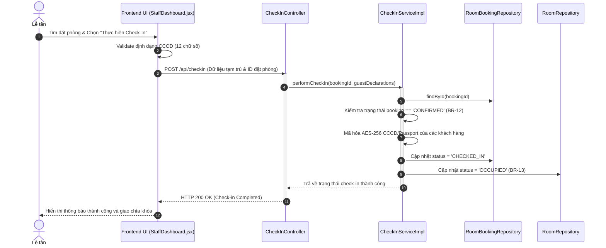

# KẾ HOẠCH THỰC THI MÃ NGUỒN VÀ KIỂM THỬ (EDS & TDD SPECIFICATION)
## Quy trình WF-03: Thủ tục Check-In & Khai báo Tạm trú (Module 2)

| Field                | Value                                               |
| :---------------------| :----------------------------------------------------|
| **Document ID**      | RESORT-M2-IMP-003                                   |
| **Version**          | 1.0                                                 |
| **Date**             | 2026-07-01                                          |
| **Status**           | Approved                                            |
| **Document Owner**   | SWP391 SE2023-G3 Architecture Team                  |
| **Author**           | Pham Anh Tuan                      |
| **Reviewed by**      | SWP391 SE2023-G3 Tech Lead                          |
| **DPO Sign-off**     | [x] Approved — 2026-07-01 — Data Protection Officer |
| **Approved by**      | Principal Architect                                 |
| **Last Review**      | 2026-07-01                                          |
| **Based on EDS/TDD** | EDS v2.0 & TDD v1.0                                 |

---

## CHANGELOG

| Ngày | Người thực hiện | Nội dung thay đổi |
| :--- | :--- | :--- |
| 2026-07-01 | Antigravity | Tạo tài liệu thiết kế kỹ thuật (EDS) và đặc tả kiểm thử (TDD) tích hợp cho WF-03 |

---

## MỤC LỤC

1. [Tổng quan Quy trình (WF-03 Overview)](#1-tổng-quan-quy-trình-wf-03-overview)
2. [Ma trận Truy vết Nghiệp vụ (Traceability Matrix)](#2-ma-trận-truy-vết-nghiệp-vụ-traceability-matrix)
3. [Architecture Decision Records (ADR)](#3-architecture-decision-records-adr)
4. [Yêu cầu Phi chức năng & SLA (NFRs)](#4-yêu-cầu-phi-chức-năng--sla-nfrs)
5. [Mô hình Tĩnh MVC (Static MVC Modeling)](#5-mô-hình-tĩnh-mvc-static-mvc-modeling)
6. [Mô hình Động (Dynamic Modeling)](#6-mô-hình-động-dynamic-modeling)
7. [Đặc tả Interface & Giao thức (Interface Spec)](#7-đặc-tả-interface--giao-thức-interface-spec)
8. [Đặc tả API Endpoints (API Specification)](#8-đặc-tả-api-endpoints-api-specification)
9. [Bảng mã lỗi (Error Codes)](#9-bảng-mã-lỗi-error-codes)
10. [Đặc tả Kiểm thử TDD (TDD Test Design & Cases)](#10-đặc-tả-kiểm-thử-tdd-tdd-test-design--cases)
11. [Entry & Exit Criteria (DoD)](#11-entry--exit-criteria-dod)
12. [Kế hoạch Rollback (Rollback Plan)](#12-kế-hoạch-rollback-rollback-plan)

---

## 1. Tổng quan Quy trình (WF-03 Overview)

Quy trình **WF-03: Thủ tục Check-In & Khai báo Tạm trú** dành cho nhân viên Lễ tân tại resort để thực hiện thủ tục nhận phòng cho khách hàng khi họ đến. Quy trình bao gồm đối chiếu thông tin đặt phòng, thu thập giấy tờ tùy thân (CCCD/Passport) của khách hàng chính và những người đi cùng, mã hóa an toàn dữ liệu này để khai báo tạm trú và cập nhật trạng thái phòng nghỉ từ sẵn sàng sang đang sử dụng (`OCCUPIED`).

| Field | Value |
| :--- | :--- |
| **Module / Bounded Context** | Module 2: Check-In Context / Booking & Accommodation Domain |
| **Data Classification** | Sensitive-PII (Ảnh chụp giấy tờ tùy thân, Số CCCD/Passport) |
| **Compliance Scope** | Luật Cư trú Việt Nam 2020, Nghị định 13/2023/NĐ-CP (Bảo vệ dữ liệu cá nhân) |
| **Upstream Dependencies** | [Room Booking Service](file:///d:/ResortManageNew/05-Development/backend/src/main/java/fu/se/smms/service/impl/BookingServiceImpl.java) (Lấy đặt phòng đã được thanh toán cọc) |
| **Downstream Consumers** | [Villa Status Dashboard](file:///d:/ResortManageNew/05-Development/backend/src/main/java/fu/se/smms/controller/VillaController.java) (Cập nhật sơ đồ trạng thái phòng thời gian thực) |

---

## 2. Ma trận Truy vết Nghiệp vụ (Traceability Matrix)

| Requirement ID | Loại | Mô tả yêu cầu | Thành phần MVC / Code chịu trách nhiệm | Target Compliance | ADR liên quan |
| :--- | :--- | :--- | :--- | :--- | :--- |
| **BR-12** | Business Rule | Chỉ các đơn đặt phòng ở trạng thái `CONFIRMED` mới được phép làm thủ tục check-in. | `CheckInServiceImpl.validateCheckIn()`, `CheckInController` | Xác thực quy trình | ADR-01 |
| **BR-13** | Business Rule | Sau khi check-in thành công, trạng thái Villa vật lý chuyển sang `OCCUPIED` và booking chuyển sang `CHECKED_IN`. | `VillaService.updateStatus()`, `RoomBooking.setStatus()` | Quản lý buồng phòng | ADR-01 |
| **BR-21** | Business Rule | Chỉ nhân viên Lễ tân (`ROLE_RECEPTIONIST`) mới được cấp quyền thực hiện check-in và khai báo tạm trú. | `CheckInController`, `@PreAuthorize("hasRole('RECEPTIONIST')")` | RBAC - Bảo mật | ADR-01 |

---

## 3. Architecture Decision Records (ADR)

*   **ADR-001 (Kiến trúc MVC phân rã)**: React SPA Frontend kết nối Spring Boot REST API Backend qua JWT token.
*   **ADR-002 (Mã hóa CCCD/Passport lưu trú)**: Dữ liệu định danh CCCD/Passport của khách và người đi cùng được mã hóa bằng thuật toán đối xứng AES-256 trước khi ghi vào cơ sở dữ liệu để tuân thủ Luật Cư trú 2020.

---

## 4. Yêu cầu Phi chức năng & SLA (NFRs)

*   **Thời gian phản hồi (Latency)**: API thực thi check-in và cập nhật trạng thái phòng phải hoàn tất trong vòng $p99 < 300\text{ ms}$.
*   **Bảo mật dữ liệu (Security)**: Số định danh cá nhân không được hiển thị nguyên bản trên giao diện nhân viên trừ khi được cấp quyền giải mã tạm thời. Giao thức truyền ảnh định danh phải được ký bảo mật qua S3 pre-signed URL hoặc lưu trữ mã hóa trong thư mục đính kèm bảo mật của server.

---

## 5. Mô hình Tĩnh MVC (Static MVC Modeling)

### 5.1. Thành phần MODEL (Dữ liệu & ORM)

#### Server-Side Model (JPA Entities tại [fu.se.smms.entity](file:///d:/ResortManageNew/05-Development/backend/src/main/java/fu/se/smms/entity))
1.  **RoomBooking**: Chứa thông tin đặt phòng cần check-in.
    *   `bookingId`: Integer (PK)
    *   `status`: String (`CONFIRMED` -> `CHECKED_IN`)
2.  **Room**: Đại diện cho phòng/villa nghỉ dưỡng.
    *   `roomId`: Integer (PK)
    *   `status`: RoomStatus (`AVAILABLE` -> `OCCUPIED`)
3.  **AccompanyingGuest**: Lưu thông tin khách đi cùng (Composition sở hữu bởi `RoomBooking`).
    *   `guestId`: Integer (PK)
    *   `fullName`: String
    *   `identityDocument`: String (Mã hóa AES-256)
    *   `documentType`: String (`CCCD`, `PASSPORT`)
    *   `nationality`: String

#### Client-Side Model (React State tại `frontend/src/pages/StaffDashboard.jsx`)
*   `arrivalsList`: Danh sách các phòng dự kiến check-in trong ngày.
*   `selectedArrival`: Chi tiết đặt phòng đang được tiến hành thủ tục.
*   `guestDeclarations`: Mảng các khách đi kèm cùng thông tin CCCD/Passport nhập liệu.

### 5.2. Thành phần VIEW (Giao diện Hiển thị)
*   **StaffDashboard.jsx**: Bảng điều khiển dành cho Lễ tân, hiển thị danh sách các phòng chuẩn bị check-in (Arrivals).
*   **GuestInfoStep.jsx**: Form nhập thông tin định danh của khách lưu trú chính và khách đi kèm, hỗ trợ validate định dạng CCCD/Passport vật lý.

### 5.3. Thành phần CONTROLLER (Điều phối & Định tuyến)
*   **Server REST Controllers**:
    *   `CheckInController`:
        *   `GET /api/checkin/arrivals`: Lấy danh sách các đơn đã thanh toán cọc và sẵn sàng check-in trong ngày.
        *   `POST /api/checkin`: Gửi dữ liệu check-in gồm ID đặt phòng và thông tin khai báo tạm trú của khách đi cùng.
*   **Client Event Handlers**:
    *   `handleCheckInSubmit`: Gửi HTTP POST request chứa dữ liệu tạm trú được mã hóa qua API Client lên máy chủ.

---

## 6. Mô hình Động (Dynamic Modeling)

### 6.1. Luồng Check-In thành công (Happy Path Sequence)



---

## 7. Đặc tả API Endpoints (API Specification)

### 7.1. Gửi thông tin Check-In
*   **Method**: `POST`
*   **Path**: `/api/checkin`
*   **Auth Level**: JWT Bearer (`ROLE_RECEPTIONIST`)
*   **Payload Request (JSON)**:
    ```json
    {
      "bookingId": 101,
      "guests": [
        {
          "fullName": "Nguyễn Văn A",
          "documentType": "CCCD",
          "identityDocument": "012345678901",
          "nationality": "Vietnam"
        },
        {
          "fullName": "Nguyễn Văn B",
          "documentType": "CCCD",
          "identityDocument": "012345678902",
          "nationality": "Vietnam"
        }
      ]
    }
    ```
*   **Phản hồi thành công (200 OK)**:
    ```json
    {
      "message": "Check-in completed successfully for Booking ID: 101",
      "checkedInTime": "2026-07-01T23:10:00"
    }
    ```

---

## 8. Đặc tả Kiểm thử TDD (TDD Test Design & Cases)

### 8.1. Danh sách Test Cases (TDD Specification)

#### `CHECKIN-TC-001` — Check-in thành công đơn đặt phòng hợp lệ (Happy Path)
*   **Severity**: CRITICAL
*   **Feature under test**: `CheckInServiceImpl.performCheckIn()`
*   **Test File**: [CheckInServiceImplTest.java](file:///d:/ResortManageNew/05-Development/backend/src/test/java/fu/se/smms/service/impl/CheckInServiceImplTest.java)
*   **Hành vi mong đợi**: Trạng thái đơn đặt phòng chuyển thành `CHECKED_IN`, trạng thái phòng chuyển thành `OCCUPIED`.

#### `CHECKIN-TC-002` — Chặn check-in đối với đơn chưa thanh toán đặt cọc (BR-12)
*   **Severity**: HIGH
*   **Feature under test**: `CheckInServiceImpl.performCheckIn()`
*   **Preconditions**: Đơn đặt phòng có `status` = `PENDING_DEPOSIT`.
*   **Hành vi mong đợi**: Ném lỗi `BusinessException` mã `CHECKIN-001` (400 Bad Request) và không thay đổi trạng thái phòng.

#### `CHECKIN-TC-003` — Mã hóa an toàn CCCD/Passport trong DB (Security)
*   **Severity**: CRITICAL
*   **Feature under test**: `CheckInServiceImpl.performCheckIn()`
*   **Hành vi mong đợi**: Trường `identityDocument` trong bảng `accompanying_guest` của database được mã hóa AES-256 hoàn toàn, không hiển thị plaintext.

#### `CHECKIN-TC-004` — Phân quyền thực hiện Check-in (RBAC - BR-21)
*   **Severity**: HIGH
*   **Feature under test**: `CheckInController.performCheckIn()`
*   **Hành vi mong đợi**:
    *   Người dùng có role `RECEPTIONIST` truy cập thành công.
    *   Người dùng có role `CHEF` hoặc `SPECIALIST` bị trả về mã lỗi 403 Forbidden.
