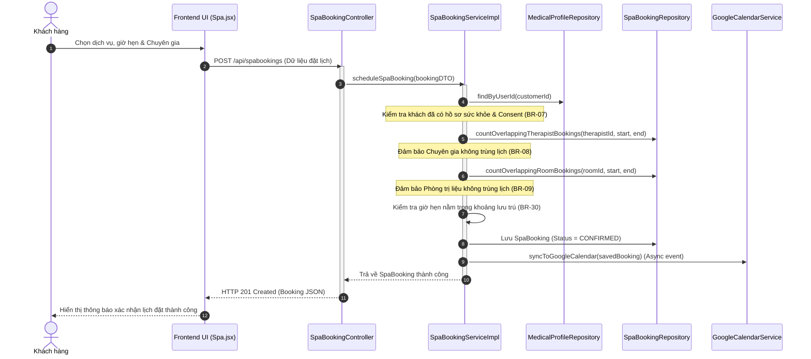

# KẾ HOẠCH THỰC THI MÃ NGUỒN VÀ KIỂM THỬ (EDS & TDD SPECIFICATION)
## Quy trình WF-04: Đặt lịch Trị liệu Spa/Yoga & Điều phối Chuyên gia (Module 3)

| Field                | Value                                               |
| :---------------------| :----------------------------------------------------|
| **Document ID**      | RESORT-M3-IMP-001                                   |
| **Version**          | 1.0                                                 |
| **Date**             | 2026-07-01                                          |
| **Status**           | Approved                                            |
| **Document Owner**   | SWP391 SE2023-G3 Architecture Team                  |
| **Author**           | Nguyen Xuan Dung                     |
| **Reviewed by**      | SWP391 SE2023-G3 Tech Lead                          |
| **DPO Sign-off**     | [x] Approved — 2026-07-01 — Data Protection Officer |
| **Approved by**      | Principal Architect                                 |
| **Last Review**      | 2026-07-01                                          |
| **Based on EDS/TDD** | EDS v2.0 & TDD v1.0                                 |

---

## CHANGELOG

| Ngày | Người thực hiện | Nội dung thay đổi |
| :--- | :--- | :--- |
| 2026-07-01 | Antigravity | Tạo tài liệu thiết kế kỹ thuật (EDS) và đặc tả kiểm thử (TDD) tích hợp cho WF-04 |

---

## MỤC LỤC

1. [Tổng quan Quy trình (WF-04 Overview)](#1-tổng quan-quy-trình-wf-04-overview)
2. [Ma trận Truy vết Nghiệp vụ (Traceability Matrix)](#2-ma-trận-truy-vết-nghiệp-vụ-traceability-matrix)
3. [Architecture Decision Records (ADR)](#3-architecture-decision-records-adr)
4. [Yêu cầu Phi chức năng & SLA (NFRs)](#4-yêu-cầu-phi-chức-năng--sla-nfrs)
5. [Mô hình Tĩnh MVC (Static MVC Modeling)](#5-mô-hình-tĩnh-mvc-static-mvc-modeling)
6. [Mô hình Động (Dynamic Modeling)](#6-mô-hình-động-dynamic-modeling)
7. [Đặc tả Interface & Giao thức (Interface Spec)](#7-đặc-tả-interface--giao-thức-interface-spec)
8. [Đặc tả API Endpoints (API Specification)](#8-đặc-tả-api-endpoints-api-specification)
9. [Bảng mã lỗi (Error Codes)](#9-bảng-mã-lỗi-error-codes)
10. [Đặc tả Kiểm thử TDD (TDD Test Design & Cases)](#10-đặc-tả-kiểm-thử-tdd-tdd-test-design--cases)
11. [Entry & Exit Criteria (DoD)](#11-entry--exit-criteria-dod)
12. [Kế hoạch Rollback (Rollback Plan)](#12-kế-hoạch-rollback-rollback-plan)

---

## 1. Tổng quan Quy trình (WF-04 Overview)

Quy trình **WF-04: Đặt lịch Trị liệu Spa/Yoga & Điều phối Chuyên gia** thực hiện lập lịch cho các dịch vụ chăm sóc sức khỏe tại resort. Hệ thống kiểm tra điều kiện hồ sơ y tế của khách hàng, sau đó chạy Công cụ điều phối (`Specialist Assignment Engine`) để tự động khớp khung giờ trị liệu với Chuyên gia phù hợp đang trống lịch và Phòng trị liệu (`Treatment Room`) đang sẵn có. Sau khi đặt thành công, hệ thống tự động đồng bộ lịch hẹn lên Google Calendar của Chuyên gia và Khách hàng, đồng thời ghi chép hồ sơ chẩn đoán khi phiên trị liệu kết thúc.

| Field | Value |
| :--- | :--- |
| **Module / Bounded Context** | Module 3: Spa & Wellness Scheduling Context |
| **Data Classification** | PII & Health Information (Lịch hẹn dịch vụ, Ghi chú bệnh án phục hồi của Chuyên gia) |
| **Compliance Scope** | Nghị định 13/2023/NĐ-CP (Bảo vệ dữ liệu cá nhân) |
| **Upstream Dependencies** | [Module 1 (Medical Profile)](file:///d:/ResortManageNew/05-Development/backend/src/main/java/fu/se/smms/service/impl/MedicalProfileServiceImpl.java) (Kiểm tra điều kiện consent & hồ sơ bệnh lý), [Module 2 (Room Booking)](file:///d:/ResortManageNew/05-Development/backend/src/main/java/fu/se/smms/service/impl/BookingServiceImpl.java) (Đối chiếu khoảng ngày lưu trú) |
| **Downstream Consumers** | Google Calendar API Integration, [Folio Billing Context](file:///d:/ResortManageNew/05-Development/backend/src/main/java/fu/se/smms/service/impl/InvoiceServiceImpl.java) (Tính tiền lẻ hoặc gộp gói) |

---

## 2. Ma trận Truy vết Nghiệp vụ (Traceability Matrix)

| Requirement ID | Loại | Mô tả yêu cầu | Thành phần MVC / Code chịu trách nhiệm | Target Compliance | ADR liên quan |
| :--- | :--- | :--- | :--- | :--- | :--- |
| **BR-07** | Business Rule | Khách hàng bắt buộc phải hoàn thành hồ sơ sức khỏe & Consent trước khi đặt Spa. | `SpaBookingServiceImpl.scheduleSpaBooking()`, `MedicalProfileRepository` | Pháp lý PII | ADR-01 |
| **BR-08** | Business Rule | Chuyên gia trị liệu không được gán lịch trùng lặp ca trị liệu. | `SpaBookingRepository.countOverlappingTherapistBookings()` | Tối ưu tài nguyên | ADR-01 |
| **BR-09** | Business Rule | Phòng trị liệu không được gán lịch trùng lặp tại cùng một thời điểm. | `SpaBookingRepository.countOverlappingRoomBookings()` | Tối ưu tài nguyên | ADR-01 |
| **BR-30** | Business Rule | Giờ hẹn trị liệu phải nằm trong thời gian Check-in và Check-out của đặt phòng lưu trú. | `SpaBookingServiceImpl.scheduleSpaBooking()`, `RoomBooking` | Lịch trình hợp lệ | ADR-01 |

---

## 3. Architecture Decision Records (ADR)

*   **ADR-001 (Kiến trúc MVC phân rã)**: React SPA giao tiếp Spring Boot REST API qua JWT token.
*   **ADR-004 (Tích hợp Google Calendar Async)**: Quá trình đồng bộ Google Calendar được thực hiện bất đồng bộ (async event) qua dịch vụ message queue / application event để tránh làm tăng độ trễ (latency) của API đặt lịch chính.

---

## 4. Yêu cầu Phi chức năng & SLA (NFRs)

*   **Thời gian phản hồi (Latency)**: API tìm kiếm chuyên gia rảnh và tạo lịch hẹn phải có tốc độ phản hồi $p99 < 300\text{ ms}$.
*   **Độ chính xác lịch (Availability)**: Đảm bảo kiểm tra giao dịch cô lập (Transaction Isolation Level SERIALIZABLE hoặc cơ chế Pessimistic Locking) để tránh lỗi đặt trùng (Double Booking) khi hai khách hàng đặt cùng một Specialist ở cùng một thời điểm.

---

## 5. Mô hình Tĩnh MVC (Static MVC Modeling)

### 5.1. Thành phần MODEL (Dữ liệu & ORM)

#### Server-Side Model (JPA Entities tại [fu.se.smms.entity](file:///d:/ResortManageNew/05-Development/backend/src/main/java/fu/se/smms/entity))
1.  **SpaBooking**: Bản ghi thông tin lịch trị liệu.
    *   `spaBookingId`: Integer (PK)
    *   `startDatetime`: LocalDateTime
    *   `endDatetime`: LocalDateTime
    *   `status`: String (`PENDING`, `CONFIRMED`, `COMPLETED`, `CANCELLED`, `NO_SHOW`)
    *   `priceAtBooking`: BigDecimal
    *   `isPackageIncluded`: Boolean
    *   `customer`: User (Many-to-One)
    *   `specialist`: User (Many-to-One)
    *   `treatmentRoom`: TreatmentRoom (Many-to-One)
2.  **SpaService**: Loại hình trị liệu (Massage, Tắm thuốc, Yoga).
    *   `serviceId`: Integer (PK)
    *   `name`: String
    *   `durationMinutes`: Integer
    *   `price`: BigDecimal
3.  **TreatmentRoom**: Phòng trị liệu vật lý.
    *   `treatmentRoomId`: Integer (PK)
    *   `roomName`: String
    *   `status`: String (`AVAILABLE`, `MAINTENANCE`)

#### Client-Side Model (React State tại `frontend/src/pages/Spa.jsx`)
*   `activeStep`: Trạng thái bước đặt lịch (Chọn dịch vụ -> Chọn chuyên gia & Giờ -> Xác nhận).
*   `availableSlots`: Grid các ca trống hiển thị trên giao diện.

### 5.2. Thành phần VIEW (Giao diện Hiển thị)
*   **Spa.jsx**: Giao diện đặt lịch spa trực quan cho khách hàng chọn dịch vụ, chuyên gia và xem khung giờ trống.
*   **SpecialistDashboard.jsx**: Bảng quản lý dành cho chuyên gia xem ca trực và viết ghi chú chẩn đoán khi hoàn tất buổi.

### 5.3. Thành phần CONTROLLER (Điều phối & Định tuyến)
*   **Server REST Controllers**:
    *   `SpaBookingController`:
        *   `POST /api/spabookings`: Tạo mới lịch đặt Spa.
        *   `GET /api/spabookings/slots`: Lấy danh sách khung giờ trống của chuyên gia/phòng trị liệu.
*   **Client Controller/API Service**:
    *   `handleBookingRequest`: Thu thập dữ liệu UI và gọi API đặt lịch.

---

## 6. Mô hình Động (Dynamic Modeling)

### 6.1. Đặt lịch Spa thành công (Happy Path Sequence)



---

## 7. Đặc tả API Endpoints (API Specification)

### 7.1. Đặt lịch hẹn Spa mới
*   **Method**: `POST`
*   **Path**: `/api/spabookings`
*   **Auth Level**: JWT Bearer (`ROLE_CUSTOMER`, `ROLE_RECEPTIONIST`)
*   **Payload Request (JSON)**:
    ```json
    {
      "customerId": 15,
      "serviceId": 5,
      "specialistId": 8,
      "treatmentRoomId": 2,
      "startDatetime": "2026-07-12T09:00:00",
      "endDatetime": "2026-07-12T10:00:00",
      "isPackageIncluded": true
    }
    ```
*   **Phản hồi thành công (201 Created)**:
    ```json
    {
      "spaBookingId": 201,
      "status": "CONFIRMED",
      "startDatetime": "2026-07-12T09:00:00",
      "endDatetime": "2026-07-12T10:00:00",
      "priceAtBooking": 500000.0,
      "isPackageIncluded": true
    }
    ```

---

## 8. Đặc tả Kiểm thử TDD (TDD Test Design & Cases)

### 8.1. Danh sách Test Cases (TDD Specification)

#### `SPA-TC-001` — Chặn đặt lịch nếu khách chưa hoàn thành hồ sơ y tế & Consent (BR-07)
*   **Severity**: CRITICAL
*   **Feature under test**: `SpaBookingServiceImpl.scheduleSpaBooking()`
*   **Test File**: `fu.se.smms.service.impl.SpaBookingServiceImplTest`
*   **Hành vi mong đợi**: Ném lỗi `BusinessException` mã `SPA-001` (400 Bad Request) do thiếu Explicit Consent.

#### `SPA-TC-002` — Chặn gán chuyên gia trùng lịch (BR-08)
*   **Severity**: CRITICAL
*   **Feature under test**: `SpaBookingServiceImpl.scheduleSpaBooking()`
*   **Preconditions**: Chuyên gia ID = 8 đã có lịch hẹn từ `09:00` đến `10:00`.
*   **Hành vi mong đợi**: Đặt lịch từ `09:30` đến `10:30` ném lỗi `BusinessException` mã `SPA-002` (409 Conflict).

#### `SPA-TC-003` — Chặn đặt lịch ngoài khoảng ngày nghỉ dưỡng (BR-30)
*   **Severity**: HIGH
*   **Feature under test**: `SpaBookingServiceImpl.scheduleSpaBooking()`
*   **Preconditions**: Khách đặt phòng từ `2026-07-10` đến `2026-07-15`.
*   **Hành vi mong đợi**: Đặt lịch Spa vào ngày `2026-07-17` ném lỗi `BusinessException` mã `SPA-004` (400 Bad Request).
