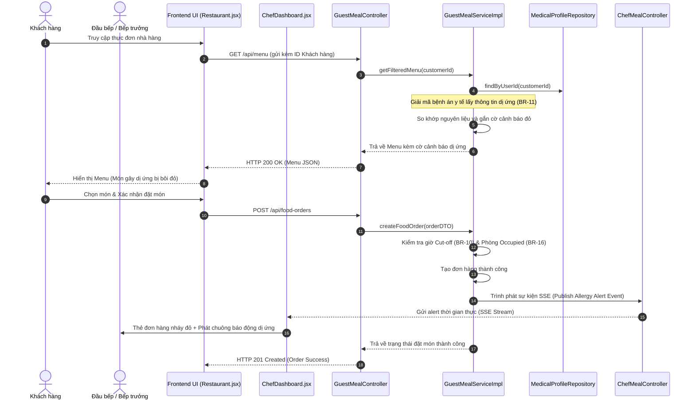

# KẾ HOẠCH THỰC THI MÃ NGUỒN VÀ KIỂM THỬ (EDS & TDD SPECIFICATION)
## Quy trình WF-05: Đặt món ăn ẩm thực trị liệu & Cảnh báo Dị ứng (Module 4)

| Field | Value |
| :--- | :--- |
| **Document ID** | RESORT-M4-IMP-001 |
| **Version** | 1.0 |
| **Date** | 2026-07-01 |
| **Status** | Approved |
| **Document Owner** | SWP391 SE2023-G3 Architecture Team |
| **Author** | Antigravity AI Pair Programmer |
| **Reviewed by** | SWP391 SE2023-G3 Tech Lead |
| **DPO Sign-off** | [x] Approved — 2026-07-01 — Data Protection Officer |
| **Approved by** | Principal Architect |
| **Last Review** | 2026-07-01 |
| **Based on EDS/TDD** | EDS v2.0 & TDD v1.0 |

---

## CHANGELOG

| Ngày | Người thực hiện | Nội dung thay đổi |
| :--- | :--- | :--- |
| 2026-07-01 | Antigravity | Tạo tài liệu thiết kế kỹ thuật (EDS) và đặc tả kiểm thử (TDD) tích hợp cho WF-05 |

---

## MỤC LỤC

1. [Tổng quan Quy trình (WF-05 Overview)](#1-tổng-quan-quy-trình-wf-05-overview)
2. [Ma trận Truy vết Nghiệp vụ (Traceability Matrix)](#2-ma-trận-truy-vết-nghiệp-vụ-traceability-matrix)
3. [Architecture Decision Records (ADR)](#3-architecture-decision-records-adr)
4. [Yêu cầu Phi chức năng & SLA (NFRs)](#4-yêu-cầu-phi-chức-năng--sla-nfrs)
5. [Mô hình Tĩnh MVC (Static MVC Modeling)](#5-mô-hình-tĩnh-mvc-static-mvc-modeling)
6. [Mô hình Động (Dynamic Modeling)](#6-mô-hình-động-dynamic-modeling)
7. [Đặc tả Interface & Giao thức (Interface Spec)](#7-đặc-tả-interface--giao-thức-interface-spec)
8. [Đặc tả API Endpoints (API Specification)](#8-đặc-tả-api-endpoints-api-specification)
9. [Bảng mã lỗi (Error Codes)](#9-bảng-mã-lỗi-error-codes)
10. [Đặc tả Kiểm thử TDD (TDD Test Design & Cases)](#10-đặc-tả-kiểm-thử-tdd-tdd-test-design--cases)
11. [Entry & Exit Criteria (DoD)](#11-entry--exit-criteria-dod)
12. [Kế hoạch Rollback (Rollback Plan)](#12-kế-hoạch-rollback-rollback-plan)

---

## 1. Tổng quan Quy trình (WF-05 Overview)

Quy trình **WF-05: Đặt món ăn ẩm thực trị liệu & Cảnh báo Dị ứng** phụ trách quản lý luồng đặt món ăn dinh dưỡng an toàn cho sức khỏe của khách hàng. Hệ thống tự động đối chiếu các chất gây dị ứng trong hồ sơ y tế của khách hàng với thành phần nguyên liệu của từng món ăn trong thực đơn để đưa ra cảnh báo đỏ hiển thị trên giao diện của khách. Khi đơn hàng chứa món ăn có nguy cơ dị ứng được gửi đi, hệ thống kích hoạt cảnh báo khẩn cấp thời gian thực (SSE/Websocket) trên màn hình của bếp trưởng để chuẩn bị khu vực chế biến riêng biệt, tránh lây nhiễm chéo dị ứng nguyên.

| Field | Value |
| :--- | :--- |
| **Module / Bounded Context** | Module 4: Food & Beverage (Dining) Context |
| **Data Classification** | PII & Health Alert Info (Dị ứng món ăn, Chi tiết đơn hàng ẩm thực) |
| **Compliance Scope** | Tiêu chuẩn Vệ sinh An toàn Thực phẩm & Luật An toàn Sức khỏe Khách hàng |
| **Upstream Dependencies** | [Module 1 (Medical Profile)](file:///d:/ResortManageNew/05-Development/backend/src/main/java/fu/se/smms/service/impl/MedicalProfileServiceImpl.java) (Lấy thông tin chất gây dị ứng được giải mã), [Module 2 (Room Booking)](file:///d:/ResortManageNew/05-Development/backend/src/main/java/fu/se/smms/service/impl/BookingServiceImpl.java) (Xác định phòng check-in hoạt động) |
| **Downstream Consumers** | [Folio Billing Context](file:///d:/ResortManageNew/05-Development/backend/src/main/java/fu/se/smms/service/impl/InvoiceServiceImpl.java) (Cộng dồn chi phí món ngoài gói vào Hóa đơn tổng hợp) |

---

## 2. Ma trận Truy vết Nghiệp vụ (Traceability Matrix)

| Requirement ID | Loại | Mô tả yêu cầu | Thành phần MVC / Code chịu trách nhiệm | Target Compliance | ADR liên quan |
| :--- | :--- | :--- | :--- | :--- | :--- |
| **BR-10** | Business Rule | Khách phải chọn món ăn trước giờ Cut-off quy định (với món đặt trước trong gói). | `GuestMealServiceImpl.validateCutoffTime()`, `SystemConfiguration` | Hiệu năng vận hành | ADR-01 |
| **BR-11** | Business Rule | Hệ thống hiển thị cảnh báo dị ứng thực phẩm thời gian thực dựa trên hồ sơ khách hàng. | `GuestMealServiceImpl.getFilteredMenu()`, `MedicalProfile` | An toàn sức khỏe | ADR-01 |
| **BR-16** | Business Rule | Chỉ phòng có trạng thái đã nhận phòng (`OCCUPIED`) mới được gọi món lẻ ngoài gói. | `GuestMealServiceImpl.createFoodOrder()`, `Room.getStatus()` | Kiểm soát thất thoát | ADR-01 |
| **SSE-01** | Technical Rule | Kích hoạt cảnh báo bếp thời gian thực qua giao thức Server-Sent Events (SSE). | `ChefMealController`, `ChefDashboard.jsx` | Phản hồi khẩn cấp | ADR-01 |

---

## 3. Architecture Decision Records (ADR)

*   **ADR-001 (Kiến trúc MVC phân rã)**: React SPA Frontend kết nối Spring Boot REST API Backend qua JWT token.
*   **Websocket vs SSE (Quyết định kiến trúc)**: Lựa chọn Server-Sent Events (SSE) cho luồng đẩy cảnh báo dị ứng từ Backend xuống Chef Dashboard ở Frontend do tính chất luồng truyền dữ liệu một chiều (server-to-client) nhẹ nhàng, dễ bảo trì và có cơ chế tự động kết nối lại (auto-reconnect) mặc định của trình duyệt.

---

## 4. Yêu cầu Phi chức năng & SLA (NFRs)

*   **Thời gian truyền tin (SSE Latency)**: Cảnh báo dị ứng phải được truyền từ lúc khách ấn đặt món đến khi màn hình của đầu bếp nhấp nháy đỏ dưới $1\text{ giây}$.
*   **Tính khả dụng (Availability)**: Trình duyệt tại quầy bếp trưởng phải duy trì kết nối SSE liên tục. Hệ thống có cơ chế heartbeat phát mỗi 15 giây để giữ kết nối không bị timeout.

---

## 5. Mô hình Tĩnh MVC (Static MVC Modeling)

### 5.1. Thành phần MODEL (Dữ liệu & ORM)

#### Server-Side Model (JPA Entities tại [fu.se.smms.entity](file:///d:/ResortManageNew/05-Development/backend/src/main/java/fu/se/smms/entity))
1.  **FoodMenu**: Danh mục các món ăn.
    *   `foodId`: Integer (PK)
    *   `dishName`: String
    *   `description`: String
    *   `price`: BigDecimal
    *   `dietaryTags`: String (Danh sách các chất gây dị ứng đi kèm, ví dụ: `PEANUT,SEAFOOD`)
2.  **FoodOrder**: Bản ghi đơn đặt món ăn.
    *   `orderId`: Integer (PK)
    *   `orderTime`: LocalDateTime
    *   `status`: String (`PENDING`, `PREPARING`, `READY`, `DELIVERED`, `CANCELLED`)
    *   `totalAmount`: BigDecimal
    *   `origin`: String (`ROOM_SERVICE`, `RESTAURANT`)
3.  **FoodOrderDetail**: Chi tiết các món trong đơn hàng.
    *   `orderDetailId`: Integer (PK)
    *   `foodOrder`: FoodOrder (Many-to-One)
    *   `foodMenu`: FoodMenu (Many-to-One)
    *   `quantity`: Integer
    *   `isPackageIncluded`: Boolean

#### Client-Side Model (React State tại `frontend/src/pages/Restaurant.jsx`)
*   `allergyWarningList`: Mảng các ID món chứa nguyên liệu dị ứng của khách để gắn nhãn đỏ cảnh báo.
*   `cartItems`: Danh sách các món ăn khách đã chọn vào giỏ hàng.

### 5.2. Thành phần VIEW (Giao diện Hiển thị)
*   **Restaurant.jsx**: Trang đặt món ăn của khách, hiển thị nhãn dị ứng và cảnh báo đỏ nếu món chứa chất gây dị ứng.
*   **ChefDashboard.jsx**: Giao diện hiển thị các đơn hàng của bếp, thẻ đơn hàng có viền nhấp nháy đỏ kèm âm thanh chuông báo động nếu phát hiện món chứa dị ứng.

### 5.3. Thành phần CONTROLLER (Điều phối & Định tuyến)
*   **Server REST Controllers**:
    *   `GuestMealController`: Xử lý `/api/menu` (GET) và `/api/food-orders` (POST).
    *   `ChefMealController`: Xử lý `/api/chef/orders` (GET), `/api/chef/orders/status` (PUT) và đăng ký luồng `/api/chef/alerts/sse`.

---

## 6. Mô hình Động (Dynamic Modeling)

### 6.1. Đặt món và Cảnh báo Dị ứng (Happy Path Sequence)



---

## 7. Đặc tả API Endpoints (API Specification)

### 7.1. Đăng ký luồng sự kiện SSE dành cho nhà bếp
*   **Method**: `GET`
*   **Path**: `/api/chef/alerts/sse`
*   **Auth Level**: JWT Bearer (`ROLE_CHEF`)
*   **Phản hồi thành công (200 OK - Stream)**:
    *   Header: `Content-Type: text/event-stream`
    *   Payload Event:
        ```json
        {
          "event": "allergy-warning",
          "data": {
            "orderId": 501,
            "roomNumber": "Villa-103",
            "guestName": "Nguyễn Văn A",
            "allergens": ["PEANUT"],
            "dishes": ["Súp gà cốt dừa lạc rang"]
          }
        }
        ```

---

## 8. Đặc tả Kiểm thử TDD (TDD Test Design & Cases)

### 8.1. Danh sách Test Cases (TDD Specification)

#### `DINING-TC-001` — Tự động gắn nhãn dị ứng món ăn chính xác (BR-11)
*   **Severity**: CRITICAL
*   **Feature under test**: `GuestMealServiceImpl.getFilteredMenu()`
*   **Preconditions**: Hồ sơ y tế của khách hàng ghi nhận dị ứng `SEAFOOD`. Thực đơn có món `Tôm hùm nướng phô mai` chứa tag nguyên liệu `SEAFOOD`.
*   **Hành vi mong đợi**: Món `Tôm hùm nướng phô mai` trong danh sách trả về của API phải được gán trường `allergyWarning = true`.

#### `DINING-TC-002` — Chặn đặt món sau giờ Cut-off quy định (BR-10)
*   **Severity**: HIGH
*   **Feature under test**: `GuestMealServiceImpl.createFoodOrder()`
*   **Preconditions**: Giờ Cut-off đặt món trước là `17:00` hàng ngày. Khách đặt món vào lúc `17:05`.
*   **Hành vi mong đợi**: Ném lỗi `BusinessException` mã `DINING-001` (400 Bad Request) và từ chối tạo đơn.

#### `DINING-TC-003` — Chặn gọi món phụ phí ngoài gói nếu phòng chưa Check-in (BR-16)
*   **Severity**: HIGH
*   **Feature under test**: `GuestMealServiceImpl.createFoodOrder()`
*   **Preconditions**: Phòng ID = 3 có status = `AVAILABLE` (chưa có khách ở).
*   **Hành vi mong đợi**: Yêu cầu gọi thêm món phụ phí ngoài gói ném lỗi `BusinessException` mã `DINING-002` (403 Forbidden).
