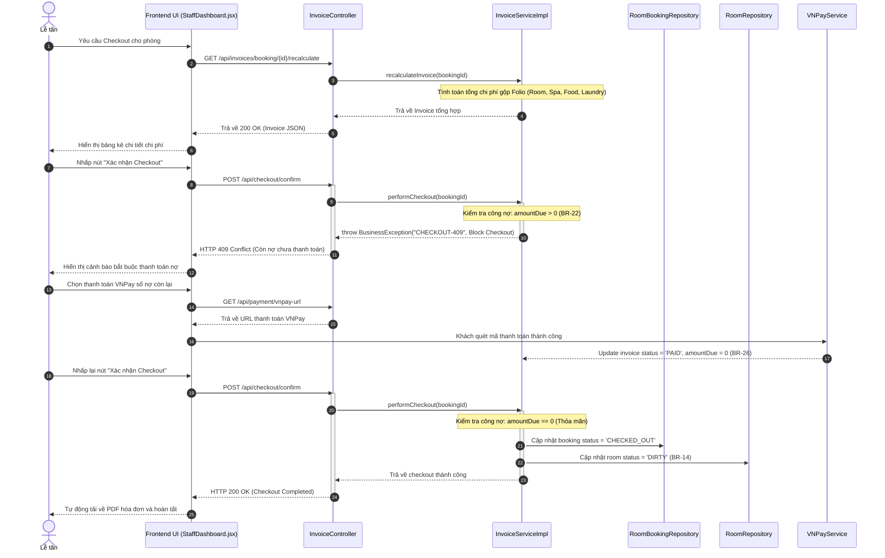

# KẾ HOẠCH THỰC THI MÃ NGUỒN VÀ KIỂM THỬ (EDS & TDD SPECIFICATION)
## Quy trình WF-06: Hóa đơn Tổng hợp & Làm thủ tục Trả phòng (Module 5)

| Field                | Value                                               |
| :---------------------| :----------------------------------------------------|
| **Document ID**      | RESORT-M5-IMP-001                                   |
| **Version**          | 1.0                                                 |
| **Date**             | 2026-07-01                                          |
| **Status**           | Approved                                            |
| **Document Owner**   | SWP391 SE2023-G3 Architecture Team                  |
| **Author**           | All Team 3                                          |
| **Reviewed by**      | SWP391 SE2023-G3 Tech Lead                          |
| **DPO Sign-off**     | [x] Approved — 2026-07-01 — Data Protection Officer |
| **Approved by**      | Principal Architect                                 |
| **Last Review**      | 2026-07-01                                          |
| **Based on EDS/TDD** | EDS v2.0 & TDD v1.0                                 |

---

## CHANGELOG

| Ngày | Người thực hiện | Nội dung thay đổi |
| :--- | :--- | :--- |
| 2026-07-01 | Antigravity | Tạo tài liệu thiết kế kỹ thuật (EDS) và đặc tả kiểm thử (TDD) tích hợp cho WF-06 |

---

## MỤC LỤC

1. [Tổng quan Quy trình (WF-06 Overview)](#1-tổng-quan-quy-trình-wf-06-overview)
2. [Ma trận Truy vết Nghiệp vụ (Traceability Matrix)](#2-ma-trận-truy-vết-nghiệp-vụ-traceability-matrix)
3. [Architecture Decision Records (ADR)](#3-architecture-decision-records-adr)
4. [Yêu cầu Phi chức năng & SLA (NFRs)](#4-yêu-cầu-phi-chức-năng--sla-nfrs)
5. [Mô hình Tĩnh MVC (Static MVC Modeling)](#5-mô-hình-tĩnh-mvc-static-mvc-modeling)
6. [Mô hình Động (Dynamic Modeling)](#6-mô-hình-động-dynamic-modeling)
7. [Đặc tả Interface & Giao thức (Interface Spec)](#7-đặc-tả-interface--giao-thức-interface-spec)
8. [Đặc tả API Endpoints (API Specification)](#8-đặc-tả-api-endpoints-api-specification)
9. [Bảng mã lỗi (Error Codes)](#9-bảng-mã-lỗi-error-codes)
10. [Đặc tả Kiểm thử TDD (TDD Test Design & Cases)](#10-đặc-tả-kiểm-thử-tdd-tdd-test-design--cases)
11. [Entry & Exit Criteria (DoD)](#11-entry--exit-criteria-dod)
12. [Kế hoạch Rollback (Rollback Plan)](#12-kế-hoạch-rollback-rollback-plan)

---

## 1. Tổng quan Quy trình (WF-06 Overview)

Quy trình **WF-06: Hóa đơn Tổng hợp & Làm thủ tục Trả phòng** chịu trách nhiệm hoàn tất chu kỳ lưu trú của khách hàng. Nó bao gồm tính toán gộp toàn bộ chi phí phát sinh trong kỳ lưu trú (Folio Ledger gồm: tiền phòng thực tế, tiền dịch vụ spa vượt hạn mức, tiền gọi món ngoài gói, tiền dịch vụ phụ thu như mini-bar, giặt là), thực hiện đối chiếu công nợ để chặn check-out nếu còn nợ (`amount_due > 0`), thanh toán dư nợ qua VNPay, xuất hóa đơn giấy/PDF tiếng Việt hỗ trợ UTF-8 và chuyển trạng thái phòng sang cần dọn dẹp (`DIRTY`).

| Field | Value |
| :--- | :--- |
| **Module / Bounded Context** | Module 5: Invoice & Checkout Context / Billing Domain |
| **Data Classification** | PII & Auditable Financial Data (Hóa đơn consolidated folio, Giao dịch thanh toán) |
| **Compliance Scope** | Tiêu chuẩn Kế toán Khách sạn (AHLEI Folio Standard), Luật Kế toán Việt Nam |
| **Upstream Dependencies** | [Module 2 (Room Booking)](file:///d:/ResortManageNew/05-Development/backend/src/main/java/fu/se/smms/service/impl/BookingServiceImpl.java) (Lấy thông tin đêm lưu trú), [Module 3 (Spa Booking)](file:///d:/ResortManageNew/05-Development/backend/src/main/java/fu/se/smms/service/impl/SpaBookingServiceImpl.java) (Lấy lịch spa vượt hạn mức), [Module 4 (F&B Orders)](file:///d:/ResortManageNew/05-Development/backend/src/main/java/fu/se/smms/service/impl/GuestMealServiceImpl.java) (Lấy tiền ăn ngoài gói) |
| **Downstream Consumers** | [Villa Cleanliness Management](file:///d:/ResortManageNew/05-Development/backend/src/main/java/fu/se/smms/controller/VillaController.java) (Nhận tín hiệu phòng `DIRTY` để phân ca dọn dẹp) |

---

## 2. Ma trận Truy vết Nghiệp vụ (Traceability Matrix)

| Requirement ID | Loại | Mô tả yêu cầu | Thành phần MVC / Code chịu trách nhiệm | Target Compliance | ADR liên quan |
| :--- | :--- | :--- | :--- | :--- | :--- |
| **BR-14** | Business Rule | Sau khi hoàn tất check-out, trạng thái phòng lập tức chuyển sang `DIRTY`. | `InvoiceServiceImpl.performCheckout()`, `Room` | Quy trình buồng phòng | ADR-01, ADR-003 |
| **BR-15** | Business Rule | Hóa đơn tự động đối chiếu và tổng hợp thông qua Room_Booking_ID trung tâm. | `InvoiceServiceImpl.createInvoice()`, `Invoice` | AHLEI Folio standard | ADR-01 |
| **BR-22** | Business Rule | Chặn hoàn tất check-out trên hệ thống nếu hóa đơn còn nợ (`amount_due > 0`). | `InvoiceServiceImpl.performCheckout()` | Quản trị doanh thu | ADR-01 |
| **BR-26** | Business Rule | Lịch sử giao dịch tài chính đã thanh toán là bất biến (immutable - không được phép sửa đổi/xóa). | `PaymentTransactionLogRepository`, `PaymentTransactionLog` | Luật Kế toán | ADR-01 |
| **BR-27** | Business Rule | Doanh thu bóc tách chính xác theo nguồn thu: Room Package, Spa, F&B. | `RevenueServiceImpl.getRevenueDashboard()` | Báo cáo tài chính | ADR-01 |

---

## 3. Architecture Decision Records (ADR)

*   **ADR-001 (Kiến trúc MVC phân rã)**: React SPA giao tiếp REST API qua JWT token.
*   **ADR-003 (Immutable Audit Trail)**: Bản ghi giao dịch thanh toán trong bảng `payment_transaction_log` được cấu hình append-only. Không cấp API Update hay Delete cho bảng này. Mọi thay đổi tài chính phải thực hiện bằng bản ghi bù trừ (Reversal/Credit Note).

---

## 4. Yêu cầu Phi chức năng & SLA (NFRs)

*   **Thời gian phản hồi (Latency)**: API tính toán lại hóa đơn tổng hợp (Recalculate Folio) phải hoàn tất dưới $p99 < 300\text{ ms}$.
*   **Xuất tài liệu (PDF SLA)**: API xuất file PDF hóa đơn tiếng Việt UTF-8 phải có kích thước tối ưu (dưới 100KB) và thời gian xuất dưới 1.5 giây.

---

## 5. Mô hình Tĩnh MVC (Static MVC Modeling)

### 5.1. Thành phần MODEL (Dữ liệu & ORM)

#### Server-Side Model (JPA Entities tại [fu.se.smms.entity](file:///d:/ResortManageNew/05-Development/backend/src/main/java/fu/se/smms/entity))
1.  **Invoice**: Hóa đơn Folio tổng hợp.
    *   `invoiceId`: Integer (PK)
    *   `roomSubtotal`: BigDecimal (Đơn giá phòng x số đêm)
    *   `spaSubtotal`: BigDecimal (Tiền dịch vụ spa tính lẻ/vượt hạn mức)
    *   `foodSubtotal`: BigDecimal (Tiền ăn ngoài thực đơn gói)
    *   `serviceSubtotal`: BigDecimal (Chi phí dịch vụ phát sinh giặt là, mini-bar)
    *   `taxAndFees`: BigDecimal
    *   `finalAmount`: BigDecimal (Tổng cộng hóa đơn)
    *   `depositAmount`: BigDecimal (Đã trừ đặt cọc)
    *   `amountDue`: BigDecimal (Còn lại phải trả)
    *   `status`: String (`UNPAID`, `PAID`)
2.  **PaymentTransactionLog**: Nhật ký thanh toán.
    *   `logId`: Integer (PK)
    *   `txnRef`: String (Mã giao dịch đối chiếu)
    *   `amount`: BigDecimal
    *   `status`: String (`SUCCESS`, `FAILED`)
3.  **IncurredService**: Dịch vụ phát sinh thực tế.
    *   `id`: Integer (PK)
    *   `roomNumber`: String
    *   `category`: String (`LAUNDRY`, `MINIBAR`)
    *   `price`: BigDecimal

#### Client-Side Model (React State tại `frontend/src/pages/StaffDashboard.jsx` - Checkout Tab)
*   `invoiceDetail`: Đối tượng hóa đơn tổng hợp đang hiển thị.
*   `billingItems`: Danh sách chi tiết các khoản phí (Room, Spa, F&B, Laundry).

### 5.2. Thành phần VIEW (Giao diện Hiển thị)
*   **StaffDashboard.jsx (Checkout Tab)**: Bảng kê chi tiết hóa đơn (Folio Ledger) hiển thị các khoản thu và nút "Xác nhận Checkout".
*   **Payment.jsx**: Giao diện quét mã QR/VNPay thanh toán nợ.

### 5.3. Thành phần CONTROLLER (Điều phối & Định tuyến)
*   **Server REST Controllers**:
    *   `InvoiceController`:
        *   `GET /api/invoices/booking/{id}/recalculate`: Tính toán lại Folio hóa đơn.
        *   `POST /api/checkout/confirm`: Chạy nghiệp vụ hoàn tất checkout.
        *   `GET /api/invoices/{id}/pdf`: Trả về luồng file PDF hóa đơn.

---

## 6. Mô hình Động (Dynamic Modeling)

### 6.1. Thủ tục Trả phòng và Thanh toán (Sequence Diagram)



---

## 7. Đặc tả API Endpoints (API Specification)

### 7.1. Xác nhận Checkout phòng
*   **Method**: `POST`
*   **Path**: `/api/checkout/confirm`
*   **Auth Level**: JWT Bearer (`ROLE_RECEPTIONIST`)
*   **Payload Request (JSON)**:
    ```json
    {
      "bookingId": 101
    }
    ```
*   **Phản hồi thành công (200 OK)**:
    ```json
    {
      "message": "Checkout finalized successfully. Room status set to DIRTY.",
      "checkoutTime": "2026-07-01T23:11:00"
    }
    ```

---

## 8. Đặc tả Kiểm thử TDD (TDD Test Design & Cases)

### 8.1. Danh sách Test Cases (TDD Specification)

#### `INVOICE-TC-001` — Chặn Checkout khi hóa đơn chưa thanh toán hết (BR-22)
*   **Severity**: CRITICAL
*   **Feature under test**: `InvoiceServiceImpl.performCheckout()`
*   **Test File**: [InvoiceServiceImplTest.java](file:///d:/ResortManageNew/05-Development/backend/src/test/java/fu/se/smms/service/impl/InvoiceServiceImplTest.java)
*   **Preconditions**: Hóa đơn có `amountDue` = `3,500,000` VND.
*   **Hành vi mong đợi**: Ném lỗi `BusinessException` mã `CHECKOUT-409` và giữ nguyên trạng thái booking là `CHECKED_IN`.

#### `INVOICE-TC-002` — Hoàn tất Checkout thành công và đổi trạng thái Villa (BR-14)
*   **Severity**: CRITICAL
*   **Feature under test**: `InvoiceServiceImpl.performCheckout()`
*   **Preconditions**: Hóa đơn có `amountDue` = `0` (Đã thanh toán hết).
*   **Hành vi mong đợi**: Đơn đặt phòng cập nhật status thành `CHECKED_OUT`, Villa tương ứng cập nhật status thành `DIRTY`.

#### `INVOICE-TC-003` — Lưu vết giao dịch bất biến (Audit Trail - BR-26)
*   **Severity**: HIGH
*   **Feature under test**: `PaymentTransactionLogRepository.save()`
*   **Hành vi mong đợi**: Không có bất kỳ API/Method nào cho phép sửa đổi (`Update`) hoặc xóa (`Delete`) dữ liệu trong bảng `payment_transaction_log`.
