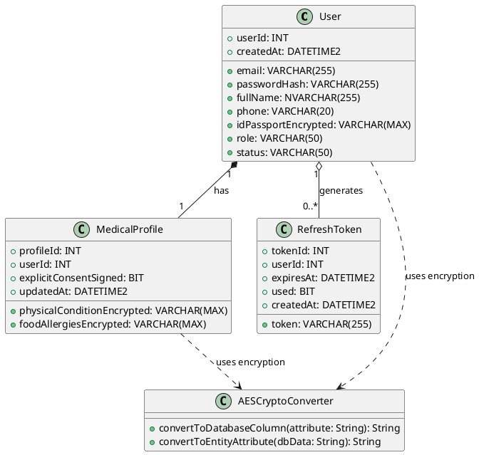
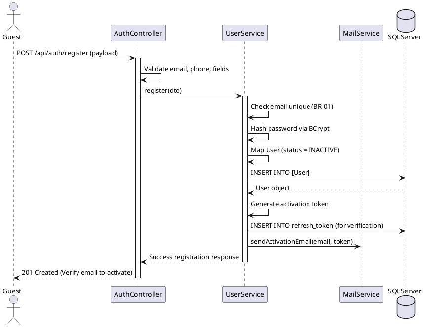
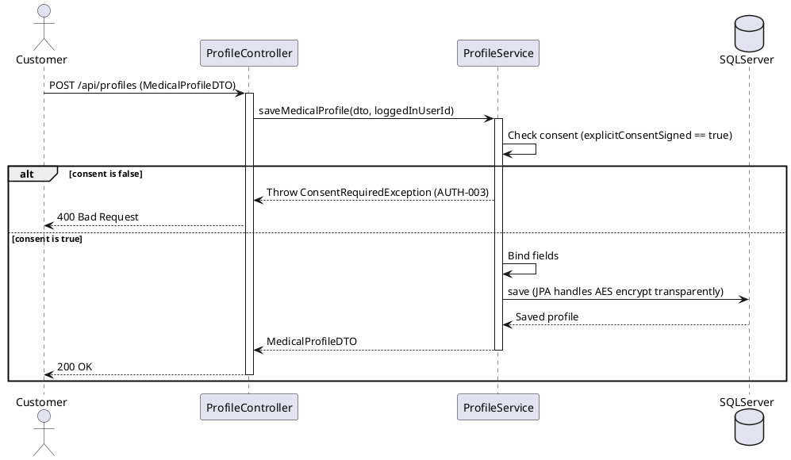
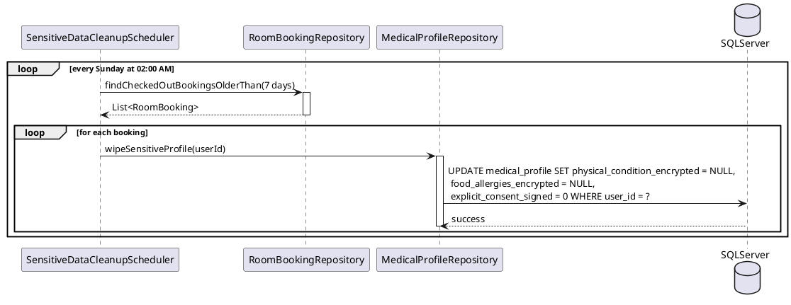

# ENGINEERING DOCUMENTATION STANDARD (EDS) v2.0 - MODULE 1
## Specification for Authentication & Sensitive Health Profile

* **Document ID:** SMMS-AUTH-IMP-001
* **Version:** 1.0
* **Date:** 2026-06-11
* **Status:** Approved
* **Document Owner:** Student 1 - Full-stack Engineer
* **Author:** Hoang Tuan Anh
* **DPO Sign-off:** [ ] Pending (Requires check for sensitive PII)
* **Approved by:** Pham Anh Tuan
* **Last Review:** 2026-06-11
* **Based on EDS:** v2.0

---

### CHANGELOG

| Ngày | Người thực hiện | Nội dung thay đổi |
| :--- | :--- | :--- |
| 2026-06-11 | Student 1 / Codex | Khởi tạo tài liệu - Thiết kế chi tiết cho Module 1: Auth & Sensitive Health Profile |

---

## MỤC LỤC
1. [Tổng quan Module](#1-tổng-quan-module)
2. [Ma trận Truy vết (Traceability Matrix)](#2-ma-trận-truy-vết-traceability-matrix)
3. [Architecture Decision Records (ADR)](#3-architecture-decision-records-adr)
4. [Non-Functional Requirements & SLA](#4-non-functional-requirements--sla)
5. [Static Modeling (Mô hình Tĩnh)](#5-static-modeling-mô-hình-tĩnh)
6. [Dynamic Modeling (Mô hình Động)](#6-dynamic-modeling-mô-hình-động)
7. [Domain Event Catalog](#7-domain-event-catalog)
8. [Interface Specification (Đặc tả Giao diện)](#8-interface-specification-đặc-tả-giao-diện)
9. [API Specification](#9-api-specification)
10. [Bảng mã lỗi (Error Codes)](#10-bảng-mã-lỗi-error-codes)
11. [Quy trình Triển khai (Step-by-Step)](#11-quy-trình-triển-khai-step-by-step)
12. [Rollback & Incident Runbook](#12-rollback--incident-runbook)
13. [Kịch bản Kiểm thử Chi tiết](#13-kịch-bản-kiểm-thử-chi-tiết)
14. [Phương pháp Xác minh](#14-phương-pháp-xác-minh)
15. [Mẫu thử thực tế (API Verification Samples)](#15-mẫu-thử-thực-tế-api-verification-samples)
16. [Bảng tổng hợp phân quyền (Authorization Matrix)](#16-bảng-tổng-hợp-phân-quyền-authorization-matrix)
17. [Phụ lục](#phụ-lục)

---

## 1. Tổng quan Module

Module 1 chịu trách nhiệm thiết lập nền tảng bảo mật cho hệ thống **NSRMS** (Ngu Son Resort & Spa Management System). Module này bao gồm việc quản lý tài khoản người dùng, đăng ký, đăng nhập SSO qua Google/Facebook, quản lý hồ sơ bệnh lý và dị ứng thực phẩm nhạy cảm dưới dạng mã hóa tại cơ sở dữ liệu để tuân thủ Nghị định 13/2023/NĐ-CP (Decree 356/2025/ND-CP), phân quyền chặt chẽ theo vai trò (RBAC), và quản trị các bảng Master Data cốt lõi của resort.

| Field | Value |
| :--- | :--- |
| **Module Name** | Authentication & Sensitive Health Profile |
| **Bounded Context** | User management, security, master data, privacy consent |
| **Data Classification** | Sensitive-PII / PII / Confidential |
| **Compliance Scope** | Decree 13/2023/NĐ-CP (Decree 356/2025/ND-CP), Residence Law 2020 |
| **Upstream Dependencies** | None |
| **Downstream Consumers** | Module 2 (Booking & Guest Declaration), Module 3 (Spa Scheduling), Module 4 (Dietary F&B), Module 5 (Folio Billing) |

---

## 2. Ma trận Truy vết (Traceability Matrix)

| Requirement ID | Loại (BR/ADR/US) | Mô tả yêu cầu | Thành phần Code | Compliance Target | ADR liên quan |
| :--- | :--- | :--- | :--- | :--- | :--- |
| **BR-01** | Business Rule | Mỗi địa chỉ email chỉ đăng ký duy nhất 1 tài khoản. | `User.email` UNIQUE constraint, `UserServiceImpl.register()` | Data integrity | — |
| **BR-02** | Business Rule | Khách đăng ký truyền thống phải xác thực email trước khi book phòng/dịch vụ. | `User.status` = `INACTIVE` -> `ACTIVE` qua `AuthService.verifyEmailToken()` | Account integrity | — |
| **UC01** | Use Case | Đăng ký & Đăng nhập truyền thống + Google SSO. | `AuthenticationController.login()`, `loginSSO()` | User experience | — |
| **UC02** | Use Case | Khai báo sức khỏe & Dị ứng. Hộp chọn đồng ý (Consent) trống mặc định. | `medical_profile.explicit_consent_signed` validation, UI check. | Decree 13/2023/NĐ-CP Art. 6 | `ADR-AUTH-001` |
| **UC03 / BR-22**| Use Case | Quản lý tài khoản, phân quyền nhân viên. Khóa tài khoản nhân viên. | `User.role` validation, `User.status` check in login filter. | Access security | `ADR-AUTH-003` |
| **UC04** | Use Case | Thiết lập Master Data (Retreat Packages, Room Types, Spa Services). | `RetreatPackageController`, `RoomTypeController`, `SpaServiceController` | Data centralization | — |
| **UC05 / BR-20**| Use Case | Quyền được xóa dữ liệu sức khỏe sau khi checkout (Data Minimization). | `SensitiveDataCleanupScheduler`, `MedicalProfileService.deleteSensitiveProfile()` | Decree 13/2023/NĐ-CP Art. 4 | `ADR-AUTH-002` |
| **BR-21** | Business Rule | RBAC: Therapist chỉ xem bệnh lý, Chef chỉ xem dị ứng ăn uống, Receptionist không xem cả hai. | `@PreAuthorize` guards, DTO filtering in `MedicalProfileServiceImpl.getForRole()` | Least Privilege | `ADR-AUTH-003` |

---

## 3. Architecture Decision Records (ADR)

### `ADR-AUTH-001` - Mã hóa dữ liệu sức khỏe & PII tại Database bằng JPA AttributeConverter

| Field | Value |
| :--- | :--- |
| **Status** | Accepted |
| **Deciders** | Student 1, Principal Architect |
| **Date** | 2026-06-11 |

**Context:** Các thông tin hộ chiếu/CCCD (`id_passport_encrypted`), ghi chú bệnh lý (`physical_condition_encrypted`), và dị ứng (`food_allergies_encrypted`) là thông tin nhạy cảm bắt buộc phải mã hóa an toàn ở trạng thái nghỉ (encryption-at-rest) theo Nghị định 13/2023/NĐ-CP. Việc mã hóa thô trong Database thủ công tại từng API controller dễ gây sai sót và trùng lặp code.

**Decision:** Sử dụng JPA `AttributeConverter<String, String>` kết hợp thuật toán **AES-256-GCM** (hoặc AES-256-CBC) tự động mã hóa dữ liệu khi ghi (`convertToDatabaseColumn`) và giải mã dữ liệu khi đọc (`convertToEntityAttribute`). Khóa bí mật (Secret Key) được cấu hình trong `application.properties` và nạp qua Spring `@Value`.

**Consequences:**
* **Tích cực:** Trong mã nguồn Java, Entity được xử lý dưới dạng Plaintext bình thường, việc mã hóa diễn ra hoàn toàn trong suốt ở tầng JPA/Hibernate. Cực kỳ an toàn, khó quên mã hóa.
* **Tiêu cực / Trade-offs:** Các truy vấn tìm kiếm trực tiếp trên cột mã hóa qua SQL `LIKE` sẽ không hoạt động. Cần tìm kiếm bằng cách tải dữ liệu lên Java và giải mã, hoặc tìm kiếm theo ID/Email.

---

### `ADR-AUTH-002` - Tự động hóa "Quyền được xóa" (Right to Deletion) qua Hybrid Job Scheduler & API endpoint

| Field | Value |
| :--- | :--- |
| **Status** | Accepted |
| **Deciders** | Student 1, Principal Architect |
| **Date** | 2026-06-11 |

**Context:** Yêu cầu bài toán (HOS-03) muốn hệ thống tự động/cho phép xóa dữ liệu sức khỏe của khách sau khi kỳ trị liệu kết thúc. Tuy nhiên, SRS nhóm lại đặc tả quy trình phê duyệt thủ công của Admin. Việc thủ công hóa sẽ vi phạm tính tự động bảo vệ dữ liệu.

**Decision:** Thực hiện giải pháp lai (hybrid):
1. Cung cấp API endpoint cho phép Khách hàng tự yêu cầu xóa ngay lập tức khi trạng thái đặt phòng đổi thành `CHECKED_OUT`.
2. Tạo một Spring `@Scheduled` background job chạy định kỳ hàng tuần quét các đặt phòng đã hoàn thành (`CHECKED_OUT`) quá 7 ngày để tự động xóa sạch dữ liệu bệnh lý và dị ứng nhạy cảm của khách hàng trong DB (set cột dữ liệu = `NULL` và consent = `0`).

**Consequences:**
* **Tích cực:** Đảm bảo tuân thủ nghiêm ngặt nguyên tắc tối thiểu hóa dữ liệu (Data Minimization) và quyền được quên của khách hàng một cách tự động, giảm tải tác vụ thủ công cho Admin.
* **Tiêu cực / Trade-offs:** Khi dữ liệu sức khỏe bị xóa, các lần quay lại nghỉ dưỡng sau của khách sẽ phải khai báo lại từ đầu.

---

### `ADR-AUTH-003` - Phân quyền RBAC mức API bằng Spring Security và DTO Filtering

| Field | Value |
| :--- | :--- |
| **Status** | Accepted |
| **Deciders** | Student 1, Security Lead |
| **Date** | 2026-06-11 |

**Context:** Quy tắc BR-21 yêu cầu kiểm soát truy cập nghiêm ngặt đối với thông tin sức khỏe nhạy cảm: `THERAPIST` không được thấy dị ứng ăn uống, `CHEF` không được thấy bệnh lý cột sống, `RECEPTIONIST` không được thấy cả hai.

**Decision:** Áp dụng kết hợp 2 lớp:
1. Sử dụng Spring Security `@PreAuthorize("hasAnyRole('THERAPIST', 'CHEF')")` tại tầng Controller để chặn truy cập API thô.
2. Tại tầng Service, phương thức `MedicalProfileServiceImpl.getForRole(userId, userRole)` sẽ tự động filter/mask trường dữ liệu nhạy cảm dựa trên role của token yêu cầu trước khi map sang `MedicalProfileDTO`.

**Consequences:**
* **Tích cực:** Bảo vệ dữ liệu nhạy cảm tối đa. Dù hacker bypass được API chung, dữ liệu trả về vẫn bị lọc sạch theo đúng quyền hạn nghiệp vụ.

---

## 4. Non-Functional Requirements & SLA

### 4.1. Performance & Availability

| Category | Requirement | Target SLA | Measurement Method | Compliance Basis |
| :--- | :--- | :--- | :--- | :--- |
| **Latency** | Đăng nhập truyền thống & sinh JWT | < 250ms | Apache Benchmark | UX Response |
| **Latency** | Đọc/Ghi dữ liệu sức khỏe nhạy cảm kèm mã hóa | < 350ms | JMeter Load Test | AES performance |
| **Availability** | Tính sẵn sàng của dịch vụ Auth | 99.99% | Uptime Robot | Core system access |

### 4.2. Data Integrity & Retention

| Category | Requirement | Target | Verification Method | Compliance Basis |
| :--- | :--- | :--- | :--- | :--- |
| **Retention** | Xóa tự động sau checkout | 7 ngày sau khi check-out | Scheduled Job verification | Decree 13/2023/NĐ-CP |
| **Consistency** | Duy nhất email | 100% Unique | DB Unique Constraint check | BR-01 |

### 4.3. Security

| Category | Requirement | Target | Verification Method | Compliance Basis |
| :--- | :--- | :--- | :--- | :--- |
| **Encryption at rest** | Trường nhạy cảm của User & Medical | AES-256 | SQL query kiểm tra chuỗi mã hóa | Decree 13/2023/NĐ-CP |
| **Transport** | Toàn bộ API endpoint | HTTPS TLS 1.3 | SSL Labs check | Data transit security |
| **Password Hashing**| Mật khẩu của mọi tài khoản | BCrypt (strength=10) | DB check password_hash start with `$2a$` | OWASP A02:2021 |

---

## 5. Static Modeling (Mô hình Tĩnh)

### 5.1. Class Diagram



### 5.2. Data Structure (JPA Mapped from resort_spa_db.sql)

```java
// User.java
@Entity
@Table(name = "[User]", schema = "dbo")
public class User {
    @Id
    @GeneratedValue(strategy = GenerationType.IDENTITY)
    @Column(name = "user_id")
    private Integer userId;

    @Column(name = "email", nullable = false, unique = true)
    private String email;

    @Column(name = "password_hash", nullable = false)
    private String passwordHash;

    @Column(name = "full_name", nullable = false)
    private String fullName;

    @Column(name = "phone", nullable = false)
    private String phone;

    @Column(name = "id_passport_encrypted")
    @Convert(converter = AESCryptoConverter.class)
    private String idPassportPlaintext;

    @Column(name = "role", nullable = false)
    private String role; // 'MANAGER', 'RECEPTIONIST', 'THERAPIST', 'CHEF', 'CUSTOMER'

    @Column(name = "status", nullable = false)
    private String status; // 'ACTIVE', 'INACTIVE'
}

// MedicalProfile.java
@Entity
@Table(name = "medical_profile", schema = "dbo")
public class MedicalProfile {
    @Id
    @GeneratedValue(strategy = GenerationType.IDENTITY)
    @Column(name = "profile_id")
    private Integer profileId;

    @Column(name = "user_id", nullable = false, unique = true)
    private Integer userId;

    @Column(name = "physical_condition_encrypted")
    @Convert(converter = AESCryptoConverter.class)
    private String physicalConditionPlaintext;

    @Column(name = "food_allergies_encrypted")
    @Convert(converter = AESCryptoConverter.class)
    private String foodAllergiesPlaintext;

    @Column(name = "explicit_consent_signed", nullable = false)
    private Boolean explicitConsentSigned;
}
```

---

## 6. Dynamic Modeling (Mô hình Động)

### 6.1 Đăng ký tài khoản truyền thống (Traditional Register Flow)



### 6.2 Lưu thông tin sức khỏe (Consent validation & AES Encryption)



### 6.3 Xóa hồ sơ sức khỏe tự động sau khi kết thúc kỳ nghỉ (Weekly Auto Deletion Job)



---

## 7. Domain Event Catalog

### 7.1. Events Published

| Event Name | Trigger | Publisher | Subscriber(s) | Payload Schema | Async? |
| :--- | :--- | :--- | :--- | :--- | :--- |
| `UserRegistered` | Đăng ký thành công | `UserServiceImpl` | `NotificationService` | `UserRegisteredEvent.java` | Yes |
| `SensitiveDataWiped` | Dữ liệu nhạy cảm bị xóa (auto/manual) | `MedicalProfileServiceImpl` | `SecurityAuditService` | `SensitiveDataWipedEvent.java` | Yes |

### 7.2. Payload Schema

```java
// UserRegisteredEvent.java
public class UserRegisteredEvent {
    private String eventId; // UUID
    private String eventType = "UserRegistered";
    private String email;
    private String fullName;
    private String verificationToken;
    private String occurredAt; // ISO 8601
}
```

---

## 8. Interface Specification (Đặc tả Giao diện)

### 8.1. Service Interface

```java
// IUserService.java
// @version 1.0
public interface IUserService {
    UserDTO register(RegisterRequestDTO dto);
    void verifyEmailToken(String email, String token);
    LoginResponseDTO login(LoginRequestDTO dto);
    LoginResponseDTO loginSSO(SSORequestDTO dto);
    UserDTO updateStaffStatus(Integer staffId, String status);
}

// IMedicalProfileService.java
// @version 1.0
public interface IMedicalProfileService {
    MedicalProfileDTO getForRole(Integer customerId, String requestUserRole);
    MedicalProfileDTO saveOrUpdateProfile(MedicalProfileDTO dto, Integer loggedInUserId);
    void deleteSensitiveProfile(Integer customerId, Integer requestUserId);
}
```

---

## 9. API Specification

### 9.1. Endpoints Table

| Method | Path | Auth Level | Roles | Rate Limit | Idempotent |
| :--- | :--- | :--- | :--- | :--- | :--- |
| **POST** | `/api/auth/register` | Public | None | 20/min | No |
| **POST** | `/api/auth/verify-email` | Public | None | 10/min | Yes |
| **POST** | `/api/auth/login` | Public | None | 60/min | No |
| **POST** | `/api/auth/login-sso` | Public | None | 60/min | No |
| **POST** | `/api/profiles` | JWT Bearer | `CUSTOMER` | 30/min | Yes |
| **GET** | `/api/profiles/customer/:customerId` | JWT Bearer | `THERAPIST`, `CHEF` | 100/min | Yes |
| **DELETE** | `/api/profiles/customer/:customerId` | JWT Bearer | `CUSTOMER`, `ADMIN` | 10/min | Yes |
| **PATCH** | `/api/admin/staff/:staffId/status` | JWT Bearer | `MANAGER` | 50/min | Yes |

---

## 10. Bảng mã lỗi (Error Codes)

| Code | HTTP Status | Message (EN) | Message (VI) | Trigger Condition |
| :--- | :---: | :--- | :--- | :--- |
| `AUTH-001` | 400 | Email already exists | Email đã được đăng ký trong hệ thống | Trùng email khi đăng ký (BR-01) |
| `AUTH-002` | 401 | Email not verified | Tài khoản chưa xác thực email | Đăng nhập khi status = INACTIVE (BR-02) |
| `AUTH-003` | 400 | Explicit consent required | Yêu cầu tích chọn đồng ý xử lý thông tin sức khỏe | explicit_consent_signed = false |
| `AUTH-004` | 403 | Staff account is locked | Tài khoản nhân viên đã bị khóa | Đăng nhập khi nhân viên có status = INACTIVE (BR-22) |
| `AUTH-005` | 403 | Insufficient permissions | Không có quyền xem thông tin này | Phân quyền truy cập bị vi phạm (BR-21) |
| `AUTH-404` | 404 | User or profile not found | Không tìm thấy người dùng hoặc hồ sơ | Truy vấn sai ID |

---

## 11. Quy trình Triển khai (Step-by-Step)

### 11.1. Pre-Migration Checklist
- [ ] Database backup được hoàn tất.
- [ ] Khóa mã hóa `AES_SECRET_KEY` được thêm vào Vault/Cấu hình biến môi trường của Spring Boot.

### 11.2. Implementation Steps
1. Áp dụng bảng `User`, `medical_profile`, `refresh_token` trong file [resort_spa_db.sql](file:///c:/Users/Administrator/Videos/FontendFor_SWP391/SQL_DB_RESORT_SPA/resort_spa_db.sql).
2. Viết class `AESCryptoConverter` mã hóa dữ liệu.
3. Cấu hình Spring Security với JWT và RBAC filters.
4. Chạy `mvn clean package` để build kiểm tra lỗi biên dịch.

---

## 12. Rollback & Incident Runbook

### 12.1. Trigger Conditions
* Hơn 5% giao dịch giải mã dữ liệu sức khỏe thất bại (lỗi BadPadding/Decryption).
* Lỗi phân quyền bị leak dữ liệu nhạy cảm (Chef xem được physical condition).

### 12.2. Rollback Procedure
* Revert commit và deploy lại phiên bản ổn định gần nhất.
* Trong trường hợp khóa AES bị thay đổi/mất: Phải khôi phục database về thời điểm backup trước khi thay đổi khóa.

---

## 13. Kịch bản Kiểm thử Chi tiết

### `TC-AUTH-UNIT-001` - Mã hóa và giải mã AES hoạt động đúng cách
* **Background:**
  * Given synthetic data classification: SYNTHETIC
* **Scenario:**
  * When `AESCryptoConverter` mã hóa chuỗi "Đau lưng"
  * Then Kết quả trả về là một chuỗi base64 đã mã hóa hoàn toàn khác biệt.
  * When Giải mã chuỗi base64 đó
  * Then Kết quả trả về chính xác là "Đau lưng".

### `TC-AUTH-API-001` - Khai báo hồ sơ sức khỏe không có Consent bị từ chối
* **Scenario:**
  * Given Khách hàng gửi request lưu Medical Profile với `explicitConsentSigned = false`
  * When POST `/api/profiles` được gọi
  * Then API trả về `400 Bad Request` và error code `AUTH-003`.

---

## 14. Phương pháp Xác minh

### 14.1. Database Inspection
```sql
-- Kiểm tra dữ liệu sức khỏe đã được mã hóa thô trong DB chưa
SELECT user_id, physical_condition_encrypted, food_allergies_encrypted, explicit_consent_signed
FROM dbo.medical_profile;
-- Mong đợi: Cột physical_condition_encrypted và food_allergies_encrypted chứa chuỗi mã hóa dài (base64), không phải plaintext tiếng Việt.
```

### 14.2. Log Verification
```bash
# Đảm bảo không ghi log plaintext thông tin nhạy cảm
kubectl logs -l app=smms-backend | grep -i "Đau cột sống\|Dị ứng"
# Mong đợi: Không xuất hiện plaintext của thông tin bệnh án trong log.
```

---

## 15. Mẫu thử thực tế (API Verification Samples)

### 15.1. Tạo hồ sơ sức khỏe có Consent
```bash
curl -X POST http://localhost:8080/api/profiles \
  -H "Authorization: Bearer [JWT_TOKEN]" \
  -H "Content-Type: application/json" \
  -d '{
    "userId": 5,
    "physicalConditionPlaintext": "Bị đau cột sống lưng L4-L5",
    "foodAllergiesPlaintext": "Dị ứng lạc và trứng",
    "explicitConsentSigned": true
  }'
```
Response mong đợi (200 OK):
```json
{
  "profileId": 1,
  "userId": 5,
  "physicalConditionPlaintext": "Bị đau cột sống lưng L4-L5",
  "foodAllergiesPlaintext": "Dị ứng lạc và trứng",
  "explicitConsentSigned": true
}
```

---

## 16. Bảng tổng hợp phân quyền (Authorization Matrix)

| Endpoint | GUEST | CUSTOMER (Own) | THERAPIST | CHEF | RECEPTIONIST | MANAGER / ADMIN |
| :--- | :---: | :---: | :---: | :---: | :---: | :---: |
| **POST** `/api/auth/register` | ✅ | ❌ | ❌ | ❌ | ❌ | ❌ |
| **POST** `/api/profiles` | ❌ | ✅ | ❌ | ❌ | ❌ | ❌ |
| **GET** `/api/profiles/customer/:id` (Physical) | ❌ | ✅ | ✅ | ❌ | ❌ | ✅ |
| **GET** `/api/profiles/customer/:id` (Allergies) | ❌ | ✅ | ❌ | ✅ | ❌ | ✅ |
| **DELETE** `/api/profiles/customer/:id` | ❌ | ✅ | ❌ | ❌ | ❌ | ✅ |
| **PATCH** `/api/admin/staff/:id/status` | ❌ | ❌ | ❌ | ❌ | ❌ | ✅ |

*Chú thích:* 
- `GET` cho `THERAPIST` chỉ trả về `physicalConditionPlaintext`, ẩn `foodAllergiesPlaintext` (mask as `null`).
- `GET` cho `CHEF` chỉ trả về `foodAllergiesPlaintext`, ẩn `physicalConditionPlaintext` (mask as `null`).

---

## PHỤ LỤC

### A. Glossary (Thuật ngữ)
* **Decree 13/2023/NĐ-CP**: Nghị định bảo vệ dữ liệu cá nhân của Việt Nam.
* **AES-256-GCM**: Advanced Encryption Standard mode Galois/Counter Mode với khóa 256 bits, đảm bảo cả tính bảo mật và tính toàn vẹn của bản tin mã hóa.

### B. Tài liệu tham chiếu
* Quy chuẩn lập trình: [AI_RULES.md](file:///c:/Users/Administrator/Videos/FontendFor_SWP391/Quy_tac_AI_Test/AI_RULES.md)
* Thiết kế database: [resort_spa_db.sql](file:///c:/Users/Administrator/Videos/FontendFor_SWP391/SQL_DB_RESORT_SPA/resort_spa_db.sql)
