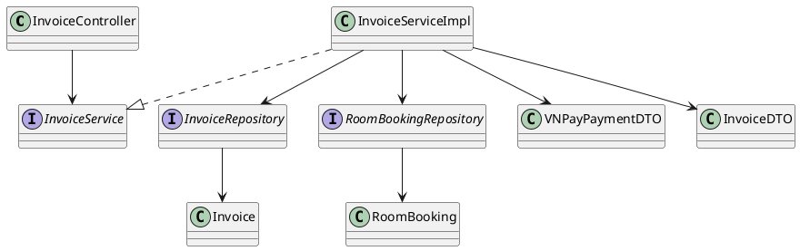
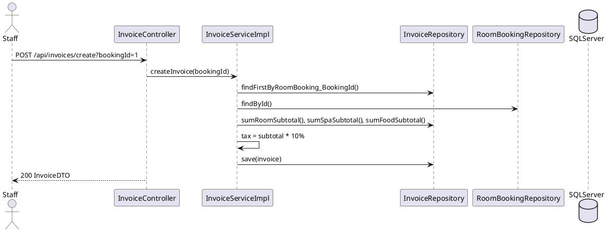
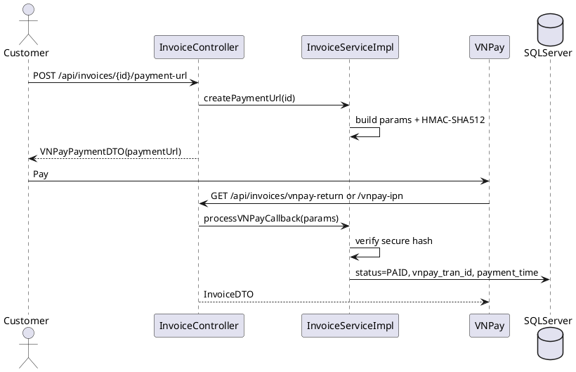
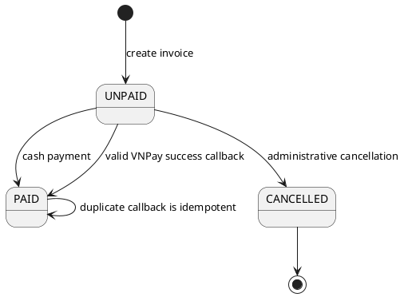

# SMMS Payment & Invoice Backend EDS

* **Document ID:** SMMS-PAYMENT-IMP-001
* **Version:** 1.0
* **Date:** 2026-06-10
* **Status:** Draft
* **Document Owner:** Backend Lead
* **Author:** Codex - Backend Engineer
* **Based on EDS:** v2.0

---

## Changelog

| Date | Author | Change |
| :--- | :--- | :--- |
| 2026-06-10 | Codex | Created implementation specification for invoice creation, cash settlement, and VNPay payment flow. |

---

## 1. Module Overview

| Field | Value |
| :--- | :--- |
| **Module Name** | Payment & Invoice |
| **Bounded Context** | Resort booking checkout |
| **Data Classification** | Internal, PII-linked financial records |
| **Compliance Scope** | Internal audit, payment integrity |
| **Upstream Dependencies** | `room_booking`, `room_booking_detail`, `spa_booking`, `food_order`, `food_order_detail`, `User` |
| **Downstream Consumers** | Customer booking flow, Staff dashboard, Admin payment ledger |

The module consolidates lodging, spa, and food charges into an AHLEI-style guest folio. It supports:

* Creating or recalculating an invoice from a room booking.
* Generating a signed VNPay payment URL.
* Processing VNPay callback/IPN data with HMAC verification.
* Marking at-counter cash payments as paid.
* Querying invoices by invoice ID or user ID.

---

## 2. Traceability Matrix

| Requirement ID | Type | Requirement | Code Component | Compliance Target |
| :--- | :--- | :--- | :--- | :--- |
| BR-PAY-001 | Business Rule | Booking checkout must aggregate room, spa, and food charges. | `InvoiceServiceImpl.createInvoice()` | Financial accuracy |
| BR-PAY-002 | Business Rule | Package-included spa/food items must not be charged again. | `InvoiceRepository.sumSpaSubtotal()`, `sumFoodSubtotal()` | No double billing |
| BR-PAY-003 | Business Rule | Invoice status must be `UNPAID`, `PAID`, or `CANCELLED`. | `Invoice.status`, SQL check constraint | State integrity |
| BR-PAY-004 | Business Rule | Successful VNPay callback marks invoice as paid and stores gateway transaction number. | `processVNPayCallback()` | Payment auditability |
| BR-PAY-005 | Business Rule | Staff can settle unpaid final invoice by cash at counter. | `markCashPayment()` | Operational checkout |
| BR-PAY-006 | Business Rule | Payment gateway must collect only outstanding `amount_due`, not gross `final_amount`. | `InvoiceServiceImpl.createPaymentUrl()` | No overcollection |
| SEC-PAY-001 | Security | VNPay callback must verify secure hash before mutation. | `processVNPayCallback()` | Anti-forgery |

---

## 3. Architecture Decision Records

### ADR-001 - Keep Invoice Aggregation in Service Layer

| Field | Value |
| :--- | :--- |
| **Status** | Accepted |
| **Date** | 2026-06-10 |

**Context:** The frontend currently uses mock payment state, while the SQL schema already defines invoice, booking, spa, and food ledgers.

**Decision:** Implement invoice aggregation in `InvoiceServiceImpl` and use repository-level native SQL for charge summation.

**Consequences:**

* Positive: Small backend surface, minimal entity expansion, matches current schema.
* Trade-off: Native SQL is coupled to SQL Server table names.

### ADR-002 - VNPay URL Signing via Configurable Properties

| Field | Value |
| :--- | :--- |
| **Status** | Accepted |
| **Date** | 2026-06-10 |

**Decision:** Store VNPay pay URL, return URL, terminal code, and hash secret in `application.properties` under `payment.vnpay.*`.

**Consequences:**

* Positive: No hard-coded production credential in Java code.
* Trade-off: Deployment must replace sandbox/demo values with secrets.

---

## 4. Non-Functional Requirements

| Category | Requirement | Target | Verification |
| :--- | :--- | :--- | :--- |
| Latency | Invoice lookup and creation | p99 < 300ms with indexed booking tables | API smoke test |
| Integrity | Payment callback mutation | Idempotent when invoice is already `PAID` | Unit/integration test |
| Security | Gateway callback authenticity | Reject invalid or missing HMAC | Security test |
| Auditability | Gateway transaction tracking | Persist `vnpay_tran_id` and `payment_time` | DB inspection |

---

## 5. Static Model



Key tables:

* `invoice`: final folio ledger with `final_amount`, `deposit_amount`, and `amount_due`.
* `room_booking`: parent reservation.
* `room_booking_detail`: lodging charge source.
* `spa_booking`: spa charge source where `is_package_included = 0`.
* `food_order_detail`: food charge source where `is_package_included = 0`.

---

## 6. Dynamic Model

### 6.1 Create Invoice



### 6.2 VNPay Payment



### 6.3 State Machine



Invariant: a `CANCELLED` invoice cannot be paid.

---

## 7. Domain Events

The current implementation does not publish async events. The following events are reserved for future integration:

| Event Name | Trigger | Publisher | Subscriber |
| :--- | :--- | :--- | :--- |
| `InvoiceCreated` | Invoice inserted or recalculated | `InvoiceServiceImpl` | Admin dashboard, accounting |
| `InvoicePaid` | Cash or VNPay success | `InvoiceServiceImpl` | Booking checkout, revenue report |
| `PaymentRejected` | Invalid VNPay callback | `InvoiceServiceImpl` | Security audit |

---

## 8. Service Interface

```java
InvoiceDTO getInvoiceById(Integer invoiceId);
List<InvoiceDTO> getInvoicesByUserId(Integer userId);
InvoiceDTO createInvoice(Integer bookingId);
VNPayPaymentDTO createPaymentUrl(Integer invoiceId);
InvoiceDTO markCashPayment(Integer invoiceId);
InvoiceDTO processPaymentCallback(VNPayPaymentDTO paymentResult);
InvoiceDTO processVNPayCallback(Map<String, String> callbackParams);
```

---

## 9. API Specification

| Method | Path | Auth Level | Roles | Idempotent |
| :--- | :--- | :--- | :--- | :--- |
| GET | `/api/invoices/{id}` | Public in dev config | Customer owner, Staff, Admin | Yes |
| GET | `/api/invoices/user/{userId}` | Public in dev config | Customer owner, Staff, Admin | Yes |
| POST | `/api/invoices/create?bookingId={id}` | Public in dev config | Staff, Admin | Yes for existing unpaid invoice |
| POST | `/api/invoices/{id}/payment-url` | Public in dev config | Customer owner, Staff | Yes |
| POST | `/api/invoices/{id}/cash-payment` | Public in dev config | Staff, Admin | Yes |
| GET | `/api/invoices/vnpay-return` | Browser return | VNPay | Yes |
| GET | `/api/invoices/vnpay-ipn` | Gateway IPN | VNPay | Yes |

### Create Invoice

```bash
curl -X POST "http://localhost:8080/api/invoices/create?bookingId=1"
```

Expected response:

```json
{
  "invoiceId": 1,
  "userId": 5,
  "bookingId": 1,
  "roomSubtotal": 12500000.00,
  "spaSubtotal": 0.00,
  "foodSubtotal": 320000.00,
  "taxAndFees": 1282000.00,
  "finalAmount": 14102000.00,
  "depositAmount": 3750000.00,
  "amountDue": 10352000.00,
  "status": "UNPAID"
}
```

### Create VNPay URL

```bash
curl -X POST "http://localhost:8080/api/invoices/1/payment-url"
```

Expected response contains `paymentUrl` and `secureHash`. VNPay `vnp_Amount` is based on `amountDue`.

### Mark Cash Payment

```bash
curl -X POST "http://localhost:8080/api/invoices/1/cash-payment"
```

Expected response has `status = PAID` and a populated `paymentTime`.

---

## 10. Error Codes

| Code | HTTP | Message |
| :--- | :---: | :--- |
| INV-001 | 400 | Invalid or missing payment input |
| INV-403 | 403 | Invalid VNPay secure hash |
| INV-404 | 404 | Invoice or booking not found |
| INV-409 | 409 | Invalid state transition |
| INV-500 | 500 | Internal payment service error |

---

## 11. Deployment Steps

1. Apply SQL schema from `SQL_DB_RESORT_SPA/resort_spa_db.sql`.
2. Replace `payment.vnpay.*` demo values with environment-specific secrets.
3. Run `dotnet build` is not applicable; backend is Maven/Spring Boot.
4. Build backend with `mvn clean package`.
5. Start backend with `mvn spring-boot:run`.
6. Smoke test `GET /api/invoices/1`.

---

## 12. Rollback & Incident Runbook

Rollback triggers:

| Condition | Threshold |
| :--- | :--- |
| Invalid invoice totals | Any confirmed double billing |
| VNPay callback rejection spike | > 5% valid payment reports rejected |
| API error rate | > 5% for 5 minutes |

Rollback procedure:

```bash
git revert <payment-backend-commit>
mvn clean package
```

If payment status was mutated incorrectly, restore affected invoice rows from database backup or audit transaction log.

---

## 13. Verification

Database checks:

```sql
SELECT invoice_id, room_booking_id, final_amount, status, vnpay_tran_id, payment_time
FROM dbo.invoice
WHERE invoice_id = 1;
```

Build check:

```bash
mvn clean package
```
