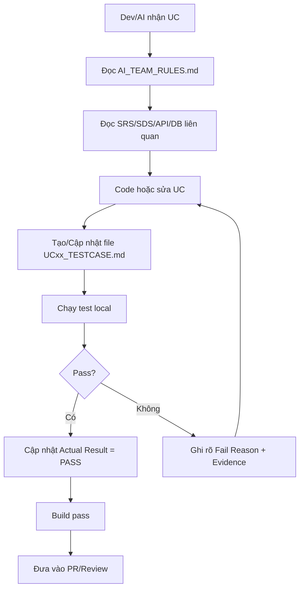

# README - Bộ Test Case Theo Use Case

Thư mục này dùng để lưu toàn bộ tài liệu test case cho từng Use Case (UC) của dự án **Ngũ Sơn Resort & Spa Management System**.

Mục tiêu chính:

1. Mỗi khi nhóm hoàn thành code cho 1 UC, phải có file test case tương ứng để QA/dev/AI kiểm thử.
2. Test case phải đồng bộ với SRS, SDS, database và API/backend/frontend đang code.
3. AI khi được giao code phải đọc bộ quy tắc chung trước, sau đó đọc test case của UC đang làm.
4. Không merge code nếu UC chưa có checklist test rõ ràng hoặc test fail chưa được ghi nhận.

---

## 1. Cấu trúc đề xuất

```text
Test_Cases/
├── README.md
├── UC_TESTCASE_TEMPLATE.md
├── TESTCASE_INDEX.md
└── UCxx_<ten-use-case>_TESTCASE.md
```

Ví dụ:

```text
UC01_Authentication_TESTCASE.md
UC02_RoomBooking_TESTCASE.md
UC03_PaymentInvoice_TESTCASE.md
UC04_SpaScheduling_TESTCASE.md
UC05_DietaryFoodOrdering_TESTCASE.md
```

---

## 2. Quy tắc đặt tên file

Format bắt buộc:

```text
UC<so-thu-tu-2-chu-so>_<ten-ngan-gon-bang-tieng-anh>_TESTCASE.md
```

Ví dụ đúng:

```text
UC01_Authentication_TESTCASE.md
UC03_PaymentInvoice_TESTCASE.md
UC05_ChefAllergyWarning_TESTCASE.md
```

Ví dụ sai:

```text
Test đăng nhập.md
payment.md
UC thanh toán.docx
```

---

## 3. Quy tắc mã test case

Format bắt buộc:

```text
TC-<MODULE>-<TYPE>-<NNN>
```

Trong đó:

| Thành phần | Ý nghĩa | Ví dụ |
| :--- | :--- | :--- |
| `MODULE` | Mã module viết hoa | `AUTH`, `BOOK`, `PAY`, `SPA`, `FOOD`, `ADMIN` |
| `TYPE` | Loại test | `UNIT`, `INT`, `API`, `UI`, `SEC`, `E2E` |
| `NNN` | Số thứ tự 3 chữ số | `001`, `002` |

Ví dụ:

```text
TC-AUTH-API-001
TC-PAY-SEC-003
TC-BOOK-E2E-002
```

---

## 4. Khi nào phải tạo test case?

Bắt buộc tạo hoặc cập nhật test case khi:

- Tạo mới một UC.
- Code xong một feature trong UC.
- Sửa bug liên quan logic nghiệp vụ.
- Thêm/sửa API endpoint.
- Thêm/sửa database table/column/constraint.
- Thêm/sửa rule phân quyền.
- Thêm/sửa flow thanh toán, booking, check-in/check-out, hồ sơ sức khỏe, dị ứng, báo cáo.

---

## 5. Luồng làm việc chuẩn sau khi code xong 1 UC



---

## 6. Tài liệu liên quan bắt buộc đọc

Trước khi viết test case, phải kiểm tra:

| Tài liệu | Mục đích |
| :--- | :--- |
| `Template/TDD_TEMPLATE_V1.md` | Mẫu gốc cho test-driven documentation |
| `Template/EDS_TEMPLATE_V2.0.md` | Mẫu gốc cho đặc tả kỹ thuật |
| `SRS/SRS_Summary.md` | Actor, UC, yêu cầu nghiệp vụ |
| `SDS/BACKEND_ARCHITECTURE.md` | Kiến trúc backend/API nếu có |
| `SDS/DATABASE_DESIGN.md` | Database design nếu có |
| `SQL_DB_RESORT_SPA/resort_spa_db.sql` | DDL thật, constraint thật |
| `Quy_tac_AI_Test/AI_TEAM_RULES.md` | Quy tắc chung cho AI/team |
| `Quy_tac_AI_Test/TESTING_GUIDELINES.md` | Tiêu chuẩn kiểm thử hiện có |

---

## 7. Definition of Done cho mỗi UC

Một UC chỉ được xem là hoàn thành khi:

- [ ] Có file test case riêng trong `Test_Cases/`.
- [ ] Có trace tới requirement/SRS/SDS/API/database liên quan.
- [ ] Có ít nhất happy path + validation/error path + permission path nếu UC có auth.
- [ ] Nếu UC có dữ liệu nhạy cảm thì có security/privacy test.
- [ ] Nếu UC có API thì có API test.
- [ ] Nếu UC có UI thì có UI test.
- [ ] Nếu UC thay đổi trạng thái nghiệp vụ thì có state transition test.
- [ ] Build backend/frontend pass.
- [ ] Test result được ghi rõ: `Not Run`, `Pass`, `Fail`, hoặc `Blocked`.
- [ ] Fail/Blocked phải có lý do và evidence.

---

## 8. Gợi ý module chính của dự án

| Module | Mã module | UC chính |
| :--- | :--- | :--- |
| Authentication & User Profile | `AUTH` | đăng ký, đăng nhập, profile, phân quyền |
| Room & Booking | `BOOK` | xem phòng, đặt phòng, check-in/check-out |
| Payment & Invoice | `PAY` | tạo hóa đơn, đặt cọc 30%, thanh toán 70%, VNPay |
| Spa/Yoga/Therapy Scheduling | `SPA` | đặt lịch, phân chuyên gia, cập nhật hồ sơ trị liệu |
| Food & Dietary | `FOOD` | món ăn, menu, dị ứng, đơn bếp |
| Admin Management | `ADMIN` | dashboard, tài khoản, phòng, dịch vụ, báo cáo |
| Staff Operation | `STAFF` | lễ tân, ca làm, xử lý hỗ trợ |

---

## 9. Ghi chú quan trọng

- Không dùng dữ liệu cá nhân thật trong test case.
- Dữ liệu test phải là synthetic/anonymized.
- Không ghi password/token/API secret thật vào markdown.
- Không đánh dấu `PASS` nếu chưa thật sự chạy kiểm thử hoặc chưa có bằng chứng.
- Không xóa lịch sử thay đổi trong file test case; chỉ thêm changelog.
