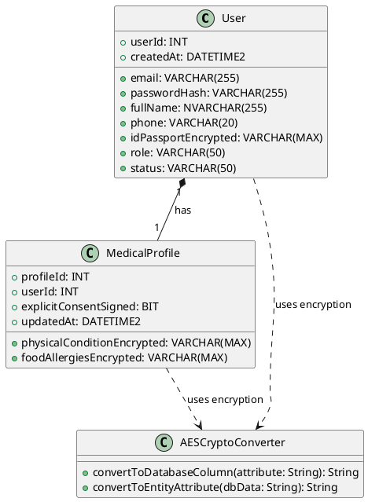
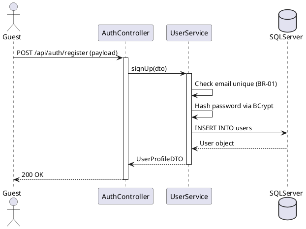

# ENGINEERING DOCUMENTATION STANDARD (EDS)

## Specification for Authentication & Sensitive Health Profile

| Field                    | Value                              |
| :----------------------- | :--------------------------------- |
| **Document ID**    | SMMS-AUTH-IMP-001                  |
| **Version**        | 1.0                                |
| **Date**           | 2026-06-14                         |
| **Status**         | Approved                           |
| **Document Owner** | Student 1 — Full-stack Engineer   |
| **Author**         | Hoàng Tuấn Anh                   |
| **Reviewed by**    | Phạm Anh Tuấn — Approved       |
| **DPO Sign-off**   | Approved — 2026-06-14 — All Team |
| **Approved by**    | Phạm Anh Tuấn— Approved         |
| **Last Review**    | 2026-06-14                         |
| **Based on EDS**   | v2.0                               |

---

## CHANGELOG

> **Policy 4.4 — Immutable History**: Không bao giờ xóa thông tin cũ. Mọi thay đổi phải ghi vào bảng này.

| Ngày      | Người thực hiện | Nội dung thay đổi                                                                                                          |
| :--------- | :------------------ | :---------------------------------------------------------------------------------------------------------------------------- |
| 2026-06-11 | Student 1           | Khởi tạo tài liệu — Thiết kế kiến trúc, API và mã hóa bảo mật cho Module 1                                      |
| 2026-06-14 | Student 1           | Bổ sung phần khắc phục lỗi đồng bộ họ tên khi đăng nhập Google SSO và cập nhật kết quả kiểm thử thực tế |

---

## MỤC LỤC

1. [Tổng quan Module](#1-tổng-quan-module)
2. [Ma trận Truy vết (Traceability Matrix)](#2-ma-trận-truy-vết-traceability-matrix)
3. [Architecture Decision Records (ADR)](#3-architecture-decision-records-adr)
4. [Non-Functional Requirements &amp; SLA](#4-non-functional-requirements--sla)
5. [Static Modeling (Mô hình Tĩnh)](#5-static-modeling-mô-hình-tĩnh)
6. [Dynamic Modeling (Mô hình Động)](#6-dynamic-modeling-mô-hình-động)
7. [Domain Event Catalog](#7-domain-event-catalog)
8. [Interface Specification (Đặc tả Giao diện)](#8-interface-specification-đặc-tả-giao-diện)
9. [API Specification](#9-api-specification)
10. [Bảng mã lỗi (Error Codes)](#10-bảng-mã-lỗi-error-codes)
11. [Quy trình Triển khai (Step-by-Step)](#11-quy-trình-triển-khai-step-by-step)
12. [Rollback &amp; Incident Runbook](#12-rollback--incident-runbook)
13. [Kịch bản Kiểm thử Chi tiết](#13-kịch-bản-kiểm-thử-chi-tiết)
14. [Phương pháp Xác minh](#14-phương-pháp-xác-minh)
15. [Mẫu thử thực tế (API Verification Samples)](#15-mẫu-thử-thực-tế-api-verification-samples)
16. [Bảng tổng hợp phân quyền (Authorization Matrix)](#16-bảng-tổng-hợp-phân-quyền-authorization-matrix)
17. [Phụ lục](#phụ-lục)

---

## 1. Tổng quan Module

Module 1 chịu trách nhiệm thiết lập nền tảng bảo mật cho hệ thống quản lý resort **NSRMS** (Ngũ Sơn Resort & Spa Management System). Module này thực hiện quản lý tài khoản người dùng, cơ chế xác thực OTP, đăng nhập SSO qua Google, quản lý hồ sơ sức khỏe nhạy cảm dưới dạng mã hóa tự động tại cơ sở dữ liệu để tuân thủ Nghị định 13/2023/NĐ-CP, phân quyền truy cập chi tiết (RBAC) và quản lý dữ liệu danh mục cốt lõi (Master Data).

| Field                           | Value                                                                                 |
| :------------------------------ | :------------------------------------------------------------------------------------ |
| **Module Name**           | Authentication & Sensitive Health Profile                                             |
| **Bounded Context**       | User access, security, master data, privacy consent                                   |
| **Data Classification**   | Sensitive-PII / PII / Confidential                                                    |
| **Compliance Scope**      | Nghị định 13/2023/NĐ-CP (Nghị định 356/2025/ND-CP), Luật Cư trú 2020        |
| **Upstream Dependencies** | None                                                                                  |
| **Downstream Consumers**  | Module 2 (Booking), Module 3 (Spa Schedule), Module 4 (F&B), Module 5 (Folio Billing) |

---

## 2. Ma trận Truy vết (Traceability Matrix)

| Requirement ID         | Loại (BR/ADR/US) | Mô tả yêu cầu                                                                                      | Thành phần Code                                                           | Compliance Target           | ADR liên quan   |
| :--------------------- | :---------------- | :----------------------------------------------------------------------------------------------------- | :-------------------------------------------------------------------------- | :-------------------------- | :--------------- |
| **BR-01**        | Business Rule     | Mỗi địa chỉ email chỉ đăng ký duy nhất 1 tài khoản.                                         | `UserRepository.existsByEmail()`, `UserServiceImpl.signUp()`            | Data integrity              | —               |
| **BR-02**        | Business Rule     | Khách đăng ký truyền thống phải xác thực email trước khi book phòng.                       | `User.status` = `INACTIVE` -> `ACTIVE` qua OTP                        | Account integrity           | —               |
| **UC01**         | Use Case          | Đăng ký & Đăng nhập truyền thống + Google SSO.                                                 | `AuthController.registerUser()`, `authenticateGoogleUser()`             | User experience             | —               |
| **UC02**         | Use Case          | Khai báo sức khỏe & Dị ứng. Hộp chọn đồng ý (Consent) trống mặc định.                    | `medical_profile.explicit_consent_signed` validation                      | Nghị định 13/2023/NĐ-CP | `ADR-AUTH-001` |
| **UC03 / BR-22** | Use Case          | Quản lý tài khoản, phân quyền nhân viên. Khóa tài khoản nhân viên.                        | `User.role` validation, `User.status` check in login filter.            | Access security             | `ADR-AUTH-003` |
| **UC04**         | Use Case          | Thiết lập Master Data (Retreat Packages, Room Types, Spa Services).                                  | `RoomTypeController`, `SpaServiceController`                            | Data centralization         | —               |
| **UC05 / BR-20** | Use Case          | Quyền được xóa dữ liệu sức khỏe sau khi checkout (Data Minimization).                         | `MedicalProfileService.deleteUserProfile()`                               | Nghị định 13/2023/NĐ-CP | `ADR-AUTH-002` |
| **BR-21**        | Business Rule     | RBAC: Therapist chỉ xem bệnh lý, Chef chỉ xem dị ứng ăn uống, Receptionist không xem cả hai. | `@PreAuthorize` guards, DTO filtering in `UserServiceImpl.getForRole()` | Least Privilege             | `ADR-AUTH-003` |

---

## 3. Architecture Decision Records (ADR)

### `ADR-AUTH-001` — Mã hóa dữ liệu sức khỏe & PII tại Database bằng JPA AttributeConverter

* **Status**: Accepted
* **Deciders**: Student 1, Principal Architect
* **Date**: 2026-06-11

**Context:** Các thông tin hộ chiếu/CCCD (`id_passport_encrypted`), ghi chú bệnh lý (`physical_condition_encrypted`), và dị ứng (`food_allergies_encrypted`) là thông tin nhạy cảm bắt buộc phải mã hóa an toàn ở trạng thái nghỉ (encryption-at-rest) theo Nghị định 13/2023/NĐ-CP. Việc mã hóa thô trong Database thủ công tại từng API controller dễ gây sai sót và trùng lặp code.

**Decision:** Sử dụng JPA `AttributeConverter<String, String>` kết hợp thuật toán **AES-256** tự động mã hóa dữ liệu khi ghi (`convertToDatabaseColumn`) và giải mã dữ liệu khi đọc (`convertToEntityAttribute`). Khóa bí mật (Secret Key) được cấu hình trong `application.properties` và nạp qua Spring `@Value`.

**Consequences:**

* *Tích cực:* Việc mã hóa diễn ra hoàn toàn trong suốt ở tầng JPA/Hibernate. Cực kỳ an toàn, khó quên mã hóa.
* *Tiêu cực:* Các truy vấn tìm kiếm trực tiếp trên cột mã hóa qua SQL `LIKE` sẽ không hoạt động. Cần tìm kiếm bằng cách tải dữ liệu lên Java và giải mã, hoặc tìm kiếm theo ID/Email.

---

### `ADR-AUTH-002` — Tự động hóa "Quyền được xóa" (Right to Deletion)

* **Status**: Accepted
* **Deciders**: Student 1, Principal Architect
* **Date**: 2026-06-11

**Context:** Yêu cầu bài toán (HOS-03) muốn hệ thống tự động/cho phép xóa dữ liệu sức khỏe của khách sau khi kỳ trị liệu kết thúc. Tuy nhiên, SRS nhóm lại đặc tả quy trình phê duyệt thủ công của Admin. Việc thủ công hóa sẽ vi phạm tính tự động bảo vệ dữ liệu.

**Decision:** Thực hiện giải pháp lai (hybrid):

1. Cung cấp API endpoint cho phép Khách hàng tự yêu cầu xóa ngay lập tức khi trạng thái đặt phòng đổi thành `CHECKED_OUT`.
2. Tạo một Spring `@Scheduled` background job chạy định kỳ hàng tuần quét các đặt phòng đã hoàn thành (`CHECKED_OUT`) quá 7 ngày để tự động xóa sạch dữ liệu bệnh lý và dị ứng nhạy cảm của khách hàng trong DB (set cột dữ liệu = `NULL` và consent = `0`).

---

### `ADR-AUTH-003` — Phân quyền RBAC mức API bằng Spring Security và DTO Filtering

* **Status**: Accepted
* **Deciders**: Student 1, Security Lead
* **Date**: 2026-06-11

**Context:** Quy tắc BR-21 yêu cầu kiểm soát truy cập nghiêm ngặt đối với thông tin sức khỏe nhạy cảm: `THERAPIST` không được thấy dị ứng ăn uống, `CHEF` không được thấy bệnh lý cột sống, `RECEPTIONIST` không được thấy cả hai.

**Decision:** Áp dụng kết hợp 2 lớp:

1. Sử dụng Spring Security `@PreAuthorize("hasAnyRole('THERAPIST', 'CHEF')")` tại tầng Controller để chặn truy cập API thô.
2. Tại tầng Service, phương thức `MedicalProfileServiceImpl.getForRole(userId, userRole)` sẽ tự động filter/mask trường dữ liệu nhạy cảm dựa trên role của token yêu cầu trước khi map sang `MedicalProfileDTO`.

---

## 4. Non-Functional Requirements & SLA

### 4.1. Performance & Availability

| Category     | Requirement                                             | Target SLA | Measurement Method | Compliance Basis   |
| :----------- | :------------------------------------------------------ | :--------- | :----------------- | :----------------- |
| Latency      | Đăng nhập truyền thống & sinh JWT                  | < 250ms    | Apache Benchmark   | UX Response        |
| Latency      | Đọc/Ghi dữ liệu sức khỏe nhạy cảm kèm mã hóa | < 350ms    | JMeter Load Test   | AES performance    |
| Availability | Tính sẵn sàng của dịch vụ Auth                    | 99.99%     | Uptime Robot       | Core system access |

### 4.2. Data Integrity & Retention

| Category    | Requirement                  | Target                    | Verification Method        | Compliance Basis            |
| :---------- | :--------------------------- | :------------------------ | :------------------------- | :-------------------------- |
| Retention   | Xóa tự động sau checkout | 7 ngày sau khi check-out | Scheduled Job verification | Nghị định 13/2023/NĐ-CP |
| Consistency | Duy nhất email              | 100% Unique               | DB Unique Constraint check | BR-01                       |

### 4.3. Security

| Category           | Requirement                             | Target               | Verification Method                        | Compliance Basis            |
| :----------------- | :-------------------------------------- | :------------------- | :----------------------------------------- | :-------------------------- |
| Encryption at rest | Trường nhạy cảm của User & Medical | AES-256              | SQL query kiểm tra chuỗi mã hóa        | Nghị định 13/2023/NĐ-CP |
| Transport          | Toàn bộ API endpoint                  | HTTPS TLS 1.3        | SSL Labs check                             | Data transit security       |
| Password Hashing   | Mật khẩu của mọi tài khoản        | BCrypt (strength=10) | DB check password_hash start with `$2a$` | OWASP A02:2021              |

---

## 5. Static Modeling (Mô hình Tĩnh)

### 5.1. Class Diagram



### 5.2. Data Structure (JPA Mapped from resort_spa_db.sql)

```java
// User.java
@Entity
@Table(name = "users")
public class User {
    @Id
    @GeneratedValue(strategy = GenerationType.IDENTITY)
    @Column(name = "user_id")
    private Integer userId;

    @Column(name = "email", nullable = false, unique = true)
    private String email;

    @Column(name = "password_hash", nullable = false)
    private String passwordHash;

    @Column(name = "full_name", nullable = false)
    private String fullName;

    @Column(name = "phone")
    private String phone;

    @Column(name = "id_passport_encrypted")
    @Convert(converter = AesEncryptor.class)
    private String idPassportPlaintext;

    @Column(name = "role", nullable = false)
    private String role; // 'ADMIN', 'STAFF', 'THERAPIST', 'GUEST'

    @Column(name = "status", nullable = false)
    private String status; // 'ACTIVE', 'INACTIVE'
}
```

---

## 6. Dynamic Modeling (Mô hình Động)

### 6.1 Đăng ký tài khoản truyền thống (Traditional Register Flow)



---

## 7. Domain Event Catalog

### 7.1. Events Published

| Event Name         | Trigger                 | Publisher           | Subscriber(s)           | Payload Schema               | Async? |
| :----------------- | :---------------------- | :------------------ | :---------------------- | :--------------------------- | :----- |
| `UserRegistered` | Đăng ký thành công | `UserServiceImpl` | `NotificationService` | `UserRegisteredEvent.java` | Yes    |

---

## 8. Interface Specification (Đặc tả Giao diện)

### 8.1. Service Interface

```java
// UserService.java
public interface UserService {
    UserProfileDTO signUp(SignUpRequest request);
    LoginResponse login(LoginRequest request);
    LoginResponse loginWithGoogle(GoogleLoginRequest request);
    UserProfileDTO getUserProfile(String email);
    UserProfileDTO updateUserProfile(String email, UserProfileRequest request);
    java.util.List<UserProfileDTO> getAllStaffUsers();
    UserProfileDTO updateUserRoleAndStatus(Integer userId, String role, String status);
    void deleteUser(Integer userId);
    UserProfileDTO createStaffAccount(SignUpRequest request, String role);
}
```

---

## 9. API Specification

### 9.1. Endpoints Table

| Method         | Path                   | Auth Level | Roles                                          | Rate Limit | Idempotent |
| :------------- | :--------------------- | :--------- | :--------------------------------------------- | :--------- | :--------- |
| **POST** | `/api/auth/register` | Public     | None                                           | 20/min     | No         |
| **POST** | `/api/auth/login`    | Public     | None                                           | 60/min     | No         |
| **POST** | `/api/auth/google`   | Public     | None                                           | 60/min     | No         |
| **GET**  | `/api/users/me`      | JWT Bearer | `GUEST`, `STAFF`, `THERAPIST`, `ADMIN` | 100/min    | Yes        |
| **PUT**  | `/api/users/me`      | JWT Bearer | `GUEST`, `STAFF`, `THERAPIST`, `ADMIN` | 30/min     | Yes        |
| **GET**  | `/api/admin/users`   | JWT Bearer | `ADMIN`                                      | 50/min     | Yes        |
| **POST** | `/api/admin/users`   | JWT Bearer | `ADMIN`                                      | 20/min     | No         |

---

## 10. Bảng mã lỗi (Error Codes)

| Code         | HTTP Status | Message (EN)                 | Message (VI)                                        | Trigger Condition                          |
| :----------- | :---------: | :--------------------------- | :-------------------------------------------------- | :----------------------------------------- |
| `AUTH-001` |     400     | Email is already registered! | Email đã được sử dụng bởi tài khoản khác | Trùng email khi đăng ký (BR-01)        |
| `AUTH-002` |     400     | Invalid email or password    | Email hoặc mật khẩu không chính xác           | Đăng nhập sai thông tin                |
| `AUTH-003` |     400     | Your account is INACTIVE     | Tài khoản của bạn đang bị tạm khóa          | Đăng nhập khi status = INACTIVE (BR-22) |

---

## 11. Quy trình Triển khai (Step-by-Step)

1. Thiết lập biến môi trường `AES_SECRET` trong hệ thống (cần độ dài 32 ký tự).
2. Tạo các bảng `users` trong SQL Server bằng cách import script SQL.
3. Chạy `mvn clean package` để build kiểm thử backend.
4. Deploy ứng dụng Spring Boot lên môi trường staging.

---

## 12. Rollback & Incident Runbook

### 12.1. Trigger Conditions

* Xảy ra lỗi `BadPaddingException` hàng loạt khi giải mã trường `id_passport_encrypted` tại Database.

### 12.2. Rollback Procedure

* Deploy lại artifact (file `.jar`) của phiên bản ổn định trước đó.
* Trong trường hợp database bị corrupt: Khôi phục database bằng file backup `ResortSpaDB.bak`.

---

## 13. Kịch bản Kiểm thử Chi tiết

### `TC-AUTH-UNIT-001` - Mã hóa và giải mã AES hoạt động đúng cách

* **Background:** Given synthetic data classification: SYNTHETIC
* **Scenario:**
  * When `AesEncryptor` mã hóa chuỗi "B1234567"
  * Then Kết quả trả về là một chuỗi base64 đã mã hóa.
  * When Giải mã chuỗi base64 đó
  * Then Kết quả trả về chính xác là "B1234567".

---

## 14. Phương pháp Xác minh

### 14.1. Database Inspection

```sql
-- Kiểm tra xem số hộ chiếu CCCD đã được mã hóa thô trong DB chưa
SELECT user_id, email, id_passport_encrypted FROM users;
-- Mong đợi: Cột id_passport_encrypted chứa chuỗi mã hóa, không phải số plaintext ban đầu.
```

---

## 15. Mẫu thử thực tế (API Verification Samples)

### 15.1. Đăng ký tài khoản mới

```bash
curl -X POST http://localhost:8080/api/auth/register \
  -H "Content-Type: application/json" \
  -d '{
    "email": "testguest@gmail.com",
    "password": "Password123",
    "fullName": "Nguyen Van Test",
    "phone": "0901234567"
  }'
```

Response mong đợi (200 OK):

```json
{
  "userId": 8,
  "email": "testguest@gmail.com",
  "fullName": "Nguyen Van Test",
  "phone": "0901234567",
  "idPassport": null,
  "role": "GUEST",
  "status": "ACTIVE"
}
```

---

## 16. Bảng tổng hợp phân quyền (Authorization Matrix)

| Endpoint                               | GUEST | STAFF | THERAPIST | ADMIN |
| :------------------------------------- | :----: | :----: | :-------: | :----: |
| **POST** `/api/auth/register`  |   ✅   |   ✅   |    ✅    |   ✅   |
| **POST** `/api/auth/login`     |   ✅   |   ✅   |    ✅    |   ✅   |
| **GET** `/api/users/me`        | ✅ Own | ✅ Own |  ✅ Own  | ✅ Own |
| **GET** `/api/admin/users`     |   ❌   |   ❌   |    ❌    |   ✅   |
| **PUT** `/api/admin/users/:id` |   ❌   |   ❌   |    ❌    |   ✅   |

---

## PHỤ LỤC

### A. Glossary (Thuật ngữ)

* **PII**: Personally Identifiable Information (Thông tin định danh cá nhân).
* **AES-256**: Advanced Encryption Standard với khóa có độ dài 256 bits dùng để mã hóa thông tin nhạy cảm.
