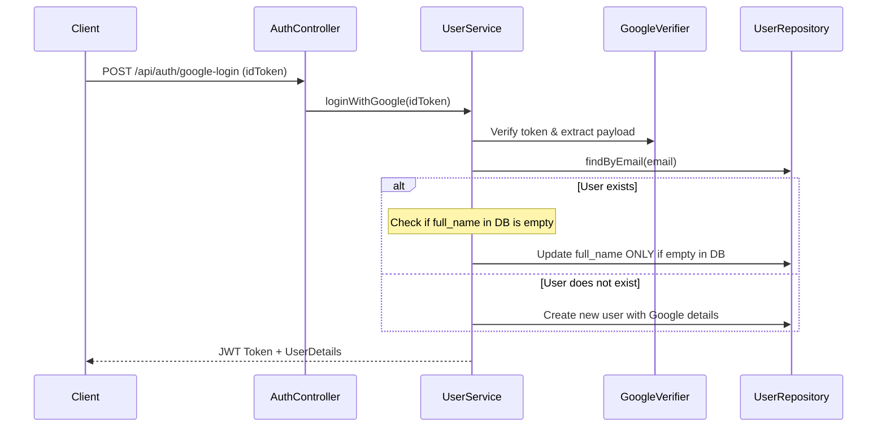

# EDS - UC01: Đăng ký & Đăng nhập (Traditional Registration & Google SSO)

## 1. Mô Tả Nghiệp Vụ (Use Case Specification)
Khách hàng và nhân viên có thể tạo tài khoản và đăng nhập vào hệ thống NSRMS.
* **Traditional Flow**: Đăng ký qua email + mật khẩu -> Hệ thống gửi OTP -> Nhập OTP xác thực -> Trạng thái kích hoạt `ACTIVE`.
* **Google SSO Flow**: Đăng nhập nhanh qua Google. Đồng bộ email, ảnh đại diện và họ tên.
* **Quy tắc sửa lỗi ghi đè**: Ngăn chặn việc Google SSO tự động ghi đè họ tên của người dùng nếu họ đã tự cập nhật tên mới trên hệ thống.

## 2. Đặc Tả Kỹ Thuật (Technical Specification)
* **API Endpoints**:
  * `POST /api/auth/register` (Đăng ký tài khoản)
  * `POST /api/auth/verify-otp` (Xác thực tài khoản)
  * `POST /api/auth/login` (Đăng nhập truyền thống)
  * `POST /api/auth/google-login` (Đăng nhập Google SSO)
* **Database Tables**:
  * `users` (`user_id`, `email`, `password_hash`, `full_name`, `role`, `status`, `created_at`)

## 3. Quy Trình Luồng Dữ Liệu (Sequence Diagram)

---

# TDD - UC01: Đăng ký & Đăng nhập

## 1. Kịch Bản Kiểm Thử (Test Cases)

### `AUTH-TC-001` — Đăng ký tài khoản với email hợp lệ
* **Input**: Email `test_reg@gmail.com`, password `Password123`, full_name `Nguyễn Văn A`.
* **Expected**: Trả về `201 Created`, trạng thái user = `INACTIVE`, gửi OTP thành công.

### `AUTH-TC-002` — Đăng nhập tài khoản chưa kích hoạt (status INACTIVE)
* **Input**: Email `test_reg@gmail.com`, password `Password123`.
* **Expected**: Trả về `401 Unauthorized` hoặc `400 Bad Request` yêu cầu kích thực tài khoản trước.

### `AUTH-TC-003` — Đăng nhập Google SSO không ghi đè tên đã chỉnh sửa
* **Input**: Người dùng có tên hiện tại trong DB là `Trần Khách Hàng` (đã chỉnh sửa). Đăng nhập bằng Google Account có tên là `Tran Khach Hang` (không dấu).
* **Expected**: Tên trong DB vẫn giữ nguyên là `Trần Khách Hàng`.

## 2. Kết Quả Xác Minh (Verification Result)
* **Unit Tests**: `fu.se.smms.controller.AuthControllerTest` -> `PASS`
