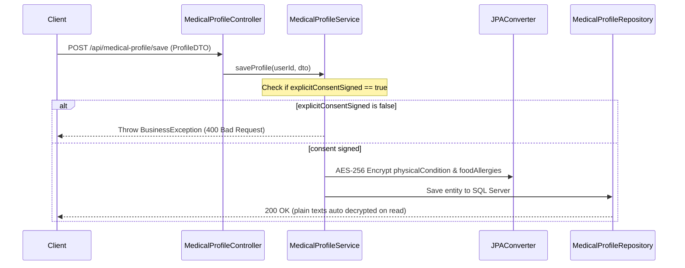

# EDS - UC02: Khai báo hồ sơ sức khỏe & Dị ứng (Sensitive Health Profile & Explicit Consent)

## 1. Mô Tả Nghiệp Vụ (Use Case Specification)
Khách hàng khai báo tình trạng sức khỏe thể chất (bệnh lý) và dị ứng ăn uống trước khi sử dụng dịch vụ Spa hoặc gọi món F&B.
* **Quy tắc Consent (Đồng thuận rõ ràng)**: Checkbox cam kết đồng ý xử lý thông tin nhạy cảm phải trống mặc định trên UI. Nếu không tích chọn, hệ thống từ chối lưu.
* **Quy tắc Mã hóa (AES-256)**: Mọi thông tin sức khỏe thể chất (`physical_condition_encrypted`) và hộ chiếu (`id_passport_encrypted`) phải được mã hóa tự động ở tầng cơ sở dữ liệu.

## 2. Đặc Tả Kỹ Thuật (Technical Specification)
* **API Endpoints**:
  * `POST /api/medical-profile/save` (Lưu/cập nhật hồ sơ sức khỏe)
  * `GET /api/medical-profile/my-profile` (Lấy hồ sơ sức khỏe hiện tại)
* **Database Tables**:
  * `medical_profile` (`profile_id`, `user_id`, `physical_condition_encrypted`, `food_allergies_encrypted`, `explicit_consent_signed`, `updated_at`)
* **Cryptography Implementation**:
  * Sử dụng JPA `AttributeConverter<String, String>` nạp khóa mật từ biến môi trường `.env`.

## 3. Quy Trình Luồng Dữ Liệu (Sequence Diagram)

---

# TDD - UC02: Khai báo hồ sơ sức khỏe & Dị ứng

## 1. Kịch Bản Kiểm Thử (Test Cases)

### `MP-TC-001` — Chặn lưu hồ sơ nếu explicit_consent_signed = false
* **Input**: `physicalCondition = 'Thoát vị đĩa đệm'`, `explicitConsentSigned = false`.
* **Expected**: Trả về `400 Bad Request`, ném lỗi yêu cầu tích chọn đồng ý điều khoản.

### `MP-TC-002` — Tự động mã hóa AES-256 dữ liệu nhạy cảm
* **Input**: Lưu hồ sơ sức khỏe thành công. Truy vấn trực tiếp DB bằng SQL thô.
* **Expected**: Cột `physical_condition_encrypted` trong SQL Server hiển thị chuỗi mã hóa, không chứa văn bản thô "Thoát vị đĩa đệm".

## 2. Kết Quả Xác Minh (Verification Result)
* **Unit Tests**: `fu.se.smms.controller.MedicalProfileControllerTest` -> `PASS`
