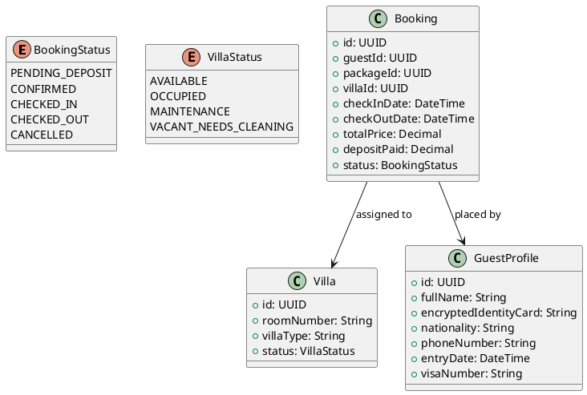
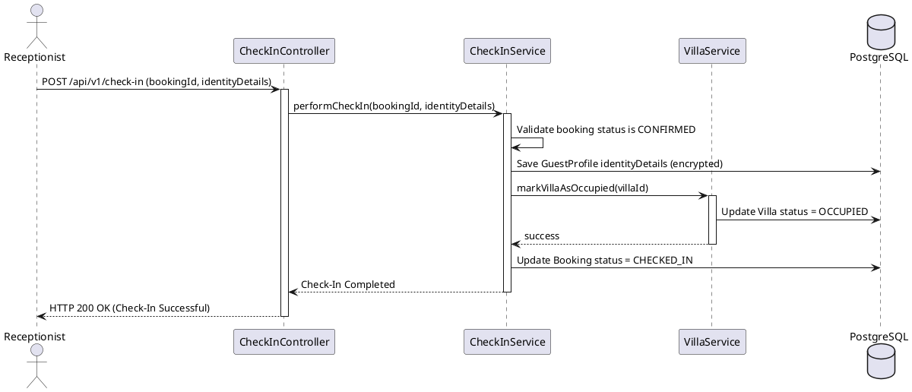
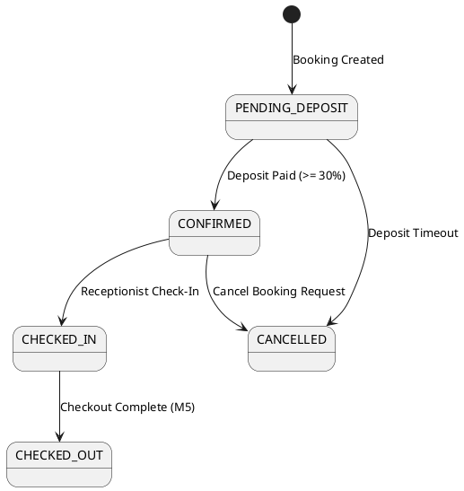
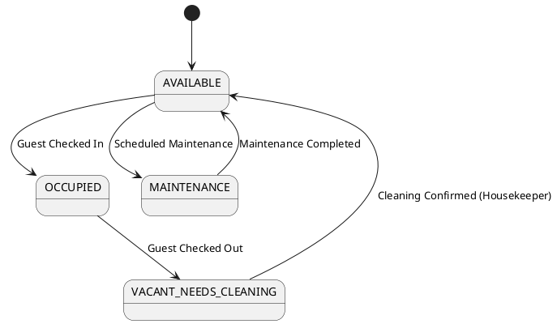

# ENGINEERING DOCUMENT STANDARD (EDS) v2.0

## Quy chuẩn Tài liệu Kỹ thuật và Đặc tả Hiện thực hóa - Module 2

| Field                    | Value                                                 |
| :----------------------- | :---------------------------------------------------- |
| **Document ID**    | RESORT-M2-IMP-001                                     |
| **Version**        | 1.0                                                   |
| **Date**           | 2026-06-13                                            |
| **Status**         | Process check                                         |
| **Document Owner** | Phạm Duy Nghĩa                                      |
| **Author**         | Phạm Duy Nghĩa                                      |
| **Reviewed by**    | Nguyễn Xuân Dũng                                   |
| **DPO Sign-off**   | [x] Approved — 2026-06-15 — Data Protection Officer |
| **Approved by**    | Nguyễn Xuân Dũng                                   |
| **Last Review**    | 2026-06-13                                            |
| **Based on EDS**   | v2.0                                                  |

---

## CHANGELOG

> **Policy 4.4 — Immutable History**: Không bao giờ xóa thông tin cũ. Mọi thay đổi phải ghi vào bảng này.

| Ngày      | Người thực hiện | Nội dung thay đổi                                                    |
| :--------- | :------------------ | :---------------------------------------------------------------------- |
| 2026-06-13 | Phạm Duy Nghĩa    | Tạo tài liệu thiết kế kỹ thuật chi tiết lần đầu cho Module 2 |

---

## MỤC LỤC

1. [Tổng quan Module](#1-tổng-quan-module)
2. [Ma trận Truy vết (Traceability Matrix)](#2-ma-trận-truy-vết-traceability-matrix)
3. [Architecture Decision Records (ADR)](#3-architecture-decision-records-adr)
4. [Non-Functional Requirements &amp; SLA](#4-non-functional-requirements--sla)
5. [Static Modeling (Mô hình Tĩnh)](#5-static-modeling-mô-hình-tĩnh)
6. [Dynamic Modeling (Mô hình Động)](#6-dynamic-modeling-mô-hình-động)
7. [Domain Event Catalog](#7-domain-event-catalog)
8. [Interface Specification (Đặc tả Giao diện)](#8-interface-specification-đặc-tả-giao-diện)
9. [API Specification](#9-api-specification)
10. [Bảng mã lỗi (Error Codes)](#10-bảng-mã-lỗi-error-codes)
11. [Quy trình Triển khai (Step-by-Step)](#11-quy-trình-triển-khai-step-by-step)
12. [Rollback &amp; Incident Runbook](#12-rollback--incident-runbook)
13. [Kịch bản Kiểm thử Chi tiết](#13-kịch-bản-kiểm-thử-chi-tiết)
14. [Phương pháp Xác minh](#14-phương-pháp-xác-minh)
15. [Mẫu thử thực tế (API Verification Samples)](#15-mẫu-thử-thực-tế-api-verification-samples)
16. [Bảng tổng hợp phân quyền (Authorization Matrix)](#16-bảng-tổng-hợp-phân-quyền-authorization-matrix)
17. [Phụ lục](#phụ-lục)

---

## 1. Tổng quan Module

Module 2 chịu trách nhiệm quản lý toàn bộ luồng nghiệp vụ cốt lõi của resort bao gồm đặt gói trị liệu sức khỏe tích hợp với phòng nghỉ (Villas), làm thủ tục nhận phòng cho khách hàng (Check-in), quản lý trạng thái Villa vật lý, và tổng hợp trục thời gian trải nghiệm (Itinerary Timeline).

| Field                           | Value                                                                             |
| :------------------------------ | :-------------------------------------------------------------------------------- |
| **Module Name**           | Retreat Package & Accommodation Booking                                           |
| **Bounded Context**       | Booking & Accommodation Domain                                                    |
| **Data Classification**   | Sensitive-PII (Thông tin CCCD, Hộ chiếu, Lịch sử trị liệu sức khỏe)      |
| **Compliance Scope**      | Luật Cư trú Việt Nam 2020                                                     |
| **Upstream Dependencies** | Core Auth Service (quản lý phân quyền người dùng)                          |
| **Downstream Consumers**  | Module 3 (Spa Services), Module 4 (Dining Services), Module 5 (Check-out Service) |

---

## 2. Ma trận Truy vết (Traceability Matrix)

| Requirement ID | Loại (BR/ADR/US) | Mô tả yêu cầu                                                      | Thành phần Code                              | Compliance Target      | ADR liên quan |
| :------------- | :---------------- | :--------------------------------------------------------------------- | :--------------------------------------------- | :--------------------- | :------------- |
| UC06           | User Story        | Khách hàng tìm kiếm, lọc gói trị liệu sức khỏe               | `RetreatPackageService.filter()`             | GWI Wellness Standards | —             |
| UC07           | User Story        | Chọn gói trị liệu, Villa mong muốn, thanh toán cọc trực tuyến | `BookingService.createBooking()`             | —                     | ADR-001        |
| UC08           | User Story        | Arrivals Dashboard, thủ tục Check-in, chụp CCCD/Passport            | `CheckInService.performCheckIn()`            | Luật Cư trú VN 2020 | ADR-002        |
| UC09           | User Story        | Quản lý trạng thái biệt thự vật lý                             | `VillaService.updateStatus()`                | —                     | ADR-003        |
| UC10           | User Story        | Xem trục thời gian (Itinerary Timeline) trải nghiệm của khách    | `ItineraryService.getTimeline()`             | —                     | ADR-004        |
| BR-04          | Business Rule     | Chỉ các gói ACTIVE mới hiển thị                                  | `RetreatPackageService.filter()`             | GWI Standard           | —             |
| BR-05          | Business Rule     | Booking được CONFIRMED sau khi thanh toán cọc thành công        | `BookingService.confirmPayment()`            | —                     | ADR-001        |
| BR-06          | Business Rule     | Chỉ cho phép đặt Villa còn trống                                 | `BookingService.validateVillaAvailability()` | —                     | —             |
| BR-12          | Business Rule     | Chỉ đơn CONFIRMED & đã cọc mới được Check-In                 | `CheckInService.validateCheckIn()`           | —                     | —             |
| BR-13          | Business Rule     | Check-In thành công chuyển trạng thái Villa sang OCCUPIED         | `VillaService.updateStatus()`                | —                     | ADR-003        |
| BR-30          | Business Rule     | Lịch trình trị liệu/ăn uống nằm trong kỳ lưu trú             | `ItineraryService.validateActivityDate()`    | —                     | ADR-004        |

---

## 3. Architecture Decision Records (ADR)

### ADR-001 — Quản lý tỉ lệ đặt cọc trực tuyến: Fixed 30% vs Configurable

| Field              | Value                                            |
| :----------------- | :----------------------------------------------- |
| **Status**   | Accepted                                         |
| **Deciders** | Student 2 (Full-stack), Principal Architect, DPO |
| **Date**     | 2026-06-15                                       |

#### Bối cảnh (Context)

Đề bài yêu cầu đặt cọc cố định là 30%. Tuy nhiên đặc tả SRS yêu cầu tỉ lệ này có thể cấu hình bởi Ban quản lý. Nếu ghi cứng 30% vào code thì sẽ vi phạm SRS, ngược lại nếu cho cấu hình tự do không kiểm soát sẽ gây rủi ro về mặt vận hành.

#### Các phương án đã xem xét

| Phương án           | Mô tả                                                                        | Ưu điểm                                                                 | Nhược điểm                                                                      |
| :--------------------- | :----------------------------------------------------------------------------- | :------------------------------------------------------------------------- | :---------------------------------------------------------------------------------- |
| A. Cứng hóa 30%      | Viết cứng tỷ lệ cọc `0.3` trong source code.                            | Đơn giản, thực thi nhanh.                                              | Vi phạm SRS, không thể thay đổi nếu có đợt khuyến mãi/chính sách mới. |
| B. Lưu trong Database | Tạo bảng `SystemConfig` lưu key `DEPOSIT_RATIO` (mặc định `0.30`). | Linh hoạt, đúng đặc tả SRS và đáp ứng yêu cầu 30% mặc định. | Cần thêm API quản trị, cần kiểm tra phân quyền chặt chẽ.                  |

#### Quyết định

Chọn **Phương án B**. Tỷ lệ cọc mặc định là 30% nhưng được tải động từ bảng cấu hình `SystemConfiguration`. Chỉ Role `ADMIN` mới được phép cập nhật tham số này.

---

### ADR-002 — Bổ sung cấu trúc dữ liệu tuân thủ Luật Cư trú Việt Nam 2020

| Field              | Value                     |
| :----------------- | :------------------------ |
| **Status**   | Accepted                  |
| **Deciders** | Student 2, DPO, Tech Lead |
| **Date**     | 2026-06-15                |

#### Bối cảnh

Để khai báo tạm trú chính xác cho cơ quan Công an địa phương theo Luật Cư trú 2020, hệ thống phải lưu trữ đầy đủ: Quốc tịch, Số hộ chiếu/Visa, Ngày nhập cảnh gần nhất, Số điện thoại và hình ảnh định danh CCCD. SRS hiện tại thiếu các trường này.

#### Quyết định

Bổ sung các trường trên vào thực thể `GuestProfile` và `CheckInRecord`. Dữ liệu nhạy cảm (Số CCCD/Passport) sẽ được mã hóa bằng thuật toán đối xứng AES-256 trước khi lưu vào DB. Chỉ DPO và Receptionist được phân quyền mới có thể giải mã xem trực tiếp.

---

### ADR-003 — Quy trình dọn dẹp Villa và chuyển giao trạng thái

| Field              | Value                          |
| :----------------- | :----------------------------- |
| **Status**   | Accepted                       |
| **Deciders** | Student 2, Principal Architect |
| **Date**     | 2026-06-15                     |

#### Bối cảnh

Khi khách làm thủ tục Check-Out, phòng chuyển sang `VACANT_NEEDS_CLEANING`. Hệ thống cần một luồng rõ ràng để cập nhật trạng thái này về `AVAILABLE`.

#### Quyết định

Phát triển một API `/api/v1/villas/:id/status` cho phép nhân viên buồng phòng (`HOUSEKEEPER`) hoặc lễ tân (`RECEPTIONIST`) cập nhật trạng thái phòng. Khi dọn dẹp xong, họ sẽ gọi API này để chuyển đổi trạng thái từ `VACANT_NEEDS_CLEANING` -> `AVAILABLE`.

---

### ADR-004 — Tối ưu hóa API trục thời gian lịch trình (Itinerary Timeline)

| Field              | Value                |
| :----------------- | :------------------- |
| **Status**   | Accepted             |
| **Deciders** | Student 2, Tech Lead |
| **Date**     | 2026-06-15           |

#### Bối cảnh

Itinerary Timeline (UC10) cần hiển thị tổng hợp thông tin từ nhiều nguồn: lịch đặt phòng (Module 2), lịch trị liệu Spa (Module 3) và lịch ăn uống (Module 4). Việc truy vấn trực tiếp cùng lúc nhiều bảng lớn có nguy cơ gây thắt nút cổ chai (performance bottleneck).

#### Quyết định

Sử dụng mô hình Aggregator Pattern. API Gateway hoặc một Service chuyên biệt sẽ gọi song song (async queries) đến các Module 3 và Module 4 bằng cách truyền ID đặt phòng, sau đó gộp dữ liệu tại memory và sắp xếp theo trục thời gian trước khi trả về client. Caching bằng Redis (TTL = 5 phút) để tăng tốc độ phản hồi.

---

## 4. Non-Functional Requirements & SLA

### 4.1. Performance & Availability

| Category     | Requirement                                     | Target SLA | Measurement Method | Compliance Basis           |
| :----------- | :---------------------------------------------- | :--------- | :----------------- | :------------------------- |
| Latency      | Itinerary Timeline API response                 | < 300ms    | k6 load test       | Trải nghiệm khách hàng |
| Availability | Hệ thống đặt phòng hoạt động liên tục | 99.9%      | Uptime Robot       | —                         |
| Throughput   | Đồng thời thực hiện đặt phòng           | 200 req/s  | Load test          | Giờ cao điểm            |

### 4.2. Security & Compliance

| Category           | Requirement                                              | Target          | Verification Method | Compliance Basis                 |
| :----------------- | :------------------------------------------------------- | :-------------- | :------------------ | :------------------------------- |
| Encryption at rest | Dữ liệu CCCD/Hộ chiếu khách hàng                   | AES-256         | Code audit          | Luật Cư trú Việt Nam 2020    |
| PII masking        | Không ghi nhận CCCD/Passport dạng plaintext trong log | Masking `***` | log review          | GDPR & Luật An toàn thông tin |

---

## 5. Static Modeling (Mô hình Tĩnh)

### 5.1. Class Diagram (PlantUML)



### 5.2. Data Structure (Prisma Schema)

```prisma
// === MODULE 2: RETREAT PACKAGE & BOOKING SCHEMA ===

enum BookingStatus {
  PENDING_DEPOSIT
  CONFIRMED
  CHECKED_IN
  CHECKED_OUT
  CANCELLED
}

enum VillaStatus {
  AVAILABLE
  OCCUPIED
  MAINTENANCE
  VACANT_NEEDS_CLEANING
}

model SystemConfiguration {
  id          String   @id @default(uuid()) @db.Uuid
  configKey   String   @unique
  configValue String
  updatedAt   DateTime @updatedAt
}

model Villa {
  id          String      @id @default(uuid()) @db.Uuid
  roomNumber  String      @unique
  villaType   String
  status      VillaStatus @default(AVAILABLE)
  bookings    Booking[]
  createdAt   DateTime    @default(now())
  updatedAt   DateTime    @updatedAt

  @@map("villas")
}

model GuestProfile {
  id                    String    @id @default(uuid()) @db.Uuid
  fullName              String
  encryptedIdentityCard String    // AES-256 encrypted Passport / CCCD
  nationality           String
  phoneNumber           String?
  entryDate             DateTime? // Dành cho khách nước ngoài
  visaNumber            String?   // Dành cho khách nước ngoài
  bookings              Booking[]
  createdAt             DateTime  @default(now())
  updatedAt             DateTime  @updatedAt

  @@map("guest_profiles")
}

model Booking {
  id             String        @id @default(uuid()) @db.Uuid
  guestId        String        @db.Uuid
  guest          GuestProfile  @relation(fields: [guestId], references: [id])
  packageId      String        @db.Uuid
  villaId        String        @db.Uuid
  villa          Villa         @relation(fields: [villaId], references: [id])
  checkInDate    DateTime
  checkOutDate   DateTime
  totalPrice     Float
  depositPaid    Float         @default(0.0)
  status         BookingStatus @default(PENDING_DEPOSIT)
  createdAt      DateTime      @default(now())
  updatedAt      DateTime      @updatedAt

  @@index([guestId])
  @@index([villaId])
  @@map("bookings")
}
```

---

## 6. Dynamic Modeling (Mô hình Động)

### 6.1. Sequence Diagram — Check-In (Happy Path)



### 6.2. State Machine Diagrams

#### Booking Status State Machine



#### Villa Status State Machine



---

## 7. Domain Event Catalog

### 7.1. Events Published (Phát ra)

| Event Name             | Trigger                                      | Publisher          | Subscriber(s)                       | Payload Schema              | Async? |
| :--------------------- | :------------------------------------------- | :----------------- | :---------------------------------- | :-------------------------- | :----- |
| `BookingConfirmed`   | Khi giao dịch thanh toán cọc thành công | `BookingService` | NotificationService, SpaService     | `BookingConfirmedEvent`   | Yes    |
| `CheckInCompleted`   | Khi khách hoàn tất thủ tục nhận phòng | `CheckInService` | ItineraryService, ResidenceReporter | `CheckInCompletedEvent`   | Yes    |
| `VillaStatusChanged` | Khi trạng thái phòng thay đổi           | `VillaService`   | DashboardSvc                        | `VillaStatusChangedEvent` | Yes    |

---

## 8. Interface Specification (Đặc tả Giao diện)

### 8.1. Booking Service Interface

```typescript
export interface CreateBookingInput {
  guestId: string;
  packageId: string;
  villaId: string;
  checkInDate: string; // ISO Date
  checkOutDate: string; // ISO Date
}

export interface BookingResponse {
  bookingId: string;
  totalPrice: number;
  requiredDeposit: number;
  status: string;
}

export interface IBookingService {
  /**
   * Tạo yêu cầu đặt chỗ tạm thời, tính toán tiền cọc cần đóng
   */
  createBooking(input: CreateBookingInput): Promise<BookingResponse>;
  
  /**
   * Xác nhận thanh toán tiền đặt cọc
   */
  confirmPayment(bookingId: string, amountPaid: number): Promise<boolean>;
}
```

---

## 9. API Specification

### 9.1. Endpoints Table

| Method          | Path                               | Auth Level | Required Roles                | Rate Limit | Idempotent? |
| :-------------- | :--------------------------------- | :--------- | :---------------------------- | :--------- | :---------: |
| **POST**  | `/api/v1/bookings`               | JWT Bearer | `CUSTOMER, RECEPTIONIST`    | 30/min     |     No     |
| **POST**  | `/api/v1/check-in`               | JWT Bearer | `RECEPTIONIST, ADMIN`       | 60/min     |     No     |
| **PATCH** | `/api/v1/villas/:id/status`      | JWT Bearer | `RECEPTIONIST, HOUSEKEEPER` | 60/min     |     Yes     |
| **GET**   | `/api/v1/itineraries/:bookingId` | JWT Bearer | `CUSTOMER, RECEPTIONIST`    | 100/min    |     Yes     |

---

## 10. Bảng mã lỗi (Error Codes)

| Code            | HTTP Status | Message (EN)                | Message (VI)                                 | Trigger Condition                |
| :-------------- | :---------: | :-------------------------- | :------------------------------------------- | :------------------------------- |
| `BOOKING-001` |     400     | Invalid Booking Dates       | Ngày đặt phòng không hợp lệ           | Check-out trước Check-in       |
| `BOOKING-002` |     400     | Deposit Amount Insufficient | Tiền cọc không đủ                       | Thanh toán cọc < 30% giá trị |
| `BOOKING-003` |     409     | Villa Already Booked        | Biệt thự đã có người đặt            | Trùng lịch phòng              |
| `CHECKIN-001` |     400     | Unqualified Booking         | Đơn hàng không đủ điều kiện checkin | Chưa thanh toán cọc           |
| `CHECKIN-002` |     400     | Identity Details Required   | Thiếu thông tin căn cước                | Check-in thiếu CCCD/Passport    |

---

## 11. Quy trình Triển khai (Step-by-Step)

1. **Database Migration**: Chạy migration tạo các bảng `villas`, `guest_profiles`, `bookings`, `SystemConfiguration`.
2. **Setup Configurations**: Chèn dòng mặc định `deposit_ratio = 0.30` vào bảng `SystemConfiguration`.
3. **Deploy Core Services**: Deploy Service đặt phòng và check-in.
4. **Integration verification**: Kiểm tra đồng bộ trạng thái giữa Đặt phòng và Đặt lịch trị liệu (Module 3).

---

## 12. Rollback & Incident Runbook

### 12.1. Trigger Conditions

* Tỷ lệ lỗi API Check-in > 5% trong 5 phút.
* Giao dịch thanh toán cọc hoàn tất nhưng Booking không chuyển trạng thái CONFIRMED.

### 12.2. Rollback Procedure

```bash
# Deploy lại phiên bản container ổn định trước đó
kubectl rollout undo deployment/booking-service
# Xác minh trạng thái dịch vụ
curl -X GET https://resort.api/health
```

---

## 13. Kịch bản Kiểm thử Chi tiết

Xem chi tiết tại tài liệu [TDD_Module2.md](file:///d:/ResortManageNew/07-Reports/TDD/Module2/TDD_Module2.md).

---

## 14. Bảng tổng hợp phân quyền (Authorization Matrix)

| Endpoint                            | CUSTOMER | RECEPTIONIST | HOUSEKEEPER | ADMIN | SYSTEM |
| :---------------------------------- | :------: | :----------: | :---------: | :----: | :----: |
| `POST /api/v1/bookings`           |    ✅    |      ✅      |     ❌     |   ✅   |   ✅   |
| `POST /api/v1/check-in`           |    ❌    |      ✅      |     ❌     |   ✅   |   ❌   |
| `PATCH /api/v1/villas/:id/status` |    ❌    |      ✅      |     ✅     |   ✅   |   ✅   |
| `GET /api/v1/itineraries/:id`     |  ✅ Own  |    ✅ All    |     ❌     | ✅ All | ✅ All |

---

## PHỤ LỤC

### A. Glossary (Thuật ngữ)

* **Retreat Package**: Gói kỳ nghỉ chăm sóc sức khỏe toàn diện bao gồm cả phòng nghỉ và dịch vụ trị liệu.
* **Arrivals Dashboard**: Màn hình bảng điều khiển danh sách khách hàng dự kiến check-in trong ngày của bộ phận lễ tân.
* **Itinerary Timeline**: Trục thời gian hiển thị lịch trình hoạt động của khách hàng từ lúc Check-In đến Check-Out.
