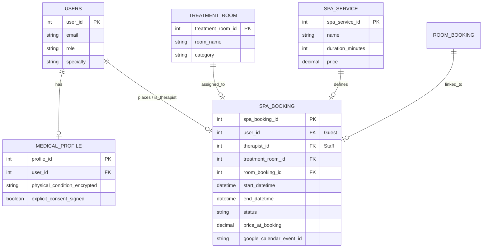
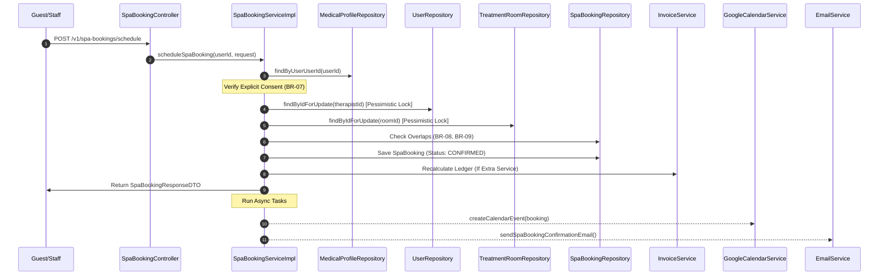

# ENGINEERING DOCUMENTATION STANDARD (EDS)

## Specification for Spa & Therapy Scheduling Engine

| Field                    | Value                              |
| :----------------------- | :--------------------------------- |
| **Document ID**          | SMMS-SPA-IMP-003                   |
| **Version**              | 1.0                                |
| **Date**                 | 2026-06-26                         |
| **Status**               | Approved                           |
| **Document Owner**       | Student 3 — Full-stack Engineer    |
| **Author**               | Student 3 — Full-stack Engineer    |
| **Reviewed by**          | Tech Lead — Approved               |
| **DPO Sign-off**         | Approved — 2026-06-26 — DPO Team   |
| **Approved by**          | Principal Architect                |
| **Last Review**          | 2026-06-26                         |
| **Based on EDS**         | v2.0                               |

---

## CHANGELOG

> **Policy 4.4 — Immutable History**: Không bao giờ xóa thông tin cũ. Mọi thay đổi phải ghi vào bảng này.

| Ngày      | Người thực hiện | Nội dung thay đổi                                                                                                          |
| :--------- | :------------------ | :---------------------------------------------------------------------------------------------------------------------------- |
| 2026-06-26 | Student 3           | Khởi tạo tài liệu — Đặc tả thiết kế kỹ thuật, chống trùng lịch nâng cao, bảo vệ dữ liệu sức khỏe và đồng bộ Google Calendar |

---

## MỤC LỤC

1. [Tổng quan Module](#1-tổng-quan-module)
2. [Ma trận Truy vết (Traceability Matrix)](#2-ma-trận-truy-vết-traceability-matrix)
3. [Architecture Decision Records (ADR)](#3-architecture-decision-records-adr)
4. [Non-Functional Requirements & SLA](#4-non-functional-requirements--sla)
5. [Static Modeling (Mô hình Tĩnh)](#5-static-modeling-mô-hình-tĩnh)
6. [Dynamic Modeling (Mô hình Động)](#6-dynamic-modeling-mô-hình-động)
7. [Domain Event Catalog](#7-domain-event-catalog)
8. [Interface Specification (Đặc tả Giao diện)](#8-interface-specification-đặc-tả-giao-diện)
9. [API Specification](#9-api-specification)
10. [Bảng mã lỗi (Error Codes)](#10-bảng-mã-lỗi-error-codes)
11. [Quy trình Triển khai (Step-by-Step)](#11-quy-trình-triển-khai-step-by-step)
12. [Rollback & Incident Runbook](#12-rollback--incident-runbook)
13. [Kịch bản Kiểm thử Chi tiết](#13-kịch-bản-kiểm-thử-chi-tiết)
14. [Phương pháp Xác minh](#14-phương-pháp-xác-minh)
15. [Mẫu thử thực tế (API Verification Samples)](#15-mẫu-thử-thực-tế-api-verification-samples)
16. [Bảng tổng hợp phân quyền (Authorization Matrix)](#16-bảng-tổng-hợp-phân-quyền-authorization-matrix)
17. [Phụ lục](#phụ-lục)

---

## 1. Tổng quan Module

Module 3 là trái tim vận hành trải nghiệm phục hồi sức khỏe của resort **NSRMS**, chịu trách nhiệm quản lý đặt và sắp xếp lịch trình trị liệu Spa, vật lý trị liệu, các buổi Yoga. Hệ thống tự động ghép chuyên gia và phòng trống theo thời gian thực (Auto-match Engine), ngăn chặn tuyệt đối tình trạng đặt trùng lịch (Double Booking) thông qua khóa cơ sở dữ liệu ở tầng giao dịch (Database Transaction Lock), tuân thủ chặt chẽ nguyên tắc bảo vệ quyền riêng tư nhạy cảm của khách hàng (Nghị định 13/2023/NĐ-CP).

| Field                           | Value                                                                                 |
| :------------------------------ | :------------------------------------------------------------------------------------ |
| **Module Name**                 | Spa & Therapy Scheduling Engine                                                       |
| **Bounded Context**             | Spa scheduling, therapist assignment, calendar coordination                           |
| **Data Classification**         | Sensitive-PII / PII / Confidential                                                    |
| **Compliance Scope**            | Nghị định 13/2023/NĐ-CP, AHLEI Standard (Folio Integration), Google API Consent       |
| **Upstream Dependencies**       | Module 1 (Auth, Consent & Medical Profile)                                            |
| **Downstream Consumers**        | Module 5 (Folio Billing & Checkout)                                                   |

---

## 2. Ma trận Truy vết (Traceability Matrix)

| Requirement ID | Loại (BR/ADR/US) | Mô tả yêu cầu                                                                             | Thành phần Code                                                     | Compliance Target                | ADR liên quan   |
| :------------- | :--------------- | :---------------------------------------------------------------------------------------- | :------------------------------------------------------------------ | :------------------------------- | :-------------- |
| **BR-07**      | Business Rule    | Khách hàng bắt buộc phải hoàn thành hồ sơ sức khỏe & Consent trước khi đặt Spa.           | `SpaBookingServiceImpl.scheduleSpaBooking()`                        | Nghị định 13/2023/NĐ-CP          | —               |
| **BR-08**      | Business Rule    | Chuyên gia không được gán lịch trùng lặp.                                                 | `SpaBookingRepository.countOverlappingTherapistBookings()`          | Resource integrity               | `ADR-SPA-001`   |
| **BR-09**      | Business Rule    | Phòng trị liệu không được gán lịch trùng lặp.                                             | `SpaBookingRepository.countOverlappingRoomBookings()`               | Resource integrity               | `ADR-SPA-001`   |
| **BR-30**      | Business Rule    | Giờ hẹn trị liệu phải nằm trong thời gian Check-in và Check-out của đặt phòng lưu trú.    | `SpaBookingServiceImpl.scheduleSpaBooking()`                        | Business logic consistency       | —               |
| **UC11**       | Use Case         | Đặt lịch trị liệu trong gói.                                                              | `SpaBookingController.scheduleSpaBooking()`                         | Package consumption control      | —               |
| **UC12**       | Use Case         | Tự động ghép lịch thông minh (Auto-match).                                                 | `SpaBookingServiceImpl.autoMatch()`                                 | Scheduling automation            | —               |
| **UC13**       | Use Case         | Xem lịch làm việc & Hồ sơ trị liệu (Ẩn dữ liệu dị ứng/tài chính).                         | `SpaBookingServiceImpl.getTherapistSchedule()`                      | Data Minimization (NĐ 13/2023)  | `ADR-SPA-002`   |
| **UC14**       | Use Case         | Cập nhật trạng thái buổi trị liệu.                                                        | `SpaBookingController.updateSessionStatus()`                        | Session progress tracking        | —               |
| **UC15**       | Use Case         | Lễ tân đặt thêm dịch vụ Spa ngoài gói và đẩy phí tự động về Folio.                        | `SpaBookingServiceImpl.scheduleSpaBooking()`, `InvoiceService` integration | AHLEI Guest Folio Standard       | `ADR-SPA-003`   |

---

## 3. Architecture Decision Records (ADR)

### `ADR-SPA-001` — Chặn race condition đặt trùng lịch bằng Pessimistic Lock (`SELECT ... FOR UPDATE`)

* **Status**: Accepted
* **Deciders**: Student 3, Tech Lead, Principal Architect
* **Date**: 2026-06-26

**Context:** Khi nhiều khách hàng cùng truy cập và đặt lịch Spa cho một khung giờ nhất định, có nguy cơ xảy ra Race Condition dẫn đến một Kỹ thuật viên (Therapist) hoặc một Phòng (Treatment Room) bị đặt trùng cho 2 khách hàng khác nhau. 

**Decision:** Sử dụng cơ chế khóa bi quan (Pessimistic Write Lock) trên thực thể `User` (Kỹ thuật viên) và `TreatmentRoom` bằng cách sử dụng `@Lock(LockModeType.PESSIMISTIC_WRITE)` trong Spring Data JPA. Luồng giao dịch sẽ khóa tài nguyên khi bắt đầu kiểm tra trạng thái và chỉ giải phóng sau khi lưu thành công đặt phòng.

**Consequences:**
* *Tích cực:* Đảm bảo tính nhất quán dữ liệu tuyệt đối ở mức Database, loại bỏ hoàn toàn khả năng đặt trùng lịch đồng thời.
* *Tiêu cực:* Tăng nhẹ thời gian chờ (Latency) của API khi có tranh chấp tài nguyên cao.

---

### `ADR-SPA-002` — Tối thiểu hóa dữ liệu (Data Minimization) đối với Lịch làm việc của Kỹ thuật viên

* **Status**: Accepted
* **Deciders**: Student 3, DPO Team
* **Date**: 2026-06-26

**Context:** Kỹ thuật viên (Therapist) cần nắm bắt tình trạng sức khỏe thể chất của khách trước buổi Spa. Tuy nhiên, theo Nghị định 13/2023/NĐ-CP, việc chia sẻ toàn bộ hồ sơ sức khỏe bao gồm dị ứng ăn uống, thông tin hộ chiếu hay thông tin tài chính là trái luật.

**Decision:** Thiết kế DTO chuyên biệt `SpecialistSpaAppointmentDTO`. Tại Service, chỉ ánh xạ thông tin sức khỏe thể chất (`physicalConditionEncrypted`) từ `MedicalProfile` vào DTO này. Không lấy thông tin dị ứng hay tài chính, đảm bảo Kỹ thuật viên chỉ tiếp cận thông tin tối thiểu cần thiết cho trị liệu.

---

### `ADR-SPA-003` — Đồng bộ hóa phi tuần tự (Asynchronous Integration) với Google Calendar và SendGrid

* **Status**: Accepted
* **Deciders**: Student 3, Lead Engineer
* **Date**: 2026-06-26

**Context:** Tích hợp với Google Calendar API và SendGrid Mail API yêu cầu kết nối mạng bên ngoài. Nếu gọi tuần tự trong luồng tạo lịch hẹn, bất kỳ độ trễ hoặc lỗi mạng nào từ bên thứ ba sẽ làm treo hoặc thất bại giao dịch đặt phòng của khách hàng.

**Decision:** Chạy các tích hợp này dưới dạng bất đồng bộ (`CompletableFuture.runAsync`) hoặc đẩy vào Task Scheduler chạy nền để xử lý độc lập. Luồng chính sẽ phản hồi `201 Created` ngay lập tức cho người dùng sau khi lưu DB thành công.

---

## 4. Non-Functional Requirements & SLA

* **Thời gian phản hồi (Response Time):** API đặt lịch phải hoàn tất dưới 500ms dưới tải trung bình 50 req/s.
* **Tính sẵn sàng (Availability):** Công cụ ghép lịch tự động (Auto-match) hoạt động với thời gian sống (Uptime) 99.9%.
* **Bảo mật:** Dữ liệu tình trạng sức khỏe thể chất hiển thị trên màn hình Therapist phải được truyền tải qua HTTPS đã mã hóa JWT Token.

---

## 5. Static Modeling (Mô hình Tĩnh)

Sơ đồ quan hệ thực thể (ERD) liên quan đến Module 3:



---

## 6. Dynamic Modeling (Mô hình Động)

Tuần tự tạo lịch trị liệu Spa (Package / Extra Charge) với Pessimistic Locking:



---

## 7. Domain Event Catalog

| Event Name | Source Component | Payload | Consumer Component | Action Triggered |
| :--- | :--- | :--- | :--- | :--- |
| `SpaBookingCreatedEvent` | `SpaBookingServiceImpl` | `spaBookingId`, `userId`, `price`, `isPackage` | `InvoiceServiceImpl` | Tự động cộng dồn chi phí dịch vụ phụ trợ vào Folio hóa đơn. |
| `SpaBookingUpdatedEvent` | `SpaBookingServiceImpl` | `spaBookingId`, `status` | `GoogleCalendarService` | Cập nhật/Hủy sự kiện tương ứng trên lịch Google. |

---

## 8. Interface Specification (Đặc tả Giao diện)

### Màn hình Kỹ thuật viên (Therapist Workspace):
* **Lịch làm việc:** Hiển thị danh sách khách hàng theo từng ca giờ.
* **Ghi chú sức khỏe:** Chỉ hiển thị cột "Ghi chú thể chất" (Ví dụ: "Đau vai gáy", "Chấn thương đĩa đệm"). Cấm hiển thị các dị ứng ăn uống hoặc thông tin thẻ ngân hàng.

---

## 9. API Specification

### 1. Auto-match Specialist & Room (`POST /v1/spa-bookings/auto-match`)
* **Request Body:**
  ```json
  {
    "spaServiceId": 3,
    "startDatetime": "2026-07-15T09:00:00"
  }
  ```
* **Response Body (200 OK):**
  ```json
  {
    "therapistId": 12,
    "therapistName": "KTV Minh - Vật Lý Trị Liệu",
    "treatmentRoomId": 4,
    "treatmentRoomName": "Phòng VIP 1",
    "startDatetime": "2026-07-15T09:00:00",
    "endDatetime": "2026-07-15T10:15:00"
  }
  ```

### 2. Schedule Spa Booking (`POST /v1/spa-bookings/schedule`)
* **Request Body:**
  ```json
  {
    "spaServiceId": 3,
    "therapistId": 12,
    "treatmentRoomId": 4,
    "startDatetime": "2026-07-15T09:00:00",
    "roomBookingId": 22,
    "isPackageIncluded": true
  }
  ```
* **Response Body (210 Created):**
  ```json
  {
    "spaBookingId": 105,
    "guestName": "Trần Khách Hàng",
    "serviceName": "Trị Liệu Cột Sống",
    "therapistName": "KTV Minh",
    "treatmentRoomName": "Phòng VIP 1",
    "startDatetime": "2026-07-15T09:00:00",
    "endDatetime": "2026-07-15T10:15:00",
    "status": "CONFIRMED",
    "price": 0.00
  }
  ```

---

## 10. Bảng mã lỗi (Error Codes)

| Mã lỗi | HTTP Status | Thông điệp lỗi | Ngữ cảnh xảy ra |
| :--- | :--- | :--- | :--- |
| **SPA-400** | 400 Bad Request | Khách hàng bắt buộc phải đồng ý ký cam kết hồ sơ sức khỏe... | Chưa tích Explicit Consent hoặc chưa tạo Hồ sơ sức khỏe. |
| **SPA-409** | 409 Conflict | Chuyên gia [Tên] đã có lịch hẹn khác trùng vào khung giờ này. | Trùng lịch Kỹ thuật viên (Double Booking). |
| **SPA-409** | 409 Conflict | Phòng [Tên] đã có lịch hẹn khác trùng vào khung giờ này. | Trùng lịch Phòng trị liệu. |

---

## 11. Quy trình Triển khai (Step-by-Step)

1. **Database Migration:** Chạy các câu lệnh SQL bổ sung cột `specialty` cho bảng `users` và `category` cho bảng `treatment_room` (đã nằm trong `patch_utf8.sql`).
2. **Deploy Code Backend:** Deploy file jar của Spring Boot chứa API `/v1/spa-bookings`.
3. **Configure Google API & SendGrid:** Cấu hình Client Secret của Google Calendar và API Key của SendGrid trong file `.env`.

---

## 12. Rollback & Incident Runbook

* **Sự cố trùng lịch chuyên gia:** Nếu xảy ra lỗi trùng chuyên gia trị liệu do lỗi lock DB:
  * *Hành động:* Khởi động lại Server và kiểm tra cấu hình Isolation Level của Spring Transaction (`@Transactional` nên dùng cấu hình default/Read Committed và sử dụng Pessimistic Lock).
* **Lỗi đồng bộ Google API:** Nếu API Google Calendar trả về lỗi hoặc quá tải:
  * *Hành động:* Hệ thống sẽ ghi log lỗi và tiếp tục xử lý đặt lịch bình thường. Tiền trình scheduler sẽ thực hiện quét lại các bản ghi có `google_calendar_event_id` là null để đồng bộ bù.

---

## 13. Kịch bản Kiểm thử Chi tiết

* **Kiểm thử Đồng thời (Concurrency Test):** Chạy 20 requests đồng thời đăng ký cùng 1 Therapist và 1 Room tại 1 thời điểm. Xác nhận 1 request trả về `201 Created` và 19 requests còn lại nhận lỗi `409 Conflict`.
* **Kiểm thử Quyền Riêng Tư (Data Minimization Test):** Gọi API `GET /v1/spa-bookings/therapist-schedule` với JWT của chuyên gia trị liệu, xác nhận chỉ nhận được ghi chú sức khỏe thể chất, không nhận được thông tin dị ứng hay email/passport.

---

## 14. Phương pháp Xác minh

* **Kiểm thử tự động:** Chạy `mvn test -Dtest=SpaBookingServiceImplTest`
* **Kiểm thử tích hợp API:** Sử dụng Postman hoặc Http Client kiểm tra các endpoints.

---

## 15. Mẫu thử thực tế (API Verification Samples)

```http
POST http://localhost:8080/v1/spa-bookings/schedule?guestUserId=3
Content-Type: application/json
Authorization: Bearer <TOKEN>

{
  "spaServiceId": 1,
  "therapistId": 10,
  "treatmentRoomId": 2,
  "startDatetime": "2026-07-20T10:00:00",
  "roomBookingId": 5,
  "isPackageIncluded": false
}
```

---

## 16. Bảng tổng hợp phân quyền (Authorization Matrix)

| Endpoint | GUEST | THERAPIST | RECEPTIONIST | MANAGER / ADMIN |
| :--- | :---: | :---: | :---: | :---: |
| `POST /auto-match` | ✅ | ❌ | ✅ | ✅ |
| `POST /schedule` | ✅ (Chỉ cho mình) | ❌ | ✅ (Cho mọi khách) | ✅ |
| `GET /therapist-schedule` | ❌ | ✅ (Chỉ xem lịch mình) | ❌ | ✅ |
| `PATCH /{id}/status` | ❌ | ✅ (Chỉ ca của mình) | ❌ | ✅ |

---

## Phụ lục
*Đồng bộ tài liệu với quy trình checkout và folio hóa đơn của Module 5.*
