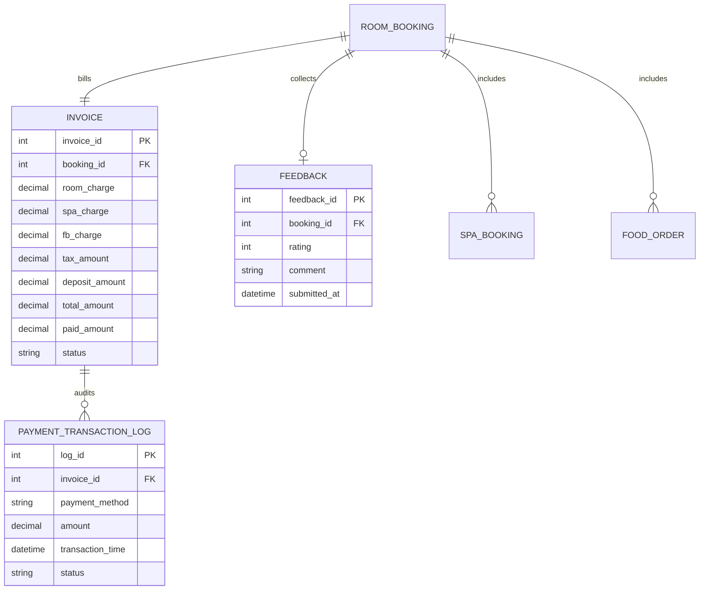
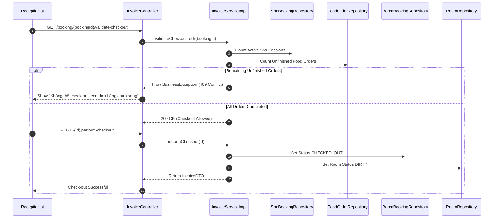

# ENGINEERING DOCUMENTATION STANDARD (EDS)

## Specification for Consolidated Checkout & Analytics

| Field              | Value                            |
| :-------------------| :---------------------------------|
| **Document ID**    | SMMS-PAY-IMP-005                 |
| **Version**        | 1.0                              |
| **Date**           | 2026-06-26                       |
| **Status**         | Approved                         |
| **Document Owner** | Pham Anh Tuan                    |
| **Author**         | Pham Anh Tuan                    |
| **Reviewed by**    | All Team                         |
| **DPO Sign-off**   | Approved — 2026-06-26 — All Team |
| **Approved by**    | Hoang Tuan Anh                   |
| **Last Review**    | 2026-06-26                       |
| **Based on EDS**   | v2.0                             |

---

## CHANGELOG

> **Policy 4.4 — Immutable History**: Không bao giờ xóa thông tin cũ. Mọi thay đổi phải ghi vào bảng này.

| Ngày      | Người thực hiện | Nội dung thay đổi                                                                                                          |
| :--------- | :------------------ | :---------------------------------------------------------------------------------------------------------------------------- |
| 2026-06-26 | Student 5           | Khởi tạo tài liệu — Thiết kế quy trình tính toán Folio, tích hợp thanh toán VNPay, khóa check-out, và Dashboard phân tích     |

---

## MỤC LỤC

1. [Tổng quan Module](#1-tổng-quan-module)
2. [Ma trận Truy vết (Traceability Matrix)](#2-ma-trận-truy-vết-traceability-matrix)
3. [Architecture Decision Records (ADR)](#3-architecture-decision-records-adr)
4. [Non-Functional Requirements & SLA](#4-non-functional-requirements--sla)
5. [Static Modeling (Mô hình Tĩnh)](#5-static-modeling-mô-hình-tĩnh)
6. [Dynamic Modeling (Mô hình Động)](#6-dynamic-modeling-mô-hình-động)
7. [Domain Event Catalog](#7-domain-event-catalog)
8. [Interface Specification (Đặc tả Giao diện)](#8-interface-specification-đặc-tả-giao-diện)
9. [API Specification](#9-api-specification)
10. [Bảng mã lỗi (Error Codes)](#10-bảng-mã-lỗi-error-codes)
11. [Quy trình Triển khai (Step-by-Step)](#11-quy-trình-triển-khai-step-by-step)
12. [Rollback & Incident Runbook](#12-rollback--incident-runbook)
13. [Kịch bản Kiểm thử Chi tiết](#13-kịch-bản-kiểm-thử-chi-tiết)
14. [Phương pháp Xác minh](#14-phương-pháp-xác-minh)
15. [Mẫu thử thực tế (API Verification Samples)](#15-mẫu-thử-thực-tế-api-verification-samples)
16. [Bảng tổng hợp phân quyền (Authorization Matrix)](#16-bảng-tổng-hợp-phân-quyền-authorization-matrix)
17. [Phụ lục](#phụ-lục)

---

## 1. Tổng quan Module

Module 5 là mắt xích cuối cùng của quy trình vận hành resort **NSRMS**, chịu trách nhiệm dồn chi phí từ các bộ phận (buồng phòng, ẩm thực, trị liệu spa) vào một hóa đơn tổng hợp duy nhất (**Consolidated Guest Folio**), thực hiện xác thực điều kiện checkout, cung cấp cổng thanh toán trực tuyến bảo mật và các báo cáo phân tích doanh thu trực quan cho Quản lý.

| Field                           | Value                                                                                 |
| :------------------------------ | :------------------------------------------------------------------------------------ |
| **Module Name**                 | Consolidated Checkout & Analytics                                                     |
| **Bounded Context**             | Invoicing, payment logging, room status release, executive dashboard                  |
| **Data Classification**         | Financial data, PII                                                                   |
| **Compliance Scope**            | AHLEI Standard (Uniform System of Accounts for the Lodging Industry), VNPay Standards |
| **Upstream Dependencies**       | Module 2 (Room Booking), Module 3 (Spa Booking), Module 4 (F&B Orders)                |
| **Downstream Consumers**        | Financial Audit Team, Manager Operations                                              |

---

## 2. Ma trận Truy vết (Traceability Matrix)

| Requirement ID | Loại (BR/ADR/US) | Mô tả yêu cầu                                                                             | Thành phần Code                                                     | Compliance Target                | ADR liên quan   |
| :------------- | :--------------- | :---------------------------------------------------------------------------------------- | :------------------------------------------------------------------ | :------------------------------- | :-------------- |
| **BR-14**      | Business Rule    | Sau khi hoàn tất check-out, trạng thái phòng lập tức chuyển sang `DIRTY`.                 | `InvoiceServiceImpl.performCheckout()`                              | Operational efficiency           | —               |
| **BR-15**      | Business Rule    | Hóa đơn tự động đối chiếu thông qua Room_Booking_ID trung tâm.                            | `InvoiceServiceImpl.createInvoice()`                                | Accounting integrity             | `ADR-PAY-001`   |
| **BR-18**      | Business Rule    | Chỉ khách hàng đã hoàn thành lưu trú (CHECKED_OUT) mới được gửi review.                   | `FeedbackServiceImpl.submitFeedback()`                              | Data integrity                   | —               |
| **BR-19**      | Business Rule    | Mỗi đặt phòng chỉ được phép gửi duy nhất 1 review.                                        | `FeedbackServiceImpl.submitFeedback()`                              | Abuse prevention                 | —               |
| **BR-26**      | Business Rule    | Lịch sử giao dịch tài chính đã thanh toán là immutable (không được sửa đổi/xóa).            | `PaymentTransactionLogRepository` & `PaymentTransactionLog`        | Audit Compliance (AHLEI)         | `ADR-PAY-002`   |
| **BR-27**      | Business Rule    | Doanh thu bóc tách chính xác theo nguồn thu: Room Package, Spa, F&B.                       | `RevenueServiceImpl.getRevenueDashboard()`                          | Financial reporting              | —               |
| **UC21**       | Use Case         | Tạo hóa đơn tổng hợp khi Check-out.                                                      | `InvoiceController.createInvoice()`                                 | Customer billing consolidation   | —               |
| **UC22**       | Use Case         | Kiểm tra trạng thái đơn nợ chưa settle (Consolidated Billing Constraint) & Checkout.      | `InvoiceController.validateCheckout()`                              | Operational integrity            | `ADR-PAY-003`   |

---

## 3. Architecture Decision Records (ADR)

### `ADR-PAY-001` — Thiết kế Consolidated Folio đối chiếu bằng Room Booking ID

* **Status**: Accepted
* **Deciders**: Student 5, Chief Accountant
* **Date**: 2026-06-26

**Context:** Theo tiêu chuẩn AHLEI, tất cả chi phí phát sinh tại các POS độc lập phải được cộng dồn về một tài khoản nợ trung tâm của phòng lữ hành. Nếu tính toán hóa đơn bằng cách quét động tất cả các bảng vào lúc checkout sẽ gây suy giảm hiệu năng nghiêm trọng và dễ sai lệch dữ liệu khi có thay đổi giá.

**Decision:** Thực thể `Invoice` đóng vai trò là Consolidated Folio, liên kết trực tiếp với `RoomBooking` bằng khóa ngoại. Các chi phí Spa và F&B được đẩy về Invoice thông qua các phương thức trigger recalculate lưu trữ giá trị tĩnh tại thời điểm đặt dịch vụ để phục vụ mục đích kiểm toán.

---

### `ADR-PAY-002` — Lưu trữ Lịch sử Giao dịch Immutable (Audit Trail)

* **Status**: Accepted
* **Deciders**: Student 5, Security Officer
* **Date**: 2026-06-26

**Context:** Hệ thống tài chính cần ngăn chặn hành vi sửa đổi thủ công lịch sử giao dịch nhằm biển thủ tiền mặt hoặc lừa đảo.

**Decision:** Định nghĩa bảng `payment_transaction_log` với các ràng buộc nghiêm ngặt ở tầng ứng dụng: không cung cấp bất kỳ API Update hoặc Delete nào trên Repository/Service liên quan tới log giao dịch. Mọi giao dịch VNPay callback hoặc thủ tục thanh toán tiền mặt thành công sẽ tự động tạo bản ghi lưu vết vĩnh viễn với thông tin dấu thời gian chính xác của hệ thống.

---

### `ADR-PAY-003` — Cơ chế Early Checkout (Force Cancel F&B) giải phóng phòng

* **Status**: Accepted
* **Deciders**: Student 5, Operations Director
* **Date**: 2026-06-26

**Context:** Quy tắc checkout bình thường sẽ chặn lễ tân nếu có đơn F&B hoặc Spa chưa hoàn thành. Tuy nhiên, trên thực tế, khách có thể muốn Checkout khẩn cấp vào sáng sớm khi bếp chưa làm xong món ăn đã đặt từ hôm trước.

**Decision:** Cung cấp API `/invoices/{id}/early-checkout`. Khi được gọi, hệ thống sẽ thực hiện hủy bỏ có kiểm soát (Force Cancel) đối với toàn bộ các đơn hàng F&B hoặc Spa ở trạng thái chuẩn bị/chờ chế biến (`PENDING`, `PREPARING`), cấn trừ tiền về 0 và cho phép thực thi Checkout giải phóng phòng ngay lập tức.

---

## 4. Non-Functional Requirements & SLA

* **Độ chính xác tài chính (Accuracy):** Tính toán hóa đơn chính xác 100%, làm tròn tiền đồng theo chính sách cấu hình hệ thống.
* **Tốc độ callback VNPay:** Thời gian xử lý callback IPN từ cổng thanh toán VNPay tối đa dưới 1 giây để phản hồi mã trạng thái xác thực.

---

## 5. Static Modeling (Mô hình Tĩnh)



---

## 6. Dynamic Modeling (Mô hình Động)

Luồng kiểm soát Checkout Constraint & Giải phóng phòng:



---

## 7. Domain Event Catalog

| Event Name | Source Component | Payload | Consumer Component | Action Triggered |
| :--- | :--- | :--- | :--- | :--- |
| `InvoicePaidEvent` | `InvoiceServiceImpl` | `invoiceId`, `bookingId`, `amount` | `EmailService` | Tự động tạo PDF hóa đơn và gửi email cảm ơn/xác nhận thanh toán cho khách hàng. |
| `RoomReleasedEvent` | `InvoiceServiceImpl` | `roomId` | `HousekeepingService` | Đưa phòng vào hàng đợi dọn dẹp trên giao diện nhân viên vệ sinh. |

---

## 8. Interface Specification (Đặc tả Giao diện)

### Màn hình Checkout (Reception Workspace):
* **Folio chi tiết:** Liệt kê rõ các khoản: Tiền phòng (đã trừ cọc 30%), Tiền Spa phát sinh, Tiền F&B phát sinh, Thuế VAT (10%), Số tiền cuối cùng cần thanh toán.
* **Revenue Dashboard:** Biểu đồ doanh thu trực quan lọc theo Năm/Tháng, bóc tách nguồn thu thành các màu sắc khác nhau.

---

## 9. API Specification

### 1. Validate Checkout (`GET /invoices/booking/{bookingId}/validate-checkout`)
* **Response Body (200 OK):** *(Rỗng - Cho phép checkout)*
* **Response Body (409 Conflict):**
  ```json
  {
    "code": "INV-409",
    "message": "Không thể Check-out: Còn đơn gọi món F&B chưa hoàn thành."
  }
  ```

### 2. Perform Checkout (`POST /invoices/{id}/perform-checkout`)
* **Response Body (200 OK):**
  ```json
  {
    "invoiceId": 12,
    "bookingId": 3,
    "totalAmount": 7500000.00,
    "status": "PAID",
    "checkedOutAt": "2026-06-26T10:15:00"
  }
  ```

---

## 10. Bảng mã lỗi (Error Codes)

| Mã lỗi | HTTP Status | Thông điệp lỗi | Ngữ cảnh xảy ra |
| :--- | :--- | :--- | :--- |
| **INV-409** | 409 Conflict | Không thể Check-out: Còn 1 buổi trị liệu Spa chưa hoàn thành... | Chặn Checkout do còn lịch Spa chưa xong. |
| **PAY-409** | 409 Conflict | Đặt phòng này đã có đánh giá. | BR-19: Chặn gửi Feedback lần thứ hai. |

---

## 11. Quy trình Triển khai (Step-by-Step)

1. **Deploy Schema Patches:** Khởi tạo bảng `payment_transaction_log` và thêm ràng buộc Unique cho `feedback`.
2. **Deploy Code:** Deploy backend Spring Boot và cập nhật config URL callback VNPay trong file cấu hình `.env` cho khớp với tên miền triển khai.

---

## 12. Rollback & Incident Runbook

* **Sự cố lỗi mạng khi thanh toán VNPay:** Khách đã bị trừ tiền trên app ngân hàng nhưng trạng thái hóa đơn trong hệ thống NSRMS vẫn báo "UNPAID".
  * *Hành động:* Lễ tân kiểm toán lại giao dịch qua mã tham chiếu `vnp_TxnRef` trên trang quản trị VNPay Merchant. Sau đó sử dụng nút "Mark Cash Payment" hoặc "Force Confirm" trên màn hình Admin để đồng bộ thủ công hóa đơn thành PAID, hệ thống sẽ tự ghi nhận log giao dịch cấn trừ tương ứng.

---

## 13. Kịch bản Kiểm thử Chi tiết

* **Kiểm thử BR-18 (Quyền gửi đánh giá):** Gửi feedback cho booking ở trạng thái `CONFIRMED`. Xác nhận API ném lỗi chặn. Chỉ cho phép khi trạng thái booking là `CHECKED_OUT`.
* **Kiểm thử BR-14 (Giải phóng phòng):** Gọi Checkout cho Invoice. Xác nhận trạng thái phòng trong bảng `rooms` chuyển từ `OCCUPIED` sang `DIRTY`.

---

## 14. Phương pháp Xác minh

* **Chạy tests:** `mvn test -Dtest=InvoiceServiceImplTest,FeedbackServiceImplTest`
* **Xác thực API:** Sử dụng postman chạy luồng checkout khép kín từ Đặt phòng &rarr; Thêm món F&B &rarr; Validate Checkout &rarr; Thanh toán VNPay/Tiền mặt &rarr; Thực hiện Checkout.

---

## 15. Mẫu thử thực tế (API Verification Samples)

```http
POST http://localhost:8080/invoices/12/perform-checkout
Authorization: Bearer <TOKEN>
```

---

## 16. Bảng tổng hợp phân quyền (Authorization Matrix)

| Endpoint | GUEST | RECEPTIONIST | MANAGER | ADMIN |
| :--- | :---: | :---: | :---: | :---: |
| `GET /invoices/{id}` | ✅ (Chỉ của mình) | ✅ | ✅ | ✅ |
| `POST /{id}/cash-payment` | ❌ | ✅ | ✅ | ✅ |
| `POST /{id}/perform-checkout` | ❌ | ✅ | ✅ | ✅ |
| `GET /revenue/dashboard` | ❌ | ❌ | ✅ | ✅ |

---

## Phụ lục
*Tương thích chuẩn hóa dữ liệu tài chính kế toán theo AHLEI.*
