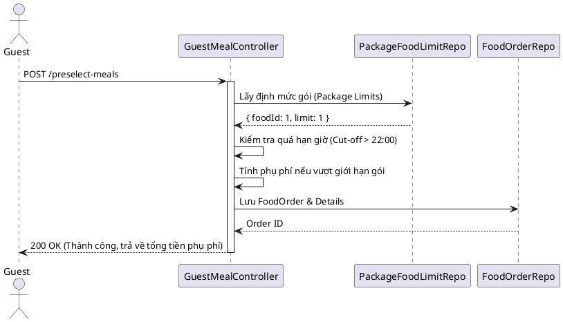

# ENGINEERING DOCUMENT STANDARD (EDS) v2.0

## Quy chuẩn Tài liệu Kỹ thuật và Đặc tả Hiện thực hóa

| Field | Value |
| :--- | :--- |
| **Document ID** | RESORT-MOD4-IMP-001 |
| **Version** | 1.0 |
| **Date** | 2026-06-17 |
| **Status** | Approved |
| **Document Owner** | Student 4 — Full-stack Engineer|
| **Author** | Lê Xuân Dũng |
| **Reviewed by** | Phạm Anh Tuấn — Approved |
| **DPO Sign-off** | [x] Approved — 2026-06-17 — All Team |
| **Approved by** | Phạm Anh Tuấn — Approved |
| **Last Review** | 2026-06-17 |
| **Based on EDS** | v2.0 |

---

## CHANGELOG

| Ngày | Người thực hiện | Nội dung thay đổi. |
| :--- | :--- | :--- |
| 2026-06-17 | Student 4 | Tạo tài liệu lần đầu đặc tả cho Module 4 (Dietary F&B) |

---

## 1. Tổng quan Module

Module 4 quản lý toàn bộ trải nghiệm ẩm thực dinh dưỡng tại resort. Bao gồm việc khách hàng đặt trước các bữa ăn hàng ngày, nhà bếp quản lý thực đơn, và đặc biệt là hệ thống tự động cảnh báo dị ứng dựa trên hồ sơ y tế của khách hàng nhưng vẫn đảm bảo tuyệt đối tính riêng tư cho các bệnh lý không liên quan.

| Field | Value |
| :--- | :--- |
| **Module Name** | Dietary F&B Management |
| **Bounded Context** | Food & Beverage |
| **Data Classification** | Sensitive-PII (Dữ liệu y tế, dị ứng) |
| **Compliance Scope** | Nghị định 13/2023/NĐ-CP (Bảo vệ dữ liệu cá nhân) |
| **Upstream Dependencies** | Module 2 (Booking & Guest Profile) |
| **Downstream Consumers** | Module 5 (Folio Billing) |

---

## 2. Ma trận Truy vết (Traceability Matrix)

| Requirement ID | Loại (BR/ADR/US) | Mô tả yêu cầu | Thành phần Code | Compliance Target | ADR liên quan |
| :--- | :--- | :--- | :--- | :--- | :--- |
| BR-10 | Business Rule | Khách phải chọn món trước giờ Cut-off | `GuestMealController.preselectMeals()` | N/A | — |
| BR-11 | Business Rule | Cảnh báo dị ứng khi chọn món | `GuestMealController.getFilteredMenu()` | An toàn sức khỏe | — |
| BR-16 | Business Rule | Chỉ phòng "Occupied" mới được gọi ngoài gói | `GuestMealController.orderExtra()` | N/A | — |
| UC-20 | User Story | Che giấu bệnh lý nhạy cảm đối với bếp | `GuestMealController.getChefAllergies()` | Nghị định 13/2023 | ADR-001 |

---

## 3. Architecture Decision Records (ADR)

### ADR-001 — Cơ chế mã hóa và giải mã có chọn lọc dữ liệu Y tế

| Field | Value |
| :--- | :--- |
| **Status** | Accepted |
| **Deciders** | Principal Architect, DPO |
| **Date** | 2026-06-17 |

#### Bối cảnh (Context)
Nghị định 13/2023 yêu cầu tối thiểu hóa dữ liệu (Data Minimization). Đầu bếp cần biết thông tin dị ứng của khách (đậu phộng, hải sản) nhưng tuyệt đối không được biết các bệnh lý nhạy cảm khác (vô sinh, xương khớp).

#### Quyết định (Decision)
Lưu trữ hai trường riêng biệt trong DB: `food_allergies_encrypted` và `physical_condition_encrypted`. Sử dụng AES-256 mã hóa ở tầng Database.
Tầng Application (Controller cho bếp) CHỈ giải mã trường `food_allergies_encrypted` và chặn hoàn toàn việc trả về trường `physical_condition_encrypted`.

#### Hệ quả (Consequences)
*   **Tích cực**: Tuân thủ tuyệt đối luật bảo vệ dữ liệu, tránh rò rỉ bệnh lý nhạy cảm.
*   **Tiêu cực**: Tăng CPU usage do thao tác giải mã (Decryption) trên luồng request của đầu bếp.

---

## 4. Non-Functional Requirements & SLA

### 4.1. Performance & Availability

| Category | Requirement | Target SLA | Measurement Method | Compliance Basis |
| :--- | :--- | :--- | :--- | :--- |
| Latency | Lấy menu và lọc dị ứng | < 500ms | APM / Metrics | — |
| Availability| API đặt món | 99.9% | Uptime monitor | — |

### 4.2. Security

| Category | Requirement | Target | Verification Method | Compliance Basis |
| :--- | :--- | :--- | :--- | :--- |
| Encryption | Dữ liệu hồ sơ y tế | AES-256 | Code Review | NĐ 13/2023 |

---

## 5. Static Modeling (Mô hình Tĩnh)

### 5.1. Data Structure (Lược đồ cơ sở dữ liệu)

```sql
CREATE TABLE dbo.medical_profile (
    profile_id INT IDENTITY(1,1) PRIMARY KEY,
    user_id INT NOT NULL UNIQUE,
    physical_condition_encrypted NVARCHAR(MAX) NULL, 
    food_allergies_encrypted NVARCHAR(MAX) NULL, 
    explicit_consent_signed BIT NOT NULL DEFAULT 0,
    updated_at DATETIME2 NOT NULL DEFAULT GETDATE()
);

CREATE TABLE dbo.food_order (
    order_id INT IDENTITY(1,1) PRIMARY KEY,
    user_id INT NOT NULL,
    room_booking_id INT,
    order_time DATETIME2 NOT NULL DEFAULT GETDATE(),
    status VARCHAR(50) NOT NULL,
    total_amount DECIMAL(15,2) NOT NULL DEFAULT 0.00
);
```

---

## 6. Dynamic Modeling (Mô hình Động)

### 6.1. Sequence Diagram — Đặt món (Happy Path)



---

## 7. API Specification

### 7.1. Endpoints Table

| Method | Path | Auth Level | Required Roles | Rate Limit |
| :--- | :--- | :--- | :--- | :--- |
| **GET** | `/guest/menu` | JWT Bearer | `GUEST` | 100/min |
| **POST** | `/guest/preselect-meals` | JWT Bearer | `GUEST` | 60/min |
| **GET** | `/guest/chef/allergies` | JWT Bearer | `CHEF` | 300/min |
| **PUT** | `/chef/orders/:id/status`| JWT Bearer | `CHEF` | 120/min |

### 7.2. Bảng mã lỗi (Error Codes)

| Code | HTTP Status | Message (EN) | Message (VI) | Trigger Condition |
| :--- | :---: | :--- | :--- | :--- |
| `MOD4-001` | 400 | Cut-off time exceeded | Đã qua thời gian hạn chót | Khách đặt món cho ngày mai sau giờ Cut-off |
| `MOD4-002` | 404 | User/Booking not found | Không tìm thấy thông tin | Truy vấn sai user hoặc booking ID |
| `MOD4-003` | 400 | Invalid date | Ngày không hợp lệ | Đặt món cho quá khứ |

---

## 8. Bảng tổng hợp phân quyền (Authorization Matrix)

| Endpoint | GUEST | CHEF | ADMIN | SYSTEM |
| :--- | :---: | :---: | :---: | :---: |
| `/guest/menu` | ✅ Own | ❌ | ✅ All | ✅ All |
| `/guest/preselect-meals` | ✅ Own | ❌ | ✅ | ✅ |
| `/guest/chef/allergies` | ❌ | ✅ | ✅ All | ✅ |
| `/chef/orders/*` | ❌ | ✅ | ✅ | ✅ |

---

> **Phê duyệt tự động bởi hệ thống tài liệu.**
