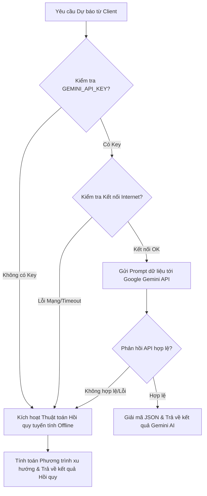

# Báo Cáo Giải Pháp Kỹ Thuật: Tích Hợp AI Dự Báo Doanh Thu (Module 5)

## 1. Giới Thiệu Chung

Trong bối cảnh quản lý resort hiện đại, việc nắm bắt xu hướng tài chính tương lai đóng vai trò then chốt giúp tối ưu hóa nguồn lực. Dự báo doanh thu (**Revenue Forecasting**) là hoạt động cốt lõi của các resort lớn để lập kế hoạch chuẩn bị nhân lực, mua sắm nguyên liệu và định giá phòng linh hoạt.

Báo cáo này trình bày chi tiết giải pháp kỹ thuật tích hợp AI dự báo doanh thu lai (**Hybrid Forecasting Engine**) được thiết kế cho hệ thống Dashboard của Quản lý (Manager Dashboard). Giải pháp kết hợp giữa sức mạnh lập luận của Mô hình Ngôn ngữ Lớn (**Google Gemini AI**) và thuật toán Thống kê toán học (**Hồi quy tuyến tính**) chạy offline để đảm bảo tính sẵn sàng 100% trong mọi điều kiện demo bảo vệ đồ án.

---

## 2. Kiến Trúc Lai (Hybrid Architecture)

Hệ thống được thiết kế theo mô hình **Offline-First**. Luồng ra quyết định của hệ thống được thực hiện tự động qua các bước sau:



### Ưu điểm vượt trội của thiết kế này:
1.  **Tính sẵn sàng tối đa (High Availability)**: Khi chạy thử nghiệm hoặc demo bảo vệ đồ án, nếu xảy ra sự cố mất mạng internet hoặc khóa API hết hạn mức, hệ thống không bị crash mà tự động chuyển sang chế độ tính toán toán học thô trong chưa đầy 1ms.
2.  **Thông minh khi online**: Khi kết nối mạng ổn định, resort được thừa hưởng năng lực phân tích tài chính sâu sắc từ AI của Google với các khuyến nghị kinh doanh cực kỳ tự nhiên.
3.  **Tối giản tài nguyên**: Kết nối trực tiếp qua REST API của Google mà không cần cài đặt các thư viện Spring AI cồng kềnh, tránh xung đột phiên bản thư viện trong dự án Maven.

---

## 3. Thuật Toán Hồi Quy Tuyến Tính Offline (Linear Regression)

Mô hình thống kê hồi quy tuyến tính ước lượng mối quan hệ giữa biến độc lập $x$ (thời gian tính bằng tháng, tăng dần $1, 2, 3...$) và biến phụ thuộc $y$ (doanh thu tương ứng).

### 3.1. Phương trình xu hướng
$$y = ax + b$$
Trong đó:
*   $y$: Giá trị doanh thu dự báo của một mảng dịch vụ (Villa, Spa, hoặc Food).
*   $x$: Số thứ tự tháng của điểm cần dự báo.
*   $a$: Hệ số góc (slope) thể hiện xu hướng tăng trưởng (nếu $a > 0$, doanh thu đang tăng trưởng; nếu $a < 0$, doanh thu đang đi xuống).
*   $b$: Giao điểm với trục tung (intercept).

### 3.2. Công thức tính hệ số $a$ và $b$ (Phương pháp bình phương tối thiểu - OLS)
Dựa trên tập dữ liệu lịch sử gồm $n$ tháng điểm ($x_i, y_i$):

$$a = \frac{n\sum_{i=1}^{n}(x_i y_i) - \sum_{i=1}^{n}x_i \sum_{i=1}^{n}y_i}{n\sum_{i=1}^{n}(x_i^2) - (\sum_{i=1}^{n}x_i)^2}$$

$$b = \frac{\sum_{i=1}^{n}y_i - a\sum_{i=1}^{n}x_i}{n}$$

### 3.3. Hiện thực hóa trong Backend Java
Backend thực hiện tính toán độc lập bộ hệ số ($a, b$) cho cả 3 nguồn doanh thu:
*   `regRoom` $\rightarrow$ Xu hướng doanh thu Phòng/Villa.
*   `regSpa` $\rightarrow$ Xu hướng doanh thu Spa trị liệu.
*   `regFood` $\rightarrow$ Xu hướng doanh thu Ẩm thực F&B.

Doanh thu dự báo tương lai tại tháng $x_{next}$ được giới hạn dưới bằng $0$ để tránh trường hợp toán học dự báo ra giá trị âm phi thực tế:
```java
double predRoom = Math.max(0, regRoom[0] * targetX + regRoom[1]);
```

---

## 4. Tích Hợp Google Gemini AI API

Khi có khóa kết nối hoạt động, backend sẽ chuyển giao nhiệm vụ phân tích cho mô hình `gemini-1.5-flash`.

### 4.1. Thiết kế Prompt mẫu gửi đi
Hệ thống chuyển đổi lịch sử doanh thu thành dữ liệu JSON cấu trúc và gửi kèm chỉ thị nghiêm ngặt:
```text
Dựa trên dữ liệu doanh thu lịch sử của resort dưới đây:
[Dữ liệu lịch sử chi tiết từng tháng]

Hãy dự báo doanh thu cho [N] tháng tiếp theo. Trả về kết quả dưới dạng JSON duy nhất khớp với cấu trúc sau, không kèm bất kỳ giải thích nào ngoài JSON:
{
  "forecastData": [
     {"label": "Tháng MM/YYYY", "roomRevenue": 123.45, "spaRevenue": 12.3, "foodRevenue": 45.6}
  ],
  "aiAnalysis": "Nhận xét phân tích bằng tiếng Việt sâu sắc từ AI về nguyên nhân xu hướng và khuyến nghị cụ thể cho Manager..."
}
```

### 4.2. Xử lý phản hồi (Response Sanitization)
Do các mô hình LLM đôi khi tự động bọc mã JSON trong các thẻ markdown (ví dụ: ` ```json ... ``` `), Backend được xây dựng hàm làm sạch dữ liệu chuyên biệt `cleanJsonResponse(String response)` sử dụng thư viện `Jackson ObjectMapper` để lọc bỏ các ký tự markdown thừa trước khi phân giải cấu trúc dữ liệu gửi về Client.

---

## 5. Trải Nghiệm Giao Diện Người Dùng (Frontend Visualization)

Giao diện được refactor trên ReactJS (`AdminOverview.jsx`) đảm bảo trải nghiệm cao cấp:
1.  **Chuyển đổi Chế độ (Interactive Toggle)**: Thiết kế dạng thẻ Tab linh hoạt giúp Manager chuyển nhanh giữa "Phân tích Lịch sử" (dữ liệu kế toán thực tế) và "AI Dự báo Doanh thu" (dữ liệu dự kiến tương lai).
2.  **Đồ họa trực quan (Dashed Bar Chart)**: Các cột biểu đồ dự báo tương lai được hiển thị dưới dạng **đường viền đứt nét (dashed style)** kết hợp độ mờ đục nhẹ (Glassmorphism Opacity) giúp phân biệt rõ ràng trực quan với cột doanh thu thực tế.
3.  **Khung khuyến nghị (AI Insights Card)**: Hiển thị nhận xét trực tiếp từ AI bằng tiếng Việt với giao diện bo tròn thanh lịch, làm nổi bật các đề xuất vận hành thực tế.

---

## 6. Tính Thực Tiễn và Hướng Dẫn Thuyết Trình (Defense Guide)

### 6.1. Giải trình tính thực tế trước Hội đồng chấm thi
Nếu thầy cô trong hội đồng đặt câu hỏi phản biện: *"Dự báo tài chính tương lai thường rất khó chính xác, việc đưa vào phần mềm có tính thực tế không?"*

**Bạn nên trả lời thuyết phục như sau:**
> *"Dạ thưa thầy/cô, trong quản trị Resort chuyên nghiệp, dự báo doanh thu ngắn hạn (Revenue Forecasting) là một hoạt động bắt buộc chứ không phải phi thực tế. Hệ thống này đóng vai trò là **Công cụ hỗ trợ ra quyết định (Decision Support System)**.
> 
> Dù số liệu mang tính chất dự kiến, nhưng nó giúp nhà quản trị chuẩn bị trước các kế hoạch như: tăng/giảm số lượng nhân viên trực ca theo mùa vụ, đặt trước thảo dược spa, nguyên liệu bếp để tối ưu chi phí lưu kho, hoặc chạy các chương trình khuyến mãi phòng sớm nếu dự báo thấy xu hướng giảm. Ngoài ra, việc thiết kế cơ chế dự phòng Hồi quy tuyến tính giúp hệ thống luôn hoạt động ổn định kể cả khi không có kết nối internet."*

### 6.2. Kết luận
Tính năng dự báo doanh thu AI nâng tầm đồ án từ một ứng dụng CRUD quản trị thông thường lên mức ứng dụng thông minh có khả năng phân tích dữ liệu, nâng cao giá trị kỹ thuật và tính cạnh tranh của đồ án nhóm trước hội đồng chấm thi.
