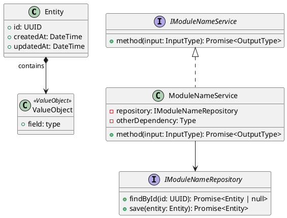
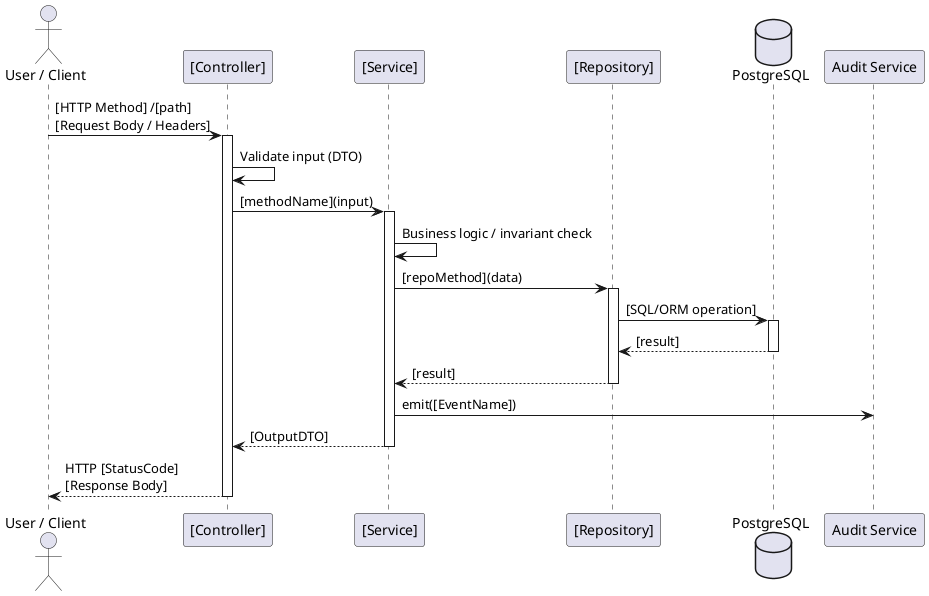
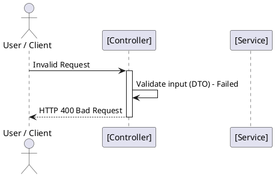
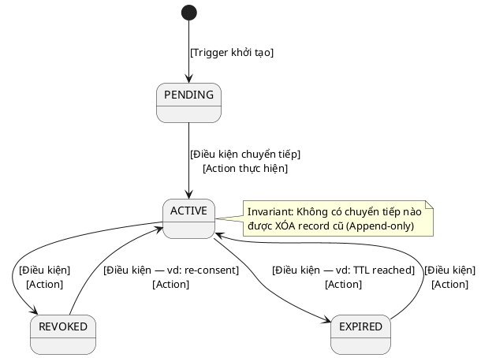

**4:

đọc file template 08_Document_References\Template\PHASE-2_ADR.md để sửa lại file 03_Design\ADR\ADR-01.md theo mẫu

5:

đọc file 03_Design\ADR\ADR-01.md và đọc WF-02 trong file 02_Requirement\workflow.md và đọc file 02_Requirement\classdiagram.md và đọc file 02_Requirement\BusinessRule.md và đọc file 02_Requirement\RequirementsTraceabilityMatrix.md và viết kế hoạch thực thi code WF-02 trong 02_Requirement\workflow.md theo mẫu template 08_Document_References\Template\EDS_TEMPLATE_V2.0.md và 08_Document_References\Template\TDD_TEMPLATE_V1.md và kết quả lưu vào thư mục 04_Implement dưới dạng markdown ; full stack (frontend,backend và database) theo mô hình MVC

6:

đọc file 03_Design\ADR\ADR-01.md và đọc WF-02 trong file 02_Requirement\workflow.md và đọc file 02_Requirement\classdiagram.md và đọc file 02_Requirement\BusinessRule.md và đọc file 02_Requirement\RequirementsTraceabilityMatrix.md và viết kế hoạch thực thi code WF-02 trong 02_Requirement\workflow.md theo mẫu template 08_Document_References\Template\EDS_TEMPLATE_V2.0.md và 08_Document_References\Template\TDD_TEMPLATE_V1.md và kết quả lưu vào thư mục 04_Implement dưới dạng markdown ; full stack (frontend,backend và database) theo mô hình MVC

**osasddkal

**4:

đọc file template 08_Document_References\Template\PHASE-2_ADR.md để sửa lại file 03_Design\ADR\ADR-01.md theo mẫu

5:

đọc file 03_Design\ADR\ADR-01.md và đọc WF-02 trong file 02_Requirement\workflow.md và đọc file 02_Requirement\classdiagram.md và đọc file 02_Requirement\BusinessRule.md và đọc file 02_Requirement\RequirementsTraceabilityMatrix.md và viết kế hoạch thực thi code WF-02 trong 02_Requirement\workflow.md theo mẫu template 08_Document_References\Template\EDS_TEMPLATE_V2.0.md và 08_Document_References\Template\TDD_TEMPLATE_V1.md và kết quả lưu vào thư mục 04_Implement dưới dạng markdown ; full stack (frontend,backend và database) theo mô hình MVC

6:

đọc file 03_Design\ADR\ADR-01.md và đọc WF-02 trong file 02_Requirement\workflow.md và đọc file 02_Requirement\classdiagram.md và đọc file 02_Requirement\BusinessRule.md và đọc file 02_Requirement\RequirementsTraceabilityMatrix.md và viết kế hoạch thực thi code WF-02 trong 02_Requirement\workflow.md theo mẫu template 08_Document_References\Template\EDS_TEMPLATE_V2.0.md và 08_Document_References\Template\TDD_TEMPLATE_V1.md và kết quả lưu vào thư mục 04_Implement dưới dạng markdown ; full stack (frontend,backend và database) theo mô hình MVC

**

# ENGINEERING DOCUMENT STANDARD (EDS) v2.0

## Quy chuẩn Tài liệu Kỹ thuật và Đặc tả Hiện thực hóa

| Field                    | Value                                                                                  |
| :----------------------- | :------------------------------------------------------------------------------------- |
| **Document ID**    | [PROJECT]-[MODULE]-IMP-[NNN]                                                           |
| **Version**        | 1.0                                                                                    |
| **Date**           | YYYY-MM-DD                                                                             |
| **Status**         | Draft / In Review / Approved / Deprecated                                              |
| **Document Owner** | [Tên cụ thể — không phải team]                                                   |
| **Author**         | [Tên + Role]                                                                          |
| **Reviewed by**    | [Tech Lead]                                                                            |
| **DPO Sign-off**   | [ ] Pending / [x] Approved — YYYY-MM-DD — [Tên DPO]*(bắt buộc với module PII)* |
| **Approved by**    | [Principal Architect]                                                                  |
| **Last Review**    | YYYY-MM-DD*(stale nếu > 2 sprints không cập nhật)*                               |
| **Based on EDS**   | v2.0                                                                                   |

---

## CHANGELOG

> **Policy 4.4 — Immutable History**: Không bao giờ xóa thông tin cũ. Mọi thay đổi phải ghi vào bảng này.

| Ngày      | Người thực hiện | Nội dung thay đổi.      |
| :--------- | :------------------ | :------------------------- |
| YYYY-MM-DD | [Tên — Role]      | Tạo tài liệu lần đầu |

---

## MỤC LỤC

1. [Tổng quan Module](#1-tổng-quan-module)
2. [Ma trận Truy vết (Traceability Matrix)](#2-ma-trận-truy-vết-traceability-matrix)
3. [Architecture Decision Records (ADR)](#3-architecture-decision-records-adr)
4. [Non-Functional Requirements &amp; SLA](#4-non-functional-requirements--sla)
5. [Static Modeling (Mô hình Tĩnh)](#5-static-modeling-mô-hình-tĩnh)
6. [Dynamic Modeling (Mô hình Động)](#6-dynamic-modeling-mô-hình-động)
7. [Domain Event Catalog](#7-domain-event-catalog)
8. [Interface Specification (Đặc tả Giao diện)](#8-interface-specification-đặc-tả-giao-diện)
9. [API Specification](#9-api-specification)
10. [Bảng mã lỗi (Error Codes)](#10-bảng-mã-lỗi-error-codes)
11. [Quy trình Triển khai (Step-by-Step)](#11-quy-trình-triển-khai-step-by-step)
12. [Rollback &amp; Incident Runbook](#12-rollback--incident-runbook)
13. [Kịch bản Kiểm thử Chi tiết](#13-kịch-bản-kiểm-thử-chi-tiết)
14. [Phương pháp Xác minh](#14-phương-pháp-xác-minh)
15. [Mẫu thử thực tế (API Verification Samples)](#15-mẫu-thử-thực-tế-api-verification-samples)
16. [Bảng tổng hợp phân quyền (Authorization Matrix)](#16-bảng-tổng-hợp-phân-quyền-authorization-matrix)
17. [Phụ lục](#phụ-lục)

---

## 1. Tổng quan Module

> Mô tả ngắn gọn mục đích của module, phạm vi nghiệp vụ và lý do tồn tại.

| Field                           | Value                                                  |
| :------------------------------ | :----------------------------------------------------- |
| **Module Name**           | [Tên module]                                          |
| **Bounded Context**       | [Domain]                                               |
| **Data Classification**   | Public / Internal / Confidential / PII / Sensitive-PII |
| **Compliance Scope**      | GDPR / CCPA / PDPA / N/A                               |
| **Upstream Dependencies** | [Module A, Module B]                                   |
| **Downstream Consumers**  | [Module X, Module Y]                                   |

---

## 2. Ma trận Truy vết (Traceability Matrix)

> Ánh xạ trực tiếp: `[Mã yêu cầu]` &rarr; `[Thành phần Code]` &rarr; `[Mục tiêu Tuân thủ]`.
> **Policy**: Không viết code nếu không biết code đó phục vụ Rule nào.

| Requirement ID | Loại (BR/ADR/US) | Mô tả yêu cầu | Thành phần Code                    | Compliance Target | ADR liên quan |
| :------------- | :---------------- | :---------------- | :----------------------------------- | :---------------- | :------------- |
| BR-CON-001     | Business Rule     | [Mô tả]         | `ConsentService.grant()`           | GDPR Art. 7.1     | ADR-001        |
| US-CON-005     | User Story        | [Mô tả]         | `ConsentController.POST /consents` | —                | —             |
| ADR-001        | Decision          | [Mô tả]         | `ConsentRepository`                | GDPR Art. 5.1(e)  | —             |

---

## 3. Architecture Decision Records (ADR) ⭐️ *Mới*

> **Section mới — EDS v2.0**
> Ghi lại lý do đằng sau mỗi quyết định kiến trúc quan trọng. DPO và Auditor cần section này để hiểu tại sao hệ thống được thiết kế như vậy.

### ADR-[NNN] — [Tiêu đề quyết định ngắn gọn]

| Field                | Value                                         |
| :------------------- | :-------------------------------------------- |
| **Status**     | Proposed / Accepted / Superseded / Deprecated |
| **Deciders**   | [Tên + Role của người ra quyết định]   |
| **Date**       | YYYY-MM-DD                                    |
| **Supersedes** | ADR-[NNN]*(nếu thay thế ADR cũ)*         |

#### Bối cảnh (Context)

> Mô tả vấn đề hoặc áp lực buộc phải đưa ra quyết định này. Bối cảnh kỹ thuật, nghiệp vụ, hoặc pháp lý nào dẫn đến ADR này?

#### Các phương án đã xem xét (Options Considered)

| Phương án | Mô tả                  | Ưu điểm | Nhược điểm |
| :----------- | :----------------------- | :--------- | :------------- |
| A            | [Mô tả phương án A] | + [...]    | - [...]        |
| B            | [Mô tả phương án B] | + [...]    | - [...]        |

#### Quyết định (Decision)

> Chọn Phương án [X] vì [lý do cụ thể].

#### Hệ quả (Consequences)

##### Tích cực:

* [Hệ quả tích cực 1]

##### Tiêu cực / Trade-offs:

* [Trade-off 1 — và cách giảm thiểu]

##### Compliance Impact:

* [Ảnh hưởng đến GDPR / CCPA / ... nếu có]

> *(Thêm ADR mới bên dưới, không xóa ADR cũ. Nếu ADR bị thay thế, đánh dấu Superseded by ADR-[NNN])*

---

## 4. Non-Functional Requirements & SLA ⭐️ *Mới*

> **Section mới — EDS v2.0**
> Với module xử lý PII, NFR không chỉ là yêu cầu kỹ thuật — đây là nghĩa vụ pháp lý (GDPR Art. 32).

### 4.1. Performance & Availability

| Category     | Requirement         | Target SLA | Measurement Method | Compliance Basis |
| :----------- | :------------------ | :--------- | :----------------- | :--------------- |
| Latency      | API response (p99)  | < 300ms    | k6 load test       | —               |
| Availability | Uptime (monthly)    | 99.9%      | Uptime monitor     | —               |
| Throughput   | Concurrent requests | 500 req/s  | Load test          | —               |

### 4.2. Data Integrity & Retention

| Category    | Requirement              | Target  | Verification Method | Compliance Basis |
| :---------- | :----------------------- | :------ | :------------------ | :--------------- |
| Durability  | Zero record loss         | RPO = 0 | Transaction log     | GDPR Art. 5.1(f) |
| Retention   | Audit log retention      | 7 năm  | DB backup policy    | GDPR Art. 5.1(e) |
| Consistency | Consent&harr; Audit sync | 100%    | Reconciliation job  | GDPR Art. 7.1    |

### 4.3. Security

| Category              | Requirement   | Target          | Verification Method | Compliance Basis |
| :-------------------- | :------------ | :-------------- | :------------------ | :--------------- |
| Encryption at rest    | PII fields    | AES-256         | openssl CLI check   | GDPR Art. 32     |
| Encryption in transit | All endpoints | TLS 1.3+        | SSL Labs scan       | GDPR Art. 32     |
| Access control        | Role-based    | Least privilege | Auth Matrix (§16)  | GDPR Art. 25     |

### 4.4. Scalability & Capacity Planning

> Dự kiến tải trong 12 tháng tới: [X] users, [Y] consent records/day. Giải pháp scale: [horizontal / vertical / caching strategy].

---

## 5. Static Modeling (Mô hình Tĩnh)

### 5.1. Class Diagram (PlantUML)



### 5.2. Data Structure (Prisma Schema)

```prisma
// === [MODULE NAME] SCHEMA ===

model [EntityName] {
  id          String   @id @default(uuid()) @db.Uuid
  // --- Khai báo đầy đủ từng field, kèm chú thích ---
  fieldA      String   // [Mô tả ý nghĩa]
  fieldB      DateTime // [Mô tả ý nghĩa]
  // --- Audit fields (bắt buộc với PII modules) ---
  createdAt   DateTime @default(now())
  updatedAt   DateTime @updatedAt
  createdBy   String   // userId thực hiện thao tác
  
  @@index([fieldA])
  @@map("[table_name]")
}
```

---

## 6. Dynamic Modeling (Mô hình Động)

### 6.1. Sequence Diagram — Happy Path (PlantUML)



### 6.2. Sequence Diagram — Error Path (PlantUML)



### 6.3. State Machine *(bắt buộc nếu module có trạng thái)*



> [!WARNING]
> **Invariant bất biến**: Liệt kê các quy tắc trạng thái không bao giờ được vi phạm.

---

## 7. Domain Event Catalog ⭐️ *Mới*

> **Section mới — EDS v2.0**
> Liệt kê tất cả domain events mà module này phát ra (publish) và tiêu thụ (consume). Đặt tên event theo quy ước `[Entity][PastTenseVerb]` (vd: `ConsentGranted`).

### 7.1. Events Published (Phát ra)

| Event Name         | Trigger           | Publisher | Subscriber(s)        | Payload Schema     | Async? |
| :----------------- | :---------------- | :-------- | :------------------- | :----------------- | :----- |
| `[EntityVerbed]` | [Mô tả trigger] | [Service] | [ServiceA, ServiceB] | `[EventName].ts` | Yes/No |

### 7.2. Events Consumed (Tiêu thụ)

| Event Name         | Source         | Handler        | Action thực hiện |
| :----------------- | :------------- | :------------- | :----------------- |
| `[EntityVerbed]` | [SourceModule] | [HandlerClass] | [Mô tả xử lý]  |

### 7.3. Payload Schema

```typescript
// [EventName].ts
export interface [EventName] {
  eventId: string;          // UUID - dùng để deduplicate
  eventType: '[EventName]';
  occurredAt: string;       // ISO 8601
  version: '1.0';           // Schema version - tăng khi breaking change
  payload: {
    // --- Khai báo đầy đủ từng field ---
    [field]: [type];        // [Mô tả]
  };
  metadata: {
    correlationId: string;  // Dùng để trace request xuyên suốt
    createdBy: string;      // userId hoặc systemId
  };
}
```

---

## 8. Interface Specification (Đặc tả Giao diện)

> **Policy (EDS v2.0)**: Mỗi interface phải khai báo `@version`. Mọi breaking change phải tạo ADR mới.

### 8.1. Service Interface

```typescript
// I[ModuleName]Service.ts
// @version 1.0
// @breaking-change Ghi chú nếu thay đổi phá vỡ interface cũ

// --- Input / Output Types (khai báo đầy đủ, không dùng any) ---
export interface [MethodName]Input {
  fieldA: string;   // [Mô tả, validation rule]
  fieldB?: number;  // [Optional — mô tả khi nào dùng]
}

export interface [MethodName]Output {
  id: string;
  // ...
}

// --- Service Contract ---
export interface I[ModuleName]Service {
  /**
   * [Mô tả mục đích của method]
   * @throws {[ErrorCode]} Khi [điều kiện lỗi]
   */
  [methodName](input: [MethodName]Input): Promise<[MethodName]Output>;
}
```

### 8.2. Repository Interface

```typescript
// I[ModuleName]Repository.ts
// @version 1.0

export interface I[ModuleName]Repository {
  findById(id: string): Promise<[Entity] | null>;
  findBy[Field](value: string): Promise<[Entity][]>;
  save(entity: [Entity]): Promise<[Entity]>;
  // Lưu ý: Không có delete() — Append-only nếu module PII
}
```

---

## 9. API Specification

### 9.1. Endpoints Table

| Method          | Path                       | Auth Level | Required Roles       | Rate Limit | Idempotent? |
| :-------------- | :------------------------- | :--------- | :------------------- | :--------- | :---------: |
| **POST**  | `/api/v1/[resource]`     | JWT Bearer | `[ROLE_A]`         | 100/min    |     No     |
| **GET**   | `/api/v1/[resource]/:id` | JWT Bearer | `[ROLE_A, ROLE_B]` | 300/min    |     Yes     |
| **PATCH** | `/api/v1/[resource]/:id` | JWT Bearer | `[ROLE_A]`         | 60/min     |     Yes     |

### 9.2. Request / Response Schemas

#### POST `/api/v1/[resource]` — Tạo mới

##### Request Body:

```json
{
  "fieldA": "value",
  "fieldB": "value"
}
```

##### Response — 201 Created (Happy Path):

```json
{
  "id": "uuid-v4",
  "fieldA": "value",
  "status": "ACTIVE",
  "createdAt": "2026-05-02T00:00:00.000Z"
}
```

##### Response — 400 Bad Request (Validation Error):

```json
{
  "error": {
    "code": "[MODULE]-001",
    "message": "[Mô tả lỗi người dùng hiểu được]",
    "details": [
      { "field": "fieldA", "message": "fieldA is required" }
    ]
  }
}
```

##### Response — 409 Conflict:

```json
{
  "error": {
    "code": "[MODULE]-002",
    "message": "[Mô tả conflict]"
  }
}
```

---

## 10. Bảng mã lỗi (Error Codes)

> Tiền tố mã lỗi phải nhất quán theo module (vd: `CON-` cho Consent, `IAM-` cho Identity).

| Code          | HTTP Status | Message (EN)             | Message (VI)              | Trigger Condition  |
| :------------ | :---------: | :----------------------- | :------------------------ | :----------------- |
| `[MOD]-001` |     400     | Validation failed        | Dữ liệu không hợp lệ | [Khi nào xảy ra] |
| `[MOD]-002` |     409     | Resource conflict        | Xung đột tài nguyên   | [Khi nào xảy ra] |
| `[MOD]-003` |     404     | Resource not found       | Không tìm thấy         | [Khi nào xảy ra] |
| `[MOD]-004` |     403     | Insufficient permissions | Không đủ quyền        | [Khi nào xảy ra] |
| `[MOD]-005` |     500     | Internal error           | Lỗi hệ thống           | [Khi nào xảy ra] |

---

## 11. Quy trình Triển khai (Step-by-Step)

### 11.1. Prerequisites

- [ ] ADR đã được Accepted (xem §3)
- [ ] DPO đã sign-off nếu module xử lý PII (xem header)
- [ ] Blueprint đã được Principal Architect approve
- [ ] Môi trường staging đã sẵn sàng

### 11.2. Pre-Migration Checklist *(bắt buộc tick trước khi chạy migration)*

- [ ] Đã backup DB production: `pg_dump -h [host] -u [user] [db] > backup_YYYYMMDD.sql`
- [ ] Migration đã chạy thành công trên staging &ge; 24 giờ
- [ ] Rollback script đã được test trên staging (xem §12)
- [ ] DPO đã sign-off nếu migration thay đổi cấu trúc lưu trữ PII

### 11.3. Implementation Steps

#### Chặng 1 — [Tên chặng]

```bash
# Lệnh cụ thể, có thể chạy ngay
npx prisma migrate dev --name [migration_name]
```

> [!WARNING]
> **Chú ý**: [Cảnh báo rủi ro nếu có]

#### Chặng 2 — [Tên chặng]

*(Code snippet minh họa nếu cần)*

#### Chặng 3 — Verification sau deploy

```bash
# Kiểm tra nhanh sau khi deploy
curl -X GET https://[host]/api/v1/health
# Expected: {"status": "ok"}
```

### 11.4. Deployment Checklist

- [ ] Migration chạy thành công
- [ ] Health check endpoint trả về 200
- [ ] Error rate < 1% trong 10 phút đầu
- [ ] Audit log đang sinh ra đúng format
- [ ] Thông báo DPO nếu deploy ảnh hưởng đến PII processing

---

## 12. Rollback & Incident Runbook ⭐️ *Mới*

> **Section mới — EDS v2.0**
> Section này là bắt buộc. Một deploy thiếu rollback plan là deploy chưa hoàn chỉnh.

### 12.1. Điều kiện kích hoạt Rollback (Trigger Conditions)

| Điều kiện                  | Ngưỡng           | Người quyết định |
| :---------------------------- | :----------------- | :-------------------- |
| Error rate tăng đột biến  | > 5% trong 5 phút | On-call Engineer      |
| Latency p99 vượt ngưỡng   | > 2x baseline      | On-call Engineer      |
| Dữ liệu không nhất quán  | Bất kỳ case nào | Tech Lead + DPO       |
| Audit log ngừng hoạt động | > 1 phút          | On-call Engineer      |

### 12.2. Rollback Procedure

```bash
# Bước 1: Revert migration (nếu có schema change)
npx prisma migrate resolve --rolled-back [migration_id]

# Bước 2: Re-deploy phiên bản cũ
kubectl rollout undo deployment/[service-name]

# Bước 3: Verify rollback thành công
kubectl rollout status deployment/[service-name]
curl -X GET https://[host]/api/v1/health

# Bước 4: Chạy smoke test
# [Lệnh smoke test cụ thể]
```

### 12.3. Notification Protocol

| Thời điểm         | Người nhận | Kênh              | Template                                                   |
| :------------------- | :------------ | :----------------- | :--------------------------------------------------------- |
| Ngay khi phát hiện | On-call team  | Slack`#incident` | `"🚨 [SERVICE] incident detected: [mô tả]"`            |
| Trong 30 phút       | DPO           | Email              | *(Bắt buộc nếu PII bị ảnh hưởng — GDPR Art. 33)* |
| Trong 72 giờ        | DPA           | Email              | *(Bắt buộc nếu có data breach — GDPR Art. 33)*      |

### 12.4. Post-Incident Review (PIR)

> Bắt buộc hoàn thành PIR document trong vòng 48 giờ sau khi incident được resolve.

#### PIR Template:

* **Timeline**: Diễn biến từng bước theo thứ tự thời gian
* **Root Cause**: Nguyên nhân gốc rễ (5 Whys)
* **Impact**: Số users ảnh hưởng, thời gian downtime, PII exposure?
* **Remediation**: Các bước đã thực hiện để khắc phục
* **Prevention**: Action items để tránh tái diễn

---

## 13. Kịch bản Kiểm thử Chi tiết

> **Policy (EDS v2.0 — Test Data)**: Mọi test scenario phải khai báo Test Data Classification.
>
> * `SYNTHETIC` *(bắt buộc mặc định)* — dữ liệu giả hoàn toàn
> * `ANONYMIZED` — nếu cần realistic data, phải anonymize trước
> * ❌ **TUYỆT ĐỐI KHÔNG** dùng Production PII trong test cases

### 13.1. Unit Tests

#### `TC-UNIT-001` — [Tên test case]

* **Feature**: [Tên feature]
* **Background**:
  * Given test data classification: `SYNTHETIC`
  * And [precondition khác]

##### Scenario: [Mô tả happy path]

* Given [trạng thái ban đầu]
* When [hành động thực hiện]
* Then [kết quả mong đợi]

##### Scenario: [Mô tả error path]

* Given [trạng thái ban đầu]
* When [hành động gây lỗi]
* Then [lỗi mong đợi — error code cụ thể]
* And [không có side effect ngoài ý muốn]
* **Hàm được test**: `ClassName.methodName()`
* **Invariant kiểm tra**: [Mô tả invariant]

### 13.2. Integration Tests

#### `TC-INT-001` — [Tên test case]

##### Scenario: [Service + Repository phối hợp đúng]

* Given test data classification: `SYNTHETIC`
* And database đang chạy với seed data [X]
* When [Service method] được gọi với input [Y]
* Then repository [repoMethod] được gọi đúng 1 lần
* And database chứa record với `[field]` = `[expected value]`
* And audit log chứa event `[EventName]` với payload [Z]
* **External dependencies**: [Vault / Mailer / Cache / ...]
* **Mock strategy**: [Mock hoàn toàn / Test container / ...]

### 13.3. E2E / Security Tests

#### `TC-E2E-001` — [Tên test case]

##### Scenario: [Luồng hoàn chỉnh qua API]

* Given test data classification: `SYNTHETIC`
* And user `[roleX]` đã đăng nhập, có JWT hợp lệ
* When POST `/api/v1/[resource]` được gọi với:

| Header           | Value            |
| :--------------- | :--------------- |
| Authorization    | Bearer [token]   |
| Content-Type     | application/json |
| X-Correlation-Id | [uuid]           |

* Then response status là 201
* And response body chứa `[field]` = `[expected]`
* And database chứa record mới

##### Scenario: [Unauthorized access]

* Given user không có role `[requiredRole]`
* When POST `/api/v1/[resource]` được gọi
* Then response status là 403
* And response body chứa error code `[MOD]-004`

##### Scenario: [CSRF / Injection attempt]

* Given [payload độc hại]
* When [endpoint] được gọi với payload đó
* Then [hệ thống xử lý an toàn, không có injection]

---

## 14. Phương pháp Xác minh

### 14.1. Database Inspection

```sql
-- Verify record tồn tại sau khi tạo
SELECT id, status, created_at, created_by
FROM [table_name]
WHERE id = '[uuid]';

-- Verify append-only (không có UPDATE/DELETE)
SELECT * FROM [audit_table]
WHERE entity_id = '[uuid]'
ORDER BY occurred_at DESC;

-- Verify không có PII leak trong log
SELECT query FROM pg_stat_activity
WHERE query ILIKE '%[sensitive_field]%';
```

### 14.2. Log / Audit Verification

```bash
# Kiểm tra audit log format
kubectl logs -l app=[service-name] | grep '"eventType":"[EventName]"' | head -5

# Verify log chứa đủ fields bắt buộc
kubectl logs -l app=[service-name] | jq 'select(.eventType == "[EventName]") | {eventId, occurredAt, correlationId}'

# Kiểm tra không có PII trong Log (GDPR requirement)
kubectl logs -l app=[service-name] | grep -i "password\|secret\|ssn\|creditCard"
# Expected: No output
```

### 14.3. Tool-based Verification

```bash
# Verify JWT signature và claims
# Paste token tại jwt.io hoặc:
echo "[JWT_TOKEN]" | cut -d'.' -f2 | base64 -d | jq .

# Verify encryption at rest (AES-256)
openssl enc -d -aes-256-cbc -in [encrypted_file] -k [key] -pbkdf2

# Verify TLS version
openssl s_client -connect [host]:443 -tls1_3 2>&1 | grep "Protocol"
# Expected Protocol : TLSv1.3
```

---

## 15. Mẫu thử thực tế (API Verification Samples)

### 15.1. Happy Path

```bash
# [POST] Tạo resource mới
curl -X POST https://[host]/api/v1/[resource] \
  -H "Authorization: Bearer [JWT_TOKEN]" \
  -H "Content-Type: application/json" \
  -H "X-Correlation-Id: $(uuidgen)" \
  -d '{
    "fieldA": "value",
    "fieldB": "value"
  }'
```

##### Expected Response (201):

```json
{
  "id": "550e8400-e29b-41d4-a716-446655440000",
  "fieldA": "value",
  "status": "ACTIVE",
  "createdAt": "2026-05-02T00:00:00.000Z"
}
```

### 15.2. Error Paths

```bash
# [POST] Thiếu required field -> 400
curl -X POST https://[host]/api/v1/[resource] \
  -H "Authorization: Bearer [JWT_TOKEN]" \
  -H "Content-Type: application/json" \
  -d '{}'
```

##### Expected Response (400):

```json
{
  "error": {
    "code": "[MOD]-001",
    "message": "Validation failed",
    "details": [
      { "field": "fieldA", "message": "fieldA is required" }
    ]
  }
}
```

```bash
# [GET] Không có JWT -> 401
curl -X GET https://[host]/api/v1/[resource]/[id]
```

##### Expected Response (401):

```json
{
  "error": {
    "code": "IAM-001",
    "message": "Authentication required"
  }
}
```

---

## 16. Bảng tổng hợp phân quyền (Authorization Matrix)

> **Nguyên tắc Least Privilege**: Mỗi Role chỉ có quyền tối thiểu cần thiết để thực hiện nhiệm vụ của mình.

| Endpoint                          | GUEST |  USER  | ADMIN |  DPO  | SYSTEM |
| :-------------------------------- | :---: | :----: | :----: | :----: | :----: |
| `GET /api/v1/[resource]`        |  ❌  | ✅ Own | ✅ All | ✅ All | ✅ All |
| `POST /api/v1/[resource]`       |  ❌  |   ✅   |   ✅   |   ❌   |   ✅   |
| `PATCH /api/v1/[resource]/:id`  |  ❌  | ✅ Own | ✅ All |   ❌   |   ✅   |
| `DELETE /api/v1/[resource]/:id` |  ❌  |   ❌   |   ✅   |   ❌   |   ❌   |
| `GET /api/v1/[resource]/audit`  |  ❌  |   ❌   |   ✅   |   ✅   |   ✅   |

##### Chú thích:

* ✅ = Được phép
* ❌ = Bị từ chối (403)
* **Own** = Chỉ được phép với resource của chính mình

---

## PHỤ LỤC

### A. Glossary (Thuật ngữ)

| Thuật ngữ           | Định nghĩa                                                                   |
| :-------------------- | :------------------------------------------------------------------------------ |
| `[Term]`            | [Định nghĩa rõ ràng, không mơ hồ]                                       |
| **PII**         | Personally Identifiable Information (Thông tin cá nhân có thể định danh) |
| **Append-only** | Chiến lược lưu trữ không cho phép UPDATE/DELETE, chỉ INSERT             |
| **DPO**         | Data Protection Officer (Nhân viên bảo vệ dữ liệu)                        |

### B. Tài liệu tham khảo

| Document                              | Link / Path                                      |
| :------------------------------------ | :----------------------------------------------- |
| GDPR Art. 7 (Consent conditions)      | [Link]                                           |
| GDPR Art. 32 (Security of processing) | [Link]                                           |
| IAM Core Blueprint (Master Template)  | `03_implement/IAM_TECHNICAL_IMPLEMENTATION.md` |
| Refresh Token Blueprint               | `03_implement/IAM_REFRESH_TOKEN_TECHNICAL.md`  |

---

> **EDS v2.0** — Áp dụng ngay lập tức cho toàn bộ repo PrivacyOps.
> Các sections đánh dấu ⭐️ là bổ sung mới so với EDS v1.0.
> Câu hỏi hoặc đề xuất sửa đổi: tạo Issue với label `docs-policy`.
