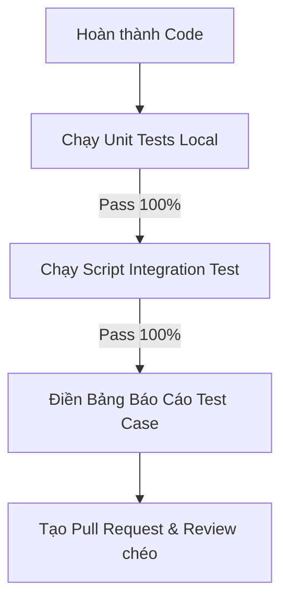

# TESTING GUIDELINES & QA STANDARDS (QUY TRÌNH KIỂM THỬ VÀ NGHIỆM THU)

Tài liệu này thiết lập hệ thống quy trình kiểm thử (QA/QC) bắt buộc đối với tất cả thành viên trong nhóm và các trợ lý AI để đảm bảo chất lượng phần mềm không bị suy giảm khi bàn giao mã nguồn.

---

## 1. Quy Trình Nghiệm Thu & Kiểm Thử Bắt Buộc (QA Gateways)

Mỗi khi hoàn thành một tính năng (Task) hoặc sửa một lỗi (Bug), lập trình viên hoặc AI phải đi qua **4 bước nghiệm thu**:



---

## 2. Quy Định Kiểm Thử Đơn Vị (Unit Testing Standards)

### 2.1 Backend (JUnit 5 + Mockito)
* **Phạm vi:** Bắt buộc đối với các lớp Service và Util. Không viết unit test cho Entity thuần túy (chỉ có getter/setter).
* **Mocking:**
  - Mock hoàn toàn các Repository và Service liên quan bằng `@Mock` hoặc `Mockito.mock()`.
  - Không kết nối đến Database thật trong Unit Test để đảm bảo tốc độ chạy kiểm thử nhanh.
* **Nguyên tắc Độc lập:** Mỗi hàm kiểm thử phải chạy độc lập và không phụ thuộc vào kết quả của hàm kiểm thử trước đó.
* **Mẫu cấu trúc Unit Test:**
  ```java
  @Test
  void shouldUpdateBookingStatusToConfirmedWhenInvoiceIsPaid() {
      // 1. Arrange (Thiết lập giả lập)
      RoomBooking mockBooking = new RoomBooking();
      mockBooking.setBookingId(1);
      mockBooking.setStatus("PENDING");

      Invoice mockInvoice = new Invoice();
      mockInvoice.setInvoiceId(10);
      mockInvoice.setStatus("UNPAID");
      mockInvoice.setRoomBooking(mockBooking);

      when(invoiceRepository.findById(10)).thenReturn(Optional.of(mockInvoice));
      when(invoiceRepository.save(any(Invoice.class))).thenAnswer(i -> i.getArgument(0));
      when(roomBookingRepository.save(any(RoomBooking.class))).thenAnswer(i -> i.getArgument(0));

      // 2. Act (Thực hiện hành động)
      VNPayPaymentDTO paymentResult = new VNPayPaymentDTO();
      paymentResult.setOrderId("10");
      paymentResult.setResponseCode("00"); // Thành công
      InvoiceDTO result = service.processPaymentCallback(paymentResult);

      // 3. Assert (Xác thực kết quả)
      assertEquals("PAID", result.getStatus());
      assertEquals("CONFIRMED", mockBooking.getStatus());
      verify(roomBookingRepository, times(1)).save(mockBooking);
  }
  ```

---

## 3. Quy Trình Kiểm Thử Tích Hợp Tự Động (Integration Testing)

Đối với các cổng thanh toán (như VNPay) hoặc dịch vụ bên thứ ba:
1. **Thiết lập Môi trường Test:** Chạy ứng dụng trên cổng phát triển (Local port `8080`).
2. **Kịch bản Test Tự động:** Sử dụng script Python ([payment_test.py](file:///C:/Users/Administrator/.gemini/antigravity-ide/brain/3ea87a64-75f1-452f-9bb2-4683a43d1c3c/scratch/payment_test.py)) để thực hiện:
   - Reset dữ liệu database bằng SQL command.
   - Gửi yêu cầu thật lên cổng API để lấy link thanh toán.
   - Giả lập chữ ký số HMAC-SHA512 để mô phỏng VNPay callback thành công hoặc thất bại.
   - Gọi API trả về và đối soát cơ sở dữ liệu.

---

## 4. Mẫu Bảng Test Case Bắt Buộc (Test Case Template)

Mọi báo cáo nghiệm thu tính năng phải có danh sách các ca kiểm thử theo cấu trúc bảng dưới đây:

| Mã Test Case | Nội dung / Mục tiêu kiểm thử | Trạng thái ban đầu | Các bước thực hiện | Kết quả mong đợi | Trạng thái thực tế |
| :--- | :--- | :--- | :--- | :--- | :--- |
| **TC-PAY-01** | Tạo link thanh toán VNPay thành công | Hóa đơn `UNPAID` có số tiền hợp lệ | 1. Gọi API `POST /api/invoices/{id}/payment-url`<br>2. Nhận đối tượng JSON trả về | URL thanh toán hợp lệ chứa các query param VNPay chuẩn và chữ ký số. | **PASS** |
| **TC-PAY-02** | Xử lý VNPay Callback thành công | Hóa đơn `UNPAID`, đơn đặt phòng `PENDING` | 1. Gửi VNPay callback có ResponseCode = `00` và chữ ký số chuẩn | Trạng thái Hóa đơn chuyển thành `PAID`. Trạng thái đặt phòng chuyển thành `CONFIRMED`. | **PASS** |
| **TC-PAY-03** | Chặn VNPay Callback có chữ ký sai | Hóa đơn `UNPAID` | 1. Gửi VNPay callback có chữ ký số không chính xác hoặc rỗng | API trả về lỗi `403 Forbidden`, thông điệp "Invalid VNPay secure hash". Trạng thái hóa đơn giữ nguyên `UNPAID`. | **PASS** |
| **TC-PAY-04** | Thanh toán tiền mặt tại quầy | Hóa đơn `UNPAID`, đơn đặt phòng `PENDING` | 1. Quản trị viên/Lễ tân gọi API `POST /api/invoices/{id}/cash-payment` | Hóa đơn đổi thành `PAID` với `vnpayTranId = null`. Trạng thái đơn đặt phòng đổi thành `CONFIRMED`. | **PASS** |
